# Global PMI Monitor: Strong Manufacturing New Export Orders in Mexico

## Global trends:

☐ The global composite PMI increased by +0.1pt in June to 52.0, while services rose +0.4pt to 51.7 and manufacturing fell -0.5pt to 52.2.

☐ In Mexico, manufacturing new exports orders improved significantly and have returned to expansionary territory for the first time in over two years.

## ■ Major economy-level trends:

☐ The manufacturing PMI fell in the US (avg. ISM/S&P Global -1.0pt to 53.6) and the Euro Area (-0.1pt to 51.4) but rose in China (avg. RatingDog/NBS +0.1pt to 51.0).

☐ The services PMI remained unchanged in the US (avg. ISM/S&P Global +0.0pt to 52.6), rose in the Euro Area (+1.8pt to 49.4), and fell in China (avg. RatingDog/NBS -0.1pt to 52.3).

## Country-level trends:

☐ The composite PMI remained weak in the UK but strengthened in the Euro Area in June.

## ■ Activity components:

☐ The global forward-looking PMI component rose for services (services future activity +1.8pt to 59.6) and remained unchanged for manufacturing (orders-to-inventories ratio +0.0 to 1.06).

☐ The global employment PMI component fell by -0.6pt for manufacturing to 49.6 and rose by +0.9pt for services to 49.9.

## Inflation-related components:

□ Manufacturing suppliers' delivery times increased +0.9pt in June to 45.8.

☐ The global manufacturing input price PMI fell by -4.3pt to 63.1 and the output price PMI fell by -1.0pt to 57.0.

## ■ Trade-related components:

☐ The manufacturing new export orders PMI component improved most in Mexico (+2.8pt to 46.2) but fell most in India (-1.7pt to 52.0) in May.

Exhibit 1: In Mexico, the Manufacturing New Exports Orders Component Jumped Back to Expansionary Territory  
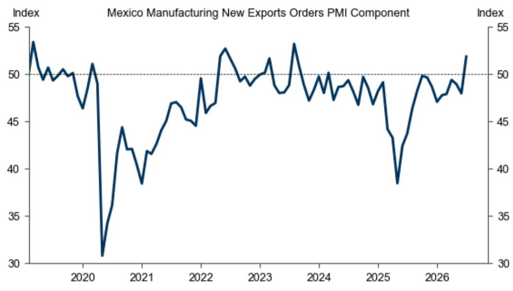  
Source: S&P Global, Haver Analytics, GS Global Investment Research

## Strong Manufacturing New Export Orders in Mexico

## Global Trends

Exhibit 2: The Global Composite PMI Rounded Up by +0.2pt in June to 52.0, While Services Rose +0.4pt to 51.7 and Manufacturing Fell -0.5pt to 52.2  
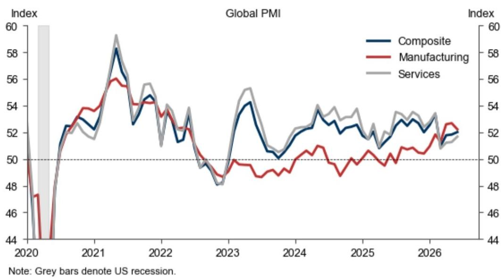  
Source: S&P Global, Haver, GS Global Investment Research

## Major Economy-Level Trends

Exhibit 3: The Manufacturing PMI Fell in the US (Avg. ISM/S&P Global -1.0pt to 53.6) and the Euro Area (-0.1pt to 51.4) but Rose in China (Avg. RatingDog/NBS +0.1pt to 51.0)  
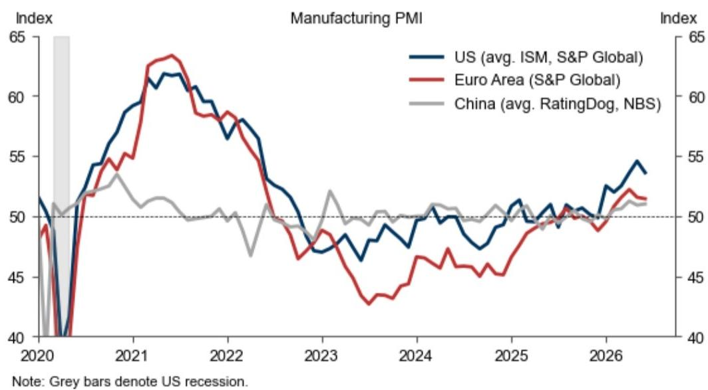  
Source: S&P Global, Haver, GS Global Investment Research

Exhibit 4: The Services PMI Remained Unchanged in the US (Avg. ISM/S&P Global +0.0pt to 52.6), Rose in the Euro Area (+1.8pt to 49.4), and Fell in China (Avg. RatingDog /NBS -0.1pt to 52.3)  
  
Source: S&P Global, Haver, GS Global Investment Research

## Region-Level Trends

Exhibit 5: The Composite PMI Remained Weak in the UK in June  
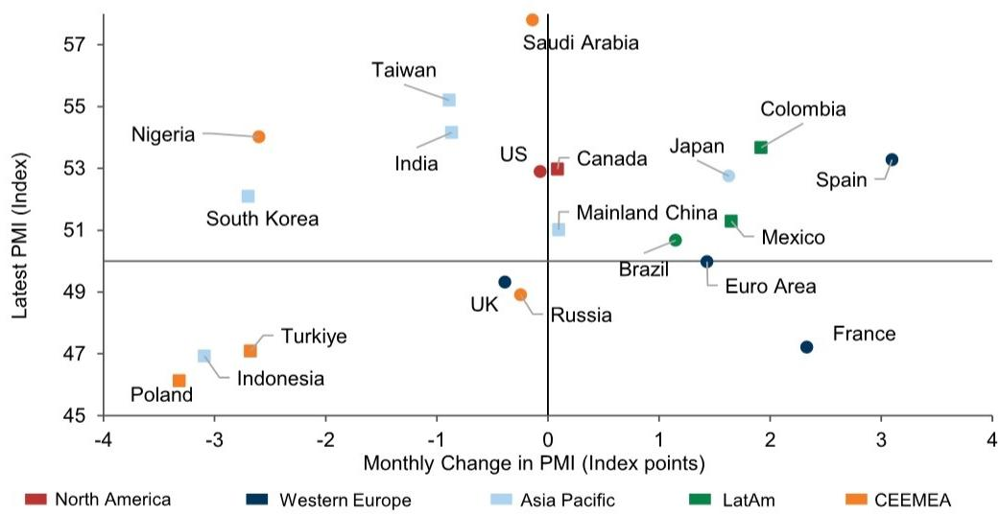  
Round markers are Composite PMIs, square markers are Manufacturing PMIs. We plot economies in our GS coverage with a global Gross Value Added (GVA) weight of at least 0.5%, and that are a standard deviation away from the cross-economy mean in either the PMI level or the PMI change, as well as the G7 and BRICs economies. US PMI is an average of S&P Global and ISM Composite PMIs. Mainland China PMI is an average of Caixin and official NBS Composite PMI.  
Source: S&P Global, Haver, GS Global Investment Research

Exhibit 6: On a 3-Month Basis, the Composite PMI Has Declined in the Euro Area and UK  
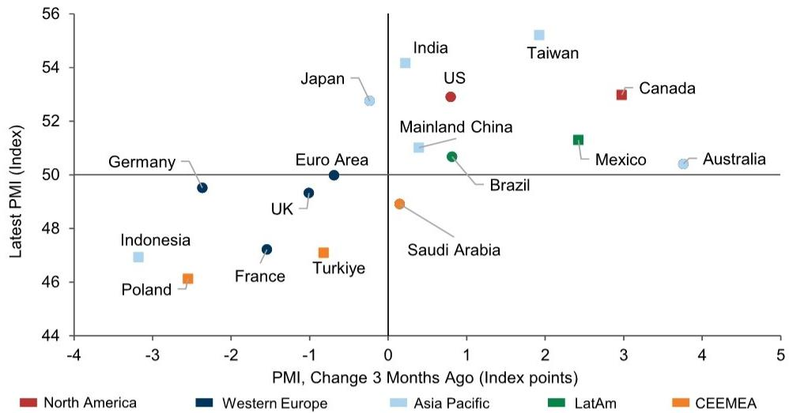  
Round markers are Composite PMIs, square markers are Manufacturing PMIs. We plot economies in our GS coverage with a global Gross Value Added (GVA) weight of at least 0.5%, and that are a standard deviation away from the cross-economy mean in either the PMI level or the PMI change, as well as the G7 and BRICs economies. US PMI is an average of S&P Global and ISM Composite PMIs. Mainland China PMI is an average of Caixin and official NBS Composite PMI.  
Source: S&P Global, Haver, GS Global Investment Research

Exhibit 7: The Global Forward-Looking PMI Component Rose for Services (Services Future Activity +1.8pt to 59.6) and Remained Unchanged for Manufacturing (Orders-to-Inventories Ratio +0.0 to 1.06)  
  
Source: S&P Global, Haver, GS Global Investment Research

Exhibit 8: The Global Employment PMI Component Fell by +0.6pt for Manufacturing to 49.6 and Rose by +0.9pt for Services to 49.9  
  
Source: S&P Global, Haver, GS Global Investment Research

## Inflation-Related Components

Exhibit 9: Manufacturing Suppliers' Delivery Increased +0.9pt in June to 45.8  
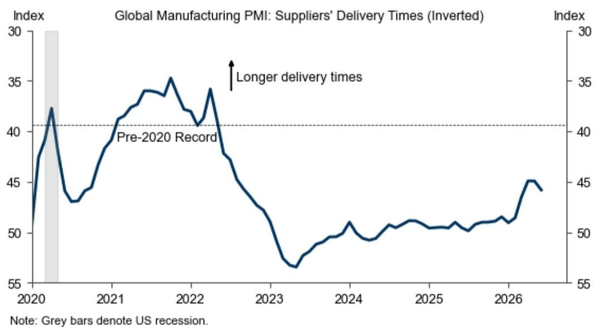  
Source: S&P Global, Haver, GS Global Investment Research

Exhibit 10: Manufacturing Suppliers' Delivery Times Lengthened Most in Canada Last Month  
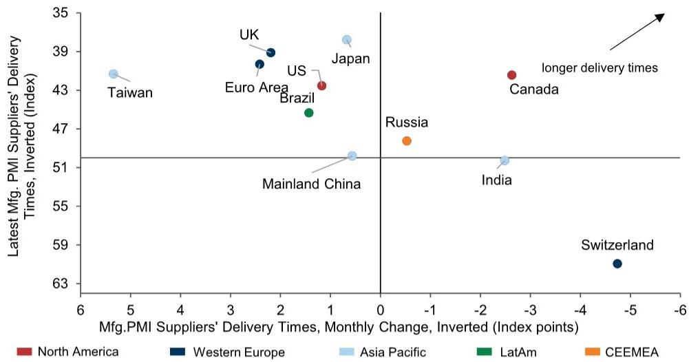  
We plot economies in our GS coverage with a global GVA weight of at least 0.5%, and that are a standard deviation away from the cross-economy mean in either the suppliers' delivery times level or its change, as well as the G7 and BRICs economies. China PMI is an average of the Markit and the NBS official suppliers' delivery times components.  
Source: S&P Global, Haver, GS Global Investment Research

Exhibit 11: On a 3-Month Basis, Manufacturing Suppliers' Delivery Times Have Improved Most DMs outside the UK  
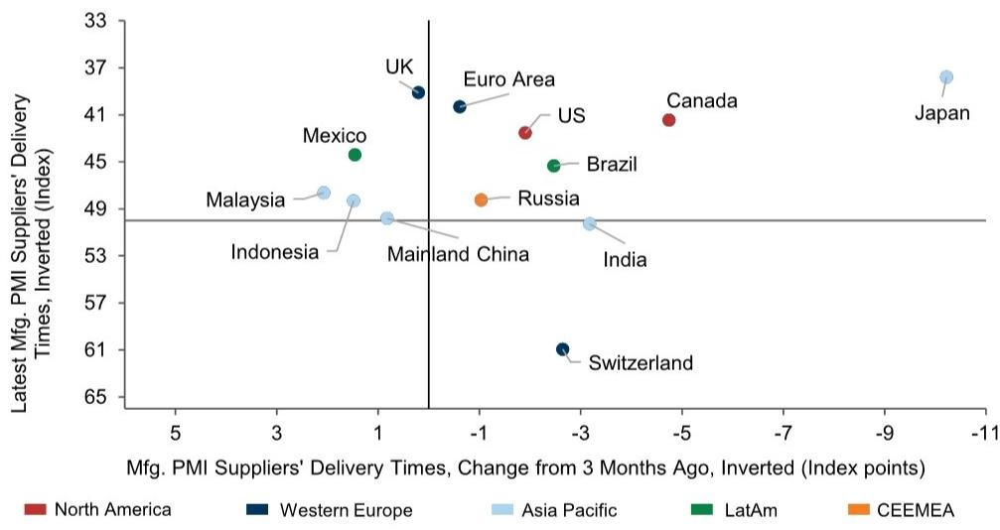  
We plot countries in our GS coverage with a global GVA weight of at least 0.5%, and that are a standard deviation away from the cross-country mean in either the suppliers' delivery times level or its change, as well as the G7 and BRICs economies. China PMI is an average of the Markit and the NBS official suppliers' delivery times components.  
Source: S&P Global, Haver, GS Global Investment Research

Exhibit 12: The Global Manufacturing Input Price PMI Fell by -4.3pt to 63.1 and the Output Price PMI Fell by -1.0pt to 57.0  
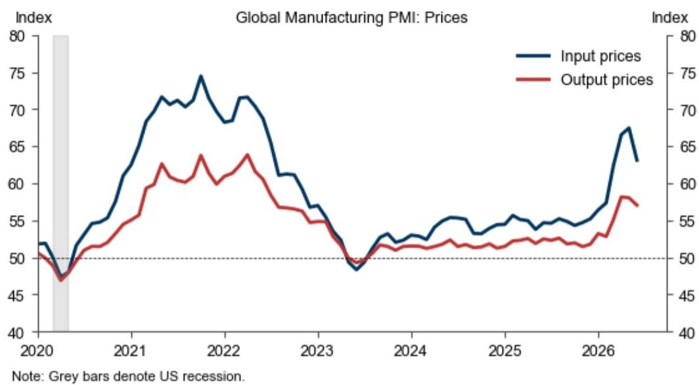  
Source: S&P Global, Haver, GS Global Investment Research

Exhibit 13: The Global Services Input Price PMI Fell by +1.4pt to 59.5 and the Output Price PMI Ticked Down by -0.4pt to 55.2  
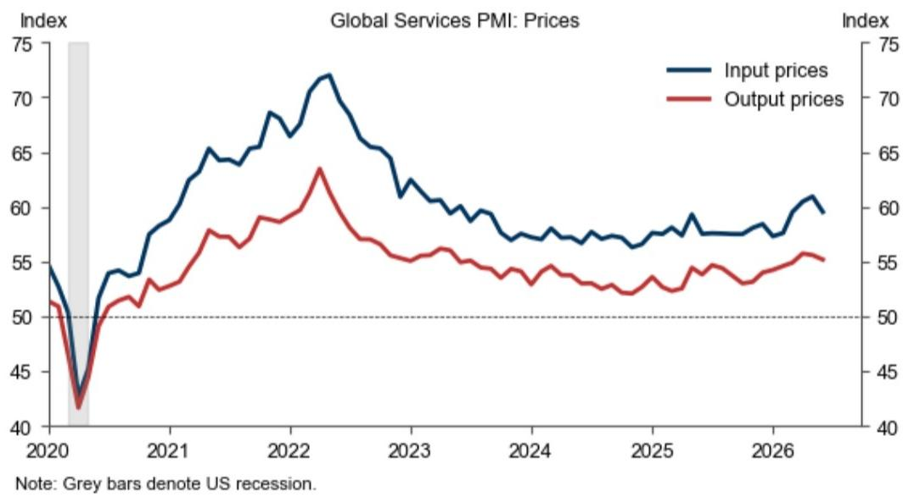  
Source: S&P Global, Haver, GS Global Investment Research

## Trade-Related Components

Exhibit 14: The Manufacturing New Export Orders PMI Component Improved Most in Mexico (+2.8pt to 46.2) but Fell Most in India (-1.7pt to 52.0) in May

Change in Manufacturing New Export Orders PMI Component

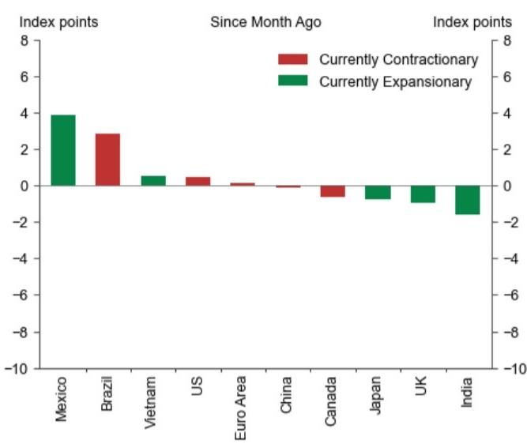  
Source: S&P Global, Haver Analytics, GS Global Investment Research

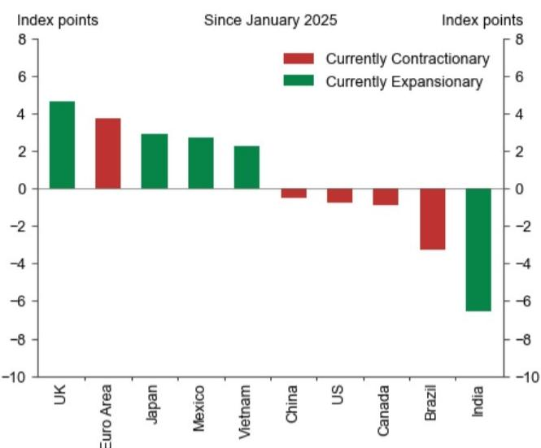

## Analysis of PMIs From Our Economics Team

■ Hong Kong: PMI increased in June, July 6

■ Euro Area Data Update: Area-Wide PMIs Revised Up, GDP Tracking Ticks Up, July 3

Mexico: Firmer Consumer Sentiment and Manufacturing/Services PMIs; Mixed Business Sentiment Signals, July 3

Brazil: Firmer Manufacturing and Services PMIs; Intense but Moderating Input Cost/Price Pressures in Manufacturing, July 3

USA: ISM Manufacturing Somewhat Below Expectations, July 1

Brazil: Firmer June Manufacturing PMI; Still Intense but Moderating Input Cost/Price Pressures, July 1

■ Euro Area Data Update: Manufacturing PMIs Revised Up Slightly for June, July 1
