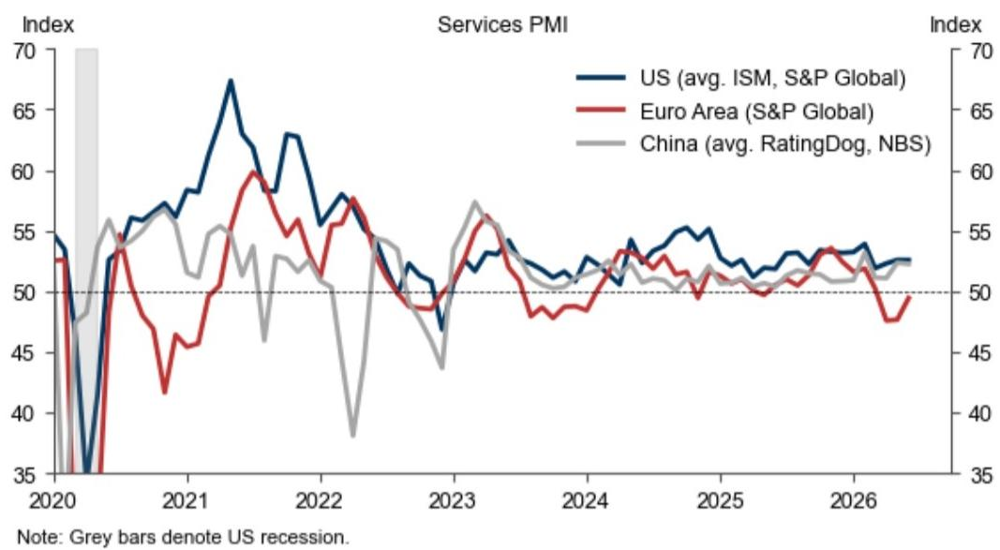
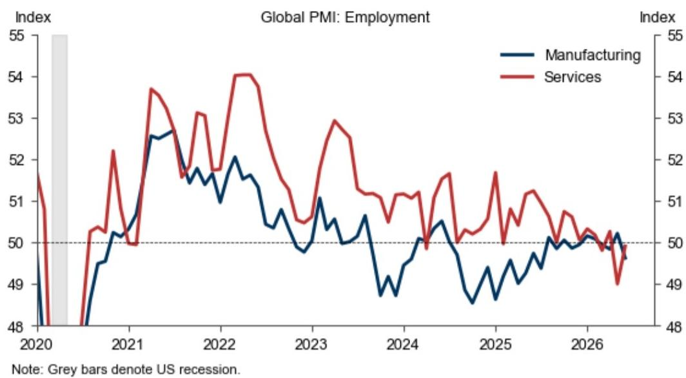
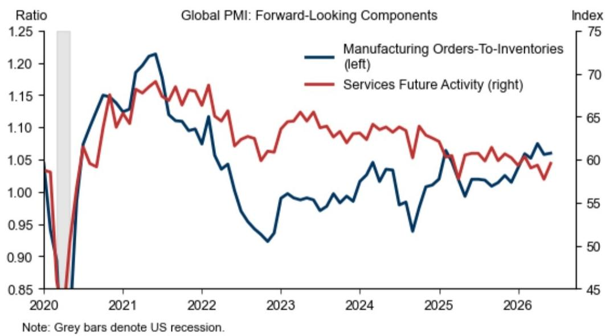

# GS：全球投入价格回落4.3个百分点，GS，为供应链调整创造宽松窗口

全球PMI在6月维持了温和扩张的态势，综合指数微升至52.0。但这份来自GS的最新监测报告真正的看点，并不在于全球总量的平淡表现，而在于一个被多数人忽略的结构性变化：墨西哥制造业新出口订单指数在6月大幅跃升2.8个百分点，时隔两年多首次回到扩张区间。与此同时，全球制造业投入价格指数却出现了4.3个百分点的明显回落。这两组数据叠加在一起，指向一个值得产业决策者关注的信号——全球供应链的再配置正在从“规划”走向“执行”，而价格不确定性的缓解则为这一进程提供了更宽松的窗口。

> **KC评论：** 墨西哥新出口订单的回升并非短期波动。报告显示，这一指标上一次回到扩张区间已是两年前。结合近两年北美近岸外包的持续讨论，这次数据突破更像是一个“从量变到质变”的节点。完整报告中的图表1值得细看，它展示了这一指标的月度变化轨迹，比单纯的数字更能说明趋势的持续性。

## 1. 全球制造业出现分化：美国节奏变化，中国企稳，墨西哥接棒

6月全球制造业PMI整体回落0.5个百分点至52.2，但内部结构差异明显。美国制造业PMI（综合标普和ISM均值）下降了1.0个百分点至53.6，欧元区微降0.1个百分点至51.4。相比之下，中国制造业PMI（综合财新和官方均值）小幅上升0.1个百分点至51.0，表现出一定的韧性。

真正让这份报告区别于普通月度监测的，是墨西哥数据的异军突起。该国制造业新出口订单指数在5月的基础上进一步改善，并一举突破50的荣枯线。考虑到墨西哥在全球供应链中“近岸外包”枢纽的定位，这一变化可能意味着北美区域内的产业链整合正在加速，而非简单的周期性波动。

对关注全球制造业布局的读者而言，这里有一个需要追问的问题：墨西哥的订单回升，是抢走了亚洲竞争对手的份额，还是全球总需求扩张带来的增量？报告未做直接归因，但从印度新出口订单指数同期下滑1.7个百分点来看，前者的可能性不容忽视。

## 2. 价格不确定性的同步回落为政策调整创造空间

与需求端的分化相比，价格端的信号更加统一。全球制造业投入价格PMI在6月大幅下降4.3个百分点至63.1，产出价格PMI也下降了1.0个百分点至57.0。服务业的投入和产出价格同样呈现温和回落。

这个组合意味着什么？一方面，上游成本不确定性的缓解有助于改善制造业企业的利润空间，尤其是对价格敏感的中小企业。另一方面，对于仍在观察通胀粘性的各国央行而言，制造业价格增速的节奏变化是一个积极信号。如果这一趋势持续，可能会影响下半年主要地区的利率路径判断。

> **KC评论：** 投入价格下降4.3个点，是这份报告里幅度最大的单一变动之一。但要注意，63.1仍然处于历史偏高水平。报告没有给出“通胀问题已解决”的结论，只是提供了“方向改善”的证据。完整报告中的图表12和13分别展示了制造业和服务业的价格分项走势，适合放在一起对比阅读。

## 3. 报告尚未完全回答的关键问题：订单改善的可持续性与传导路径

尽管墨西哥的数据亮眼，但报告本身也留下了一些未解问题。首先，新出口订单的改善是否能够持续？单月数据突破荣枯线，尚不足以确认趋势性反转。其次，订单改善能否转化为实际的生产和就业增长？报告显示全球制造业就业PMI仍在49.6的调整区间，服务业就业也仅为49.9。这意味着，即使订单回暖，企业扩产的意愿可能仍然谨慎。

另一个值得持续观察的维度是供应商交货时间。全球制造业供应商交货时间PMI在6月上升了0.9个百分点至45.8，虽然仍处于“延长”区间，但改善的方向是明确的。如果交货时间持续恢复正常化，将有助于缓解全球贸易中的瓶颈问题，进一步支撑出口导向型地区的表现。

对于关注全球贸易格局的研究者来说，这份报告提供了一个清晰的观察框架：跟踪墨西哥新出口订单的持续性、全球投入价格的回落速度、以及就业PMI何时回到扩张区间。这三个指标的组合，比单一的总量数字更能说明供应链重构的真实进展。

For informational purposes only. Portions may be generated,translated,summarized,or edited with AI assistance based on source materials and may contain omissions or errors. Please verify independently. This is not investment,legal,tax,accounting,or other professional advice.

For informational purposes only. Portions may be generated,translated,summarized,or edited with AI assistance based on source materials and may contain omissions or errors. Please verify independently. This is not investment,legal,tax,accounting,or other professional advice.

