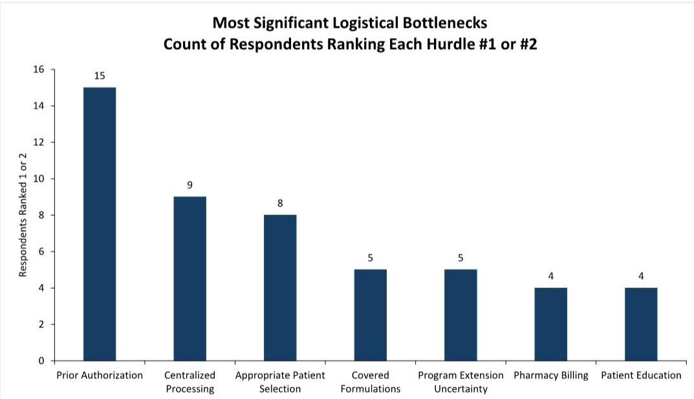
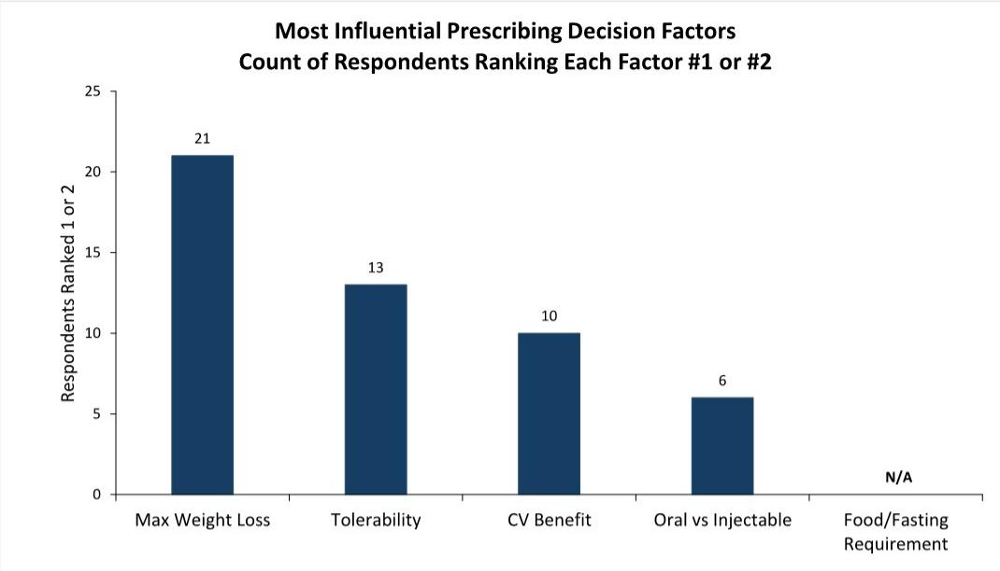
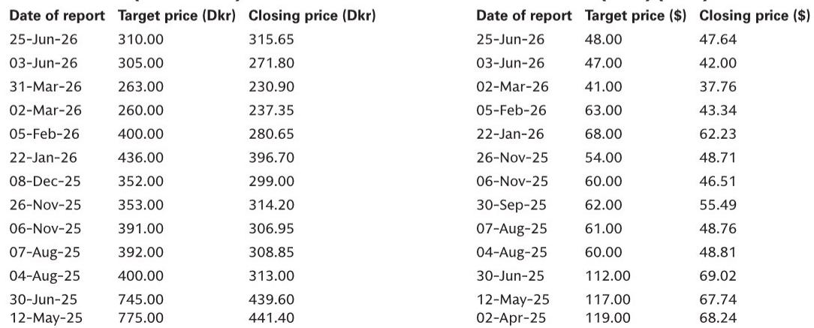

# The Medicare GLP-1 Bridge Program Will Reshape the Obesity Market Faster Than Most Observers Expect

On July 1, 2026, a single policy change will unlock what has historically been the largest untapped pool of demand in the anti-obesity medication market. The CMS GLP-1 Bridge program, running through December 2027, removes the statutory barrier that prevented Medicare from covering drugs exclusively for weight loss. For the first time, approximately 15 million Medicare beneficiaries will have access to Wegovy and Zepbound at a $50 monthly copay. This is not a marginal expansion. It is a structural shift in the addressable market.

The research community has spent the past year debating the trajectory of GLP-1 adoption, focusing largely on commercial insurance coverage and out-of-pocket pricing dynamics. Those debates remain relevant. But the Medicare Bridge program changes the calculus in a way that most top-down models have not fully captured. A recent survey of 25 physicians who treat Medicare patients for obesity without diabetes offers early, granular evidence of what this unlock means. The results suggest that adoption will be faster and deeper than consensus expects, and that the competitive dynamics between Novo Nordisk and Eli Lilly will shift in ways that are not yet reflected in current market pricing.

The survey indicates that physicians expect approximately 31% of eligible patients to enroll in the program shortly after its July 2026 launch, rising to 45% within one year. At face value, these numbers translate to roughly 5 million patients on therapy by mid-2027 and 7 million by mid-2028, assuming the 15 million eligible beneficiary base. Even accounting for sample bias—these physicians are likely early adopters, with 23% of their eligible patients already on GLP-1s through self-pay channels—the implied volume trajectory is substantial. The current utilization rate among Medicare-eligible patients is likely closer to 10-20% based on company commentary and prescription data. The Bridge program could more than double that penetration within 18 months.

The revenue implications are equally significant. Our estimates suggest the Medicare channel will generate approximately $2.6 billion in 2026 and $8 billion in 2027, assuming a volume-weighted average monthly pricing of $245 under the Medicare agreement. But the more important insight is the interplay between volume and price. The existing self-pay population is paying significantly more than $245 per month. As these patients transition to the Bridge program, there will be a simultaneous price headwind that partially offsets the volume gain. The net effect, however, remains strongly positive: incremental revenue of over $2 billion in the second half of 2026 and over $6 billion in 2027.

## The Share Split Between Injectable and Oral GLP-1s Will Favor High-Efficacy Injectables, But the Oral Market Dynamics Are More Nuanced Than They Appear

The survey reveals a clear preference for injectable formulations, with physicians expecting a 70/30 split between injectables and orals under the Bridge program. Within injectables, Eli Lilly's Zepbound Kwikpen is expected to command 44% market share, followed by Novo Nordisk's Wegovy pen at 27%. This is consistent with pre-Bridge dynamics among self-pay patients, where Zepbound held 45% and Wegovy pen held 34%.

The dominance of injectables is driven by a single factor: weight loss efficacy. When physicians ranked the factors driving their prescribing decisions, the ability to achieve maximum weight loss was the most common top factor, followed by tolerability. Oral versus injectable preference was a less frequently cited driver. This suggests that in a physician-directed channel like Medicare, where prior authorization and clinical judgment play a significant role, efficacy will trump convenience.

The oral market, however, tells a more complex story. Within orals, Novo Nordisk's Wegovy pill is expected to capture 16% share and Eli Lilly's Foundayo 13%. But the breakdown by physician specialty reveals a striking divergence. Among endocrinologists, the pre-Bridge share split between Wegovy pill and Foundayo is 65:35 in favor of Wegovy pill. After the Bridge program, endocrinologists expect this to shift to 45:55 in favor of Foundayo. Among primary care physicians, the pre-Bridge split is 77:23 in favor of Wegovy pill, shifting to 69:31 post-Bridge.

This divergence matters because it signals that endocrinologists, who tend to be more experienced with GLP-1s in the type 2 diabetes setting, may be developing a preference for Foundayo based on clinical experience with Rybelsus. If this trend continues, the oral market could see a gradual shift toward Lilly as the Bridge program matures. The key variable is the proportion of prescribers who are endocrinologists versus primary care physicians. In the Medicare population, where obesity is often accompanied by multiple comorbidities, specialist involvement may be higher than in the commercial market.

## Prior Authorization Will Be the Primary Bottleneck, Not Patient Demand or Physician Reluctance

The survey identifies prior authorization as the most significant logistical hurdle to program adoption, followed by a long tail of factors including centralized processing and appropriate patient selection. This is a critical finding because it shifts the risk narrative away from demand-side concerns and toward operational execution.

Patient interest is already high. Physicians reported that 38% of their eligible patient population has expressed interest in GLP-1s ahead of the Bridge program. This is an incremental 15% above those already on therapy through non-Medicare channels. The demand is there. The question is whether the healthcare system can process the volume of prior authorizations required to convert that interest into prescriptions.

The Bridge program requires physicians to submit prior authorization for every patient. For a physician with 100 eligible Medicare patients, this means processing 100 prior authorizations if all patients enroll. In a healthcare system already strained by administrative burden, this could create a bottleneck that delays adoption by several months. The survey respondents ranked prior authorization as the most important bottleneck, ahead of patient education, formulary navigation, and supply constraints.

This has direct implications for revenue timing. If prior authorization delays push patient enrollment from the third quarter of 2026 to the fourth quarter, the 2026 revenue estimate of $2.6 billion could shift to 2027. Observers should monitor not just prescription volume, but the speed of prior authorization processing and any CMS actions to streamline the process.

## The Survey Raises Important Questions That the Report Does Not Fully Answer

While the survey provides granular insight into physician expectations, several critical variables remain unaddressed. First, the survey sample consists of 25 physicians who are likely early adopters. They have meaningful Medicare populations, experience treating obesity, and have prescribed multiple GLP-1s. This is precisely the group that would be most enthusiastic about the Bridge program. The broader physician population, particularly primary care physicians who are less experienced with GLP-1s, may show lower adoption rates.

Second, the survey does not fully address the impact of the $50 copay on patient adherence. Physicians reported an average observed treatment duration of approximately 12 months among self-pay patients. The lower out-of-pocket cost under the Bridge program could increase adherence, but it could also attract patients who are less committed to long-term treatment. The net effect on duration is uncertain.

Third, the competitive dynamics beyond 2027 remain unclear. The Bridge program is temporary, running through December 2027. What happens after that depends on legislative action, CMS policy, and the evolution of commercial coverage. If the program is not extended or made permanent, the volume unlock could reverse, creating a cliff risk for both manufacturers and observers.

Fourth, the survey does not address the potential for supply constraints. Both Novo Nordisk and Eli Lilly have invested heavily in manufacturing capacity, but demand from the Medicare channel could outpace supply, particularly for high-efficacy injectables. Any supply disruption would disproportionately affect Zepbound, which is expected to capture the largest share.

## How to Use This Survey as a Decision Framework

For observers, the survey provides a framework for monitoring the Bridge program's impact in real time. The key metrics to track fall into three categories: volume, share, and operational efficiency.

On volume, the critical number is the percentage of eligible patients who enroll in the program within the first six months. The survey suggests 31% shortly after launch. If actual enrollment exceeds 35%, the revenue trajectory will likely exceed current estimates. If enrollment falls below 25%, the bottleneck is likely prior authorization or patient education, not demand.

On share, the metric to watch is the injectable-oral split and the relative performance of Zepbound versus Wegovy pen. If Zepbound maintains or increases its 44% share, Eli Lilly will capture the majority of the revenue upside. If Wegovy pen gains share, it would signal that Novo Nordisk's manufacturing scale and brand recognition are overcoming the efficacy gap.

On operational efficiency, the leading indicator is prior authorization processing time. If CMS or private payers implement streamlined processes, adoption could accelerate. If processing times exceed 30 days, the 2026 revenue estimates may need to be revised downward.

The survey also has implications for risk management. For those with long positions in Eli Lilly, the positive readthrough is clear: Zepbound is expected to maintain leading share, and the oral market could shift toward Foundayo over time. For Novo Nordisk, the survey is more mixed. Wegovy pill's food-effect requirement was not viewed as a barrier by any physician, which is a positive surprise. But the overall share split favors Lilly, and the endocrinologist preference for Foundayo could erode Novo's oral market position.

The most important unresolved question is whether the Bridge program will be extended beyond 2027. If it is, the volume unlock becomes permanent, and the revenue estimates for 2028 and beyond would need to be revised significantly upward. If it is not, manufacturers face a cliff risk that could compress multiples. This is the single most important policy variable to monitor over the next 18 months.

*For informational purposes only. Portions may be generated, translated, summarized, or edited with AI assistance based on source materials and may contain omissions or errors. Please verify independently. This is not professional advice.*

For informational purposes only. Portions may be generated, translated, summarized, or edited with AI assistance based on source materials and may contain omissions or errors. Please verify independently. This is not professional advice.

