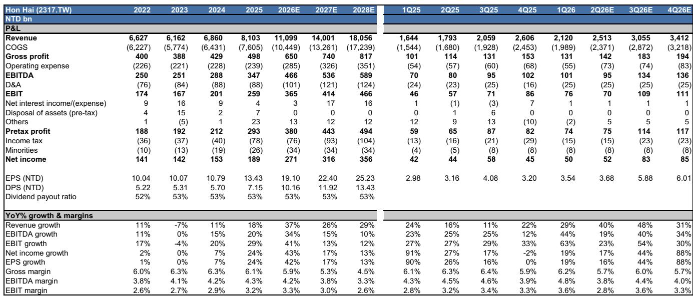
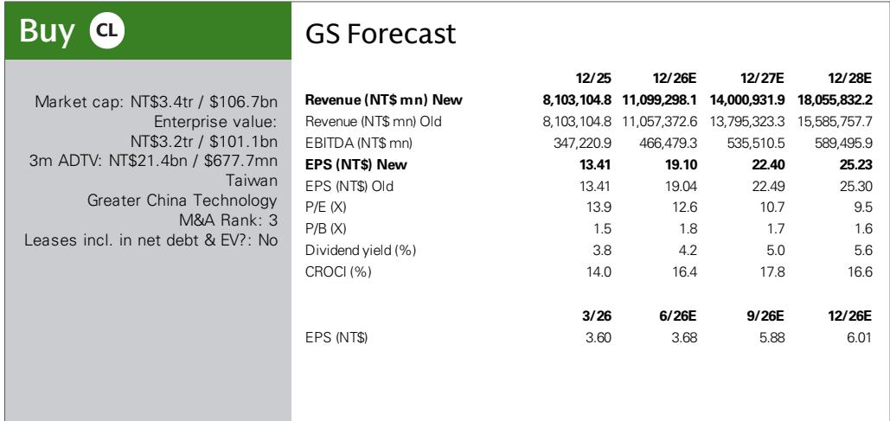
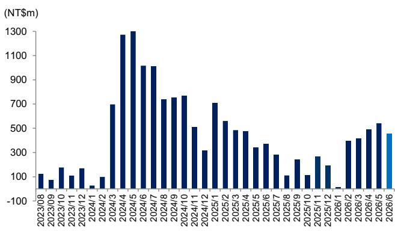

# 研究笔记：鸿海营收超预期背后的结构性信号

6月营收同比增长52%，比研究机构自身预测高出18%——鸿海交出了一份值得重新审视其增长逻辑的季度成绩单。但这份报告的关键判断，不在于单月数字的意外，而在于一个更结构性的信号：AI服务器机柜正在从“备货”阶段进入“规模放量”阶段，而鸿海在这一环节的份额扩张，可能比市场预期的更快、更持久。

研究机构在最新报告中维持了对鸿海的积极看法，并强调2026年下半年到2027年，AI服务器和智能手机形态变化将构成公司增长的双引擎。报告上调了2027-2028年营收预测，主要驱动力正是AI机柜的收入上修。

## 1. 营收超预期背后，是AI产品拉货动能的持续强化

6月营收822亿新台币，同比+52%，环比-4%。环比微降并非需求转弱，而是受到材料供应紧张的影响。研究指出，AI产品的拉货动能仍在持续，且管理层对三季度给出了环比和同比均增长的指引。

关键看点在于：消费电子和云网业务环比持平，PC和组件则因提前拉货而环比下降。这意味着，AI相关产品并没有挤占传统业务，而是独立构成了增量。研究机构预期7月营收将同比+51%、环比+13%至929亿新台币，AI机柜放量是主要支撑。

> **观察评论：** 营收超预期18%不是偶然。鸿海的AI服务器业务正在从“小批量出货”向“机柜级规模交付”切换。完整报告中的月度营收模型值得细看，尤其是7-9月的环比增速假设，这直接决定了三季度能否维持40%以上的同比增速。

## 2. 毛利率承压是主动选择，而非经营出现变化

营收快速扩张的同时，毛利率却在走低。研究机构将2027-2028年毛利率预测从5.4%/5.2%下调至5.3%/4.5%。表面看是利润率压缩，但背后是产品组合的结构性变化——AI机柜的营收占比快速提升，而这类产品的毛利率天然低于消费电子EMS。

但换个角度看，营业利润率仅从3.0%微降至2.6%，说明规模效应和运营效率正在部分对冲毛利率的节奏变化。净利率从2.3%降至2.0%，但每股收益预测却几乎没有下调，2027-2028年EPS分别为22.40和25.23新台币，与之前基本一致。

报告尚未完全回答的问题是：毛利率的节奏变化是否有底？如果AI机柜占比继续提升，毛利率是否会在2029年进一步压缩到4%以下？这需要读者自行判断规模扩张与利润率的平衡点。

## 3. 电动车业务：小步快跑，但贡献仍需时间验证

鸿海的电动车子公司Foxtron，6月营收仅4.55亿新台币，环比下滑，同比虽有增长但体量依然很小。报告提到了几个积极信号：Foxtron推出了首款自有品牌车型“Foxtron Bria”，与三菱汽车在乘用车和零排放巴士领域达成合作。

但这些动作的营收贡献，在可预见的未来仍难以与AI服务器相提并论。研究机构将其视为“增量增长机会”，而非短期驱动力。真正值得关注的是，电动车业务能否在2027-2028年形成可观的营收基数，从而分散公司对消费电子和AI的依赖。

## 4. 估值框架的隐含假设：市场正在为“AI+电动车”双故事定价

对应18.9倍2027年预期市盈率。这个倍数高于公司2010年以来的历史均值，反映了分析师对业务结构变化的正面看法——从竞争激烈的消费电子EMS，向AI服务器和电动车代工转型。

但估值溢价能否维持，取决于两个关键变量：AI机柜的份额扩张能否持续超出预期，以及电动车业务能否在2027年前后进入规模放量阶段。报告的观察提示部分也明确提到了AI服务器爬坡慢于预期、电动车表现弱于预期等节奏变化因素。

> **观察评论：** 18.9倍PE的估值框架，本质上是在为“AI服务器份额扩张”和“电动车从0到1”两个故事定价。如果AI机柜放量节奏符合预期，估值有支撑；但如果电动车迟迟无法贡献实质营收，估值溢价可能面临回调。完整报告中的PEG&M估值模型和同业对比值得仔细推敲。

---

For informational purposes only. Portions may be generated,translated,summarized,or edited with AI assistance based on source materials and may contain omissions or errors. Please verify independently. This is not investment,legal,tax,accounting,or other professional advice.

For informational purposes only. Portions may be generated,translated,summarized,or edited with AI assistance based on source materials and may contain omissions or errors. Please verify independently. This is not investment,legal,tax,accounting,or other professional advice.

