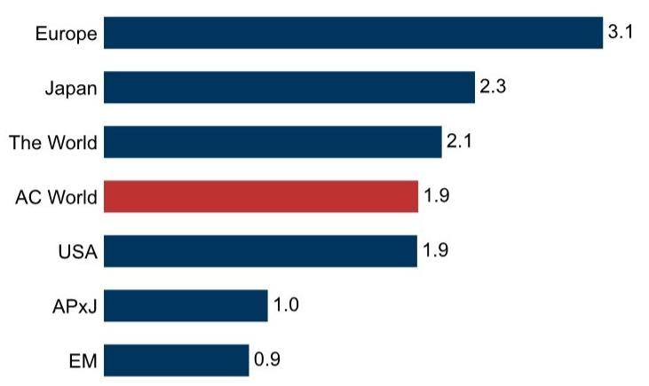
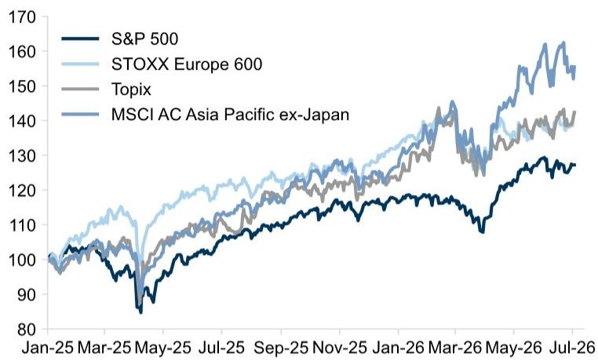
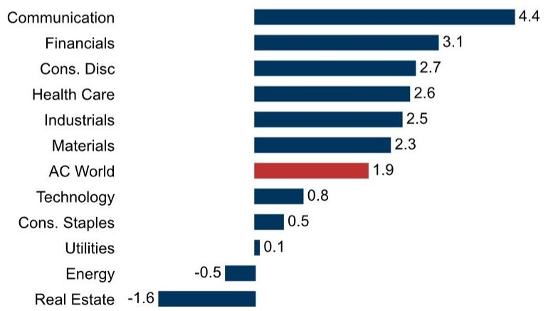
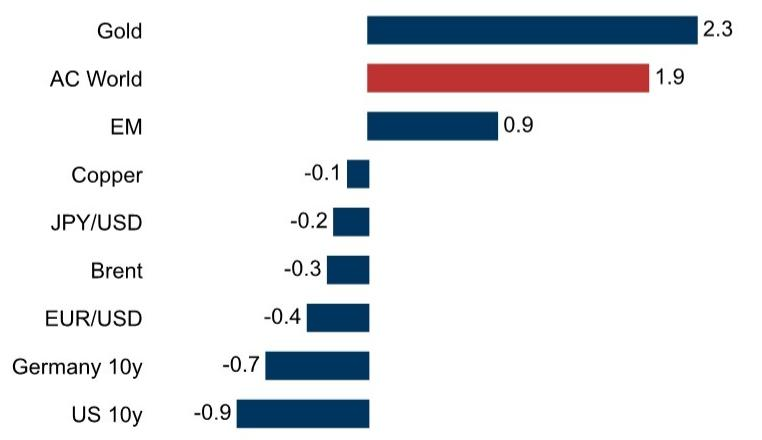
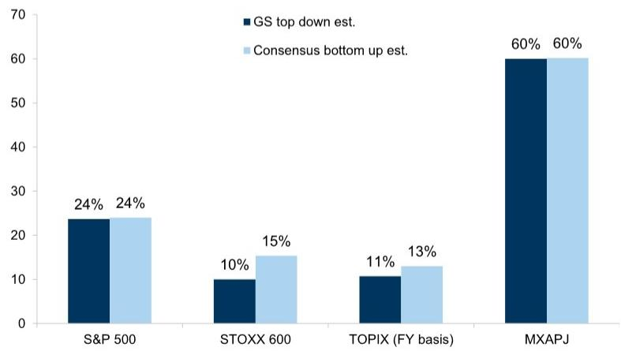
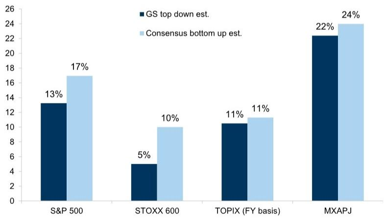
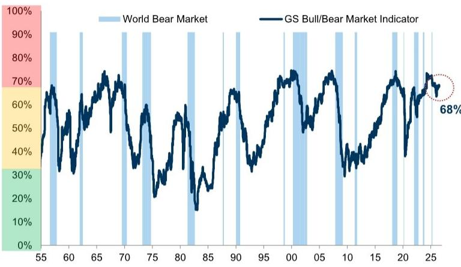
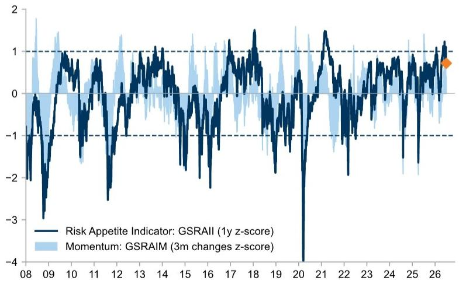
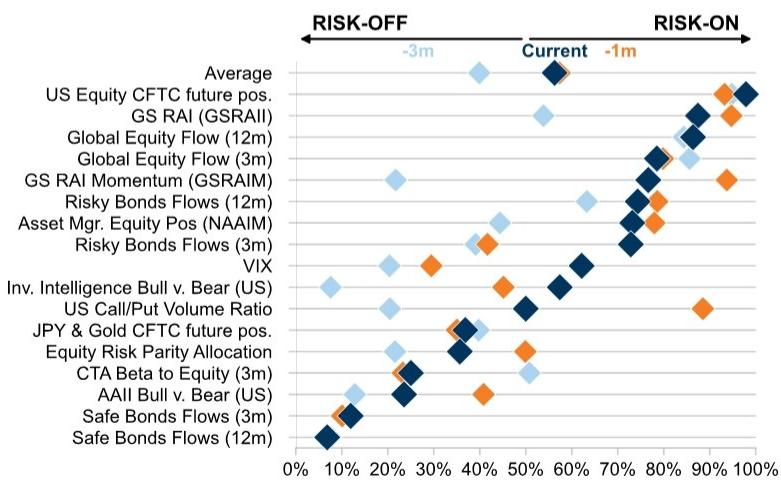

GLOBAL WEEKLY KICKSTART

## 市场动能转换，Q2财报季前瞻

全球市场上周上涨2%，欧洲市场领涨，亚洲市场表现相对落后（图表1）。随着资金从前期强势板块轮动至滞后板块，动量策略出现明显回调（图表31）。在Q2财报季来临前，市场预期处于较高水平，盈利增长预期强劲（图表7），盈利修正方向积极（图表22），市场情绪正面（图表21）。

## 本周宏观数据

美国：ISM服务业指数、FOMC 6月会议纪要、美联储官员讲话（包括Waller理事、Williams和Logan行长）。

欧洲：德国工厂订单和工业产出；瑞典初值通胀；德国、法国、挪威终值通胀。

日本：7月9日日本央行分行行长会议、5月名义工资增长、6月国内企业商品价格指数。

亚洲（除日本）：中国信贷数据；中国、中国台湾、泰国、菲律宾通胀数据；新加坡GDP和中国台湾出口数据；马来西亚央行会议。

数据截至7月3日（周五）收盘。

## 读者为Q2财报季做准备

财报季将于下周开启，对于判断当前估值是否合理至关重要。尤其是在上周动量策略出现显著轮动、资金从前期的强势板块流向滞后板块之后，这一判断显得尤为重要。

■ 美国增长强劲。市场普遍预期标普500指数Q2每股盈利增长22%，但增长仍较为集中，预计人工智能基础设施相关公司贡献了近60%的每股盈利增长。标普500指数中位数公司预计每股盈利同比增长9%。市场关注点在于人工智能支出是否开始产生实质性回报。

■ 欧洲增长强劲。市场普遍预期STOXX 600指数上半年每股盈利增长11%，但增长仍集中在能源板块。剔除大宗商品生产商后，每股盈利增长降至6%，与中位数公司表现一致。市场关注点在于制造业活动增强和欧元走弱能否支撑大宗商品板块以外的盈利增长。我们的外汇策略团队已将欧元兑美元预测从1.20修正为1.12。

Guillaume Jaisson +44(20)7552-3000 | guillaume.jaisson@gs.com GS International

Peter Oppenheimer +44(20)7552-5782 | peter.oppenheimer@gs.com GS International

Sharon Bell  
+44(20)7552-1341 | sharon.bell@gs.com GS International

John Kwon  
+65-6654-6337 |  
jongmin.kwon@gs.com  
GS (Singapore) Pte

Giovanni Ferrannini  
+44(20)7051-2589 |  
giovanni.ferrannini@gs.com  
GS International

Elena Porfidia  
+44(20)7051-5240 |  
elena.porfidia@gs.com  
GS International

## 本周概览——全球市场与指数

图表1：全球市场表现  
MSCI指数，1周价格回报（美元，%）

  
来源：Datastream, Bloomberg, GS全球投资研究  
图表2：全球权益指数 美元计价，指数价格表现

  
来源：Datastream, STOXX, GS全球投资研究

图表3：MSCI AC全球行业表现  
MSCI指数，1周价格回报（美元，%）  
  
来源：Datastream, Bloomberg, GS全球投资研究  
图表4：跨资产表现  
MSCI指数，1周价格回报（美元，%）

  
来源：Datastream, Bloomberg, GS全球投资研究

## 预测

图表5：GDP增长，% 同比：GS vs. 市场共识

<table><tr><td colspan="6">实际GDP增长</td></tr><tr><td rowspan="2">同比百分比变化</td><td>2025</td><td colspan="2">2026</td><td colspan="2">2027</td></tr><tr><td>GS</td><td>GS</td><td>共识*</td><td>GS</td><td>共识*</td></tr><tr><td>美国</td><td>2.1</td><td>2.1</td><td>2.1</td><td>2.1</td><td>2.1</td></tr><tr><td>日本</td><td>1.1</td><td>0.5</td><td>0.6</td><td>1.0</td><td>0.8</td></tr><tr><td>欧元区</td><td>1.5</td><td>0.5</td><td>0.6</td><td>1.2</td><td>1.2</td></tr><tr><td>德国</td><td>0.3</td><td>0.7</td><td>0.6</td><td>1.1</td><td>1.1</td></tr><tr><td>法国</td><td>0.9</td><td>0.5</td><td>0.6</td><td>0.7</td><td>0.9</td></tr><tr><td>意大利</td><td>0.7</td><td>0.8</td><td>0.6</td><td>0.7</td><td>0.7</td></tr><tr><td>西班牙</td><td>2.8</td><td>2.3</td><td>2.3</td><td>1.6</td><td>1.8</td></tr><tr><td>英国</td><td>1.4</td><td>1.2</td><td>1.0</td><td>1.3</td><td>1.1</td></tr><tr><td>中国</td><td>5.0</td><td>4.7</td><td>4.6</td><td>4.7</td><td>4.4</td></tr><tr><td>发达市场</td><td>1.8</td><td>1.5</td><td>1.9</td><td>1.7</td><td>1.5</td></tr><tr><td>新兴市场</td><td>4.2</td><td>3.7</td><td>4.0</td><td>4.1</td><td>3.9</td></tr><tr><td>全球</td><td>2.8</td><td>2.5</td><td>2.8</td><td>2.8</td><td>2.5</td></tr></table>

\* 彭博国家和GS汇总共识  
来源：Bloomberg, GS全球投资研究

图表6：GS宏观3个月、6个月和12个月预测

<table><tr><td rowspan="2"></td><td rowspan="2">当前</td><td colspan="3">预测</td><td rowspan="2">距12个月目标价涨跌幅（%）</td></tr><tr><td>3个月</td><td>6个月</td><td>12个月</td></tr><tr><td colspan="6">权益</td></tr><tr><td>标普500</td><td>7483</td><td>7600</td><td>8000</td><td>8300</td><td>10.9</td></tr><tr><td>STOXX欧洲600</td><td>653</td><td>640</td><td>645</td><td>660</td><td>1.1</td></tr><tr><td>MSCI亚太（除日本）</td><td>886</td><td>980</td><td>1030</td><td>1080</td><td>21.9</td></tr><tr><td>东证指数</td><td>4065</td><td>4100</td><td>4200</td><td>4400</td><td>8.3</td></tr><tr><td colspan="6">10年期利率（%）</td></tr><tr><td>美国</td><td>4.5</td><td>4.4</td><td>4.4</td><td>4.3</td><td>-19 bp</td></tr><tr><td>欧元区（德国）</td><td>2.9</td><td>3.0</td><td>3.0</td><td>3.0</td><td>7 bp</td></tr><tr><td>日本</td><td>2.7</td><td>2.5</td><td>2.5</td><td>2.4</td><td>-33 bp</td></tr><tr><td colspan="6">汇率</td></tr><tr><td>欧元/美元</td><td>1.14</td><td>1.14</td><td>1.12</td><td>1.12</td><td>-2.1</td></tr><tr><td>英镑/美元</td><td>1.34</td><td>1.33</td><td>1.34</td><td>1.33</td><td>-0.2</td></tr><tr><td>美元/日元</td><td>161</td><td>162</td><td>163</td><td>165</td><td>2.3</td></tr><tr><td colspan="6">大宗商品</td></tr><tr><td>布伦特原油（美元/桶）</td><td>72.1</td><td>83</td><td>80</td><td>75</td><td>4.0</td></tr><tr><td>NYMEX天然气（美元/百万英热单位）</td><td>3.2</td><td>3.50</td><td>3.50</td><td>3.50</td><td>9.5</td></tr><tr><td>黄金（美元/盎司）</td><td>4172</td><td>4690</td><td>4900</td><td>5115</td><td>22.6</td></tr><tr><td>LME铜（美元/吨）</td><td>13317</td><td>13620</td><td>13735</td><td>13800</td><td>3.6</td></tr></table>

来源：Bloomberg, Datastream, STOXX, GS全球投资研究

图表7：GS自上而下 vs. 市场自下而上对2026年每股盈利增长的预估  
  
来源：I/B/E/S, Toyo Keizai, STOXX, MSCI, GS全球投资研究

图表8：GS自上而下 vs. 市场自下而上对2027年每股盈利增长的预估  
  
来源：I/B/E/S, Toyo Keizai, STOXX, MSCI, GS全球投资研究

## 风险与情绪指标

图表9：GS多头/空头市场指标（GSBLBR）  
  
来源：Shiller, Haver Analytics, Datastream, GS全球投资研究  
图表10：GS多头/空头市场指标成分明细 GS多头/空头市场指标 = 平均百分位数

<table><tr><td></td><td>水平</td><td>百分位数</td></tr><tr><td>Shiller市盈率</td><td>40.3</td><td>98%</td></tr><tr><td>失业率</td><td>4.2</td><td>80%</td></tr><tr><td>0-6个季度回报表现曲线</td><td>0.3</td><td>73%</td></tr><tr><td>私营部门金融余额</td><td>3.9</td><td>56%</td></tr><tr><td>核心通胀</td><td>2.9</td><td>53%</td></tr><tr><td>ISM</td><td>53.3</td><td>50%</td></tr><tr><td>GS多头/空头市场指标</td><td></td><td>68%</td></tr></table>

注：$100^{th}$百分位表示这些变量处于最高水平，但私营部门金融余额、回报表现曲线和失业率除外，其中$100\%$表示它们处于最低水平。  
来源：Haver Analytics, Datastream, Robert Shiller, GS全球投资研究

## 图表11：风险偏好指标（GSRAII）

RAI基于跨资产类别的27组配对交易，以相对于过去2年表现的z-score衡量，详见2016年7月GOAL报告

  
来源：GS全球投资研究

图表12：情绪指标百分位数 数据自2007年起  
  
来源：EPFR, Datastream, Haver Analytics, GS全球投资研究

## 表现——本地指数

图表13：全球权益市场表现（本地指数）

<table><tr><td rowspan="2">市场</td><td colspan="4">价格回报（本地货币，%）</td></tr><tr><td>指数</td><td>1周（本地）</td><td>年初至今</td><td>1年</td></tr><tr><td>中国台湾</td><td>TWSE</td><td>5.0</td><td>61.5</td><td>106.0</td></tr><tr><td>丹麦</td><td>KFX</td><td>4.7</td><td>3.7</td><td>(4.4)</td></tr><tr><td>德国</td><td>DAX</td><td>4.5</td><td>5.3</td><td>7.7</td></tr><tr><td>泰国</td><td>SET</td><td>4.5</td><td>27.9</td><td>42.9</td></tr><tr><td>希腊</td><td>ASE</td><td>3.6</td><td>19.6</td><td>32.5</td></tr><tr><td>中国（H）</td><td>HSCEI</td><td>3.2</td><td>(13.6)</td><td>(11.0)</td></tr><tr><td>欧元Stoxx 50</td><td>SX5E</td><td>3.1</td><td>10.7</td><td>20.0</td></tr><tr><td>意大利</td><td>FTSEMIB</td><td>3.0</td><td>17.5</td><td>32.2</td></tr><tr><td>香港</td><td>HSI</td><td>3.0</td><td>(8.9)</td><td>(3.0)</td></tr><tr><td>瑞典</td><td>OMX</td><td>3.0</td><td>12.6</td><td>28.4</td></tr><tr><td>波兰</td><td>WiG</td><td>2.9</td><td>18.7</td><td>31.0</td></tr><tr><td>葡萄牙</td><td>BVLX</td><td>2.9</td><td>16.6</td><td>23.2</td></tr><tr><td>Stoxx 600</td><td>SXXP</td><td>2.7</td><td>10.2</td><td>20.0</td></tr><tr><td>日本</td><td>TPX</td><td>2.6</td><td>19.2</td><td>43.7</td></tr><tr><td>奥地利</td><td>ATX</td><td>2.5</td><td>23.3</td><td>48.2</td></tr><tr><td>挪威</td><td>OSEAX</td><td>2.4</td><td>16.8</td><td>21.1</td></tr><tr><td>匈牙利</td><td>HUX EM</td><td>2.3</td><td>28.9</td><td>43.2</td></tr><tr><td>西班牙</td><td>IBEX DM</td><td>2.2</td><td>14.7</td><td>40.0</td></tr><tr><td>捷克</td><td>PX</td><td>2.1</td><td>(2.6)</td><td>20.8</td></tr><tr><td>荷兰</td><td>AEX</td><td>2.1</td><td>13.9</td><td>18.3</td></tr><tr><td>菲律宾</td><td>PCOMP</td><td>1.9</td><td>2.2</td><td>(4.3)</td></tr><tr><td>瑞士</td><td>SMI</td><td>1.8</td><td>8.7</td><td>20.4</td></tr><tr><td>美国</td><td>SPX</td><td>1.8</td><td>9.3</td><td>19.2</td></tr><tr><td>英国</td><td>UKX</td><td>1.6</td><td>7.5</td><td>21.0</td></tr><tr><td>法国</td><td>CAC</td><td>1.5</td><td>4.4</td><td>9.7</td></tr><tr><td>比利时</td><td>BEL20</td><td>1.3</td><td>14.5</td><td>29.6</td></tr><tr><td>南非</td><td>JALSH</td><td>1.2</td><td>(3.7)</td><td>15.0</td></tr><tr><td>新加坡</td><td>FSSTI</td><td>1.0</td><td>12.9</td><td>30.5</td></tr><tr><td>土耳其</td><td>XU100</td><td>1.0</td><td>28.0</td><td>41.0</td></tr><tr><td>澳大利亚</td><td>AS51</td><td>0.9</td><td>1.5</td><td>2.9</td></tr><tr><td>新西兰</td><td>NZX 50</td><td>0.9</td><td>(0.9)</td><td>4.0</td></tr><tr><td>印度</td><td>NIFTY</td><td>0.9</td><td>(7.1)</td><td>(4.5)</td></tr><tr><td>马来西亚</td><td>FBMKLCI</td><td>0.7</td><td>(0.1)</td><td>8.4</td></tr><tr><td>加拿大</td><td>SPTSX60</td><td>0.5</td><td>11.2</td><td>28.6</td></tr><tr><td>巴西</td><td>IBOV</td><td>0.4</td><td>8.0</td><td>23.5</td></tr><tr><td>墨西哥</td><td>MEXBOL</td><td>-0.2</td><td></td><td>15.8</td></tr><tr><td>印度尼西亚</td><td>JCI</td><td>-0.3</td><td>(32.0)</td><td>(14.6)</td></tr><tr><td>中国（A）</td><td>SHSZ300</td><td>-0.5</td><td>4.6</td><td>22.0</td></tr><tr><td>埃及</td><td>EGX30</td><td>-1.8</td><td>20.8</td><td>54.0</td></tr><tr><td>韩国</td><td>KOSPI</td><td>-3.8</td><td>91.9</td><td>159.6</td></tr></table>

<table><tr><td rowspan="2">市场</td><td colspan="4">相对价格回报（vs MSCI AC全球，美元，%）</td></tr><tr><td>指数</td><td>1周（美元）</td><td>年初至今</td><td>1年</td></tr><tr><td>泰国</td><td>SET</td><td></td><td>3.3</td><td>10.9</td></tr><tr><td>丹麦</td><td>KFX</td><td></td><td>3.2</td><td>(9.8)</td></tr><tr><td>德国</td><td>DAX</td><td></td><td>3.0</td><td>(8.2)</td></tr><tr><td>中国台湾</td><td>TWSE</td><td></td><td>2.8</td><td>47.9</td></tr><tr><td>希腊</td><td>ASE</td><td></td><td>2.1</td><td>5.8</td></tr><tr><td>瑞典</td><td>OMX</td><td></td><td>2.0</td><td>(3.0)</td></tr><tr><td>欧元Stoxx 50</td><td>SX5E</td><td></td><td>1.6</td><td>(2.9)</td></tr><tr><td>意大利</td><td>FTSEMIB</td><td></td><td>1.5</td><td>3.7</td></tr><tr><td>挪威</td><td>OSEAX</td><td></td><td>1.5</td><td>9.2</td></tr><tr><td>波兰</td><td>WiG</td><td></td><td>1.5</td><td>3.1</td></tr><tr><td>葡萄牙</td><td>BVLX</td><td></td><td>1.4</td><td>2.8</td></tr><tr><td>中国（H）</td><td>HSCEI</td><td></td><td>1.3</td><td>(25.0)</td></tr><tr><td>Stoxx 600</td><td>SXXP</td><td></td><td>1.2</td><td>(3.4)</td></tr><tr><td>香港</td><td>HSI</td><td></td><td>1.0</td><td>(20.4)</td></tr><tr><td>奥地利</td><td>ATX</td><td></td><td>1.0</td><td>9.3</td></tr><tr><td>匈牙利</td><td>HUX</td><td></td><td>1.0</td><td>25.7</td></tr><tr><td>捷克</td><td>PX</td><td></td><td>1.0</td><td>(15.9)</td></tr><tr><td>英国</td><td>UKX</td><td></td><td>0.9</td><td>(4.0)</td></tr><tr><td>日本</td><td>TPX</td><td></td><td>0.9</td><td>5.1</td></tr><tr><td>南非</td><td>JALSH</td><td></td><td>0.8</td><td>(12.4)</td></tr><tr><td>西班牙</td><td>IBEX</td><td></td><td>0.7</td><td>1.0</td></tr><tr><td>荷兰</td><td>AEX</td><td></td><td>0.6</td><td>0.2</td></tr><tr><td>瑞士</td><td>SMI</td><td></td><td>0.6</td><td>(3.5)</td></tr><tr><td>新西兰</td><td>NZX 50</td><td></td><td>0.1</td><td>(12.4)</td></tr><tr><td>法国</td><td>CAC</td><td></td><td>0.0</td><td>(9.0)</td></tr><tr><td>美国</td><td>SPX</td><td></td><td>-0.2</td><td>(1.4)</td></tr><tr><td>比利时</td><td>BEL20</td><td></td><td>-0.2</td><td>0.8</td></tr><tr><td>菲律宾</td><td>PCOMP</td><td></td><td>-0.2</td><td>(12.9)</td></tr><tr><td>澳大利亚</td><td>AS51</td><td></td><td>-0.5</td><td>(5.2)</td></tr><tr><td>新加坡</td><td>FSSTI</td><td></td><td>-0.7</td><td>1.6</td></tr><tr><td>马来西亚</td><td>FBMKLCI</td><td></td><td>-0.8</td><td>(11.1)</td></tr><tr><td>土耳其</td><td>XU100</td><td></td><td>-1.3</td><td>6.8</td></tr><tr><td>加拿大</td><td>SPTSX60</td><td></td><td>-1.4</td><td>(3.4)</td></tr><tr><td>巴西</td><td>IBOV</td><td></td><td>-1.5</td><td>3.7</td></tr><tr><td>印度</td><td>NIFTY</td><td></td><td>-1.9</td><td>(23.1)</td></tr><tr><td>中国（A）</td><td>SHSZ300</td><td></td><td>-2.2</td><td>(3.0)</td></tr><tr><td>墨西哥</td><td>MEXBOL</td><td></td><td>-2.2</td><td>(3.5)</td></tr><tr><td>印度尼西亚</td><td>JCI</td><td></td><td>-2.5</td><td>(47.6)</td></tr><tr><td>埃及</td><td>EGX30</td><td></td><td>-2.9</td><td>6.5</td></tr><tr><td>韩国</td><td>KOSPI</td><td></td><td>-5.4</td><td>70.1</td></tr></table>

来源：MSCI, STOXX, 本地指数编制机构, FactSet, GS全球投资研究

## 各地区行业表现——周度

图表14：1周各地区行业表现 浅蓝色：低于AC全球市场表现-1个标准差。深蓝色：高于AC全球市场表现+1个标准差。

<table><tr><td rowspan="2">MSCI指数</td><td colspan="18">周度相对表现（%，美元）</td></tr><tr><td>美国</td><td>加拿大</td><td>英国</td><td>德国</td><td>法国</td><td>瑞士</td><td>西班牙</td><td>意大利</td><td>发达欧洲</td><td>日本</td><td>韩国</td><td>巴西</td><td>印度</td><td>中国</td><td>中国台湾</td><td>AC APxJ</td><td>EM</td><td>AC全球</td></tr><tr><td>市场</td><td>1.9</td><td>0.6</td><td>2.8</td><td>4.7</td><td>2.1</td><td>2.6</td><td>3.0</td><td>3.6</td><td>3.1</td><td>2.3</td><td>-5.1</td><td>0.7</td><td>-0.2</td><td>3.1</td><td>5.0</td><td>1.0</td><td>0.9</td><td>1.9</td></tr><tr><td>能源</td><td>-0.8</td><td>-1.6</td><td>0.9</td><td>-</td><td>-1.6</td><td>-</td><td>5.6</td><td>0.6</td><td>0.7</td><td>-1.0</td><td>9.8</td><td>0.3</td><td>-1.7</td><td>-0.9</td><td>-</td><td>-0.1</td><td>0.5</td><td>-0.5</td></tr><tr><td>原材料</td><td>1.0</td><td>3.9</td><td>1.3</td><td>-0.4</td><td>6.0</td><td>3.8</td><td>-</td><td>0.8</td><td>2.6</td><td>1.0</td><td>5.0</td><td>0.9</td><td>0.8</td><td>5.6</td><td>21.2</td><td>4.2</td><td>3.8</td><td>2.3</td></tr><tr><td>工业</td><td>1.6</td><td>0.5</td><td>6.0</td><td>8.2</td><td>3.9</td><td>3.8</td><td>-0.1</td><td>6.4</td><td>5.4</td><td>2.9</td><td>0.4</td><td>0.1</td><td>-2.6</td><td>1.4</td><td>5.2</td><td>0.3</td><td>0.3</td><td>2.5</td></tr><tr><td>资本品</td><td>1.3</td><td>-0.2</td><td>7.4</td><td>8.4</td><td>3.9</td><td>3.7</td><td>-0.6</td><td>6.4</td><td>5.6</td><td>2.4</td><td>0.2</td><td>1.1</td><td>-3.3</td><td>0.3</td><td>5.3</td><td>-0.3</td><td>-0.2</td><td>2.4</td></tr><tr><td>商业与专业服务</td><td>4.1</td><td>2.3</td><td>2.3</td><td>-</td><td>4.6</td><td>2.6</td><td>-</td><td>-</td><td>2.6</td><td>7.1</td><td>-</td><td>-</td><td>-</td><td>-2.0</td><td>-</td><td>2.8</td><td>-2.0</td><td>4.1</td></tr><tr><td>交通运输</td><td>1.6</td><td>0.3</td><td>-</td><td>6.8</td><td>1.6</td><td>8.7</td><td>1.0</td><td>-</td><td>5.0</td><td>3.0</td><td>6.4</td><td>-1.7</td><td>1.2</td><td>4.9</td><td>5.0</td><td>2.1</td><td>2.1</td><td>2.0</td></tr><tr><td>非必需消费</td><td>2.9</td><td>-1.4</td><td>0.0</td><td>3.6</td><td>0.4</td><td>-0.6</td><td>1.4</td><td>1.9</td><td>0.9</td><td>2.2</td><td>4.0</td><td>4.2</td><td>0.4</td><td>6.7</td><td>-1.9</td><td>4.6</td><td>4.6</td><td>2.7</td></tr><tr><td>汽车与零部件</td><td>2.9</td><td>-1.2</td><td>-</td><td>3.7</td><td>3.1</td><td>-</td><td>-</td><td>2.3</td><td>3.2</td><td>1.4</td><td>4.9</td><td>-</td><td>-1.1</td><td>10.0</td><td>-</td><td>4.3</td><td>4.3</td><td>2.9</td></tr><tr><td>耐用消费品与
