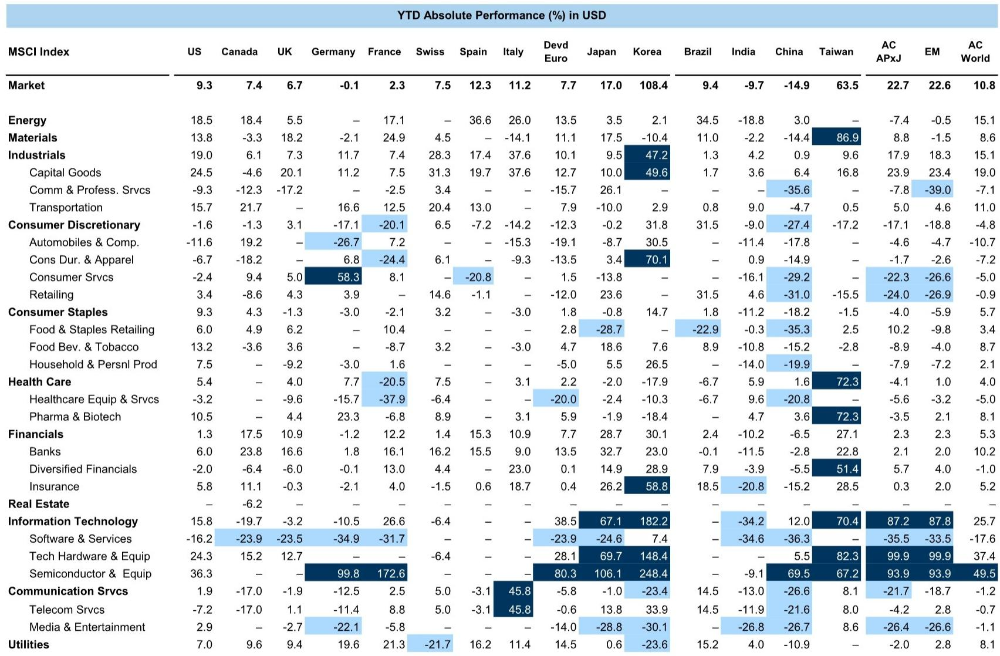
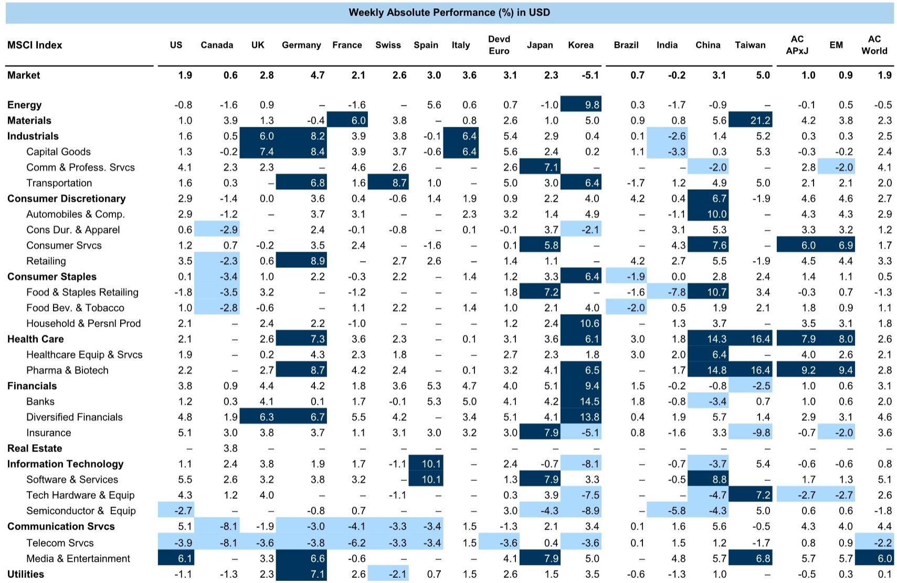
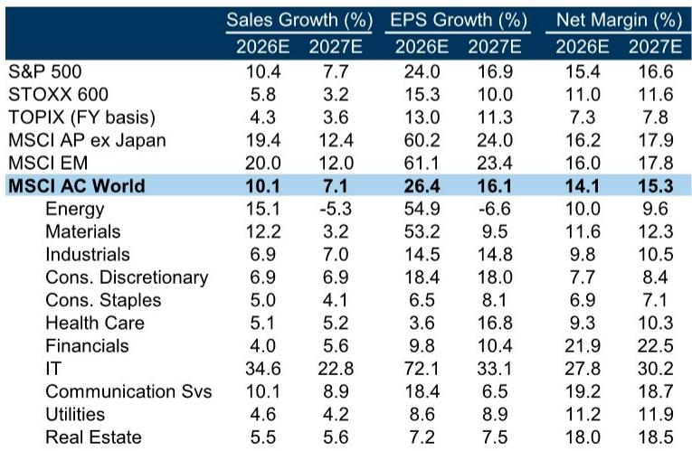

# GS：中国信贷数据本周出炉，GS给出5%GDP预测

全球市场上周上涨2%，欧洲领涨，亚洲落后。动量因子大幅回撤，资金从前期赢家流向落后板块。这组数据本身并不意外，真正值得关注的是GS在此时抛出的一个判断：Q2财报季即将开启，预期已经拉满——标普500一致预期EPS同比增长22%，欧洲STOXX 600上半年增长11%。问题在于，这些数字能否兑现，以及更关键的，AI投入是否开始产生可量化的回报。

报告给出了一条清晰的逻辑链：估值高企的背景下，业绩是相对少见的锚。上周动量因子的剧烈轮动已经说明，市场对“增长故事”的耐心在收窄。接下来的几周，将是验证估值合理性的窗口。

> **KC评论：** GS没有用“回调”或“不确定性”这类词，但数据本身在说话。22%的EPS增长中，AI基础设施公司贡献了近60%。如果这部分业绩不及预期，整个市场的增长叙事会面临修正。完整报告中的Exhibit 7和Exhibit 8值得细看，那里展示了自上而下与自下而上的EPS增长预测差异。

## 1. 欧洲的业绩增长高度依赖能源，剔除后只剩6%

GS对欧洲的判断比美国更微妙。STOXX 600上半年EPS增长11%，但剔除大宗商品相关公司后，增速骤降至6%，与中位数公司的表现一致。报告同时提到，欧元/美元预测已从1.20下调至1.12——这意味着汇率本身正在成为欧洲出口企业的隐性支撑。

问题在于，制造业活动的改善和弱势欧元能否真正拉动非大宗板块的盈利。如果答案是否定的，欧洲市场的增长基础会比表面数字脆弱得多。这一点对中国出口导向型企业也有参考价值：汇率波动对盈利的影响正在从“可忽略”变成“不可忽视”。

## 2. 宏观数据密集周，中国信贷和通胀是亚洲焦点

本周的宏观日历排得很满。美国有ISM服务业指数和FOMC会议纪要，欧洲有德国工业产出，日本有5月名义工资增长。但对亚洲市场来说，中国的信贷数据和通胀数据才是真正的变量。

GS对中国的GDP预测是2025年5.0%、2026年4.7%，略高于彭博一致预期。这个数字意味着什么？它隐含的假设是，政策托底和结构性调整能在不显著刺激的情况下维持增速。但报告没有展开的是：如果信贷数据低于预期，市场会如何重新定价中国资产。这个问题目前仍悬而未决。

> **KC评论：** GS对MSCI亚太（除日本）给出了21.9%的12个月上行空间，是所有主要区域中最高的。但这个预测能否成立，很大程度上取决于中国数据能否支撑。报告中的Exhibit 6列出了完整预测表格，值得对比不同区域的预期差异。

## 3. 报告没有完全回答的问题：AI研究的回报何时兑现

AI是贯穿这份报告的主线之一。GS明确指出，Q2财报季的焦点将是AI支出是否开始产生“有形回报”。但报告本身并没有给出判断——它只是提出了问题。

这是一个重要的观察框架：当市场对AI的预期已经计入估值，而实际回报仍不清晰时，任何低于预期的数据都可能触发重新定价。反过来，如果AI公司能证明资本支出正在转化为收入和利润，那么当前的高估值就有了支撑。这个二分法，可能是未来几周最值得跟踪的变量。

## 4. 资金轮动的信号：动量因子回撤意味着什么

上周动量因子的大幅回撤，被GS视为一个关键信号。资金从赢家流向输家，通常发生在两种场景：一是市场对增长持续性产生怀疑，二是估值差距过大后的均值回归。

GS没有明确站队，但结合Q2财报季的背景，第一种解释更有说服力。如果业绩不能验证增长故事，轮动可能只是开始；如果业绩超预期，轮动反而会成为新主线的起点。这个判断需要读者自己跟踪后续数据来验证。

For informational purposes only. Portions may be generated,translated,summarized,or edited with AI assistance based on source materials and may contain omissions or errors. Please verify independently. This is not investment,legal,tax,accounting,or other professional advice.

For informational purposes only. Portions may be generated,translated,summarized,or edited with AI assistance based on source materials and may contain omissions or errors. Please verify independently. This is not investment,legal,tax,accounting,or other professional advice.

