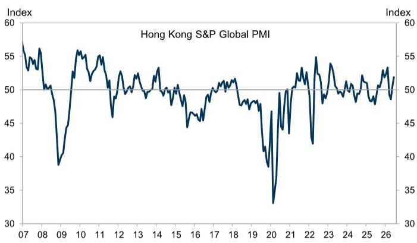

# GS：香港PMI跳升至52，GS指事件驱动而非基本面修复

香港6月PMI从50.4跃升至52.0，创下年内高点。这份GS第一时间追踪的报告揭示了一个关键信号：反弹并非全面开花，几乎完全由新订单这一个子指数拉动。对于关注大湾区宏观环境节奏的决策者而言，这个结构比数字本身更重要。

新订单子指数从5月的50.1跳升至53.2，是PMI所有成分中贡献最大的变量。标普全球在报告中的解释值得细读：新品发布、客户需求改善，以及世界杯带来的消费支出，共同推升了销售。这意味着本轮扩张带有明显的“事件驱动”和“产品周期”特征，而非宏观基本面的系统性修复。

> **KC评论：** 新订单跳升3.1个点，但产出指数只上升1.1个点，说明企业接单后还没有完全转化为实际生产。完整报告里关于库存和交付周期的数据，是判断后续产能能否跟上的关键。

外部需求维持韧性，但结构在变化。新出口订单子指数从53.0小幅回落至51.8，仍处于扩张区间。更值得关注的是“来自中国的新业务”子指数，从5月的49.2重新站上52.1。这个反弹意味着内地需求对香港服务业的支撑正在恢复，但单一月份的数据不足以确认趋势反转。

## 1. 下游利润不确定性未解，企业定价能力出现分化

成本端的不确定性在6月有所缓解，但远未消失。投入价格子指数从57.6降至55.3，仍处于高位。劳动力成本子指数微升至52.4，显示用工成本仍在上升。真正值得关注的是产出价格子指数的变化——从52.8降至52.1。

报告原文提到一个关键细节：部分企业通过提价向客户传导成本，而另一些企业则选择打折清库存来支撑销售。这种定价行为的分化，暗示不同行业、不同规模的企业正在经历截然不同的利润周期。那些无法转嫁成本的企业，将在下半年面临更明显的利润率压缩。

## 2. 报告没有完全回答的问题：就业为何仍在调整

PMI整体扩张至52.0，但就业子指数仅从49.2微升至49.4，连续第二个月处于调整区间。这是一个值得追问的缺口。

报告没有展开讨论这一矛盾。通常的解释是：企业在新订单回暖初期倾向于先用现有产能消化，而非立即扩招。但如果就业连续三个月低于50，则可能暗示企业对复苏持续性持保留态度。这个信号需要结合7月数据交叉验证。

> **KC评论：** 就业指数是PMI里滞后但最真实的指标。读者在追踪后续报告时，应重点关注这个子指数能否突破50，这比总PMI是否继续上升更能说明复苏的成色。

## 3. 一个更实用的观察框架：把PMI拆成“内需驱动”和“外需驱动”来看

这份报告的数据颗粒度足够支持一个更精细的分析框架。建议读者将香港PMI的后续走势拆成两个独立变量跟踪：

第一，新订单子指数能否维持在52以上。这是本轮扩张的核心引擎，一旦回落至50附近，意味着事件驱动效应消退。第二，产出价格与投入价格的差值。如果差值持续收窄，说明下游企业正在被动承担成本不确定性，这将抑制后续的研究和招聘意愿。

GS在报告中没有给出前瞻判断，但数据本身已经提出了问题：香港宏观环境正在经历的是“世界杯+新品周期”的一次性脉冲，还是需求端的结构性改善？答案将在未来两个月的PMI分项数据中逐步浮现。

---

For informational purposes only. Portions may be generated,translated,summarized,or edited with AI assistance based on source materials and may contain omissions or errors. Please verify independently. This is not investment,legal,tax,accounting,or other professional advice.

For informational purposes only. Portions may be generated,translated,summarized,or edited with AI assistance based on source materials and may contain omissions or errors. Please verify independently. This is not investment,legal,tax,accounting,or other professional advice.

