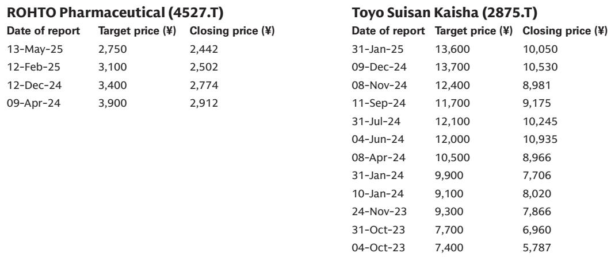
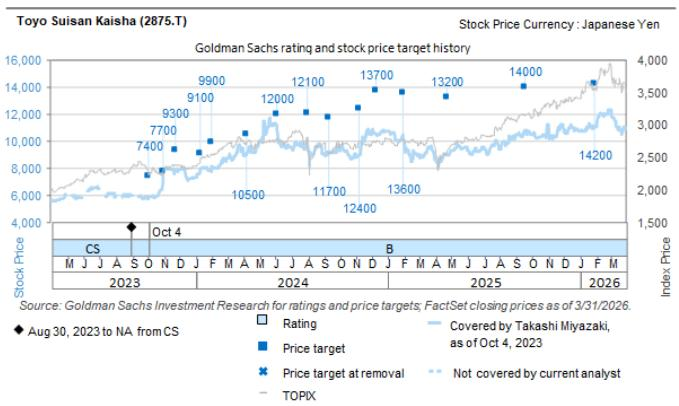
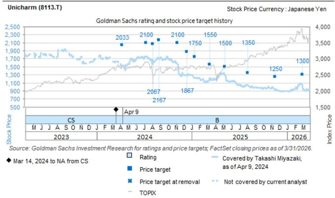

# 日本消费行业正面临三重结构性考验——多数观察者低估了其中的复杂性

关于日本消费类公司的讨论，已从简单的通胀复苏叙事，转向一个层次更丰富的战略课题。7月初在新加坡与13家机构读者交流后，主导议题并非国内消费反弹或安倍经济学时期的顺风。取而代之的是三个结构性力量：中东局势带来的成本滞后影响、消费税下调的模糊前景，以及随着通胀环境成熟，企业能否维持定价能力。读者的共识仍然分散，而这种分散既创造了机会，也带来了风险。核心洞察是：未来12到18个月，将区分出哪些公司能够应对成本滞后、税收政策变化和需求弹性，哪些不能——而市场尚未完全对这些分化进行定价。

中东地区的扰动并非短暂冲击，而是一个具有两年延续期的结构性成本事件。原油期货可能已见顶，但石脑油衍生原材料的采购成本尚未正常化。现货价格与企业损益表中成本确认之间的时滞，意味着峰值影响很可能在2026年下半年显现。多数公司尚未明确调整其2026财年指引以应对此情况，但市场已间接在折价中反映这一风险。真正的战略问题不在于成本是否上升——它们会上升——而在于哪些公司拥有定价灵活性和供应链敏捷性，能够在不破坏销量的情况下吸收或转嫁这些成本。

潜在的消费税下调增加了另一层战略复杂性，尤其对食品公司而言。减税通常被视为刺激消费的措施，但对于无法设定零售价格的公司——比如许多食品制造商——这会造成一个利润陷阱。如果零售商将全部减税幅度传递给消费者，制造商看不到任何收益。如果制造商试图将价格降幅控制在小于减税幅度，则面临失去货架空间或销量的风险。例外情况可能是拥有高SKU复杂度的公司，例如山崎面包，它们可以在新品和季节性产品上调整利润。这对该行业而言并非宏观顺风，而是对定价架构的微观考验。

最后，通胀韧性叙事比表面看起来更微妙。过去18个月，许多消费类公司成功实施了提价，但问题在于这种势头能否持续。随着成本压力从原材料转向劳动力和物流，以及消费者敏感度上升，在不损失销量的情况下提价的能力将成为关键区分因素。市场仍将通胀韧性视为行业整体属性，但证据表明它正日益成为公司特定属性。

---

## 中东成本浪潮的延续时间比市场假设的更久

普遍观点认为，中东扰动已成为过去，因为原油期货已从峰值回落。这是对消费品成本传导机制的误解。由原油和石脑油衍生的原材料——包装、某些化学品和合成投入品——不会立即调整。现货价格变化与企业损益表中成本基础之间存在结构性时滞，通常长达12至18个月。

关键含义是，许多日本消费类公司的成本峰值要到2026年下半年才会出现。这并非多数指引文件中出现的预测。味之素和东洋水产等公司并未明确将更高的中东相关成本纳入其2026财年展望，但市场已通过估值压缩间接开始定价这一风险。风险在于，那些认为成本故事已经结束的观察者，将在未来几个季度因利润压力而感到意外。

对观察者而言，战略问题是公司是否有能力通过定价、对冲或供应链重组来抵消这些成本。拥有强大品牌资产和有限竞争的公司——例如在方便面或酱油领域占据国内主导地位的公司——处于更有利的位置。那些利润率较薄或对大宗商品相关投入品敞口较大的公司，则面临更艰难的路径。市场尚未完全区分这两类公司，而这正是分析机会所在。

---

## 消费税下调可能对多数食品公司造成利润陷阱

消费税下调被广泛讨论为支持家庭支出的政策工具。然而，对消费行业而言，其影响并非均匀正面。关键结构性问题是，多数食品公司并不设定零售价格。零售商设定。当减税发生时，零售商通常会按减税全额降低货架价格。制造商看不到收入收益，但其成本结构保持不变。

这给无法影响最终定价的公司带来了利润挤压。正如读者讨论中所强调的，例外情况是拥有大量SKU的公司，尤其是那些拥有季节性产品或与零售商合作产品的公司。对这些公司而言，新SKU提供了一种在减税框架内调整利润的机制。通过将新产品的利润范围设定得略宽于减税幅度，它们可以有效抵消部分利润压力。

战略含义是，消费税下调并非行业整体催化剂。它是对产品组合复杂性和零售商关系管理能力的选择性考验。观察者应评估公司并非基于它们是否从减税中受益，而是基于其SKU架构和定价灵活性是否允许它们在不侵蚀利润的情况下应对减税。拥有简单、大宗商品类产品线的公司风险最大。那些拥有复杂、创新驱动型产品组合的公司具有结构性优势。

---

## 定价能力正变得公司特定化，而非行业整体化

过去两年主导日本消费类公司的通胀韧性主题正在成熟。早期的提价相对容易，因为投入成本通胀显而易见，消费者接受了调整的必要性。下一阶段则不同。成本压力正从原材料转向劳动力、物流和监管合规。同时，随着实际工资增长仍不均衡，消费者对价格上涨的敏感度正在上升。

来自读者会议的证据表明，市场开始进行区分。例如，龟甲万因其北美酱油复苏和全球定价策略而获得认可，但读者现在质疑其新工厂运营在2027财年上半年带来的成本拖累是否会抵消这些收益。东洋水产因其低估值和治理改善而受到青睐，但市场正在关注其墨西哥新工厂的表现。资生堂被认为具有销售环比改善的潜力，但读者对其中期增长驱动因素持怀疑态度。

模式很清晰：市场正从“水涨船高”的通胀叙事，转向“展示你的定价架构”的审视阶段。能够展示持续定价能力、成本传导机制和销量韧性的公司，将获得溢价。那些不能的公司将面临估值压缩。这不是周期性转变，而是市场在后通胀环境下评估消费类公司的结构性变化。

---

## 报告留下一个开放性问题：当成本与政策风险交汇时会发生什么？

报告提供了对中东成本滞后、消费税下调机制和通胀韧性主题的详细分析。它没有完全回答的是这三个力量如何相互作用。2026年末延迟的成本峰值、可能挤压多数食品公司利润的减税政策，以及成熟的定价能力周期，这三者的交汇创造了一个多重风险同时叠加的情景。

观察者需要考虑这些力量并非孤立发生的情景。例如，如果中东成本峰值与消费税下调同时发生，食品公司可能面临来自两个方向的利润压力——更高的投入成本，以及由于减税框架而无法转嫁价格上涨。同样，如果通胀韧性比预期更快消退，那些依赖提价来抵消销量下降的公司，可能看到收入和利润双双压缩。

报告没有对这些交互效应进行建模，这是一个有意义的空白。希望了解完整风险图景的观察者需要构建自己的情景分析，纳入每个力量的时间点和幅度。处于最佳位置的公司是那些拥有定价灵活性、SKU复杂度和供应链多元化的公司。风险最大的公司是那些拥有大宗商品类产品、薄利润和有限能力影响零售定价的公司。市场尚未完全对这些分化进行定价，这既创造了风险，也创造了机会。

---

## 应对未来18个月的决策框架

对于希望应用本报告洞察的观察者而言，一个结构化的决策框架比一份个股清单更有用。以下三步框架有助于评估日本消费行业内的个别公司。

首先，评估成本敞口和传导能力。梳理每家公司对石脑油衍生投入品的原材料敞口，并估算成本确认的时间点。然后评估公司的提价历史、需求弹性以及其核心品类的竞争动态。拥有强大品牌、有限竞争和成功提价记录的公司，更能应对中东成本浪潮。

其次，评估SKU架构和零售商关系。对于可能受到消费税下调影响的公司，关键变量不是它们是否受益，而是它们是否拥有足够的产品组合复杂性来调整利润。统计SKU数量、季节性产品或合作产品的占比，以及公司推出具有不同利润特征的新产品的能力。拥有高SKU数量和强大零售商合作伙伴关系的公司具有结构性优势。

第三，对通胀韧性叙事进行压力测试。超越近期的提价成功，审视定价能力的可持续性。成本压力是否正从原材料转向劳动力或物流？消费者情绪是否在减弱？竞争对手是在维持价格还是降价？能够在多个成本周期中维持定价能力的公司很少见，应获得溢价估值。那些依赖单次提价浪潮的公司则更为脆弱。

这个框架并非详尽无遗，但它提供了一种系统性的方法来评估将在未来18个月定义日本消费行业的三个力量。在所有三个维度上得分较高的公司，其表现可能更符合报告观点。即使在单一维度上得分较低的公司，也面临不对称的下行风险。

---

## 完整图景需要更深入的数据和原始图表

上述分析捕捉了报告中嵌入的战略逻辑，但完整图景需要更深入的资料。报告包含东洋水产、资生堂、尤妮佳和乐敦制药的详细估值框架，每个都附有具体倍数、折现假设和风险因素。它还包含GS因子概况，提供了覆盖范围内公司在增长、财务回报和估值方面的比较背景。这些要素对于围绕个股决策建立信心至关重要。

报告还包含任何严肃观察者都需要审阅的重要监管披露。所有权头寸、投资银行关系和薪酬结构均在附录中记录。这些披露并非套话；它们为评估分析的独立性和潜在利益冲突提供了关键背景。

加入社区阅读完整报告并查看原始图表。完整的分析框架支撑着每项建议。没有这些，仅基于摘要的任何决策都是不完整的。

*仅供参考。部分内容可能基于源材料通过AI辅助生成、翻译、总结或编辑，可能存在遗漏或错误。请独立核实。这不构成专业建议。*

仅供参考。部分内容可能基于源材料通过AI辅助生成、翻译、总结或编辑，可能存在遗漏或错误。请独立核实。这不构成专业建议。

