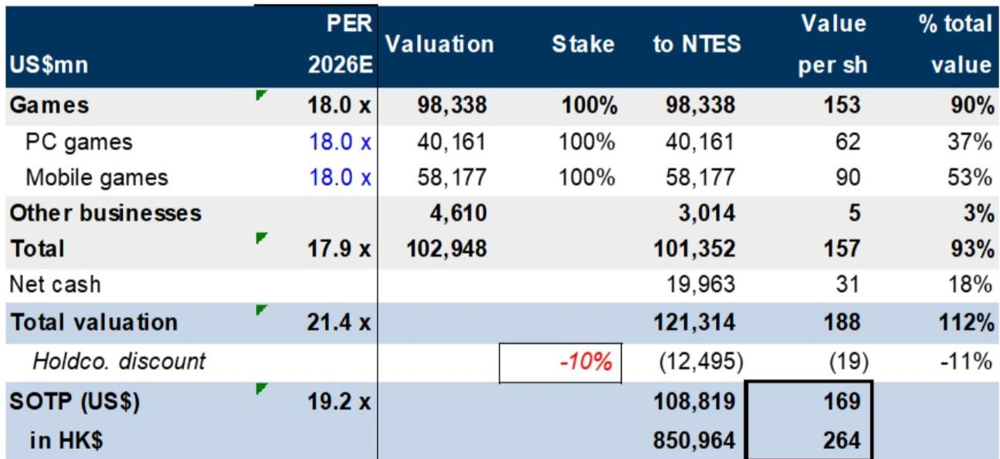
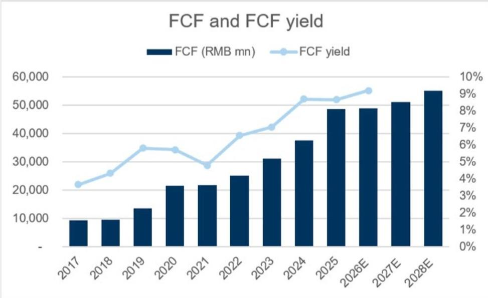
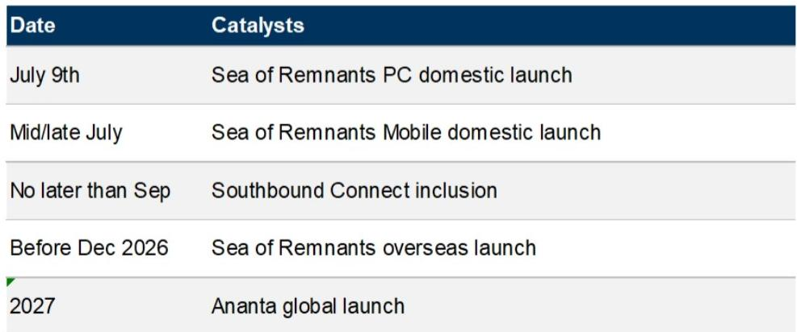

# GS：GS点破网易反常优势，不靠AI反而现金流更强

当中国互联网同行纷纷押注AI、加大资本开支时，GS一份最新研报提出了一个看似反直觉的判断：**网易真正的差异化，恰恰在于它不依赖AI叙事，却能在利润率和现金流上持续超预期。** 这份报告将网易定义为“non-AI compounder”——一个不需要AI故事也能稳定复利的公司。

在AI研究竞赛白热化的行业背景下，这一视角值得产业决策者重新审视：当市场过度关注“谁在烧钱做AI”时，是否忽略了那些靠运营效率和产品周期驱动增长的公司？

## 1. 利润率扩张的核心驱动力不是AI，而是渠道结构

报告指出，网易过去两年的利润率提升，主要来自两个非AI因素：第三方支付渠道向自有渠道的迁移，以及组织架构的精简。调整后经营利润率从2023年的30%爬升至2025年的35%，GS预计2026年将进一步提升至39%以上。

这意味着，网易的利润增长更多是“结构性的”，而非依赖某一款吸引人的游戏。渠道成本的下降是可持续的，因为一旦迁移完成，这部分节省就是永久的。

> **KC评论：** 对于关注互联网公司利润质量的读者，这里的关键不是网易是否用AI，而是它能否在不大幅增加研发投入的前提下，持续压缩渠道成本。报告中的渠道费用占比变化值得细看。

## 2. 《湮灭之潮》是2026下半年最明确的催化剂

研报的核心产品逻辑围绕《湮灭之潮》（Sea of Remnants）展开。这款游戏将于7月9日上线PC端，随后推出移动端，年内还将登陆海外。GS预计其上线首12个月总流水超过58亿元人民币，为网易带来5%以上的增量营收。

从产品矩阵看，网易的策略是“少而精”——大幅缩减新游戏发布数量，但将资源集中在少数高潜力作品上。2027年的管线还包括二次元开放世界RPG《无限大》和基于虚幻引擎5的单机作品《血源》，显示出网易在品类突破上的野心。

值得注意的是，报告给出了详细的分品类收入预测：PC游戏收入从2024年的219亿元增长至2026年的341亿元，移动游戏从600亿元增长至656亿元。PC端的增速更快，这与《湮灭之潮》PC版贡献直接相关。

## 3. 估值提升的关键变量：营收增速能否回到10%以上

报告提出了一个重要的观察框架：网易的市盈率与其营收增速高度相关。当营收增速提升至10%-15%区间时，其市盈率往往能扩张至15倍以上。当前网易交易在12-13倍前瞻市盈率，在《湮灭之潮》上线和南向通纳入等催化剂推动下，盈利修正趋势有望转正。

但这里有一个尚未完全回答的问题：**当前估值是否已经反映了这些催化剂？** 报告认为，市场对网易2026年的盈利预期可能偏低，尤其是净利润可能受到研究损失（主要为拼多多持仓）的短期扰动，但核心的游戏业务收入和经营利润有望超预期。

> **KC评论：** 这份报告最有价值的部分，是它提供了一个“非AI”公司的估值框架——当行业焦点集中在AI投入回报时，网易的现金流产出能力（预计2026年自由现金流超过490亿元，回报表现约9%）反而可能成为稀缺资产。但读者需要自己判断：这种稀缺性能否持续，尤其是在竞争对手的产品周期开始发力之后。

## 4. 报告尚未完全回答的两个关键问题

第一，**《湮灭之潮》的海外表现能否复制国内的成功？** 报告给出了国内首12月流水的详细拆分，但对海外市场仅提到“2026年内上线”。海外市场不仅面临更激烈的竞争，还需要考虑本地化运营成本和渠道分成差异。

第二，**网易的“非AI”定位能否在长期维持？** 报告承认网易在AI方面有投入，但强调其“平衡了AI研究与收益”。如果竞争对手通过AI大幅提升游戏品质或运营效率，网易的差异化优势可能被侵蚀。这需要持续跟踪网易的研发投入方向和产品落地效果。

对于关注中国互联网公司的决策者而言，这份报告提供了一个有价值的参照：在AI叙事主导的市场中，那些靠产品节奏和运营效率驱动的公司，可能被系统性地低估。但前提是，它们的产品周期确实能兑现。

For informational purposes only. Portions may be generated,translated,summarized,or edited with AI assistance based on source materials and may contain omissions or errors. Please verify independently. This is not investment,legal,tax,accounting,or other professional advice.

For informational purposes only. Portions may be generated,translated,summarized,or edited with AI assistance based on source materials and may contain omissions or errors. Please verify independently. This is not investment,legal,tax,accounting,or other professional advice.

