# 追踪信贷支持的AI数据中心建设

## 数据中心建设融资：条款存在差异，但定价尚未分化

债务融资市场已受到人工智能（AI）投资周期的显著影响——无论是在融资规模还是结构方面。我们估计，自2024年以来，与AI相关的债务发行已超过6000亿美元，涉及超大规模生态系统及数据中心建设相关行业。其中，值得特别关注的是，同期美国投资级和高收益数据中心建设合资企业（JV）发行规模估计约为900亿美元。这实际上为企业信用读者创造了一个新的类别，需要采用更接近项目融资市场的不同信用分析方法。

虽然我们预计此类发行的市场规模将显著增长，但独特的交易条款尚未转化为分散的表现。市场定价反而集中在较窄的回报表现和利差范围内，这些债券的表现比更广泛的投资级和高收益市场更为相似。然而，我们怀疑，随着时间的推移，随着建设时间表等交易特定因素的重要性增加，表现将变得更加分化。

## 追踪数据中心建设

利用追踪数据中心建设的数据集，我们将项目映射到建设进度、范围以及潜在的新增计算能力。我们发现，与银团债务相关的数据中心项目总体按计划推进，总建设进度基本符合预期时间表，且目前几乎没有证据表明存在持续延误。我们还发现，参与此类合资企业债务发行的数据中心运营商在跟踪预期时间表方面表现更好，这或许反映了其债务发行伴随的质量偏差。然而，即使建设风险的差异没有成为关键区分因素，我们认为再融资风险和覆盖条款仍可能导致分化加剧。

## 追踪信贷支持的AI数据中心建设

债务融资使用的增加已将AI相关建设转变为信用读者最重要的主题之一。鉴于预计建设的规模和范围，公共、私人和外币信用市场都发挥了作用。最近，企业信用市场中出现了一种新的资产类别：破产隔离合资企业（JV）结构，类似于项目融资交易。

此类交易通常会在项目融资市场中进行。但AI相关融资的深度以及这些交易所需的规模，已将此类融资推向了银团企业信用市场，该市场可以容纳更大的交易规模。在高收益市场，这些数据中心融资有资格被纳入广泛追踪的指数。然而，在投资级市场，它们没有资格被纳入指数。

债务规模的增长紧随总计算需求的增加。最近，它也追踪了预测电力需求容量的更急剧加速（以即将上线的全球瓦特数衡量），正如我们大宗商品研究同事所衡量的（图表1）。尽管如此，AI生态系统中的参与者通常不会披露建设过程中发行的大部分银团债务的具体用途。更广泛地说，私人基础设施和项目融资类型的交易在设计上是不透明的。

图表1：我们的大宗商品研究同事估计，到2027年将有95吉瓦的电力需求容量上线

数据中心容量是预测容量的折现值。关于方法的更多信息，请参见报告《电力分析师：美国数据中心电力需求可能激增》。AI相关债务是AI数据中心合资企业债券和其他AI相关债务的累计净债务。

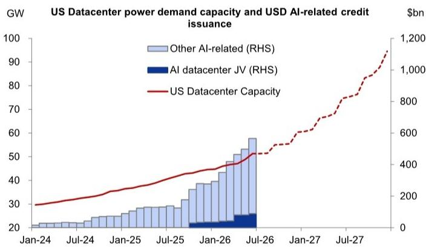  
来源：Aterio，彭博，GS全球投资研究

在此背景下，可以直接映射到AI建设的债务规模仍然很小。自2025年下半年以来，美国投资级和高收益市场约有900亿美元的合资企业债务融资协议与数据中心开发相关。这些交易为融资趋势提供了一个特别有用的窗口，因为与传统公司债券发行（其中“募集资金用途”分类通常很宽泛）不同，这些结构通常依赖于由特定数据大厅或合同容量的租赁现金流支持的锁定箱安排。此外，与这些交易相关的发行材料通常提供足够的项目层面细节，使读者能够将筹集的债务与可识别的计算能力联系起来。

尽管这些协议更加透明，但这只是与AI相关的公共债务市场融资的一小部分（再次参见图表1）。实际上，这些协议所涵盖的预期数据中心计算能力与到2027年美国所有数据中心电力需求容量之间的差距仍然非常大（图表2）。综合来看，我们认为这些合资企业所代表的样本本身只是更广泛建设的一小部分，并且不一定具有代表性。尽管如此，随着读者应对当前和预期建设的庞大规模，从融资成本到项目成果的可见性仍然是一个重要的线索。

图表2：合资企业交易仅占当前计算能力的一小部分，但我们认为它们包含一些重要信号  
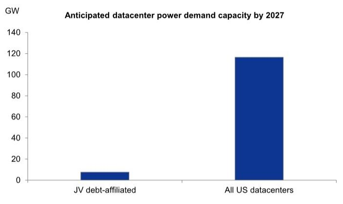  
来源：Aterio，GS全球投资研究

## 合资企业文件各不相同，但市场定价已基本趋同

正如我们之前讨论过的，这些结构的交易条款差异很大。然而，尽管存在这些特性，读者基本上将其作为一个同质群体进行交易。回报表现通常集中在一个范围内（图表3），并且不同结构之间的利差变动相关性高于更广泛的美国投资级和高收益市场（图表4）。我们认为，这种模式可能反映了这样一个事实：读者首先承保的是共同的主题风险，其次才是具体的结构差异。这些不是传统意义上杠杆于最终担保人运营表现的信用，而是杠杆于同一个基础主题：对更多计算能力的持续需求和持续的AI投入。然而，我们怀疑，随着时间的推移，随着交易特定因素的重要性增加，表现将变得更加分化。这包括，例如，建设时间表、赎回保护、杠杆限制和摊销计划。

图表3：数据中心合资企业债券回报表现集中在6-8%之间  
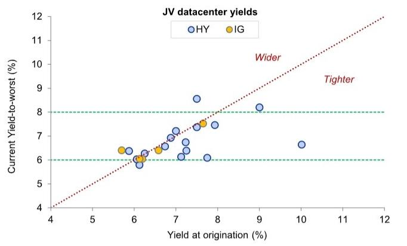  
来源：彭博，GS全球投资研究

图表4：……并且它们的交易同步性高于更广泛的美国投资级和高收益市场 滚动1个月平均配对相关性（AI数据中心债券、美国投资级和高收益债券的3天利差变动）  
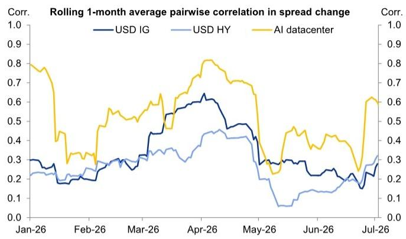  
来源：彭博，iBoxx，GS全球投资研究

## 追踪交易层面的建设

利用Aterio关于数据中心建设的数据以及数据中心建设交易的信息，我们将站点建设标记到债券、其项目运营商和最终超大规模承购方。一个重要的细微差别是，与项目相关的债务通常只覆盖整个站点的一部分。例如，一个开发项目可能包括多个数据大厅，而担保特定债券的租赁现金流可能仅与其中一部分相关。因此，我们区分了总项目容量（我们称之为“债务关联”）和明确包含在债务结构中的容量部分（“债务映射”）。这一点很重要，因为许多发行人保留在项目层面筹集额外同等债务的能力，这使得更广泛的站点建设即使在当前债券仅资助部分项目时也具有相关性。鉴于现有读者的熟悉程度，我们还将已经参与这些银团合资企业债务交易的数据中心运营商区分为“关联数据中心运营商”。

在总体层面，我们提出三点观察。首先，与公共债务交易相关的容量中只有一小部分目前在线。根据我们的估计，目前约有560兆瓦活跃，而约5.3吉瓦要么活跃，要么正在建设中，预计到2027年投入运营（图表5）。因此，建设风险的重要性对于许多此类结构来说是合理的。虽然许多当前活跃的数据中心可能由私人债务或股权融资的组合提供资金，但我们认为，大规模建设融资的需求推动了这些项目融资交易向更广泛的（公共）信用读者基础的银团化。因此，随着更多交易上线，我们预计银团债务融资将发挥更大的作用。

## 图表5：债务交易中的大多数数据中心尚未活跃，但正在建设中

按建设阶段划分的债务映射、债务关联（包括债务交易中的非映射计算能力）和关联数据中心运营商交易的吉瓦容量。活跃+按建设完成份额比例计算的在建项目。包括预计到2027年活跃的数据中心。

与合资企业交易相关的数据中心电力容量

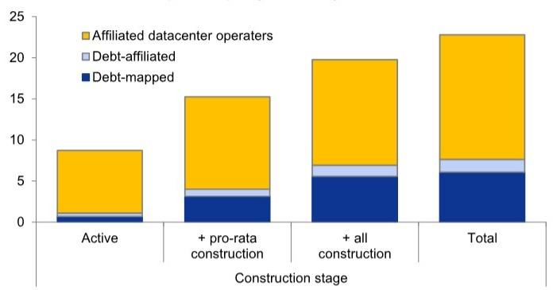  
来源：Aterio，穆迪，标普评级直通，惠誉评级，GS全球投资研究

其次，这些银团合资企业债务交易仅覆盖了预计到2027年上线的总数据中心容量的一小部分（图表6）。即使保守假设只有上述“关联数据中心运营商”返回寻求额外资金，通过这些市场融资的数据中心电力容量的隐含增长仍将是三倍的大幅增长。我们认为，尚未到来的计算能力数量支撑了许多读者的耐心态度，他们将在评估每笔交易时，只有在所有重要标准上都感到满意时才会进行配置。

## 图表6：债务交易中的数据中心仅占预期电力需求容量的一小部分

到2027年预计的债务关联（包括债务交易中的非映射计算能力）、关联数据中心运营商交易以及美国和全球所有数据中心的吉瓦容量。

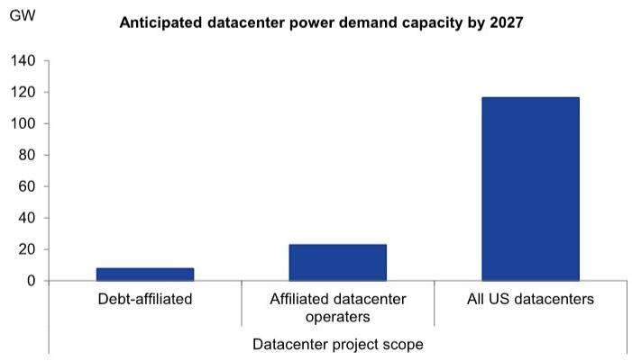  
来源：Aterio，穆迪，标普评级直通，惠誉评级，GS全球投资研究

第三，过去12个月的建设相对速度保持稳定。图表7显示，根据Aterio的估计，按比例计算，计算能力的建设速度大致呈线性增长。总体而言，这表明可见的建设迄今为止按计划进行。理论上，这可能会激发迄今为止观察到的紧张、相对统一的定价，但下图掩盖了表面下的任何异质性，并且没有将建设与预期时间表进行比较。

## 图表7：迄今为止，总体建设速度相对线性

债务映射、债务关联（包括债务交易中的非映射计算能力）和关联数据中心运营商交易的计算能力吉瓦数。时间序列基于每月对建设进度或激活状态的评估。

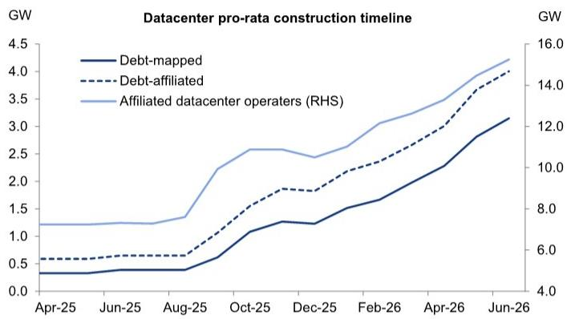  
来源：Aterio，穆迪，标普评级直通，惠誉评级，GS全球投资研究

## 交易层面的建设时间表

使用相同的数据集，我们将测量的建设进度与简单的预期时间表进行比较。前者由Aterio使用卫星图像追踪建设情况。后者在数据中心开始建设的列出的激活日期和项目竣工日期之间线性插值进度。虽然我们不期望实际建设是线性的（由于采购前置时间、设备交付、场地准备和电力互联时间表），但我们认为假设的线性基准仍然有助于评估项目进度。

总体而言，我们发现建设大致按计划进行，但比线性预期基准略微落后275兆瓦（图表8）。这一差距在与合资企业结构相关的数据中心项目之间有所不同，但平均仅为15兆瓦，并且任何给定项目都不超过100兆瓦（图表9）。

图表8：总体而言，数据中心容量基本遵循预期时间表，但略有滞后

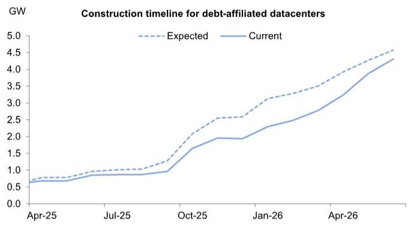  
来源：Aterio，穆迪，标普评级直通，惠誉评级，GS全球投资研究

图表9：虽然映射债务之间存在显著差异，但没有债务资助的项目滞后预期时间表超过100兆瓦  
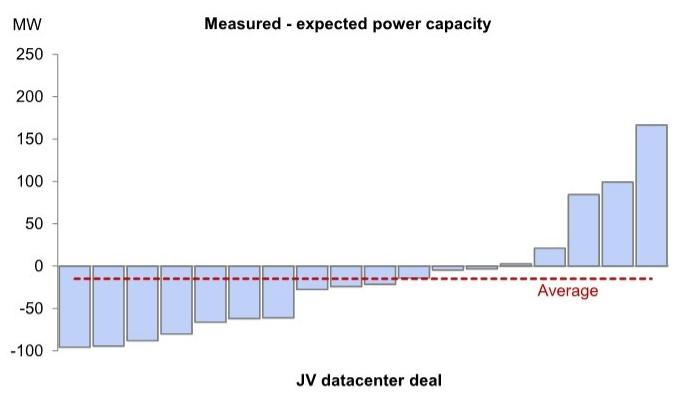  
来源：Aterio，穆迪，标普评级直通，惠誉评级，GS全球投资研究

虽然我们的大宗商品研究同事注意到数据中心建设存在延误，但样本中缺乏持续、重大的建设延误对债券持有人来说相对令人鼓舞。我们认为，部分原因可能反映在选择并能够进入市场的数据中心运营商身上。如果我们转而观察那些未使用这种数据中心融资的运营商，我们发现相对于线性基线存在持续且不断增长的延迟（图表10）。综合来看，这可能意味着那些能够在银团债务市场为数据中心项目融资的运营商在交付建设方面处于更有利的位置。随着市场扩张，如果更多运营商选择这些结构来资助项目，也值得留意这种质量差异。

图表10：未参与合资企业债务资助数据中心交易的数据中心运营商落后于预期建设时间表  
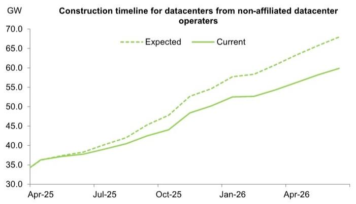  
来源：Aterio，穆迪，标普评级直通，惠誉评级，GS全球投资研究

## 建设风险之外的分化原因

尽管没有持续的建设延误（至少基于目前可见的证据），但我们认为读者仍应密切关注建设风险。我们认为它仍然是核心问题，特别是考虑到完工担保、应急储备和成本超支保险的重要性。也就是说，如果可见的建设延误尚不足以推动重大分化，读者应越来越多地关注接下来会发生什么。

我们认为，下一个分化来源可能是再融资风险，以及相关的摊销结构。正如我们指出的，市场上银团的债务仅反映了近期预计上线总计算能力的一小部分。我们预计将利用一系列市场来为这些资产融资。在此背景下，当前结构覆盖利息和本金以及有效再融资的能力将变得越来越重要。

我们关注的部分原因来自于对最终再融资渠道缺乏共识。虽然一些市场参与者可能特别将公共资产支持证券市场视为为产生现金流的数据中心进行再融资的可能竞争者，但资产支持证券市场与数据中心融资需求之间的规模差异可能意味着需要更广泛的市场和读者（图表11）。一些高收益结构也可能随着建设风险的消退而受益，可能推高评级。

然而，即使在这种情况下，结果也不会支持统一的利差压缩。相反，它可能会加剧项目之间的分化：那些具有强大租赁覆盖、可控再融资需求和保守结构保护的项目，与那些具有较重后端风险的项目。

图表11：美国数据中心资产支持证券市场目前为440亿美元  
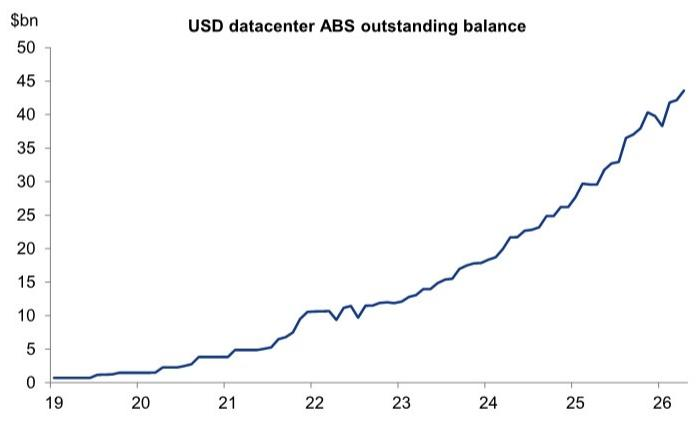  
来源：Intex，GS全球投资研究

我们感谢Patricia Pacheco对本报告的贡献。
