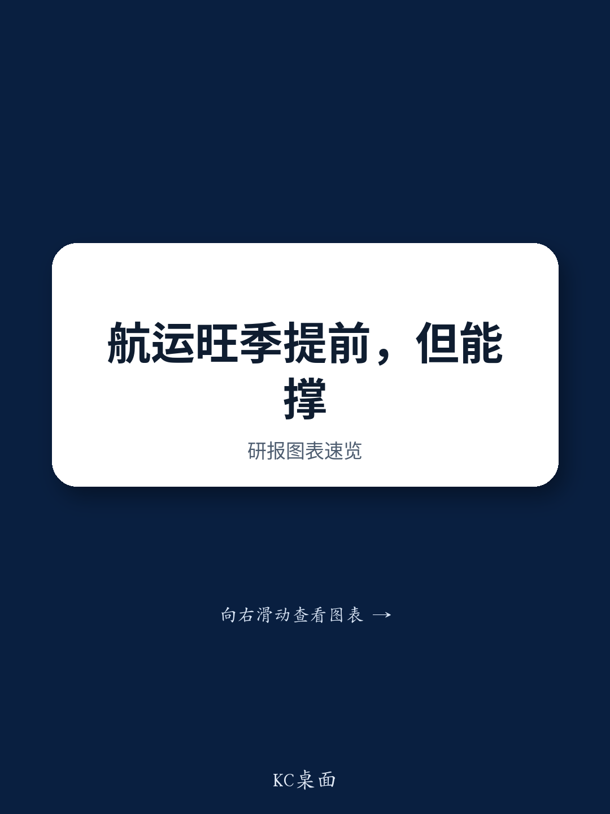

# 旺季时机不再是日历赌注：集装箱运输的结构性变化需要新的分析框架

集装箱运输行业正进入一个传统季节性规律不再适用的时期。近期与东方海外（国际）有限公司的企业日讨论显示，当前运输旺季开始时间早于往年，预计仅能持续至2026年第三季度中期。这不仅仅是日历上的异常，它反映了更深层次的结构性力量，正在重塑市场参与者评估运输公司、运力规划和费率周期的方式。

费率上涨的直接催化剂是潜在关税上调前的提前出货，以及燃料成本上涨的传导。但在这个战术性解释之下，存在着更深刻的转变。管理层明确将费率环境归因于全球化退潮趋势，这一趋势正在降低运输效率，且他们认为这一动态难以逆转。其含义是明确的：该行业可能正在从由供需平衡驱动的周期性模式，过渡到一个结构不同的新阶段，其中地缘政治、贸易碎片化和船队年龄动态成为主导变量。

继续使用历史季节性模式或简单的供需算术来评估运输公司的参与者，可能会错过十年来最重要的转折点。旧的框架正在瓦解，新的框架必须建立。

## 早到的旺季是结构性碎片化的信号，而不仅仅是战术性提前出货

从企业日得到的最直接观察是旺季的时间异常。2026年第二季度，上海出口集装箱运价指数美西和美东航线的平均即期运价同比分别上涨19%和6%，而欧洲航线则上涨45%。管理层将此归因于潜在更高关税前的提前出货以及燃料价格上涨的传导。

这个解释就其本身而言是正确的，但并不完整。提前出货在以往的关税周期中也曾出现，但此次运价上涨的幅度和持续性表明，有更深层次的结构性因素在起作用。关键在于，提前出货不仅仅是把需求提前。它还意味着库存行为正在变得永久性地更具防御性。当企业担心贸易路线可能中断或关税可能不可预测地上升时，它们会延长库存持有时间。这种库存与销售比率的结构性上升，即使基础消费增长温和，也会直接提振运输需求。

第二个层面的含义是，即使当前旺季在第三季度中期结束，第四季度运价有所回落，运价的底部也可能高于以往周期。如果全球化退潮永久性地降低了运输效率，那么集装箱运输的有效供给将低于名义船队规模所显示的水平。这不是一个周期性故事，而是运输服务的结构性重新定价。

一个尚未解答的关键问题是，运价的强势在多大程度上是暂时的提前出货所致，又在多大程度上是货物在碎片化贸易路线上流动成本永久性上升的体现。报告提供了运价水平的数据，但并未区分这两种力量。参与者需要建立自己的模型来分离战术性和结构性驱动因素。

## 船队扩张目标与全球化退潮及老旧船舶退役相结合，挑战供给过剩的叙事

东方海外的目标是到2030年将其运营运力从2026年3月的110万标准箱扩大到200万标准箱。这意味着在不到五年内运力大约弹性较高，这得益于54亿美元的剩余资本支出，以及约30艘待交付船舶和另外10艘将租入的船舶。

乍看之下，这种激进的扩张似乎证实了困扰运输公司的供给过剩担忧。一家全球性投行的行业报告曾多次指出供给过剩问题。但管理层提出了一个值得认真分析的论点：结构性的全球化退潮正在降低运输效率，而老旧船舶的潜在提前退役可能有效吸收新增供给。

全球化退潮带来的效率损失并非微不足道。当贸易路线变得更加碎片化，船舶在港口停留时间更长，为规避地缘政治风险而选择更长航线，并以更低的利用率运营时，名义上更大的船队可能提供的有效吞吐量反而更少。这类似于其他行业中“幽灵产能”的概念：名义上存在但无法有效部署的产能。

此外，目前集装箱船的平均拆解船龄已超过30年，而历史平均水平在25年左右，低点曾达到18年。这表明船舶退役已被推迟，很可能是由于疫情期间的运价繁荣使老旧船舶在经济上仍可维持。随着运价正常化，这些老旧船舶很可能会被拆解。如果拆解周期加速，可能会吸收相当一部分新增交付量。

管理层还指出，出于安全考虑，重返红海的可能性仍然很低，他们预计自己不会是首批重返的公司。这是一个关键数据点。绕行红海已经吸收了巨大的运力。如果这种绕行持续下去，将有效地收紧市场，其程度远超船队统计数据所显示的情况。

一个悬而未决的问题是，全球化退潮的效率损失、老旧船舶拆解以及红海绕行这三者的综合效应，是否足以抵消东方海外及其他承运人已计划的运力扩张。报告提供了方向性的论点，但没有给出量化模型。这是参与者必须填补的核心分析空白。

## 向小型船舶和新兴市场航线的转变揭示了贸易模式的根本变化

企业日的一个值得注意的细节是，东方海外的订单正在向中小型船舶转变，例如为拉丁美洲、非洲和其他新兴市场设计的16000标准箱船舶。这是对该行业长期以来专注于为亚欧和跨太平洋航线优化的超大型集装箱船战略的背离。

这种转变之所以重要，有三个原因。首先，小型船舶每标准箱的运营成本更高，这意味着行业的成本结构正在上升。如果承运人在碎片化航线上部署更多小型船舶，行业的盈亏平衡费率将结构性上升。这支撑了更高的长期费率底部。

其次，对新兴市场航线的关注表明，贸易增长正在从传统的发达市场走廊转移。这与全球化退潮是一致的：随着供应链从中国分散，贸易量在需要不同船型和港口基础设施的地区增长。只关注跨太平洋和亚欧航线的参与者正在错过一个不断增长的市场部分。

第三，由于价格更便宜且交付记录可靠，向中国一流船厂下单表明该行业的供给方正变得更加集中。管理层指出，在一流船厂中很难找到2028年交付的船位。这意味着新造船的潜在供给可能比总订单数据所显示的更为紧张，尤其是对于高质量船厂而言。

其战略含义是，集装箱运输行业并不仅仅是在增加运力。它正在根据一个根本不同的贸易环境重新配置其船队构成。将所有标准箱运力视为可互换的参与者正在犯错误。

## 报告未完全解答的问题：股息政策、股权结构与战略灵活性之间的相互作用

报告提供了关于东方海外资本管理的有用数据。公司持有净现金，2024-2026年的股息政策为30-50%的派息率，并在2024-2025年按上限支付。由于14-15%的低自由流通量，目前未考虑股份回购。

这些事实提出了报告未完全解决的重要战略问题。在拥有54亿美元剩余资本支出和低自由流通量的情况下，公司如何平衡其扩张雄心与股东回报？如果股息按区间上限支付，派息可能相当可观，但这也会减少可用于船队扩张的现金。公司有净现金，但资本支出计划规模巨大，可能消耗掉大部分现金。

更根本的是，低自由流通量引发了关于公司治理和战略一致性的问题。当一家公司拥有控股股东时，少数股东的利益可能并不总是与公司的扩张战略一致。从长期战略角度看，优先考虑船队增长而非回购或特别股息是合理的，但根据股东的时间跨度不同，这可能并非对所有股东都是最优选择。

报告没有模拟资本支出与股息之间的权衡，也没有分析控股股东改变股息政策或采取其他资本配置策略的可能性。这些都是开放性问题，参与者必须根据自己对管理层行为和战略优先级的假设进行评估。

## 新环境下评估集装箱运输的决策框架

鉴于上述结构性转变，参与者需要一个新框架来评估集装箱运输公司。旧框架侧重于全球集装箱需求增长与船队供给增长之间的平衡，并以季节性模式作为时机参考。新框架必须至少纳入五个额外变量。

第一，参与者应量化全球化退潮带来的效率损失。这需要估算由于航线更长、碎片化贸易导致的港口拥堵以及地缘政治绕行而损失了多少有效运力。一个合理的起点是假设有效供给比名义船队运力低5-10%，但这个数字会因承运人和航线而异。

第二，参与者应建立一个考虑全球船队年龄结构和退役经济激励的拆解模型。如果平均拆解船龄从30年下降到25年，这将从市场中移除大量运力。关键变量是使老旧船舶在经济上不可行的运价水平。

第三，红海风险溢价应被视为一个结构性因素，直到有明确证据表明航运公司愿意返回。管理层明确表示他们预计不会是首批返回的公司，这表明风险溢价将持续数年，而非数月。

第四，船队构成比总标准箱运力更重要。涉足新兴市场航线和拥有小型船舶的承运人，其盈利状况可能与专注于发达市场航线上超大型船舶的承运人不同。参与者应按航线和船型分解运力。

第五，资本配置纪律至关重要。在一个固定成本高的资本密集型行业中，明智投资的公司与过度投资的公司之间的差异可能是巨大的。股息派发率、新造船订单成本以及新船的利用率，都是长期股东价值创造的前瞻性指标。

这个框架不提供简单的答案。它要求参与者对本质上不确定的变量做出判断。但它比完全忽视这些结构性力量的框架更有用。

## 完整图景需要比单次企业日所能提供的更深入的数据

此次企业日的见解很有价值，但必然是不完整的。即使是来自信息灵通团队的单次管理层演示，也无法提供在复杂且不断变化的行业中做出决策所需的量化严谨性。关于全球化退潮效率损失的规模、船舶拆解的时间点以及股息政策的可持续性等问题，都需要更详细的分析。

原始报告包含图表和数据，说明了此处讨论的运价趋势、运力计划和船队年龄动态。这些可视化内容对于理解所描述变化的规模至关重要。没有它们，定性论点仍然是抽象的。

对于希望构建完整图景的参与者而言，下一步是审视支撑完整研究的详细财务模型、同行比较和情景分析。企业日提供了方向性信号，但研究论点必须建立在严谨的数据和透明的假设之上。

加入社区阅读完整报告并查看原始图表。

*仅供参考。部分内容可能基于源材料通过AI辅助生成、翻译、总结或编辑，可能存在遗漏或错误。请独立核实。这不构成专业建议。*

仅供参考。部分内容可能基于源材料通过AI辅助生成、翻译、总结或编辑，可能存在遗漏或错误。请独立核实。这不构成专业建议。

