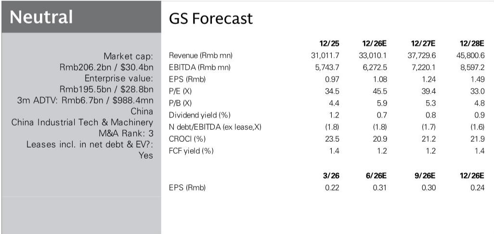
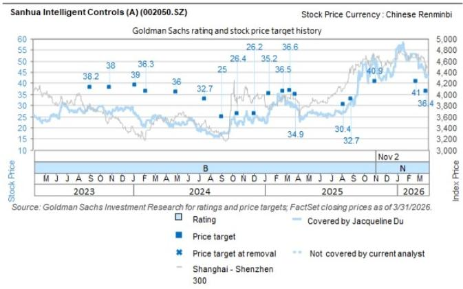
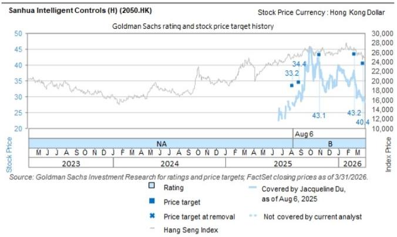

# GS：液冷收入预增超50%，三花智控正切入AI数据中心供应链

一份GS在7月6日与三花智控董秘交流后的研报，表面上是季度经营更新的常规跟踪，但细看数据与节奏，真正值得关注的信号不是传统HVAC组件何时见底，而是两个正在加速的结构性变量：商用制冷与液冷。

报告的核心判断很清晰：二季度整体符合预期，但商业HVAC和液冷是增长引擎，前者有冷链运输这个细分亮点，后者预计2026年收入同比增长超过50%，且下半年可能在AIDC（人工智能数据中心）领域有项目突破。

这不是一个“等待周期反转”的故事，而是一个“老业务筑底、新业务上量”的切换阶段。

## 1. 家用空调的影响正在收窄，但商用才是利润增量

三花的基本盘——家用HVAC组件——一季度同比下滑6%，二季度预计回到持平或小幅正增长。海外好于国内，商用好于家用，这是两个明确的方向。

北美去年预购效应消退、国内政策影响退坡，这些压制因素市场已经充分预期。真正需要关注的是结构变化：中国能效标准提升正在推动新品类出货，欧洲、印度、日本因高温和空调渗透率提升仍有空间，而商用HVAC的毛利率明显高于家用。

冷链运输被报告单独点名，这是一个容易被忽视的细分。商用场景的订单能见度和客户粘性优于家用，且三花在此领域有先发优势。

> **KC评论：** 家用空调组件的底部大概率已经出现，但弹性有限。真正能拉动利润率的，是商用HVAC和液冷。读者可以重点关注三季度商用订单的环比趋势，这是判断估值能否切换的关键。

## 2. 液冷：从“边缘业务”到“第二增长曲线”的临界点

液冷是这份报告最值得深读的部分。三花去年组建了专门团队，产品线从数据中心的微通道（一次侧）延伸到冷板、泵阀、传感器等二次侧组件，单台价值量在提升。

管理层预计2026年液冷收入从2025年的20亿元增至30亿元以上，同比增长50%+。更关键的是，报告提到下半年可能在自研ASIC服务器供应链中获得项目突破。三花直接与云厂商做资质认证，出货则通过服务器供应链厂商。

这个模式意味着，一旦进入某个大型云厂商的供应商名单，订单的持续性和规模都会快速放大。三花不做完整的CDU系统，而是向Vertiv、英维克等系统集成商供应核心组件，这种定位既避免了与客户竞争，又保持了较高的技术壁垒。

> **KC评论：** 液冷业务的估值逻辑和传统HVAC完全不同。如果下半年确实有AIDC项目落地，市场可能会重新定价三花的成长属性。报告没有给出具体客户名字，但“自研ASIC服务器”这个表述指向了哪些云厂商，值得读者自己推演。

## 3. 汽车热管理：海外出货对冲国内不确定性

汽车热管理二季度预计同比增长13%，与一季度15%的增速基本持平或略弱。管理层认为国内新能源车零售可能有所调整，但海外出货仍然强劲，尤其是零跑、吉利、比亚迪等出口导向型车企，以及特斯拉在5-6月的需求回升。

三季度的排产看起来比较饱满，部分新产品（油泵、膨胀阀）产能偏紧。从单品向集成模块的转型仍在推进，单车价值量在提升。新机会还包括传感器、传感器清洗阀、自动驾驶用的油泵，以及车载冰箱的热管理。

原材料成本不确定性可控，北美客户定价与铜铝联动，欧洲敞口做了部分对冲。二季度可能仍有汇兑损失，但管理层预计小于一季度。

但报告也坦率指出了外部不确定性：国内需求、海外政策不确定性和出口关税。GS对汽车热管理2026年全年增速预测为12%，2026-2030年CAGR为16%，低于公司自己15-20%的CAGR目标。

## 4. 报告没有完全回答的关键问题

这份报告在经营细节上做得扎实，但有几个问题留给了读者自己去判断。

第一，液冷业务的利润率水平。报告提到商用HVAC是“更高毛利”，但液冷作为新业务，初期研发和产线投入较大，毛利率何时能稳定在什么区间，报告没有给出明确指引。

第二，人形机器人的商业化时间表。三花在机器人执行器上的布局是GS看好的长期逻辑，但报告也承认市场对Optimus的量产时间线过于乐观。这块业务何时从概念变为收入，目前仍是未知数。

第三，北美和欧洲的政策变化对汽车热管理的影响。管理层提到了不确定性，但没有给出具体的应对方案或情景分析。如果关税进一步升级，三花是否有足够的海外产能来对冲？

对于一个正在从“周期成长”向“技术成长”切换的公司，市场的容忍度取决于新业务的可见度。液冷是未来12个月最值得跟踪的变量。

For informational purposes only. Portions may be generated,translated,summarized,or edited with AI assistance based on source materials and may contain omissions or errors. Please verify independently. This is not investment,legal,tax,accounting,or other professional advice.

