# 全球资金流动周报

# 能源板块资金流动的起伏

## 全球资金流动，截至7月1日当周

■ 共同基金及相关投资产品的资金流动方面，权益类产品仍为净流出，固定收益类产品则为净流入。

Lexi Kanter  
+1(212)855-9701 | alexandra.kanter@gs.com GS & Co. LLC

- 截至7月1日当周，全球权益类基金净资金流动仍为负值（-140亿美元，前一周为-50亿美元）。在发达市场中，美国基金是净流出的主要来源。在新兴市场中，中国大陆和全球新兴市场基准基金是净流出的主要来源，而中国台湾和韩国权益类基金则录得净流入。从行业层面看，科技类基金在前一周录得最大净流出后，本周重新获得净流入。与此同时，能源类基金出现净流出，因能源价格持续走低（见本周图表）。我们近期注意到，尽管能源价格出现回落，但贸易条件对汇率的影响迄今仍更具持续性。我们认为，这种更具粘性的贸易条件影响反映了不同的宏观影响，这些影响会随时间推移体现在经济数据和公司层面表现上，我们仍对与2022年能源冲击的相似之处保持警惕，当时贸易条件对汇率的差异化影响在能源价格见顶数月后才达到峰值。

- 全球固定收益类基金的资金流入在各类型基金中均保持良好支撑。短期债券基金和通胀保护债券基金持续获得资金流入，长期债券基金的资金流入转为正值。在新兴市场，硬通货和本币债券基金均录得净流入。货币市场基金资产增加约550亿美元。

跨境外汇资金流动在G10货币中总体为正，但在其他地区为负。美元和欧元的需求最为强劲。亚洲地区普遍出现净流出；人民币在前一周录得净流入后，本周重新出现净流出。

<table><tr><td rowspan="3"></td><td colspan="4">全球资金流动摘要</td></tr><tr><td colspan="2">百万美元</td><td colspan="2">占资产管理规模百分比</td></tr><tr><td>4周合计</td><td>7月1日</td><td>4周均值</td><td>7月1日</td></tr><tr><td>权益</td><td>139,067</td><td>-13,859</td><td>0.11</td><td>-0.04</td></tr><tr><td>固定收益</td><td>84,835</td><td>29,236</td><td>0.21</td><td>0.29</td></tr><tr><td>其中：新兴市场</td><td>4,009</td><td>838</td><td>0.14</td><td>0.12</td></tr><tr><td>货币市场</td><td>52,099</td><td>54,999</td><td>0.12</td><td>0.49</td></tr><tr><td>外汇资金流动*</td><td>60,550</td><td>3,811</td><td>0.09</td><td>0.02</td></tr></table>

*跨境基金流动，不包括硬通货和外汇对冲基金

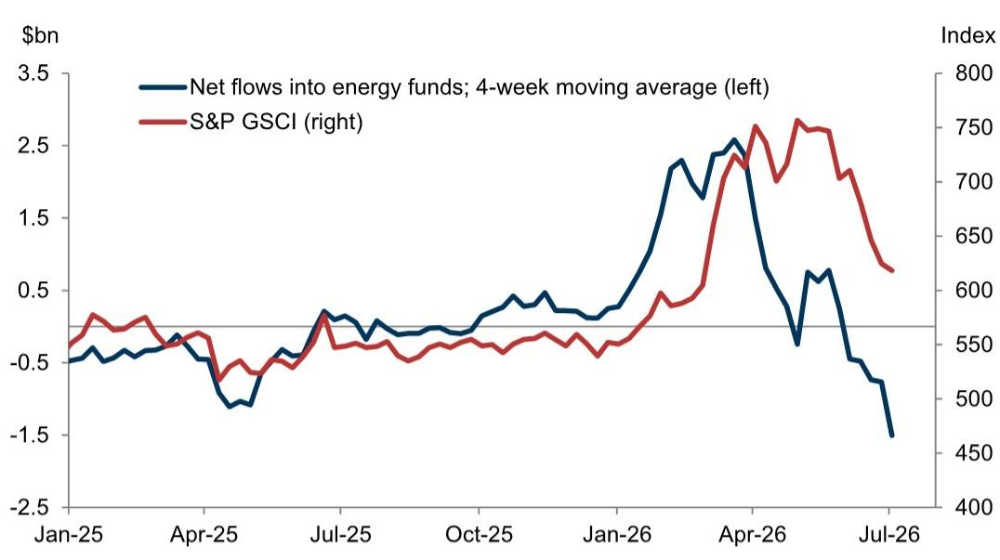  
来源：EPFR, Haver Analytics, GS全球投资研究

## 全球资金流动趋势

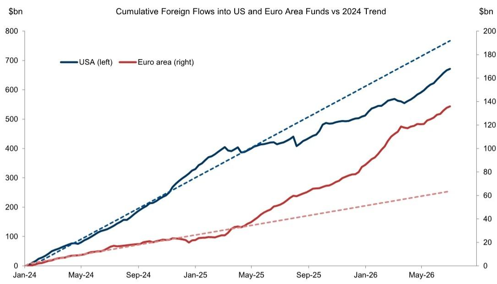  
来源：EPFR, GS全球投资研究

  
来源：EPFR, GS全球投资研究

  
来源：EPFR, GS全球投资研究

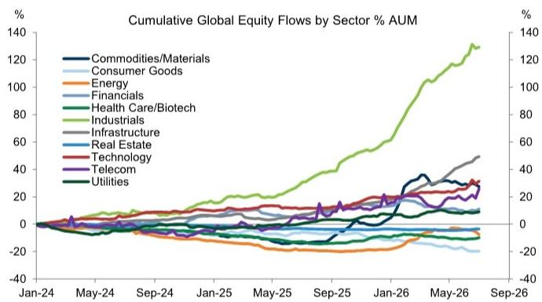  
反映行业主题基金的资金流动

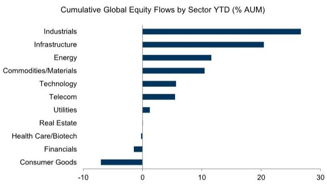  
反映行业主题基金的资金流动

来源：EPFR, GS全球投资研究  
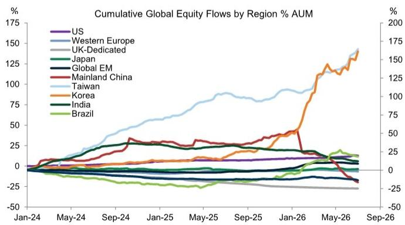  
反映国家和区域主题基金的资金流动  
来源：EPFR, GS全球投资研究

来源：EPFR, GS全球投资研究  
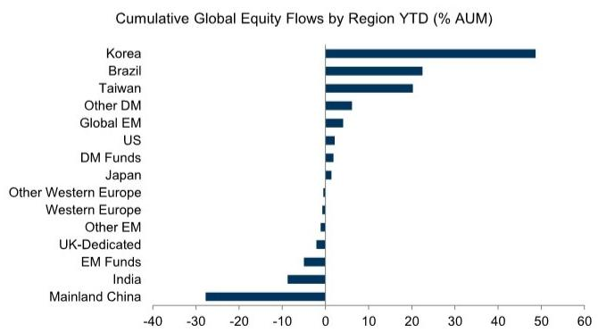  
反映国家和区域主题基金的资金流动  
来源：EPFR, GS全球投资研究

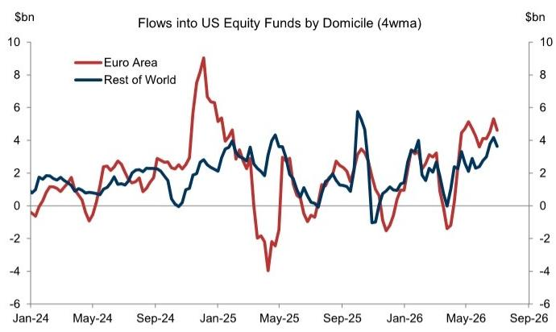  
来源：EPFR, GS全球投资研究

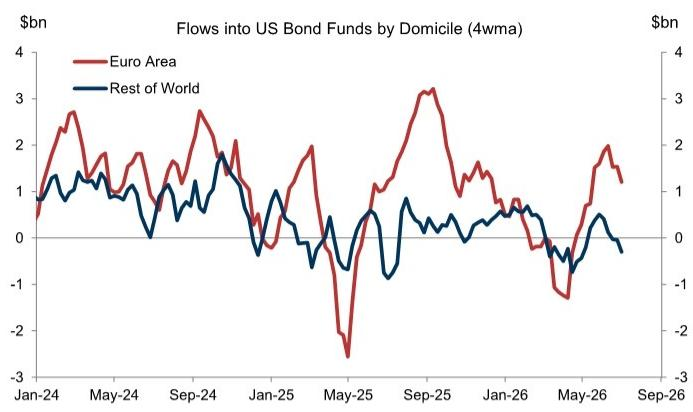  
来源：EPFR, GS全球投资研究

按国家划分的未对冲外资总流动  
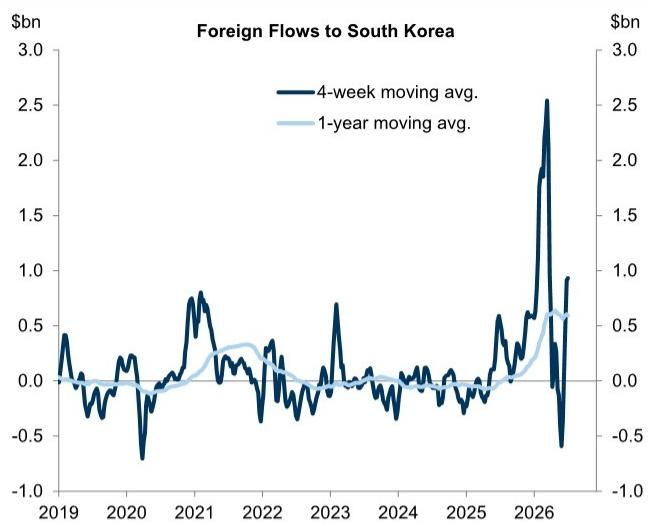

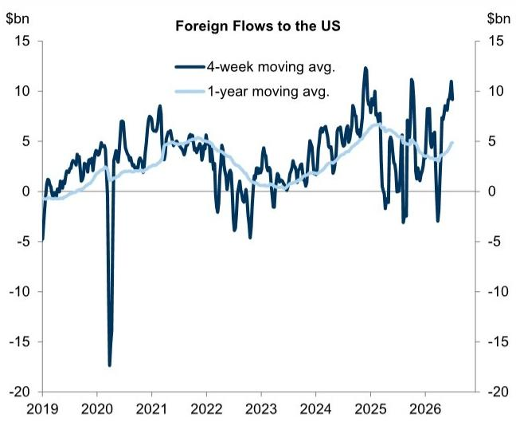

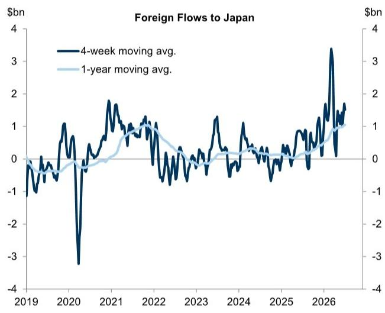

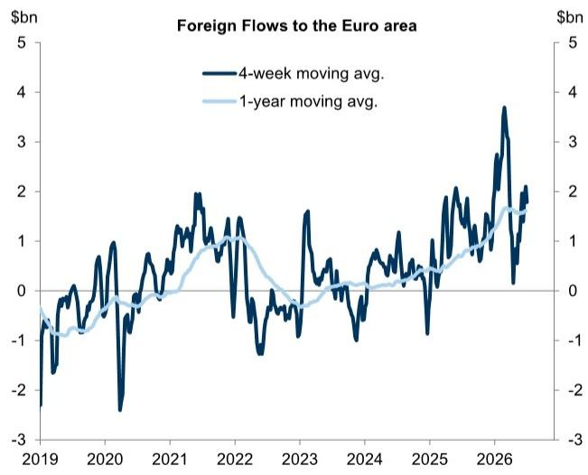  
来源：EPFR, GS全球投资研究

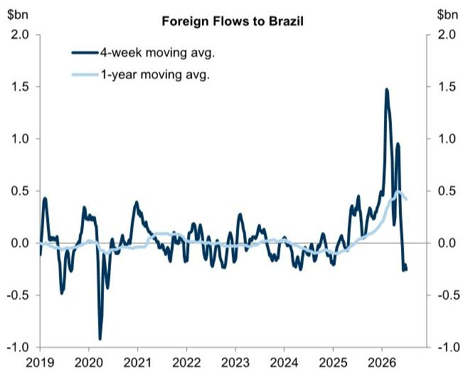

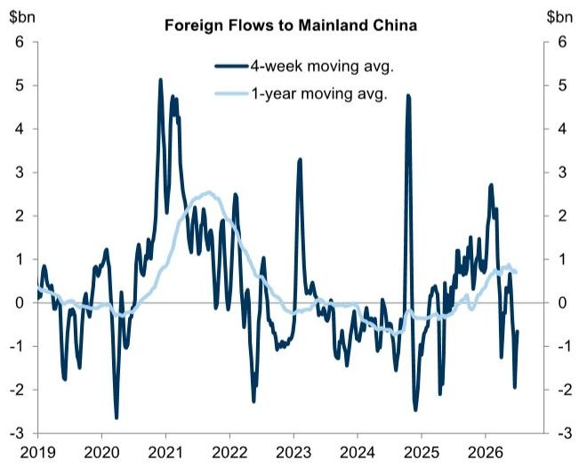

美国权益类基金未对冲净流入

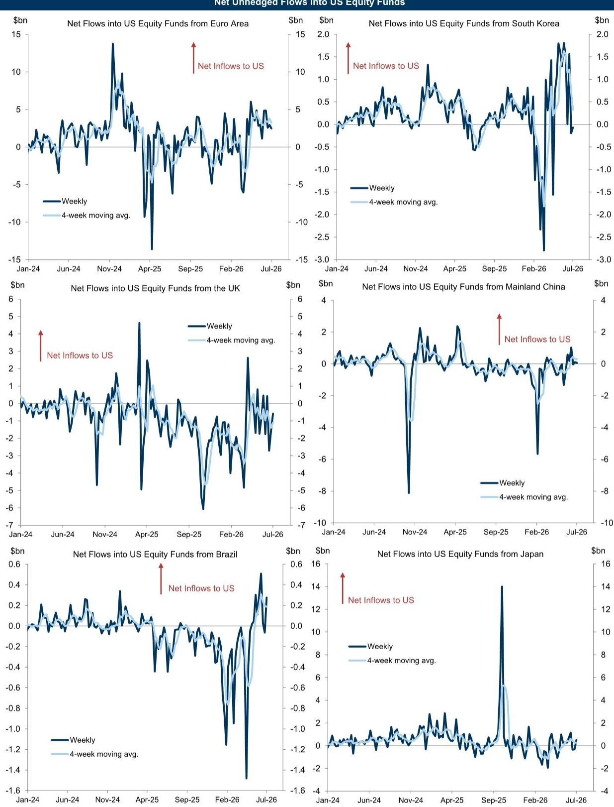  
来源：EPFR, Haver Analytics, GS全球投资研究

固定收益与权益资金流动

<table><tr><td rowspan="3"></td><td colspan="8">全球资金流动</td></tr><tr><td colspan="5">百万美元</td><td colspan="2">占资产管理规模百分比</td><td rowspan="2">4周合计Z值</td></tr><tr><td>4周合计</td><td>7月1日</td><td>6月24日</td><td>6月17日</td><td>6月10日</td><td>4周均值</td><td>7月1日</td></tr><tr><td>权益总计</td><td>139,067</td><td>-13,859</td><td>-4,992</td><td>126,425</td><td>31,494</td><td>0.11</td><td>-0.04</td><td>2.12</td></tr><tr><td>全球基准¹</td><td>50,255</td><td>8,921</td><td>14,361</td><td>15,116</td><td>11,857</td><td>0.17</td><td>0.12</td><td>2.00</td></tr><tr><td>含美国</td><td>35,165</td><td>5,584</td><td>9,300</td><td>8,317</td><td>11,963</td><td>0.17</td><td>0.10</td><td>2.09</td></tr><tr><td>不含美国</td><td>15,090</td><td>3,337</td><td>5,061</td><td>6,799</td><td>-107</td><td>0.16</td><td>0.14</td><td>1.17</td></tr><tr><td>发达市场²</td><td>108,886</td><td>-18,751</td><td>-8,294</td><td>120,798</td><td>15,132</td><td>0.14</td><td>-0.09</td><td>2.29</td></tr><tr><td>美国</td><td>110,784</td><td>-17,207</td><td>-8,548</td><td>119,189</td><td>17,350</td><td>0.17</td><td>-0.10</td><td>2.28</td></tr><tr><td>西欧</td><td>-10,075</td><td>-3,704</td><td>-1,294</td><td>-1,173</td><td>-3,904</td><td>-0.12</td><td>-0.18</td><td>-1.26</td></tr><tr><td>英国主题</td><td>-734</td><td>-81</td><td>-676</td><td>185</td><td>-163</td><td>-0.06</td><td>-0.02</td><td>1.21</td></tr><tr><td>其他</td><td>-9,341</td><td>-3,623</td><td>-618</td><td>-1,359</td><td>-3,740</td><td>-0.13</td><td>-0.21</td><td>-1.39</td></tr><tr><td>日本</td><td>4,280</td><td>1,855</td><td>475</td><td>1,166</td><td>784</td><td>0.09</td><td>0.15</td><td>0.68</td></tr><tr><td>其他</td><td>3,897</td><td>306</td><td>1,073</td><td>1,616</td><td>901</td><td>0.23</td><td>0.07</td><td>1.15</td></tr><tr><td>新兴市场³</td><td>-20,073</td><td>-4,030</td><td>-11,059</td><td>-9,489</td><td>4,506</td><td>-0.16</td><td>-0.13</td><td>-1.12</td></tr><tr><td>全球新兴市场基准</td><td>-5,956</td><td>-2,013</td><td>-508</td><td>-570</td><td>-2,865</td><td>-0.11</td><td>-0.14</td><td>-1.03</td></tr><tr><td>中国大陆</td><td>-27,283</td><td>-5,729</td><td>-10,367</td><td>-9,051</td><td>-2,136</td><td>-1.04</td><td>-0.88</td><td>-1.12</td></tr><tr><td>中国台湾</td><td>9,768</td><td>2,426</td><td>1,077</td><td>1,031</td><td>5,234</td><td>1.03</td><td>0.97</td><td>2.95</td></tr><tr><td>韩国</td><td>9,825</td><td>4,545</td><td>-536</td><td>-76</td><td>5,892</td><td>1.22</td><td>2.12</td><td>2.46</td></tr><tr><td>印度</td><td>-1,196</td><td>-250</td><td>-69</td><td>-416</td><td>-461</td><td>-0.37</td><td>-0.30</td><td>-1.07</td></tr><tr><td>巴西</td><td>-608</td><td>-151</td><td>-196</td><td>-64</td><td>-198</td><td>-0.65</td><td>-0.65</td><td>-1.19</td></tr><tr><td>其他</td><td>-4,624</td><td>-2,859</td><td>-461</td><td>-344</td><td>-960</td><td>-0.30</td><td>-0.75</td><td>-1.92</td></tr><tr><td colspan="9">权益行业资金流动</td></tr><tr><td>大宗商品/材料</td><td>-2,245</td><td>-1,843</td><td>-1,082</td><td>1,879</td><td>-1,198</td><td>-0.24</td><td>-0.72</td><td>-0.60</td></tr><tr><td>消费品</td><td>-2,335</td><td>412</td><td>74</td><td>-781</td><td>-2,039</td><td>-0.28</td><td>0.20</td><td>-0.45</td></tr><tr><td>能源</td><td>-9,718</td><td>-5,602</td><td>-2,556</td><td>-526</td><td>-1,034</td><td>-0.78</td><td>-1.81</td><td>-2.10</td></tr><tr><td>金融</td><td>6,819</td><td>4,008</td><td>-1,371</td><td>2,467</td><td>1,715</td><td>0.38</td><td>0.89</td><td>1.16</td></tr><tr><td>医疗保健</td><td>4,835</td><td>2,502</td><td>687</td><td>536</td><td>1,109</td><td>0.31</td><td>0.62</td><td>1.90</td></tr><tr><td>工业</td><td>5,778</td><td>812</td><td>-2,487</td><td>6,288</td><td>1,165</td><td>0.51</td><td>0.28</td><td>0.78</td></tr><tr><td>基础设施</td><td>4,022</td><td>815</td><td>2,077</td><td>473</td><td>657</td><td>0.72</td><td>0.54</td><td>2.11</td></tr><tr><td>房地产</td><td>3,114</td><td>-230</td><td>2,110</td><td>1,529</td><td>-295</td><td>0.13</td><td>-0.04</td><td>1.98</td></tr><tr><td>科技</td><td>49,214</td><td>15,937</td><td>-23,832</td><td>38,281</td><td>18,828</td><td>0.53</td><td>0.66</td><td>3.92</td></tr><tr><td>电信</td><td>3,797</td><td>3,163</td><td>-1,144</td><td>953</td><td>824</td><td>1.13</td><td>3.77</td><td>2.29</td></tr><tr><td>公用事业</td><td>54</td><td>550</td><td>346</td><td>-379</td><td>-463</td><td>0.01</td><td>0.30</td><td>-0.02</td></tr><tr><td>高贝塔⁴</td><td>3,030</td><td>904</td><td>-3,400</td><td>5,216</td><td>310</td><td>0.10</td><td>0.13</td><td>0.00</td></tr><tr><td>低贝塔⁴</td><td>-703</td><td>38</td><td>907</td><td>132</td><td>-1,779</td><td>-0.03</td><td>0.01</td><td>0.49</td></tr><tr><td>固定收益总计</td><td>84,835</td><td>29,236</td><td>16,374</td><td>19,160</td><td>20,065</td><td>0.21</td><td>0.29</td><td>1.13</td></tr><tr><td>发达市场⁵</td><td>82,179</td><td>28,237</td><td>13,375</td><td>19,521</td><td>21,047</td><td>0.23</td><td>0.31</td><td>1.34</td></tr><tr><td>政府</td><td>11,221</td><td>4,736</td><td>-94</td><td>1,623</td><td>4,957</td><td>0.17</td><td>0.29</td><td>0.04</td></tr><tr><td>抵押贷款支持</td><td>2,560</td><td>293</td><td>477</td><td>609</td><td>1,180</td><td>0.21</td><td>0.10</td><td>0.34</td></tr><tr><td>市政</td><td>7,188</td><td>1,859</td><td>1,226</td><td>2,509</td><td>1,593</td><td>0.26</td><td>0.26</td><td>1.49</td></tr><tr><td>综合型</td><td>27,840</td><td>9,215</td><td>7,592</td><td>3,861</td><td>7,172</td><td>0.24</td><td>0.32</td><td>1.03</td></tr><tr><td>投资级信用</td><td>9,383</td><td>3,301</td><td>865</td><td>3,771</td><td>1,446</td><td>0.20</td><td>0.29</td><td>0.65</td></tr><tr><td>高收益</td><td>7,217</td><td>3,350</td><td>1,857</td><td>2,096</td><td>-86</td><td>0.26</td><td>0.48</td><td>0.80</td></tr><tr><td>银行贷款</td><td>3,309</td><td>806</td><td>486</td><td>1,020</td><td>998</td><td>0.46</td><td>0.44</td><td>0.58</td></tr><tr><td>长久期⁶</td><td>-569</td><td>1,124</td><td>-1,183</td><td>-1,046</td><td>537</td><td>-0.03</td><td>0.22</td><td>-1.14</td></tr><tr><td>短久期⁶</td><td>17,378</td><td>6,576</td><td>1,123</td><td>3,506</td><td>6,173</td><td>0.19</td><td>0.28</td><td>0.43</td></tr><tr><td>通胀保护</td><td>1,610</td><td>294</td><td>69</td><td>885</td><td>361</td><td>0.23</td><td>0.17</td><td>0.92</td></tr><tr><td>新兴市场</td><td>4,009</td><td>838</td><td>3,220</td><td>193</td><td>-242</td><td>0.14</td><td>0.12</td><td>0.40</td></tr><tr><td>硬通货</td><td>446</td><td>162</td><td>578</td><td>267</td><td>-561</td><td>0.04</td><td>0.06</td><td>0.43</td></tr><tr><td>混合</td><td>142</td><td>-81</td><td>142</td><td>52</td><td>28</td><td>0.05</td><td>-0.12</td><td>0.10</td></tr><tr><td>本币</td><td>3,421</td><td>757</td><td>2,500</td><td>-127</td><td>291</td><td>0.23</td><td>0.20</td><td>0.32</td></tr><tr><td>货币市场</td><td>52,099</td><td>54,999</td><td>-25,536</td><td>25,110</td><td>-2,475</td><td>0.12</td><td>0.49</td><td>-0.39</td></tr></table>

1. 主要为MSCI World和MSCI ACWI基准。2. 发达市场国家和区域主题基金之和；不包括全球发达市场基准基金（如MSCI World基金）。3. 全球新兴市场基准基金与新兴市场国家和区域主题基金之和。4. 高贝塔基金包括大宗商品、金融和工业行业基金。低贝塔基金包括消费品、房地产和公用事业行业基金。5. 基准可能包含部分投资级新兴市场债券；以下类别包括发达市场和新兴市场基金。6. 长久期包括长期综合型、长期公司债和长期政府债券基金。短久期包括短期综合型、短期公司债和短期政府债券基金。

<table><tr><td rowspan="3"></td><td colspan="8">外汇资金流动¹</td></tr><tr><td colspan="5">百万美元</td><td colspan="2">占资产管理规模百分比</td><td rowspan="2">4周合计Z值</td></tr><tr><td>4周合计</td><td>7月1日</td><td>6月24日</td><td>6月17日</td><td>6月10日</td><td>4周均值</td><td>7月1日</td></tr><tr><td>总计</td><td>60,550</td><td>3,811</td><td>20,805</td><td>22,519</td><td>13,416</td><td>0.09</td><td>0.02</td><td>0.66</td></tr><tr><td>G10</td><td>59,065</td><td>7,573</td><td>16,737</td><td>20,480</td><td>14,275</td><td>0.14</td><td>0.07</td><td>1.65</td></tr><tr><td>美元</td><td>36,654</td><td>4,825</td><td>9,611</td><td>11,092</td><td>11,126</td><td>0.15</td><td>0.08</td><td>1.35</td></tr><tr><td>欧元</td><td>7,140</td><td>1,215</td><td>2,342</td><td>2,852</td><td>731</td><td>0.13</td><td>0.09</td><td>1.08</td></tr><tr><td>英镑</td><td>4,180</td><td>850</td><td>939</td><td>1,801</td><td>590</td><td>0.10</td><td>0.08</td><td>0.56</td></tr><tr><td>澳元</td><td>521</td><td>-192</td><td>238</td><td>313</td><td>161</td><td>0.07</td><td>-0.10</td><td>0.37</td></tr><tr><td>新西兰元</td><td>49</td><td>6</td><td>23</td><td>13</td><td>8</td><td>0.10</td><td>0.05</td><td>0.45</td></tr><tr><td>加元</td><td>2,321</td><td>112</td><td>721</td><td>931</td><td>557</td><td>0.17</td><td>0.03</td><td>1.56</td></tr><tr><td>瑞士法郎</td><td>1,248</td><td>22</td><td>495</td><td>610</td><td>120</td><td>0.07</td><td>0.01</td><td>0.30</td></tr><tr><td>挪威克朗</td><td>122</td><td>66</td><td>117</td><td>45</td><td>-106</td><td>0.03</td><td>0.07</td><td>-0.47</td></tr><tr><td>瑞典克朗</td><td>776</td><td>166</td><td>252</td><td>257</td><td>102</td><td>0.08</td><td>0.07</td><td>0.48</td></tr><tr><td>日元</td><td>6,054</td><td>503</td><td>1,998</td><td>2,568</td><td>986</td><td>0.16</td><td>0.05</td><td>1.53</td></tr><tr><td>亚洲</td><td>-911</td><td>-3,453</td><td>2,807</td><td>-295</td><td>31</td><td>-0.01</td><td>-0.14</td><td>-0.29</td></tr><tr><td>人民币</td><td>-2,617</td><td>-1,727</td><td>1,556</td><td>-1,761</td><td>-685</td><td>-0.09</td><td>-0.24</td><td>-0.51</td></tr><tr><td>港币</td><td>376</td><td>-15</td><td>145</td><td>179</td><td>68</td><td>0.08</td><td>-0.01</td><td>0.70</td></tr><tr><td>印度卢比</td><td>-1,843</td><td>-571</td><td>-51</td><td>-454</td><td>-766</td><td>-0.17</td><td>-0.21</td><td>-1.43</td></tr><tr><td>韩元</td><td>3,733</td><td>-257</td><td>804</td><td>1,305</td><td>1,881</td><td>0.19</td><td>-0.05</td><td>1.44</td></tr><tr><td>马来西亚林吉特</td><td>-95</td><td>-57</td><td>11</td><td>1</td><td>-51</td><td>-0.07</td><td>-0.17</td><td>-0.65</td></tr><tr><td>新加坡元</td><td>374</td><td>20</td><td>127</td><td>156</td><td>71</td><td>0.10</td><td>0.02</td><td>1.31</td></tr><tr><td>新台币</td><td>-1,016</td><td>-794</td><td>133</td><td>180</td><td>-535</td><td>-0.04</td><td>-0.14</td><td>-0.83</td></tr><tr><td>泰铢</td><td>-22</td><td>-58</td><td>6</td><td>30</td><td>1</td><td>-0.01</td><td>-0.14</td><td>-0.22</td></tr><tr><td>印尼盾</td><td>201</td><td>18</td><td>67</td><td>58</td><td>60</td><td>0.11</td><td>0.04</td><td>0.52</td></tr><tr><td>菲律宾比索</td><td>-4</td><td>-11</td><td>9</td><td>11</td><td>-13</td><td>0.00</td><td>-0.06</td><td>-0.11</td></tr><tr><td>美洲</td><td>-1,248</td><td>-569</td><td>241</td><td>29</td><td>-950</td><td>-0.08</td><td>-0.15</td><td>-0.91</td></tr><tr><td>阿根廷比索</td><td>21</td><td>-11</td><td>33</td><td>3</td><td>-4</td><td>0.06</td><td>-0.12</td><td>-0.20</td></tr><tr><td>巴西雷亚尔</td><td>-1,020</td><td>-426</td><td>115</td><td>-8</td><td>-702</td><td>-0.12</td><td>-0.21</td><td>-1.09</td></tr><tr><td>墨西哥比索</td><td>-246</td><td>-80</td><td>27</td><td>-17</td><td>-177</td><td>-0.06</td><td>-0.08</td><td>-0.82</td></tr><tr><td>智利比索</td><td>-9</td><td>-17</td><td>32</td><td>15</td><td>-40</td><td>-0.01</td><td>-0.05</td><td>-0.41</td></tr><tr><td>秘鲁索尔</td><td>-39</td><td>-23</td><td>9</td><td>4</td><td>-28</td><td>-0.04</td><td>-0.10</td><td>-0.54</td></tr><tr><td>哥伦比亚比索</td><td>45</td><td>-12</td><td>25</td><td>32</td><td>0</td><td>0.05</td><td>-0.06</td><td>-0.09</td></tr><tr><td>欧非中东</td><td>489</td><td>-108</td><td>205</td><td>420</td><td>-29</td><td>0.05</td><td>-0.04</td><td>-0.06</td></tr><tr><td>捷克克朗</td><td>195</td><td>6</td><td>14</td><td>166</td><td>10</td><td>0.23</td><td>0.03</td><td>1.64</td></tr><tr><td>匈牙利福林</td><td>14</td><td>-8</td><td>14</td><td>18</td><td>-9</td><td>0.01</td><td>-0.03</td><td>-0.21</td></tr><tr><td>波兰兹罗提</td><td>131</td><td>-34</td><td>50</td><td>61</td><td>54</td><td>0.07</td><td>-0.07</td><td>0.02</td></tr><tr><td>罗马尼亚列伊</td><td>28</td><td>1</td><td>7</td><td>17</td><td>3</td><td>0.04</td><td>0.01</td><td>-0.09</td></tr><tr><td>俄罗斯卢布</td><td>4</td><td>1</td><td>1</td><td>1</td><td>0</td><td>0.10</td><td>0.07</td><td>0.49</td></tr><tr><td>土耳其里拉</td><td>-8</td><td>-5</td><td>24</td><td>14</td><td>-41</td><td>-0.01</td><td>-0.02</td><td>-0.32</td></tr><tr><td>以色列谢克尔</td><td>266</td><td>40</td><td>71</td><td>97</td><td>59</td><td>0.14</td><td>0.08</td><td>0.89</td></tr><tr><td>南非兰特</td><td>-141</td><td>-107</td><td>24</td><td>46</td><td>-104</td><td>-0.05</td><td>-0.15</td><td>-0.
