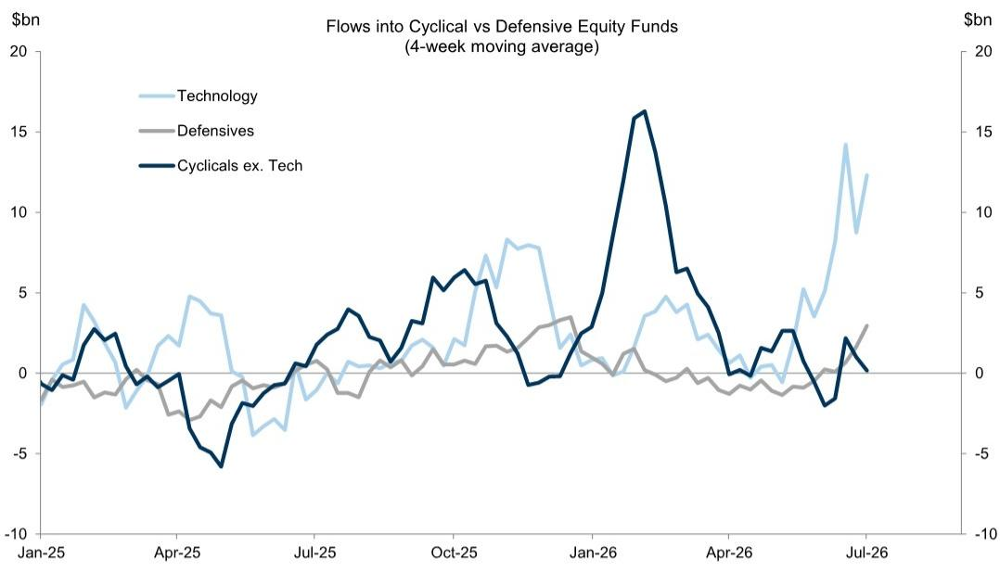
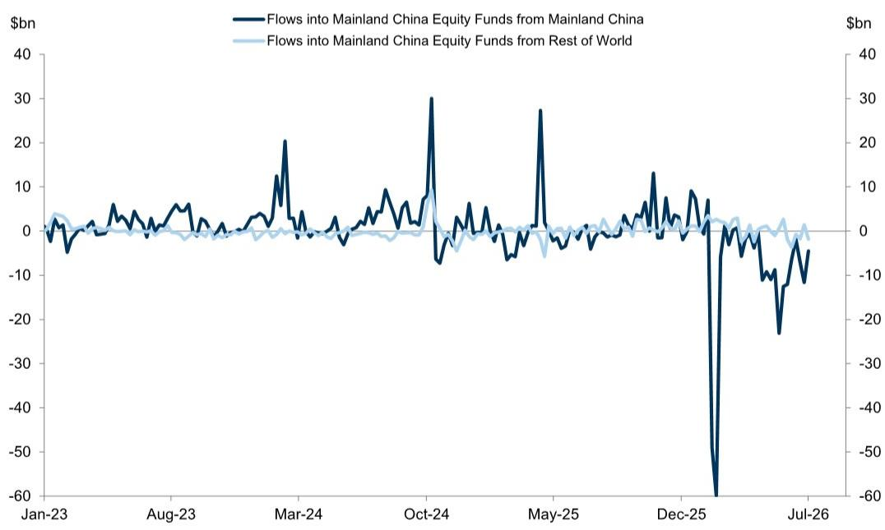

# 市场资金正转向固定收益与精选权益，这并非短暂停顿

截至7月1日当周的全球资金流动数据显示，全球资本配置正在发生结构性转变，其意义远超简单的避险操作。权益类基金净流出140亿美元，较前一周50亿美元的赎回规模有所加速；而固定收益基金则几乎在所有类别中吸纳了290亿美元的新增资金。这并非由单一数据点或季节性调整引发的短暂重新配置，而是一场基于对宏观环境轨迹、行业盈利可见性以及过去18个月贸易条件冲击持久性进行深度重新评估的战略性转向。

最关键的信号不仅在于资金正从权益流向债券，更在于资金在每类资产内部的集中方向。在固定收益领域，短久期和通胀保护债券基金持续获得资金流入，而长久期基金在连续数周流出后刚刚转为正值。在权益领域，科技基金在前一周遭遇创纪录流出后，本周强劲反弹，流入160亿美元；而能源基金则因原油价格持续下行，流出56亿美元。这些模式表明，读者并非在衰退或软着陆之间做二元选择，而是在对制度变迁进行精细押注——这需要仔细分析久期、行业敞口和货币动态。

为何是现在？因为宏观数据不再发出混杂信号，而是传递出一个连贯的信息。能源价格正在走低，但贸易条件对汇率的影响却比大宗商品本身的价格变动更具粘性。正如某全球研究机构报告所指出的，与2022年能源冲击的类比具有启发性：汇率分化在能源价格见顶后数月才达到峰值。如果这一模式重演，当前的资金流动数据可能捕捉到的是一轮持续多个季度的调整的早期阶段，而非一周的短暂波动。这对组合构建、货币对冲和行业配置具有深远影响。

## 从能源转向科技：市场正在定价分化的盈利周期

截至7月1日当周的行业资金流动数据揭示的故事远比简单的风险偏好切换更为有趣。能源行业基金净流出56亿美元，是当周所有行业中流出规模最大的，而四周累计流出97亿美元，在数据集中也属极端水平。这一情况发生在能源价格持续走低之际，但资金流动模式暗示的不仅仅是针对现货价格的机械反应，而是机构读者正在提前减少对一个盈利动能正在转弱的行业的敞口，即便围绕供应约束的宏观叙事依然成立。

与此同时，科技基金吸引了159亿美元的资金流入，是当周最大规模，且远超其他行业。尤其引人注目的是，前一周科技基金刚刚遭遇了数据集中最大的净流出。这种剧烈反转并非犹豫不决的迹象，而是短暂恐慌后信念的迅速回归。在弱势中卖出科技股的读者似乎已得出结论，相对于人工智能相关资本支出、半导体需求和数字基础设施建设的根本性轨迹，此前的抛售过度了。科技基金四周累计流入达490亿美元，远超其他所有行业。

其含义清晰可见：市场正在定价盈利周期的分化。能源行业盈利可能面临实现价格下降的逆风，即使结构性供应故事依然看涨。科技行业盈利则受到仍处于早期阶段的资本支出超级周期的支撑。读者正在用资金投票，而投票结果差距悬殊。这对组合管理者提出的问题是：这一转向是否还有进一步空间，还是已经反映在行业估值中。

## 固定收益资金流入广泛，但久期信号尚不明朗

固定收益基金净流入290亿美元，延续了持续数周的趋势。这些流入的构成比总量数字更为重要。短久期债券基金流入66亿美元，而长久期基金在连续数周流出后转为正值，但规模仅为11亿美元。通胀保护债券基金也持续获得资金流入，尽管规模较小。

这一模式表明，读者并非在单纯押注利率下降。如果是那样，长久期基金将吸收更多资金。相反，数据指向一种更具防御性的姿态：读者想要收益，但希望承担有限的久期风险。他们一方面在对冲通胀可能比市场预期更具粘性的可能性，另一方面也在为央行可能比当前定价更早降息做准备。这并非矛盾，而是一种对冲。

对资产配置者而言，其影响是显著的。一个超配短久期固定收益的组合，隐含的押注是回报表现曲线将从短端陡化。这要么押注经济衰退迫使央行降息，要么押注通胀缓和而经济未出现急剧下滑。资金流动数据并未告诉我们哪种情景会胜出，但它确实表明，一个庞大且精明的读者群体正在同时为这两种结果布局。

## 新兴市场权益资金沿半导体产业链分化

新兴市场权益资金整体数据显示当周净流出40亿美元，其中中国大陆基金流出57亿美元是主要拖累。但区域细分揭示出显著分化。中国台湾权益基金流入24亿美元，韩国权益基金流入45亿美元。这两个市场是全球半导体供应链中的主导者，其资金流动正与更广泛的新兴市场板块明显脱钩。

四周累计数据更为显著。中国台湾累计流入98亿美元，韩国98亿美元，而中国大陆则累计流出273亿美元。这并非关于新兴市场作为一个单一资产类别的故事，而是关于全球供应链结构性转变在新兴世界内部创造赢家和输家的故事。读者押注，由人工智能需求和芯片制造回流驱动的半导体周期，将支撑中国台湾和韩国的盈利增长，即便中国经济面临房地产行业和人口结构方面的挑战。

对全球配置者而言，战略问题是这种分化是否可持续。如果半导体周期比预期更早见顶，流入中国台湾和韩国的资金可能像来时一样迅速逆转。但如果人工智能资本支出周期具有多年持续性，那么当前的资金流动模式可能是这些市场持续重估的早期阶段。数据并未解决这一问题，但它迫使读者直面它。

## 贸易条件之谜：为何汇率资金流与能源价格背离

报告中最引人入胜的发现之一是，贸易条件对汇率的影响比能源价格本身的变动更具粘性。与2022年能源冲击的类比具有启发性：汇率分化在能源价格见顶后数月才达到峰值。如果这一模式重演，当前的资金流动数据可能捕捉到的是货币市场长期调整的早期阶段。

截至7月1日当周的跨境汇率资金流动数据显示，美元和欧元有强劲净需求，而亚洲整体出现净流出。人民币在经历前一周短暂喘息后，再次出现净流出。这与能源冲击尚未完全通过贸易和资本账户渠道传导的世界状况一致。即使油价下跌，其对贸易平衡、通胀差异和央行政策立场的累积影响仍在持续塑造汇率流动。

对组合管理者而言，其含义是货币对冲决策不能仅基于现货大宗商品价格做出。对贸易流动、财政状况和货币政策的二阶效应可能比大宗商品价格变动本身持续更久。一个超配新兴市场货币而未仔细分析各国贸易条件敞口的组合，正在承担资金流动数据未能完全捕捉的风险。

## 报告尚未解答的问题：科技复苏的可持续性

报告提供了当前资金流动的丰富图景，但留下了几个关键问题未解。其中最重要的是，科技行业的资金流入反弹是可持续的，还是仅仅是一次恐慌后的反射性回弹。前一周创纪录的流出紧随本周创纪录的流入，表明读者对科技的情绪对近期消息面高度敏感。如果财报季揭示利润率压力或人工智能相关资本支出放缓，资金流动可能再次逆转。

第二个未解问题是，转向短久期固定收益是战术性交易还是战略性配置调整。如果央行降息早于预期，短久期头寸将跑输长久期头寸。资金流动数据表明读者正在对冲这种可能性，但并未告诉我们他们是否配置正确。

报告也未完全解释新兴市场权益与新兴市场固定收益资金流动之间的分化。尽管新兴市场权益出现流出，但新兴市场固定收益基金流入8.38亿美元，其中本币债券吸引了大部分资金。这表明读者愿意承担新兴市场信用风险，但不愿承担新兴市场权益风险。是什么驱动了这种区别？是对新兴市场央行可信度的看法，还是对新兴市场公司盈利的看法？数据并未说明。

## 基于资金流动数据的组合管理决策框架

资金流动数据可以转化为一个简单而有效的组合管理决策框架。该框架包含三个维度：久期、行业和地域。

在久期方面，数据建议维持杠铃策略。短久期固定收益正在吸收大量资金，这意味着共识是利率短期内将保持高位。但长久期资金流动的转向，尽管规模不大，表明一些读者开始为降息周期布局。一个超配短久期债券并选择性配置长久期债券的杠铃策略，与资金流动模式一致。

在行业方面，数据支持结构性关注科技和战术性关注能源。流入科技的资金规模太大，不容忽视，而能源的持续流出表明市场正在定价多个季度的盈利放缓。但该框架也必须考虑科技资金可能拥挤且易受回调影响的风险。头寸规模应反映这一风险。

在地域方面，数据支持对新兴市场采取选择性方法。中国台湾和韩国正因半导体周期吸引资金，而中国继续出现流出。该框架应将这两个市场视为独立的资产类别，而非单一的新兴市场配置。货币对冲决策应基于对贸易条件效应可能比能源价格变动持续更久的理解。

## 加入社区阅读完整报告并查看原始图表

本分析中的资金流动数据揭示了一个处于重大转向中的市场，但完整图景需要查看底层图表以及按国家、行业和基金类型的详细细分。原始报告包含捕捉数周资金流动轨迹的可视化图表、突出显示哪些流动在统计上极端的Z值分析，以及对于货币对冲决策至关重要的跨境汇率资金流动的详细数据。加入社区阅读完整报告并查看原始图表。

*仅供参考。部分内容可能基于源材料通过AI辅助生成、翻译、总结或编辑，可能存在遗漏或错误。请独立核实。这不构成专业建议。*

仅供参考。部分内容可能基于源材料通过AI辅助生成、翻译、总结或编辑，可能存在遗漏或错误。请独立核实。这不构成专业建议。

