# 年中住房市场展望：趋于稳定但增长有限

■ 受年初异常天气及抵押贷款利率回升影响，上半年住宅投资表现波动：一季度住宅固定投资年化下降8%后，二季度进一步下降5%（估算）。本文回顾了我们对下半年住房市场的核心预测。

Ronnie Walker
+1(917)343-4543 |
ronnie.walker@gs.com
GS & Co. LLC

持续高位的抵押贷款利率将继续对住房流转产生最显著影响。近80%的抵押贷款借款人的利率低于当前市场利率，近60%的借款人利率低于市场利率2个百分点以上，这极大地抑制了他们的搬迁意愿。因此，我们预计2026年下半年成屋销售年化量仅为420万套，较2026年上半年水平高3%，但较2019年低22%。

长期存在的住房短缺使独栋住宅建设对利率上升表现出极强的韧性，但供需平衡的正常化以及建筑商利润率的回归，已导致独栋住宅开工量出现温和放缓。今年以来，独栋住宅开工量较去年下降2%，但尽管当前抵押贷款利率高出3个百分点，其平均水平仍较2019年高4%。我们预计今年独栋住宅开工总量为92万套（2025年为94万套），年底年化开工量约为93万套。

我们预计住房需求将保持温和。积极方面，国内人口结构趋势仍具支撑性，基于调查的购房意愿指标有所改善。但消极方面，移民减少将继续抑制家庭形成，收入增长表现一般。在供给增长依然稳健而需求略有减弱的组合下，我们估算房主空置率将从2026年一季度的1.1%升至四季度的1.2%和2027年的1.3%。在住房市场趋于宽松的背景下，我们预计今年全国房价同比（12月对12月）仅上涨0.8%，明年上涨2.3%。

多户住宅建设可能进一步下降，但速度放缓。已开工的多户住宅积压项目已缩减33%，但仍较2019年高9%。多户住宅开工量因此有所回升，但略低于竣工速度，我们预计积压项目将在明年回落至疫情前水平。

鉴于过去一年新租约租金仅增长1-2%，且新租约与续租约租金差距已收窄至疫情前水平以下，我们预计今年剩余时间月度PCE住房通胀平均仅为0.19%，同比增速将从当前的3.2%降至2026年12月的2.9%和2027年12月的2.2%。

我们预测2026年三季度和四季度住宅固定投资（RFI）年化增长率分别为-1.5%和+1.5%，反映出多户住宅建设的拖累被翻新支出增长和成屋销售小幅上升所抵消。这意味着2026年RFI（四季度对四季度）增长率为-3.2%，而2025年为-3.8%，我们此前预测为-3.0%。

## 年中住房市场展望：趋于稳定但增长有限

受年初异常天气及抵押贷款利率回升影响，住宅投资上半年表现波动：一季度住宅固定投资年化下降8%后，二季度进一步下降5%（估算）。本文回顾了我们对下半年住房市场的核心预测。

图表1：GS住房预测

<table><tr><td colspan="11">住房预测</td></tr><tr><td rowspan="2">指标</td><td colspan="4">年度均值</td><td colspan="2">2025</td><td colspan="4">2026</td></tr><tr><td>2024</td><td>2025</td><td>2026</td><td>2027</td><td>Q3</td><td>Q4</td><td>Q1</td><td>Q2</td><td>Q3</td><td>Q4</td></tr><tr><td>实际住宅固定投资（季环比年化）*</td><td>1.3</td><td>-3.8</td><td>-3.3</td><td>2.1</td><td>-7.1</td><td>-1.7</td><td>-7.8</td><td>-5.1</td><td>-1.5</td><td>1.5</td></tr><tr><td>住房开工量（千套，年化）</td><td>1,370</td><td>1,356</td><td>1,347</td><td>1,372</td><td>1,347</td><td>1,323</td><td>1,418</td><td>1,299</td><td>1,323</td><td>1,348</td></tr><tr><td>独栋住宅开工量（千套，年化）</td><td>1,015</td><td>941</td><td>921</td><td>948</td><td>890</td><td>923</td><td>945</td><td>900</td><td>910</td><td>930</td></tr><tr><td>多户住宅开工量（千套，年化）</td><td>355</td><td>415</td><td>426</td><td>424</td><td>458</td><td>401</td><td>473</td><td>399</td><td>413</td><td>418</td></tr><tr><td>成屋销售（千套，年化）</td><td>4,067</td><td>4,076</td><td>4,168</td><td>4,255</td><td>4,047</td><td>4,157</td><td>4,053</td><td>4,160</td><td>4,226</td><td>4,234</td></tr><tr><td>新房销售（千套，年化）</td><td>684</td><td>679</td><td>631</td><td>649</td><td>687</td><td>711</td><td>623</td><td>590</td><td>649</td><td>661</td></tr><tr><td>房主空置率（%）**</td><td>1.1</td><td>1.2</td><td>1.2</td><td>1.3</td><td>1.2</td><td>1.2</td><td>1.1</td><td>1.1</td><td>1.1</td><td>1.2</td></tr><tr><td>Case-Shiller房价指数（季环比年化）***</td><td>4.1</td><td>1.2</td><td>0.8</td><td>2.3</td><td>-0.2</td><td>3.5</td><td>2.1</td><td>-0.8</td><td>1.6</td><td>1.6</td></tr></table>

注：粗体为已公布数据。红色斜体为GS预测值。  
\* 年度值为四季度对四季度。\*\* 年度值为期末值。  
\*\*\* 年度值为12月经季节性调整的同比增速。  
来源：GS全球研究

## 黄金手铐的钥匙何在

对利率最为敏感的住房市场前景，很大程度上取决于抵押贷款利率的走向。图表2显示，抵押贷款利率在3月份因伊朗战争、油价上涨及美联储加息预期而回升。我们的策略师预计，抵押贷款利率在可预见的未来将保持高位，年底前维持在目前水平（6.43%）附近，明年小幅回落至6.3%，这反映了我们对美联储偏鸽派的预测。

图表2：策略师预计抵押贷款利率将保持高位，仅从当前的6.43%降至明年底的6.3%  
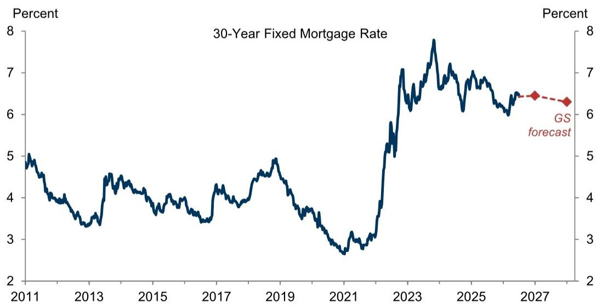  
来源：Freddie Mac，GS全球研究

持续高位的抵押贷款利率将继续对住房流转产生最显著影响。图表3左图显示，近80%的抵押贷款借款人的利率低于当前市场利率，近60%的借款人利率低于市场利率2个百分点以上。2020年和2021年大量借款人低利率再融资，叠加当前抵押贷款利率高企，造成了显著的搬迁财务成本——购买新房需要提前偿还现有抵押贷款，并以高得多的利率申请新贷款。受此“锁定”效应影响，我们预计2026年成屋销售总量仅为420万套，较2019年低22%，但略高于过去两年的水平。明年，我们预计成屋销售将小幅上升至约430万套，这反映了抵押贷款利率的温和下降以及锁定效应的自然衰减（例如借款人逐步偿还贷款）。

虽然成屋销售的小幅回升将增加可用住房的总供给，但对净住房供给以及长期存在但正在缓解的全国性住房短缺影响有限，因为家庭通常只是在不同住房单元之间转换，并未创造或消灭住房单元。不过，住房流转对GDP具有重要影响，因为更多的成屋销售通过经纪人佣金（占RFI权重的15%）推动住宅固定投资增长。

图表3：近80%的借款人抵押贷款利率低于当前市场利率；预计未来几年成屋销售仅温和回升  
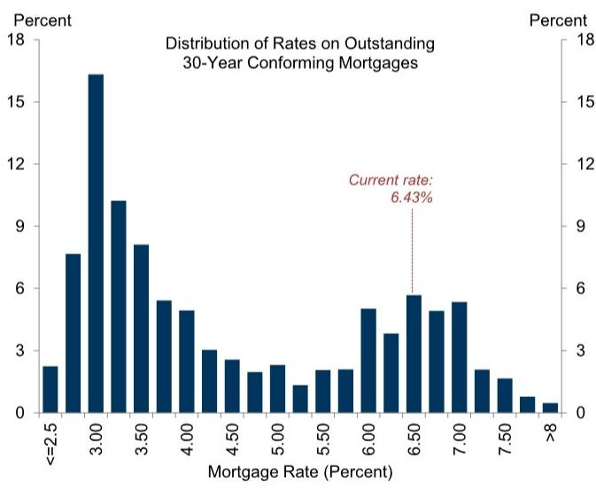

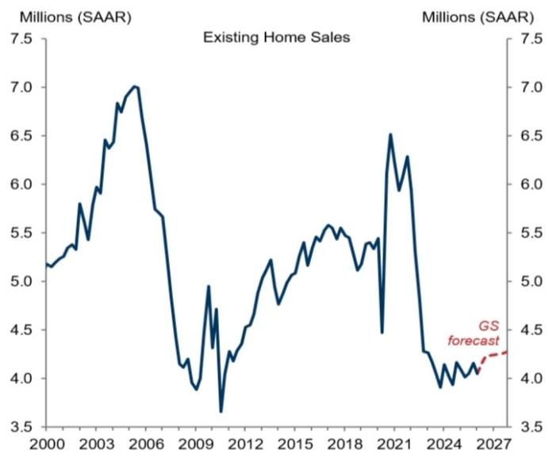  
来源：eMBS，全美房地产经纪人协会（NAR），GS全球研究

## 独栋住宅建设：短缺支撑略有减弱

长期存在的住房短缺使独栋住宅建设对利率上升表现出极强的韧性。近年来住宅建设的高位运行改善了供需平衡，尽管仍处于历史偏紧水平（图表4）。

图表4：可用住房供给有所改善，但按历史标准仍偏紧  
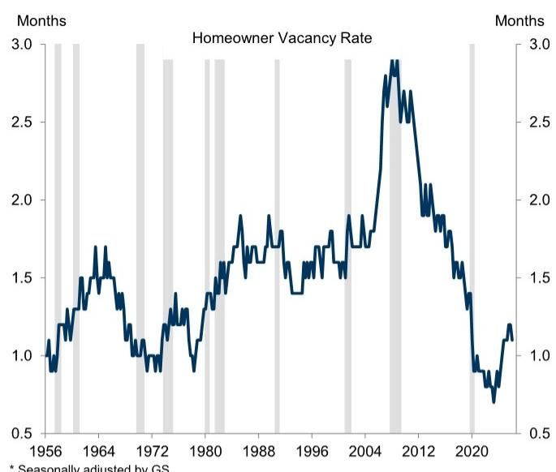  
\* 经GS季节性调整。  
注：阴影部分表示NBER定义的经济衰退期。

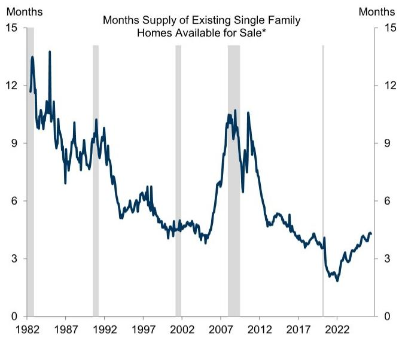  
来源：商务部，全美房地产经纪人协会（NAR），GS全球研究

这种改善，加上建筑商利润率回归至疫情前水平（图表5），导致独栋住宅开工量出现温和放缓。今年以来，独栋住宅开工量较去年下降2%，但由于住房市场仍偏紧，其平均水平仍较2019年高4%，尽管当前抵押贷款利率高出3个百分点。展望未来，我们预计今年独栋住宅开工总量为92万套（2025年为94万套），年底年化开工量约为93万套。这一观点与股票分析师对今年建筑商交付量的预期信号（作为公司指引的代理指标）相似。

图表5：建筑商利润率正接近疫情前水平  
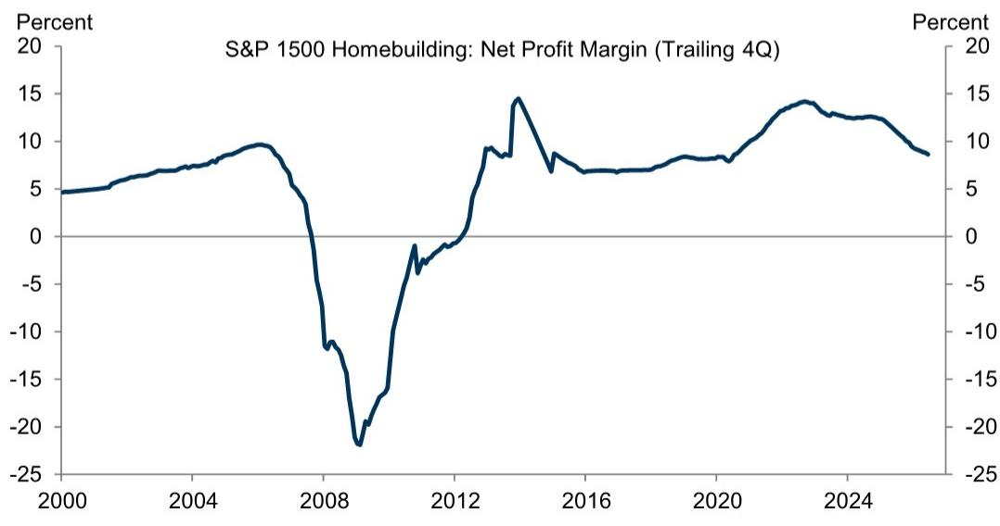  
来源：公司数据，GS全球研究

我们预计住房需求将保持温和。积极方面，国内人口结构趋势仍具支撑性，基于调查的购房意愿指标（如世界大型企业联合会询问受访者是否计划在六个月内购房的指标）在过去一年有所改善。

但消极方面，收入增长表现一般，移民减少将继续抑制家庭形成。图表6展示了我们的家庭形成模型，该模型结合了各年龄段户主率预测与经移民减少调整后的人口普查年龄组人口增长预测。该方法得出未来几年家庭形成率约为每年100万户，低于近期趋势。

图表6：虽然国内人口结构趋势支持家庭形成，但移民减少将继续抑制家庭形成

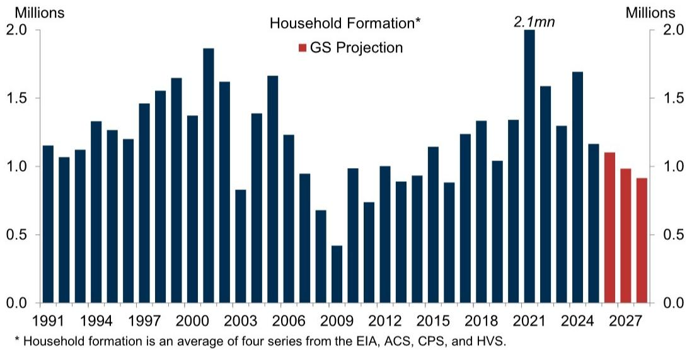  
来源：GS全球研究

在供给增长依然稳健而需求略有减弱的组合下，我们估算房主空置率将从2026年一季度的1.1%升至四季度的1.2%和2027年的1.3%。在住房市场趋于宽松的背景下，我们预计今年全国房价同比（12月对12月）仅上涨0.8%，明年上涨2.3%。

自2025年以来移民放缓对住房供给、需求及其平衡产生了何种影响？结合基于法院案件数据的各州无证移民估算与各州住房数据，我们发现，2024年至2025年间无证移民减少幅度较大的州，其成屋销售和住宅建设均较弱（图表7，上方面板）。我们还发现，移民减少幅度较大的州，房价增长也较弱（下方面板），表明需求受到的冲击略大于供给。然而，与房价的关系仅具有边缘统计显著性，我们未发现移民减少与空置率变化之间存在有意义的关系。

图表7：移民减少幅度较大的州，成屋销售、住宅建设和房价均较弱

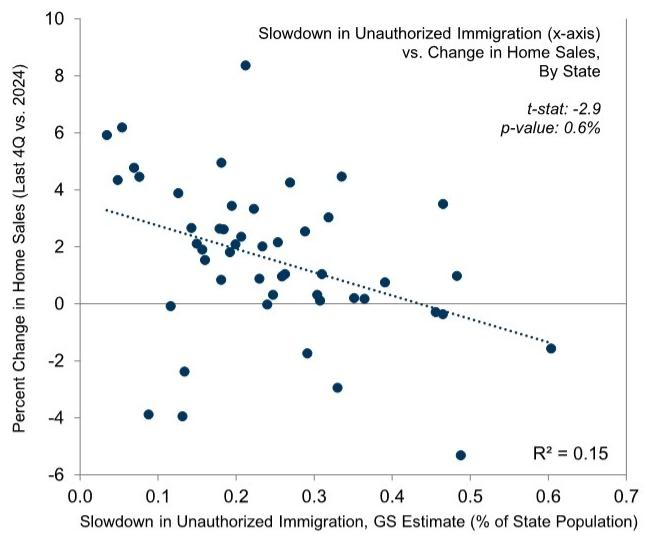

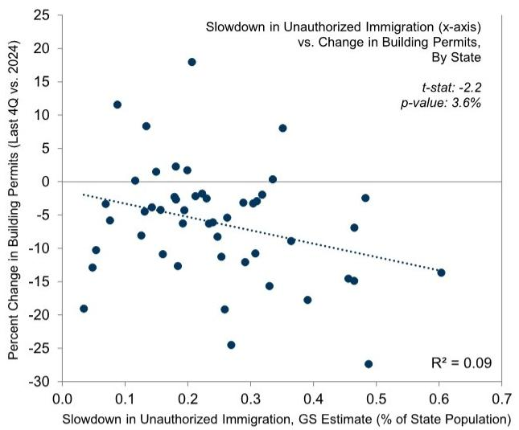

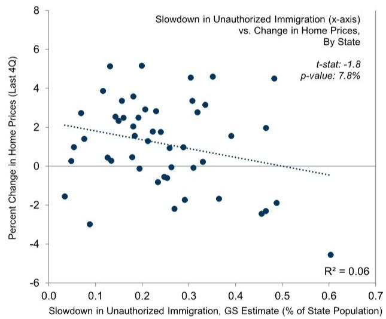  
来源：GS全球研究

考虑到该行业对无证移民劳动力的依赖程度较高，供给影响较小是否令人意外？可能并不意外，原因有二。首先，我们此前的大都市层面分析发现，与其他商品和服务的价格不同，移民变化与租金价格呈正相关关系（即移民减少对租金构成下行压力），这可能反映了住房供给在短期内缺乏弹性。其次，图表8显示，过去两年住宅建筑工人的短缺状况已显著缓解，这使得当前移民减少对劳动力供给的影响可能不如几年前那么显著。

图表8：住宅建筑行业似乎不再人手不足；该行业工资增长已放缓  
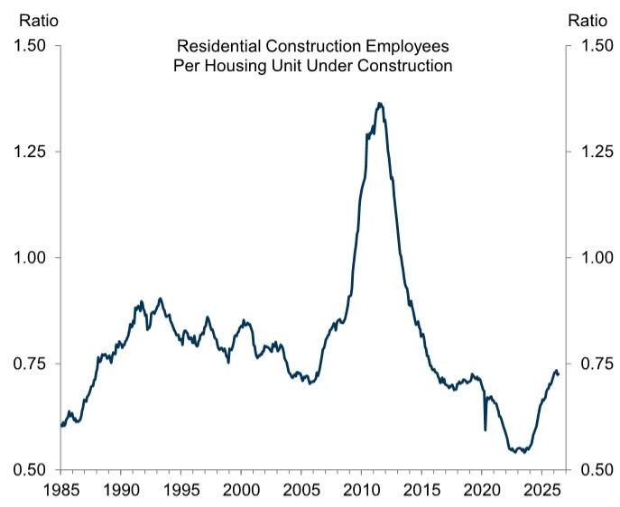  
来源：劳工部，商务部，GS全球研究

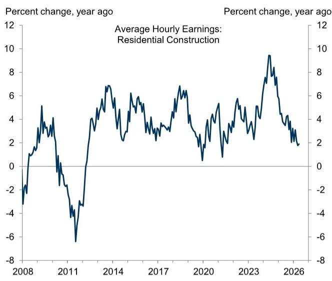

## 多户住宅建设：仍在放缓

多户住宅建设可能进一步下降，但速度放缓。图表9显示，已开工的多户住宅积压项目已下降33%，此前曾较2019年水平高出63%，原因是竣工速度在2024-2025年跃升至数十年高位后仍保持高位，而新项目储备收窄。

由于积压项目仍较2019年高9%，且吸收率较低推动租赁空置率从5.6%的谷底升至7.3%，我们预计多户住宅开发商将继续专注于清理现有积压项目，然后才启动新项目，尽管由于积压项目已缩减，这一趋势可能不如过去两年那么一致。我们预测2026年多户住宅开工量为43万套，而2025年为41万套，2024年为36万套。结合我们对独栋住宅开工量的预期，我们预计总住房开工量同比大致持平，2026年为135万套，2025年为136万套。

图表9：多户住宅在建积压项目大部分已清理，使多户住宅开工量得以回升  
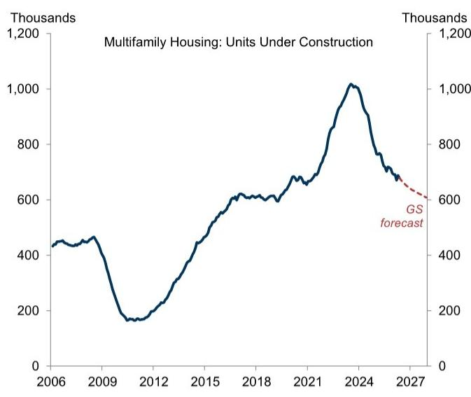  
来源：商务部，GS全球研究

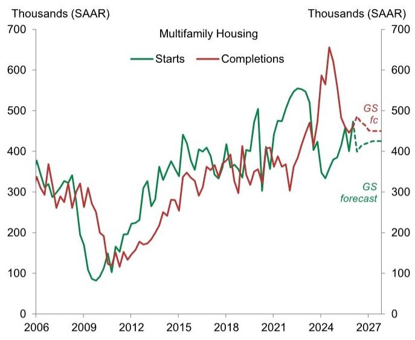

多户住宅竣工量强劲与需求略有减弱的组合，可能导致租赁空置率进一步小幅上升（图表10，左图），并对新租约租金增长构成压力。图表10右图显示，新租约租金增长的替代指标已从2022年峰值+12-13%放缓至当前约+1%。我们的新租约租金增长模型预测未来几年年化增长率为2-3%，略低于疫情前水平。

图表10：租赁空置率上升对新租约租金增长构成下行压力  
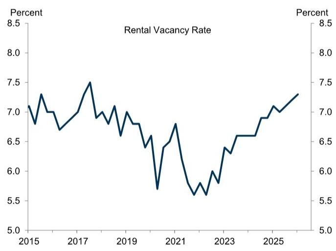

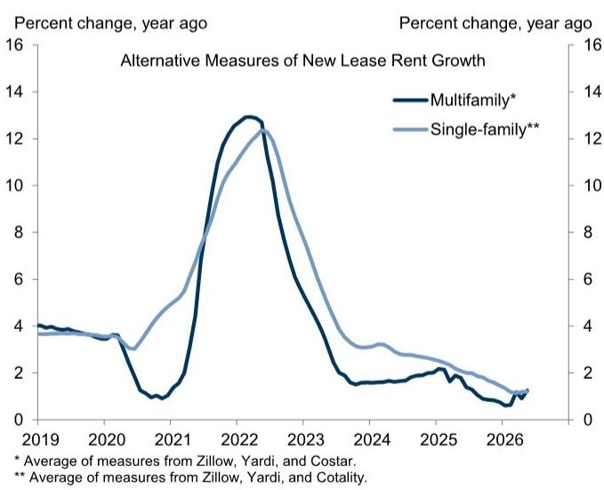  
来源：商务部，GS全球研究

除了新租约租金增长的未来步伐外，CPI和PCE报告中官方住房通胀指标的前景关键取决于新租约与续租约租金之间的差距。在2021年和2022年大幅扩大后，我们估算该差距目前较疫情前收窄了2-3%，因为过去几年新租约租金增长放缓，使续租约租金得以完全赶上。

官方住房通胀已从2022年月度峰值0.76%放缓至今年一季度的0.23%（4月和5月读数似乎受到单独因素的提振）。我们预计今年剩余时间月度住房通胀平均放缓至0.19%，明年为0.18%。我们的预测意味着PCE住房通胀同比增速将从当前的3.2%降至2026年12月的2.9%和2027年12月的2.2%，这将是2013年以来最慢增速。

图表11：我们预计PCE住房通胀将从5月的同比3.2%降至2026年12月的2.9%和2027年12月的2.2%，低于疫情前水平

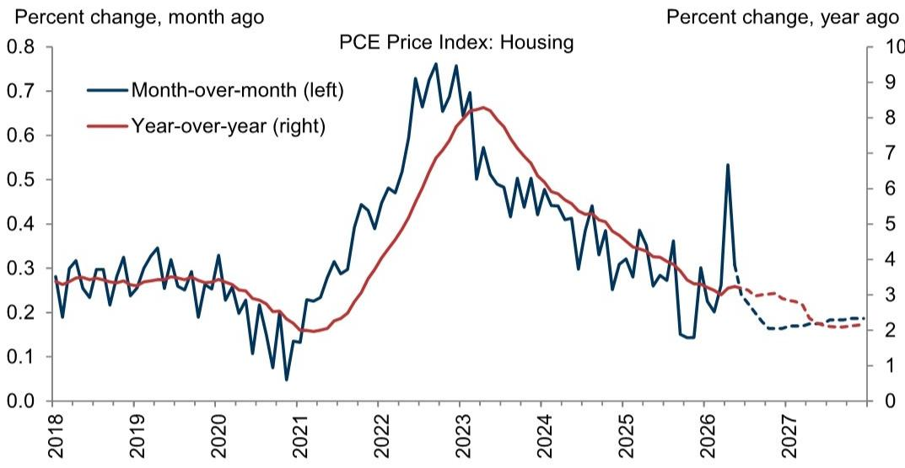  
注：虚线表示GS预测。  
来源：商务部，GS全球研究

如果新租约租金增长一年多来一直接近1%，为什么官方指标最终不会收敛到这一较慢速度？如上所述，官方住房通胀指标同时涵盖新租约和续租约的租金。虽然新租约租金增长一直疲软，但每年只有一小部分租户搬迁（图表12），现有租户的续租约往往经历更稳定的价格上涨——无论是在市场条件宽松时（因搬迁成本）还是在市场条件紧张时（因房东担心涨幅过大失去租户，且某些情况下存在涨幅上限）。

图表12：由于续租约租金涨幅更稳定，每年搬迁的租户比例有限，限制了官方住房通胀指标的下降空间

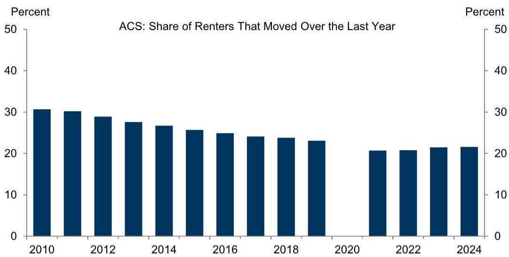  
注：因疫情对数据收集的影响，人口普查局未发布2020年ACS的官方估算。  
来源：商务部，GS全球研究

尽管如此，我们预计住房通胀的进一步放缓将有助于恢复去通胀趋势，尤其是在旨在捕捉潜在通胀趋势的指标中。图表13显示，住房通胀在美联储官员关注的每一项潜在通胀趋势指标中都占有超常权重，尤其是基于CPI的指标。

图表13：住房在几乎所有潜在通胀趋势指标中均占有超常权重  
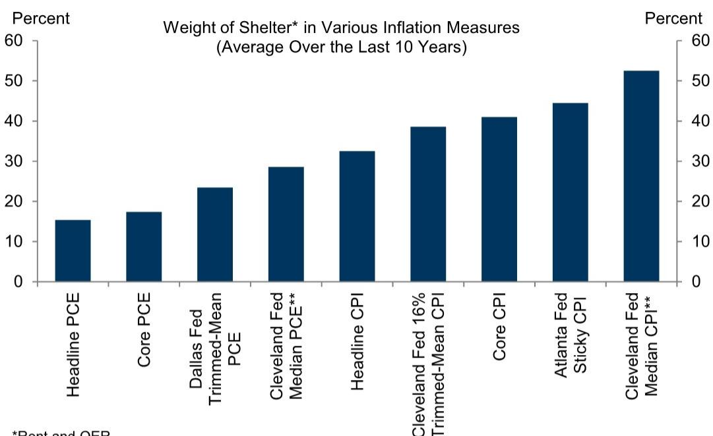  
\* 租金和业主等价租金。  
\*\* 相当于住房成为中位数的频率。由于住房通常位于通胀分布的中心附近，该成分的微小波动可能对中位数产生不成比例的影响。  
来源：GS全球研究

## 住宅固定投资增长：趋于稳定但增长有限

综合来看，我们预测2026年三季度和四季度住宅固定投资（RFI）年化增长率分别为-1.5%和+1.5%，反映出多户住宅建设的拖累被翻新支出增长和成屋销售小幅上升所抵消。我们的预测意味着2026年RFI（四季度对四季度）增长率为-3.2%，而2025年为-3.8%，我们此前预测为-3.0%。

图表14：我们预计三季度和四季度住宅建设收缩将拖累住宅固定投资  
  
来源：商务部，GS全球研究

## Ronnie Walker

## 美国宏观环境与市场观察

<table><tr><td rowspan="2"></td><td rowspan="2">2023</td><td rowspan="2">2024</td><td rowspan="2">2025</td><td rowspan="2">2026</td><td rowspan="2">2027</td><td rowspan="2">2025 Q4</td><td colspan="4">2026</td><td colspan="4">2027</td></tr><tr><td>Q1</td><td>Q2</td><td>Q3</td><td>Q4</td><td>Q1</td><td>Q2</td><td>Q3</td><td>Q4</td></tr><tr><td colspan="15">产出与支出</td></tr><tr><td>实际GDP</td><td>2.9</td><td>2.8</td><td>2.1</td><td>2.1</td><td>2.0</td><td>0.5</td><td>2.1</td><td>2.2</td><td>1.9</td><td>1.9</td><td>2.0</td><td>2.1</td><td>2.2</td><td>2.3</td></tr><tr><td>实际GDP（年度=Q4/Q4，季度=同比）</td><td>3.4</td><td>2.4</td><td>2.0</td><td>2.0</td><td>2.1</td><td>2.0</td><td>2.7</td><td>2.3</td><td>1.6</td><td>2.0</td><td>2.0</td><td>2.0</td><td>2.1</td><td>2.1</td></tr><tr><td>消费支出</td><td>2.6</td><td>2.9</td><td>2.6</td><td>1.7</td><td>1.8</td><td>1.9</td><td>0.5</td><td>1.7</td><td>1.5</td><td>1.5</td><td>1.9</td><td>2.0</td><td>2.1</td><td>2.2</td></tr><tr><td>住宅固定投资</td><td>-7.8</td><td>3.2</td><td>-2.2</td><td>-4.6</td><td>1.0</td><td>-1.7</td><td>-7.8</td><td>-5.1</td><td>-1.5</td><td>1.5</td><td>2.0</td><td>2.0</td><td>2.0</td><td>2.3</td></tr><tr><td>企业固定投资</td><td>7.3</td><td>2.9</td><td>4.1</td><td>6.8</td><td>5.8</td><td>2.4</td><td>10.6</td><td>7.9</td><td>7.5</td><td>6.9</td><td>4.9</td><td>4.9</td><td>4.9</td><td>4.9</td></tr><tr><td>建筑</td><td>16.7</td><td>1.1</td><td>-5.3</td><td>-3.6</td><td>2.1</td><td>-6.6</td><td>-4.7</td><td>0.7</td><td>-1.0</td><td>-0.2</td><td>3.5</td><td>3.5</td><td>3.5</td><td>3.5</td></tr><tr><td>设备</td><td>2.9</td><td>3.5</td><td>8.3</td><td>10.6</td><td>7.1</td><td>4.3</td><td>15.8</td><td>14.7</td><td>11.0</td><td>9.5</td><td>5.0</td><td>5.0</td><td>5.0</td><td>5.0</td></tr><tr><td>知识产权产品</td><td>6.2</td><td>3.5</td><td>5.6</td><td>8.5</td><td>6.2</td><td>5.4</td><td>13.8</td><td>5.0</td><td>8.2</td><td>7.8</td><td>5.5</td><td>5.5</td><td>5.5</td><td>5.5</td></tr><tr><td>联邦政府</td><td>3.3</td><td>3.8</td><td>-1.2</td><td>-1.4</td><td>0.8</td><td>-16.7</td><td>9.4</td><td>-2.0</td><td>1.0</td><td>1.0</td><td>1.0</td><td>1.0</td><td>1.0</td><td>1.0</td></tr><tr><td>州及地方政府</td><td>3.6</td><td>3.8</td><td>2.5</td><td>1.4</td><td>0.9</td><td>1.5</td><td>1.6</td><td>0.8</td><td>0.5</td><td>1.0</td><td>1.0</td><td>1.0</td><td>1.0</td><td>1.0</td></tr><tr><td>净出口（十亿美元，2017年）</td><td>-925</td><td>-1,033</td><td>-1,091</td><td>-1,084</td><td>-1,173</td><td>-969</td><td>-1,002</td><td>-1,086</td><td>-1,113</td><td>-1,134</td><td>-1,150</td><td>-1,165</td><td>-1,181</td><td>-1,197</td></tr><tr><td>库存投资（十亿美元，2017年）</td><td>47</td><td>44</td><td>29</td><td>43</td><td>65</td><td>-16</td><td>-17</td><td>60</td><td>65</td><td>65</td><td>65</td><td>65</td><td>65</td><td>65</td></tr><tr><td>名义GDP</td><td>6.7</td><td>5.3</td><td>5.0</td><td>6.0</td><td>4.7</td><td>4.2</td><td>5.8</td><td>8.7</td><td>3.8</td><td>4.1</td><td>4.6</td><td>4.7</td><td>4.5</td><td>4.3</td></tr><tr><td>工业生产，制造业</td><td>-1.0</td><td>-1.0</td><td>0.8</td><td>3.1</td><td>3.8</td><td>-3.5</td><td>4.4</td><td>7.6</td><td>4.8</td><td>3.9</td><td>3.3</td><td>3.2</td><td>3.2</td><td>3.3</td></tr><tr><td colspan="15">住房市场</td></tr><tr><td>住房开工量（千套）</td><td>1,421</td><td>1,370</td><td>1,356</td><td>1,347</td><td>1,372</td><td>1,323</td><td>1,418</td><td>1,299</td><td>1,323</td><td>1,348</td><td>1,362</td><td>1,365</td><td>1,375</td><td>1,385</td></tr><tr><td>新房销售（千套）</td><td>666</td><td>684</td><td>679</td><td>631</td><td>649</td><td>711</td><td>623</td><td>590</td><td>649</td><td>661</td><td>636</td><td>642</td><td>649</td><td>670</td></tr><tr><td>成屋销售（千套）</td><td>4,103</td><td>4,067</td><td>4,076</td><td>4,168</td><td>4,255</td><td>4,157</td><td>4,053</td><td>4,160</td><td>4,226</td><td>4,234</td><td>4,243</td><td>4,251</td><td>4,260</td><td>4,268</td></tr><tr><td>Case-Shiller房价指数（同比%）*</td><td>5.3</td><td>3.8</td><td>1.3</td><td>1.1</td><td>2.4</td><td>1.3</td><td>0.8</td><td>1.1</td><td>1.6</td><td>1.1</td><td>1.1</td><td>2.0</td><td>2.2</td><td>2.4</td></tr><tr><td colspan="15">通胀（同比变化%）</td></tr><tr><td>消费者价格指数（CPI）**</td><td>3.3</td><td>2.9</td><td>2.7</td><td>3.3</td><td>2.2</td><td>2.7</td><td>2.7</td><td>3.9</td><td>3.4</td><td>3.3</td><td>3.0</td><td>2.0</td><td>2.2</td><td>2.2</td></tr><tr><td>核心CPI **</td><td>3.9</td><td>3.2</td><td>2.6</td><td>2.6</td><td>2.2</td><td>2.7</td><td>2.5</td><td>2.8</td><td>2.5</td><td>2.6</td><td>2.5</td><td>2.2</td><td>2.2</td><td>2.2</td></tr><tr><td>核心PCE** †</td><td>3.1</td><td>3.0</td><td>3.0</td><td>3.0</td><td>2.2</td><td>2.9</td><td>3.1</td><td>3.4</td><td>3.2</td><td>3.1</td><td>2.6</td><td>2.3</td><td>2.3</td><td>2.2</td></tr><tr><td colspan="15">劳动力市场</td></tr><tr><td>失业率（%）^</td><td>3.8</td><td>4.1</td><td>4.4</td><td>4.4</td><td>4.3</td><td>4.4</td><td>4.3</td><td>4.2</td><td>4.3</td><td>4.4</td><td>4.4</td><td>4.3</td><td>4.3</td><td>4.3</td></tr><tr><td>U6不充分就业率（%）^</td><td>7.2</td><td>7.6</td><td>8.4</td><td>8.3</td><td>8.2</td><td>8.4</td><td>8.0</td><td>7.9</td><td>8.2</td><td>8.3</td><td>8.2</td><td>8.2</td><td>8.2</td><td>8.2</td></tr><tr><td>就业人数（千人，月度）</td><td>210</td><td>122</td><td>10</td><td>67</td><td>50</td><td>-39</td><td>73</td><td>111</td><td>40</td><td>45</td><td>50</td><td>50</td><td>50</td><td>50</td></tr><tr><td>就业人口比（%）^</td><td>60.1</td><td>59.9</td><td>59.7</td><td>58.9</td><td>58.8</td><td>59.7</td><td>59.2</td><td>59.0</td><td>58.9</td><td>58.9</td><td>58.8</td><td>58.8</td><td>58.8</td><td>58.8</td></tr><tr><td>劳动力参与率（%）^</td><td>62.5</td><td>62.5</td><td>62.4</td><td>61.5</td><td>61.4</td><td>62.4</td><td>61.9</td><td>61.5</td><td>61.6</td><td>61.5</td><td>61.5</td><td>61.5</td><td>61.5</td><td>61.4</td></tr><tr><td>平均时薪（同比%）</td><td>4.4</td><td>3.9</td><td>4.0</td><td>3.9</td><td>3.8</td><td>4.0</td><td>4.0</td><td>4.0</td><td>3.9</td><td>3.8</td><td>3.8</td><td>3.8</td><td>3.8</td><td>3.8</td></tr><tr
