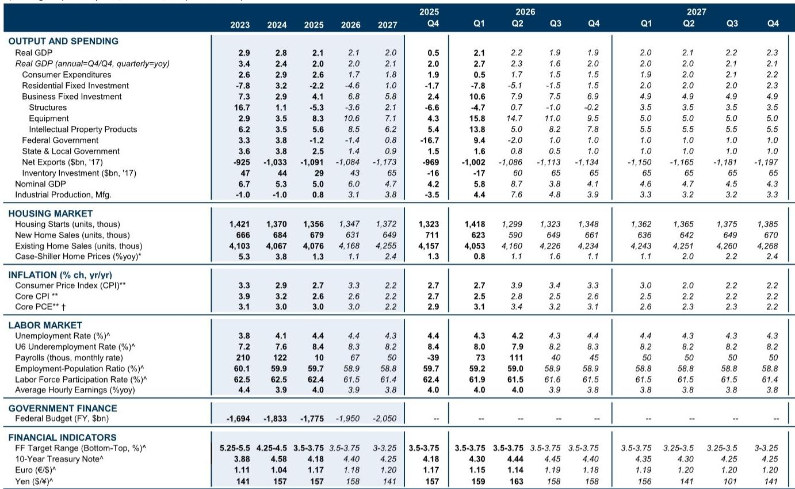
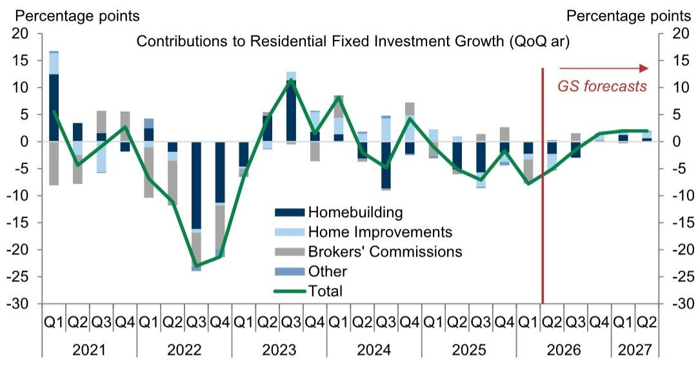

# GS：美联储降息也难救楼市？GS指住房通胀下降缓慢

当市场还在争论利率何时降、降多少时，GS这份年中住房展望给出了一个更值得关注的判断：美国住宅市场已经进入“稳定但仍在调整”的状态，这不是调整，也不是复苏，而是一种由超高利率锁仓效应和结构性供给不足共同塑造的均衡。2026年全年住宅固定研究预计调整3.2%，房价涨幅几乎为零。

这份报告最核心的洞察在于，它把美国楼市拆成了三个彼此独立但又共同指向“低流动性均衡”的板块：成屋销售被锁死、独栋新房建设缓慢降温、多户公寓还在消化存量。三个板块的合力意味着，2026年楼市对宏观环境的影响会减弱，但绝不会成为增长引擎。

> **KC评论：** GS这个判断值得认真对待，因为它不是在预测“好转”或“明显波动”，而是指向一个成交量低、价格横盘、新建活动温和的新常态。对于关注美国宏观路径的读者，这份报告提供了美联储降息之外另一个重要的政策传导渠道——即便降息，楼市也不会快速反弹。

## 1. 锁仓效应是成屋销售最硬的约束，且短期内无解

GS用了一个非常直观的数据来说明问题：目前近80%的按揭贷款人利率低于当前市场利率，近60%的人利率低于市场利率超过2个百分点。这意味着，对于绝大多数房主来说，搬家意味着放弃一个2%或3%的贷款，换上6.4%的新贷款，每月多付数百甚至上千美元。这就是“锁仓效应”的财务逻辑。

GS预计2026年下半年成屋销售年化仅420万套，比2019年低22%。即便到2027年，也只会小幅回升至约430万套。注意，这不是因为需求消失，而是因为供给侧的流动性被冰冻了。

> **KC评论：** 锁仓效应的真正含义是：成屋市场的供给弹性已经接近于零。这对整个住房产业链的影响是深远的——搬家产生的佣金、家具、装修等需求都会被抑制。报告里提到，经纪人佣金占住宅固定研究的15%，这个数字值得读者留意。

## 2. 独栋新房建设：短缺红利正在消退，但尚未逆转

过去几年，独栋新房建设对高利率表现出了惊人的韧性，原因很简单：市场上根本没有足够的二手房可买，买家只能转向新房。但这种支撑正在减弱。GS指出，供需平衡已经改善，建筑商的利润率已回到疫情前水平。

数据上，今年独栋新房开工量预计同比下降2%，全年约92万套，略低于2025年的94万套。虽然相对水平仍比2019年高出4%，但边际趋势是向下的。GS预计到年底开工量会稳定在年化93万套左右——这基本就是当前均衡水平。

这里的关键是，建筑商不再有超额利润驱动扩张，但短缺尚未完全消失，所以也不会大幅削减开工。这是一个“温和降温”而非“急刹车”的状态。

## 3. 移民减少对楼市的影响：需求端打击略大于供给端

报告单独花了一个章节来分析移民减少的影响，这是当前美国楼市讨论中容易被忽略但极其重要的变量。GS用州级法庭数据估算，发现移民减少较多的州，不仅房屋销售和建设更弱，房价涨幅也更低。

结论是：移民减少对需求的抑制略大于对供给的抑制。这似乎有些反直觉，因为建筑行业高度依赖移民劳动力。但GS给出了两个解释：一是短期住房供给缺乏弹性，移民减少不会立刻减少房屋存量；二是过去两年建筑工人短缺已经大幅缓解，劳动力市场对移民减少的敏感度下降。

这个分析的实际含义是：如果移民政策持续收紧，美国楼市将面临一个持续的需求节奏变化不确定性，而这个不确定性不会很快被供给调整所抵消。

## 4. 报告没有完全回答的问题：新租约租金何时传导到官方通胀指标

GS对多户公寓市场的分析很清晰：存量项目还在消化，新开工反弹但低于完工速度，租金空置率上升，新租约租金增速已经降到1%左右。但报告坦诚地指出，官方统计的住房通胀（PCE shelter inflation）并不会很快降到这个水平，因为存量租约的租金调整是渐进的。

GS预计PCE住房通胀从当前的3.2%降到2026年底的2.9%、2027年底的2.2%。这比市场普遍预期更慢，也更温和。但问题在于，如果新租约租金持续仍在调整，官方数据最终必须向市场租金收敛——这个收敛的速度和路径，报告给出了一个预测，但并未完全论证为什么收敛不会更快。

> **KC评论：** 住房通胀是美联储最关注的核心PCE组成部分之一。如果GS是对的，住房通胀的下降将是缓慢的、渐进的，这意味着美联储在降息节奏上仍有理由保持耐心。但如果新租约租金进一步走弱，或者存量租约调整比预期更快，住房通胀的节奏变化可能会加速——这是一个值得持续跟踪的变量。

## 5. 给关注美国宏观的读者一个观察框架

基于GS这份报告，可以建立一个简单的楼市跟踪框架：三个指标，三个节奏。成屋销售看锁仓效应的自然衰减速度（主要取决于按揭利率和借款人还贷进度）；独栋新房开工看建筑商利润率是否已经触底；多户公寓看存量项目消化进度和新租约租金是否企稳。三个指标中，只要有一个出现超预期变化，整个“稳定但仍在调整”的判断就需要重新校准。

报告给出的核心数字值得记住：2026年住宅固定研究预计调整3.2%，全国房价全年涨幅仅0.8%。这不是一个需要恐慌的数字，但也不是一个可以乐观的数字。它描述的是一个成交量被压缩、价格横盘、新建活动温和的新均衡——而这个均衡本身，就是对美联储政策传导路径最真实的检验。

For informational purposes only. Portions may be generated,translated,summarized,or edited with AI assistance based on source materials and may contain omissions or errors. Please verify independently. This is not investment,legal,tax,accounting,or other professional advice.

For informational purposes only. Portions may be generated,translated,summarized,or edited with AI assistance based on source materials and may contain omissions or errors. Please verify independently. This is not investment,legal,tax,accounting,or other professional advice.

