# 美国供应链拥堵追踪

# GS供应链拥堵指数：7月6日当周；指数周环比上升，瓶颈规模维持“2”不变

GS供应链拥堵指数
2026年7月6日当周

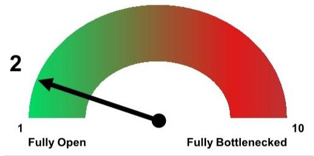

该指数仅基于周度指标，以提供高频数据信号的更细粒度信息；结合周度和月度指标的指数请参见附录

本周周度瓶颈规模维持在“2”，但拥堵指数的相对水平环比温和上升（周环比+8%；图表2）。就本周的指数和规模而言，西海岸等待靠泊卸货的集装箱船数量从1艘增至2艘，而东海岸的积压数量从4艘降至3艘（图表6）。西海岸铁路多式联运量增速较上周放缓（同比+10%，上周为+14%；图表7），而铁路服务指标表现不一。美国港口底盘平均停留时间略有下降（图表9），而海运集装箱运价（中国至美国西海岸）周环比上涨8%，同比上涨82%（图表10）。

图表1：我们的周度综合指数在最近一周有所上升（周环比+7%）；瓶颈规模维持在“2”；整体瓶颈水平仍远低于规模为“10”时的峰值拥堵水平，目前与疫情前流动性水平相当
GS周度瓶颈指数，2020年2月 - 2026年6月

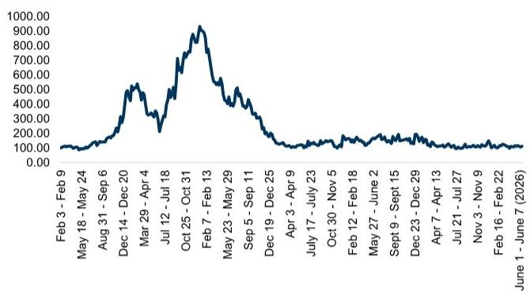  
来源：GS全球研究

图表2：6月平均周度瓶颈得分为2.0；该结果较2021年12月/2022年1月的拥堵峰值显著下降，接近疫情前基线水平

GS周度拥堵规模，按月评分\*

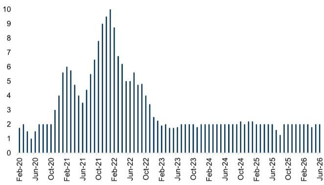  
\*数字反映各月平均周度得分  
来源：GS全球研究

提醒一下（并帮助重申我们构建指数的原因和方式），请参阅图表17后的附录。此外，如需进一步了解所追踪拥堵指标的详细信息，请参阅图表19后的术语表。

## 拥堵持续缓解背景下值得关注的运输子行业

关键问题仍然是关税和地缘政治冲突将对货运需求、时间安排以及全球贸易正常化能力产生何种影响。请参阅我们最新的关税影响追踪报告以获取更多评论。如果供应链压力总体上继续缓解，那么可以预见该指数在2026年可能更稳定地处于“1”区间。

## 指标更新

在我们追踪的指标中（图表3），我们提供了以下周度和月度变量的更新（图表4 - 图表5）。

图表3：追踪的拥堵指标

<table><tr><td colspan="2">追踪指标</td></tr><tr><td>周度变量
等待在洛杉矶/长滩靠泊的集装箱船数量
等待在美国墨西哥湾/东海岸靠泊的集装箱船数量
UNP多式联运量
UNP多式联运速度
UNP多式联运停留时间
BNSF多式联运量
BNSF多式联运速度
BNSF多式联运停留时间
海运运价，东亚至美国西海岸
20英尺集装箱底盘街道停留时间
40/45英尺集装箱底盘街道停留时间
20英尺集装箱底盘码头停留时间
40/45英尺集装箱底盘码头停留时间</td><td>月度变量
集装箱加权平均停留时间（圣佩德罗湾）
停留超过5天的集装箱比例（圣佩德罗湾）
PMI制造业供应商交货时间
“三大”西海岸港口进口重箱量
LMI运输能力
LMI仓储能力
LMI仓储利用率
中国至美国门到门运输天数
8级卡车司机数量增长
铁路集装箱停留时间（圣佩德罗湾）</td></tr></table>

来源：GS全球研究

图表4：本周瓶颈指标与上周相比结果不一

<table><tr><td></td><td>3月23日-3月29日</td><td>3月30日-4月5日</td><td>4月6日-4月12日</td><td>4月13日-4月19日</td><td>4月20日-4月26日</td><td>4月27日-5月3日</td><td>5月4日-5月10日</td><td>5月11日-5月17日</td><td>5月18日-5月24日</td><td>5月25日-5月31日</td><td>6月1日-6月7日</td><td>6月8日-6月14日</td><td>6月10日-6月21日</td><td>6月22日-6月28日</td></tr><tr><td>等待在洛杉矶/长滩靠泊的集装箱船数量</td><td>1</td><td>0</td><td>1</td><td>0</td><td>1</td><td>1</td><td>0</td><td>1</td><td>1</td><td>1</td><td>1</td><td>1</td><td>1</td><td>2</td></tr><tr><td>集装箱船积压（东海岸和墨西哥湾沿岸）*</td><td>5</td><td>4</td><td>4</td><td>1</td><td>2</td><td>2</td><td>4</td><td>5</td><td>4</td><td>5</td><td>5</td><td>3</td><td>4</td><td>3</td></tr><tr><td>UNP多式联运量（同比增速）</td><td>-8.7%</td><td>-9.0%</td><td>-8.2%</td><td>-4.3%</td><td>-2.0%</td><td>-0.3%</td><td>-0.8%</td><td>8.4%</td><td>8.4%</td><td>8.3%</td><td>15.6%</td><td>10.4%</td><td>12.5%</td><td>8.9%</td></tr><tr><td>UNP多式联运速度（同比增速）</td><td>8.5%</td><td>5.0%</td><td>8.3%</td><td>7.4%</td><td>8.3%</td><td>3.9%</td><td>2.5%</td><td>4.2%</td><td>2.9%</td><td>0.0%</td><td>-1.9%</td><td>-2.2%</td><td>-1.6%</td><td>-2.6%</td></tr><tr><td>UNP系统停留时间（小时）</td><td>20.3</td><td>20.1</td><td>19.9</td><td>19.6</td><td>19.4</td><td>20.0</td><td>20</td><td>19.9</td><td>19.5</td><td>19.8</td><td>19.7</td><td>19.4</td><td>19.9</td><td>19.7</td></tr><tr><td>BNSF多式联运量（同比增速）</td><td>1.9%</td><td>2.6%</td><td>2.3%</td><td>5.7%</td><td>4.7%</td><td>7.7%</td><td>7.8%</td><td>9.7%</td><td>18.7%</td><td>11.5%</td><td>15.9%</td><td>11.8%</td><td>14.9%</td><td>11.3%</td></tr><tr><td>BNSF多式联运速度（同比增速）</td><td>3.3%</td><td>-3.1%</td><td>-1.6%</td><td>-2.4%</td><td>-2.1%</td><td>-3.9%</td><td>-0.6%</td><td>-3.7%</td><td>6.9%</td><td>-8.6%</td><td>-10.3%</td><td>-7.2%</td><td>-6.1%</td><td>-5.3%</td></tr><tr><td>BNSF系统停留时间（小时）</td><td>22.6</td><td>22.5</td><td>22.1</td><td>22.7</td><td>22.3</td><td>22.1</td><td>22.3</td><td>23.0</td><td>22.8</td><td>22.6</td><td>22.2</td><td>22.1</td><td>22.4</td><td>22.7</td></tr><tr><td>海运运价，东亚至美国西海岸（同比增速）</td><td>-0.1%</td><td>7.7%</td><td>0.9%</td><td>13.2%</td><td>14.9%</td><td>17.4%</td><td>18.1%</td><td>14.3%</td><td>14.1%</td><td>15.6%</td><td>(11.9%)</td><td>(19.3%)</td><td>2.7%</td><td>82.2%</td></tr><tr><td>20英尺集装箱底盘街道停留时间（天）</td><td>5.3</td><td>4.9</td><td>4.4</td><td>4.2</td><td>5.4</td><td>4.5</td><td>4.2</td><td>4.9</td><td>4.4</td><td>4.7</td><td>4.7</td><td>4.4</td><td>5.1</td><td>4.3</td></tr><tr><td>40/49英尺集装箱底盘街道停留时间（天）</td><td>6.5</td><td>6.9</td><td>5.7</td><td>5.8</td><td>6.0</td><td>5.5</td><td>5.7</td><td>5.6</td><td>5.5</td><td>5.8</td><td>6.2</td><td>6.3</td><td>6.5</td><td>5.9</td></tr><tr><td>20英尺集装箱底盘码头停留时间（天）</td><td>10.6</td><td>10.6</td><td>9.4</td><td>9.1</td><td>11.4</td><td>10.3</td><td>10.2</td><td>11.5</td><td>12.0</td><td>12.4</td><td>10.8</td><td>10</td><td>13.1</td><td>10.3</td></tr><tr><td>40/49英尺集装箱底盘码头停留时间（天）</td><td>7.2</td><td>7.7</td><td>6.3</td><td>6.1</td><td>6.5</td><td>6.2</td><td>6.2</td><td>6.3</td><td>5.5</td><td>5.5</td><td>5.2</td><td>4.9</td><td>5.3</td><td>4.7</td></tr></table>

自2022年3月28日起，我们新增并回溯了东海岸和墨西哥湾沿岸集装箱船积压的估算数据。

来源：南加州海事交易所、AAR、STB、Freightos、Pool of Pools、太平洋商船协会、长滩港、奥克兰港、洛杉矶港、LMI、美国劳工统计局、IHS Markit、Refinitiv Eikon，由GS全球研究汇编

图表5：5月滞后的月度瓶颈指标与4月相比结果不一

<table><tr><td>月度变量</td><td>2025年1月</td><td>2025年2月</td><td>2025年3月</td><td>2025年4月</td><td>2025年5月</td><td>2025年6月</td><td>2025年7月</td><td>2025年8月</td><td>2025年9月</td><td>2025年10月</td><td>2025年11月</td><td>2025年12月</td><td>2026年1月</td><td>2026年2月</td><td>2026年3月</td><td>2026年4月</td><td>2026年5月</td></tr><tr><td>集装箱加权平均停留时间（天）</td><td>3.3</td><td>2.8</td><td>2.8</td><td>2.8</td><td>3.0</td><td>2.6</td><td>2.9</td><td>2.7</td><td>2.8</td><td>2.7</td><td>2.6</td><td>2.5</td><td>2.8</td><td>2.6</td><td>2.6</td><td>2.6</td><td>2.6</td></tr><tr><td>停留超过5天的集装箱比例</td><td>8%</td><td>8%</td><td>8%</td><td>8%</td><td>8%</td><td>8%</td><td>8%</td><td>8%</td><td>8%</td><td>8%</td><td>8%</td><td>8%</td><td>8%</td><td>8%</td><td>8%</td><td>8%</td><td>8%</td></tr><tr><td>铁路集装箱停留时间（天）</td><td>7.1</td><td>8.0</td><td>6.8</td><td>4.7</td><td>4.7</td><td>3.3</td><td>5.2</td><td>5.0</td><td>4.0</td><td>3.3</td><td>3.7</td><td>5.1</td><td>6.1</td><td>5.1</td><td>4.4</td><td>5.1</td><td>5.2</td></tr><tr><td>三大港口进口重箱量（同比）</td><td>23.6%</td><td>5.8%</td><td>11.6%</td><td>9.5%</td><td>-10.0%</td><td>-4.6%</td><td>8.6%</td><td>-2.1%</td><td>-7.3%</td><td>-11.5%</td><td>-9.5%</td><td>-7.1%</td><td>-11.6%</td><td>0.6%</td><td>-2.0%</td><td>-1.0%</td><td>29.6%</td></tr><tr><td>LMI运输能力</td><td>52.6</td><td>55.1</td><td>53.6</td><td>55.2</td><td>54.7</td><td>52.4</td><td>52.6</td><td>57.3</td><td>55.1</td><td>54.5</td><td>50.0</td><td>36.9</td><td>47.1</td><td>41.0</td><td>39.2</td><td>28.4</td><td>31.7</td></tr><tr><td>LMI仓储能力</td><td>51.7</td><td>50.5</td><td>52.3</td><td>55.4</td><td>50.0</td><td>47.8</td><td>51.1</td><td>50.5</td><td>51.6</td><td>52.0</td><td>54.8</td><td>61.2</td><td>50.0</td><td>50.0</td><td>46.0</td><td>45.5</td><td>50.5</td></tr><tr><td>LMI仓储利用率</td><td>68.3</td><td>65.5</td><td>59.7</td><td>60.1</td><td>62.5</td><td>62.2</td><td>59.4</td><td>62.1</td><td>65.3</td><td>56.5</td><td>47.5</td><td>42.9</td><td>54.4</td><td>60.3</td><td>59.8</td><td>64.4</td><td>62.9</td></tr><tr><td>中国至美国门到门运输天数</td><td>50</td><td>51</td><td>54</td><td>49</td><td>48</td><td>50</td><td>46</td><td>44</td><td>46</td><td>47</td><td>47</td><td>47</td><td>47</td><td>47</td><td>47</td><td>47</td><td>47</td></tr><tr><td>8级卡车司机数量</td><td>1493.1</td><td>1487.6</td><td>1491.4</td><td>1490.6</td><td>1487.7</td><td>1482.7</td><td>1482.5</td><td>1480.2</td><td>1472.3</td><td>1472.6</td><td>1467.8</td><td>1467.2</td><td>1465.6</td><td>1465.1</td><td>1464.3</td><td>1469.2</td><td>1464.8</td></tr><tr><td>PMI制造业供应商交货时间（同比）</td><td>0.8</td><td>11.6</td><td>6.1</td><td>6.2</td><td>9.8</td><td>-0.3</td><td>-4.7</td><td>2.3</td><td>10.8</td><td>-0.5</td><td>0.1</td><td>5.5</td><td>-0.4</td><td>4.6</td><td>6.3</td><td>10.7</td><td>8.4</td></tr></table>

来源：南加州海事交易所、AAR、STB、Freightos、Pool of Pools、太平洋商船协会、长滩港、奥克兰港、洛杉矶港、LMI、美国劳工统计局、IHS Markit，由GS全球研究汇编

## 周度指标更新

### 锚泊集装箱船

■ 西海岸集装箱船积压数量在最近一周从1艘增至2艘，而东海岸积压数量从4艘降至3艘。

图表6：本周东/西海岸积压3/2\*艘集装箱船

西海岸与东海岸集装箱船积压数量，周度平均值，2020年2月 - 2026年6月

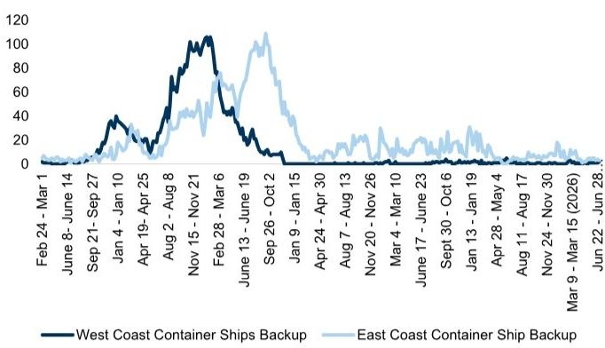  
\*东海岸数据通过卫星数据估算 - 包括在西经100度以东（即墨西哥湾和东海岸）140英里范围内停留超过3天的集装箱船  
来源：南加州海事交易所、Refinitiv Eikon、GS全球研究

### 铁路多式联运趋势

西海岸一级铁路（联合太平洋和伯灵顿北方圣太菲）的平均多式联运量增速放缓至上周的+10%，与前一周的+10%持平。

☐ BNSF多式联运量本周同比+11%，上周为同比+15%；UNP多式联运量本周同比+8.9%，上周为同比+13%。

☐ 参见图表7中BNSF/UNP的平均增长趋势。

图表7：西海岸一级铁路多式联运量增长，第1周 - 第52周同比百分比增长  
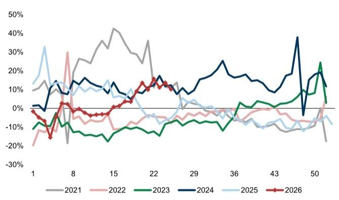  
来源：AAR，数据由GS全球研究汇编

图表8：西海岸多式联运车皮增长（UNP和BNSF）6月平均同比约+13%
西海岸一级铁路多式联运量同比百分比增长  
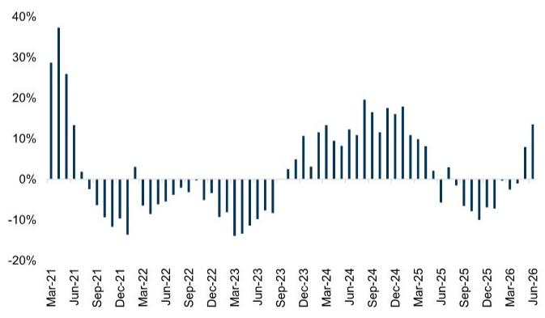  
来源：AAR，数据由GS全球研究汇编

■ 西海岸一级铁路的终端停留时间和多式联运列车速度在最近一周表现不一（详情如下）。

☐ UNP终端停留时间从19.9小时降至19.7小时；BNSF停留时间从22.4小时升至22.7小时。

☐ 多式联运列车速度方面，BNSF同比-5.3%，上周为同比-6.1%；UNP同比-2.6%，上周为同比-1.6%。

### 底盘停留时间

\- 与峰值拥堵水平相比，6月的底盘停留时间显著下降——如图表9所示；最近一周的停留时间数据较上周有所改善。

☐ 2026年第26周，20英尺集装箱底盘的街道平均停留时间为4.3天，低于前一周的5.1天。

☐ 40/45英尺集装箱底盘的街道停留时间为5.9天，低于前一周的6.5天。

☐ 20/40英尺集装箱底盘的码头停留时间为10.3/4.7天，前一周为11.1/5.3天。

图表9：更常见的20英尺集装箱底盘的停留时间已远低于峰值拥堵水平
底盘街道停留时间（20英尺集装箱）  
  
停留时间以天为单位

### 海运运价

前一周海运集装箱运价约为6180美元（同比+82%），高于前一周的约5740美元（同比+2.7%）。

图表10：海运集装箱运价，中国/东亚至北美西海岸  
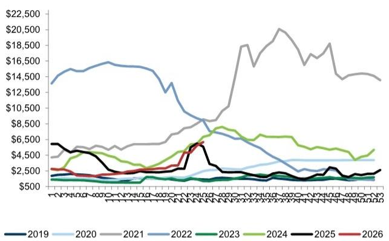  
运价为每FEU（40英尺标准箱）美元  
来源：FBX

## 滞后的月度指标（5月数据）

### 圣佩德罗湾集装箱停留时间

\- 5月集装箱加权平均停留时间约为2.6天，与4月的约2.6天持平。

5月铁路集装箱停留时间为5.2天，高于4月的5.1天；该结果仍远低于2022年约16天的峰值铁路集装箱停留时间。

图表11：圣佩德罗湾集装箱加权平均停留时间（天）  
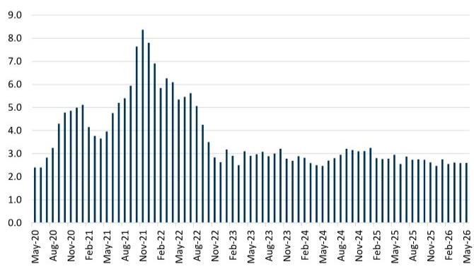  
来源：太平洋商船协会

图表12：停留超过5天的集装箱比例  
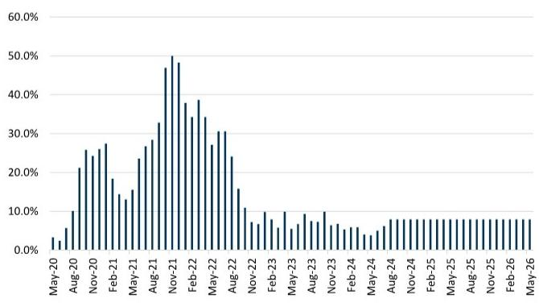  
来源：太平洋商船协会

图表13：铁路集装箱停留时间（天）  
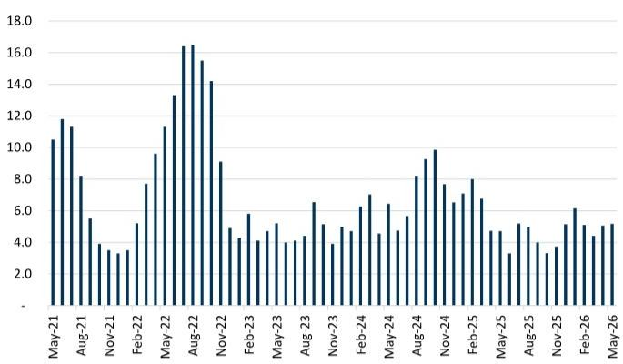  
来源：太平洋商船协会

### “三大”西海岸港口进口重箱量

■ 4月洛杉矶、长滩和奥克兰港口的进口重箱总量同比+30%。请参阅我们的三大港口报告。

图表14：4月西海岸港口进口重箱量同比+30%  
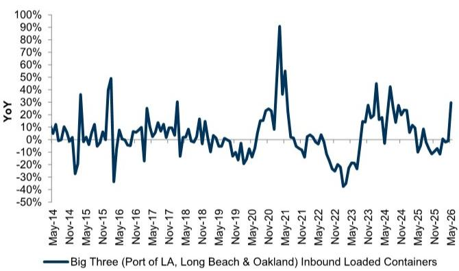  
来源：长滩港、洛杉矶港、奥克兰港

### 中国至美国门到门运输

10月从中国到美国的平均门到门运输时间为47天，与峰值拥堵时的80多天相比，已更接近疫情前的平均运输时间，且与9月的46天相比基本持平。为更新指数，我们假设11月至4月的运输时间保持不变（因数据提供商更新有限）。

图表15：中国至美国门到门运输天数

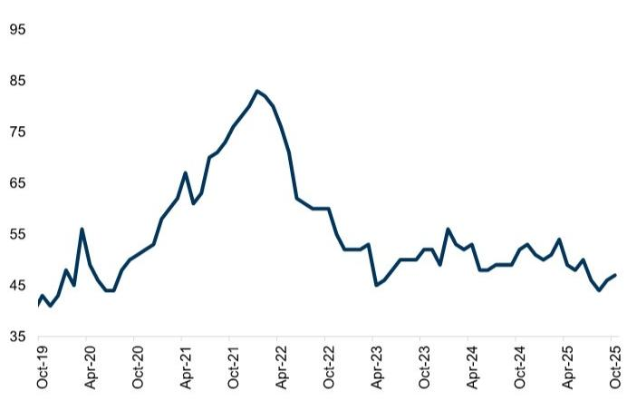  
来源：Freightos

### 卡车运输从业人数

5月卡车运输从业人数低于疫情前高点（较疫情前低7.8%）；过去六个月同比增速平均为-1.7%。5月从业人数环比-0.3%。

图表16：卡车运输从业总人数，经季节性调整

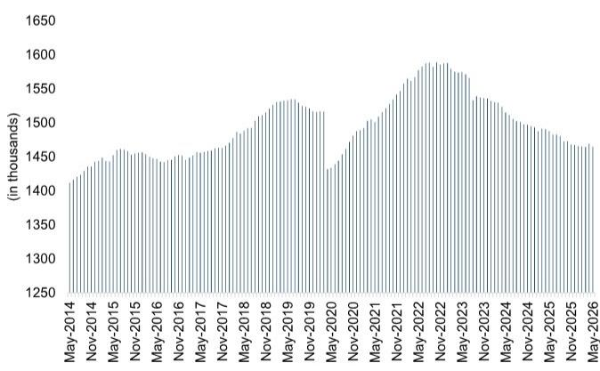  
来源：美国劳工统计局

### LMI能力与利用率

■ LMI运输能力指数

5月运输能力以较慢速度收缩，读数为31.7；该读数较4月的28.4有所上升（表明能力收缩速度放缓）。

## ■ LMI仓储能力指数

□ 5月仓储能力有所扩张，读数为50.5；该结果高于4月（表明整体可用仓储能力增加）。

## ■ LMI仓储利用率指数

□ 5月仓储利用率以较慢速度扩张（62.9，4月为64.4）。

### PMI供应商交货时间

\- 5月交货时间有所扩张（即低于50表示交货时间扩张），读数为41.4；5月供应商交货PMI指数同比+8.4%。

图表17：PMI：制造业供应商交货时间，同比，经季节性调整  
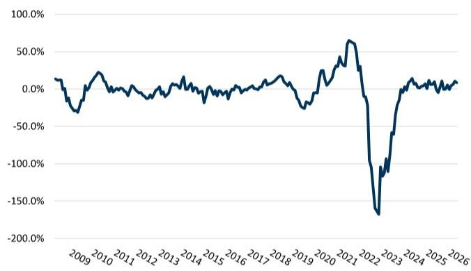  
来源：IHS Markit

## 附录

鉴于供应链流动性对零售商、消费品公司、通胀定价等方面的重要性，我们认为该指数的意义最直接地体现在供应链拥堵改善的速度上。为此，我们考察了多种变量，这些变量我们认为直接或间接地与整体拥堵相关；包括锚泊船只、交货天数、各种停留时间、多式联运量和速度统计等。通过汇总这些数据，我们创建了供应链拥堵指数——试图量化供应链在“完全瓶颈”和“完全畅通”之间的平衡状态，相对于我们选择的疫情前基准（2020年2月3日）。基本上，就是衡量整体运输物流网络的流动性。

为确定传统拥堵指数（1-10）的位置，我们计算每个类别（月度与周度变量）相对于拥堵前水平的变化，对某些我们认为与供应链瓶颈最直接相关的类别（如洛杉矶和长滩港口锚泊船只、集装箱和底盘街道停留时间、中国至美国门到门运输天数）给予更高权重，并根据我们的综合指数（图表19）进行缩放。

我们在周一晚间/周二早间发布周度指数，以传递前沿数据，这些数据将为大约滞后一个月的综合指数提供信息（即我们将每周更新周度指数，传统指数将每月更新）。从两个图表来看，周度综合指数通常应能较好地预测月度综合指数的最终方向（月度综合指数包含比纯周度变量更全面的变量，以提供对拥堵方向的强有力确认），图表18中相似的R^2值也证实了这一点。

图表18：周度综合指数（浅蓝色）领先于月度指数（深蓝色）；预计未来月度更新将确认近期周度趋势  
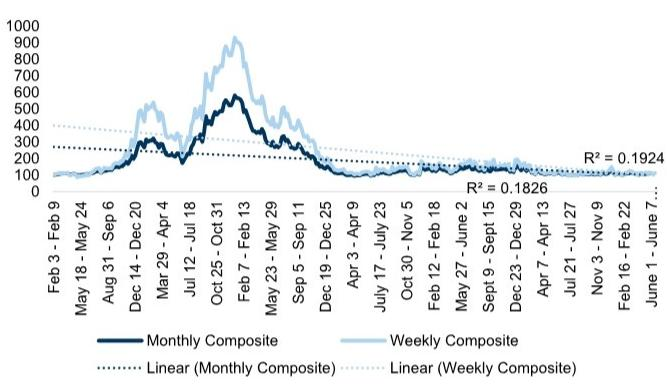  
来源：GS全球研究

图表19：我们的综合指数5月平均值为“108”，表明瓶颈得分为“2”，但若考虑所有指标（周度和月度综合），则接近“1”
周度+月度综合拥堵指数\*  
GS综合供应链拥堵指数，月度数据更新至4月  
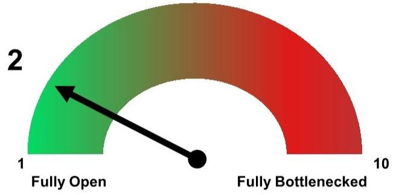  
\*我们于2022年3月28日重新调整了指数，以考虑高于预期的峰值瓶颈水平  
来源：GS全球研究

图表20：GS传统供应链拥堵指数（包含月度与周度数据）

<table><tr><td>综合指数</td><td>流动性指数</td></tr><tr><td><101</td><td>1</td></tr><tr><td>101-153</td><td>2</td></tr><tr><td>154-206</td><td>3</td></tr><tr><td>207-259</td><td>4</td></tr><tr><td>260-313</td><td>5</td></tr><tr><td>314-366</td><td>6</td></tr><tr><td>367-419</td><td>7</td></tr><tr><td>420-472</td><td>8</td></tr><tr><td>473-526</td><td>9</td></tr><tr><td>>526</td><td>10</td></tr></table>

来源：GS全球研究

图表21：GS周度供应链拥堵指数（高频数据）

<table><tr><td>综合指数</td><td>流动性指数</td></tr><tr><td><101</td><td>1</td></tr><tr><td>101-192</td><td>2</td></tr><tr><td>193-284</td><td>3</td></tr><tr><td>285-376</td><td>4</td></tr><tr><td>377-468</td><td>5</td></tr><tr><td>469-560</td><td>6</td></tr><tr><td>561-652</td><td>7</td></tr><tr><td>653-745</td><td>8</td></tr><tr><td>746-837</td><td>9</td></tr><tr><td>>838</td><td>10</td></tr></table>

来源：GS全球研究

## 术语表：

1. 西海岸集装箱船积压：追踪等待在洛杉矶和长滩港口靠泊的集装箱船数量；我们将锚泊在海岸40英里范围内的船只数量与慢速航行至港口的船只数量（即在更远海域徘徊的船只）相加，以更准确地反映真实的集装箱船积压情况。

2. 东海岸集装箱船积压：估算等待在美国东海岸和墨西哥湾沿岸港口靠泊的集装箱船数量；基于卫星图像数据技术（Eikon），我们将在美国港口140英里范围内停留至少三天的集装箱船数量相加（考虑西经100度以东的船只，以涵盖东海岸）。

3. 多式联运量：追踪西海岸一级铁路（BNSF和UNP）的多式联运车皮量同比增速。在我们的分析中，增速加快表明供应链流动性增强，因为更多货物通过系统运输。

4. 多式联运速度：追踪多式联运铁路车辆的平均速度（BNSF和UNP）。

5. 多式联运停留时间：追踪多式联运铁路车辆闲置的平均小时数（即车辆在终端等待的时间）。

6. 底盘停留时间：指底盘在码头和街道上等待的平均时间。

7. 铁路集装箱停留时间：指集装箱从海运船舶卸载后，在铁路设施等待发运的天数。

8. 集装箱加权平均停留时间：指集装箱从海运船舶卸载并由卡车运离码头后，在码头停留的天数。

9. 海运运价：指通过海运运输一个集装箱的平均成本；我们具体追踪从东亚到美国西海岸的运价，使用Freightos的FBX01指数。

10. 三大西海岸港口进口重箱量：指三大西海岸港口（洛杉矶、长滩和奥克兰）进口重箱量的同比增速（即与去年同期相比，通过港口的货物量增加了多少）。

11. PMI制造业供应商交货时间指数：读数为50表示交货时间与上月相比无变化；读数高于50表示交货时间改善（供应链加快）；读数低于50表示交货时间环比恶化（供应链延迟）。该指数源于IHS Markit的PMI商业调查，询问采购经理：“与一个月前相比，您的供应商交货时间是更慢、更快还是没有变化？”

12. 中国至美国门到门运输时间：源自Freightos，该指标追踪从订单下达并接受后，货物到达最终目的地所需的平均天数（即门到门运输不一定是港到港，因为它还包含从港口到最终目的地的运输时间）。

GS Data Works利用另类数据源和先进分析技术，在全球研究范围内创建独特的数据驱动洞察。GS Data Works分析（东海岸集装箱船积压估算）由Dan Duggan博士、Aditi Singh和Parag Agrawal提供。

## 披露附录

## Reg AC

我们，Jordan Alliger、Andrzej Tomczyk（CFA）和Paul Stoddard，特此证明本报告中表达的所有观点准确反映了我们个人对相关公司及其证券的看法。我们还证明，我们的薪酬中没有任何部分直接或间接与本次报告中表达的具体建议或观点相关。

除非另有说明，本报告封面所列人员为GS全球研究部分析师。

撰稿作者：Jordan Alliger GS & Co. LLC、Andrzej Tomczyk（CFA）GS & Co. LLC、Paul Stoddard GS & Co. LLC。

除非另有说明，本报告撰稿作者披露中列出的个人为GS全球研究部分析师。

## GS因子概况

GS因子概况通过将股票的关键属性与市场（即我们评级的股票池）及其行业同行进行比较，为股票提供背景信息。所描绘的四个关键属性是：增长、财务回报、倍数（如估值）和综合（增长、财务回报和倍数的综合）。增长、财务回报和倍数通过计算每只股票特定指标的标准化排名得出。然后将各指标的标准化排名进行平均，并转换为相关属性的百分位数。每个指标的具体计算可能因财年、行业和地区而异，但标准方法如下：

增长基于股票
