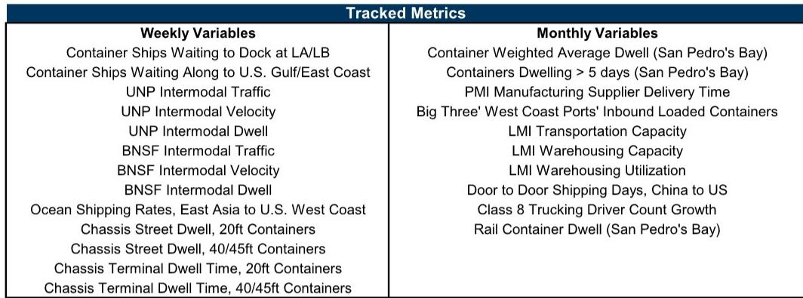
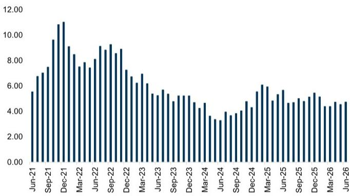

# GS：运价同比涨82%背后，GS分析美国供应链新常态与政策变量

这份GS最新发布的供应链拥堵追踪报告，传递了一个清晰但容易被忽视的信号。截至2026年7月6日，其周度瓶颈指数环比上升了8%，但瓶颈等级连续多周维持在“2”这个低位。这与2021年底至2022年初峰值时期的“10”相比，几乎可以忽略不计。报告的核心判断是：美国供应链的物理拥堵已经基本消散，接近疫情前的基线水平。但与此同时，从东亚到美国西海岸的海运运价同比飙升了82%，这一背离值得关注。

供应链从“堵”到“通”的转变，并不意味着成本不确定性自动消失。运价的独立上涨，暗示着关税、地缘政治冲突以及需求结构的变化，正在重塑全球贸易的成本分布。对于依赖跨洋运输的产业决策者而言，理解这一结构性脱钩，比单纯盯着港口积压的船数更有意义。

## 1. 港口与铁路的“解压”已基本完成，瓶颈迁移至定价环节

报告中的多项高频指标显示，物理层面的拥堵正在快速消退。西海岸等待卸货的集装箱船从上周的1艘增至2艘，但东海岸的积压从4艘降至3艘，整体仍处于低位。铁路多式联运方面，UNP和BNSF两大铁路公司的运量同比增速虽有节奏变化，但相对水平依然健康。底盘车停留时间在主要港口普遍下降，20英尺集装箱的街道停留时间已从峰值显著回落至4.3天。

> **KC评论：** 这些数据共同指向一个结论——港口和铁路的“消化能力”已经恢复。2021-2022年那种船等码头、货等车皮的局面不再。但“不堵”不等于“便宜”。运价飙升说明，当前的供应链不确定性已经从物理瓶颈转移到了定价博弈阶段，关税和地缘政治是新的变量。

## 2. 运价同比涨82%，是关税冲击的提前定价还是需求脉冲？

报告中最具冲击力的数据来自海运运价：中国/东亚至美国西海岸的集装箱运价已达到约6180美元/FEU，同比上涨82%。这一涨幅远超同期港口拥堵指标的变化。GS在报告中明确提问，关税和地缘政治冲突将对货运需求与贸易常态化的节奏产生何种影响。运价的飙升，很可能反映了市场在为潜在的关税调整提前定价，也可能是进口商在抢运订单。

这一信号对零售、消费品和制造业公司意味着，即使物流时效恢复，成本端的不确定性并未降低。企业需要重新评估库存策略和采购合同的定价条款，而不是简单假设“拥堵缓解就等于运费回落”。

## 3. 报告没有完全回答的：运价何时见顶以及关税的传导路径

GS的报告在数据层面非常扎实，但其自身也承认，对未来走势的判断仍取决于关税政策的演变。目前可以观察到的是，运价已在高位，但月度指标（如PMI供应商交付时间、仓储利用率）并未显示出同步的紧张。这意味着运价上涨的可持续性存疑。报告提到了“关税影响追踪器”，但并未在本期内容中给出明确的量化结论。对于读者而言，需要重点关注后续报告是否会更新关于关税落地后对货运流量的实际影响。

## 4. 观察框架：从“拥堵指数”转向“运价-需求-关税”三角

这份报告给产业决策者提供了一个新的观察框架。过去两年，大家习惯了用港口积压船数、卡车司机缺口等“量”的指标来判断供应链紧张程度。但现在，GS的数据表明，这些“量”的指标已经恢复常态。真正需要跟踪的，是“价”的指标（运价）与“政策”变量（关税）之间的互动。当运价与物理拥堵脱钩时，成本管理的重心应从物流操作转向贸易合规和采购策略的调整。

For informational purposes only. Portions may be generated,translated,summarized,or edited with AI assistance based on source materials and may contain omissions or errors. Please verify independently. This is not investment,legal,tax,accounting,or other professional advice.

For informational purposes only. Portions may be generated,translated,summarized,or edited with AI assistance based on source materials and may contain omissions or errors. Please verify independently. This is not investment,legal,tax,accounting,or other professional advice.

