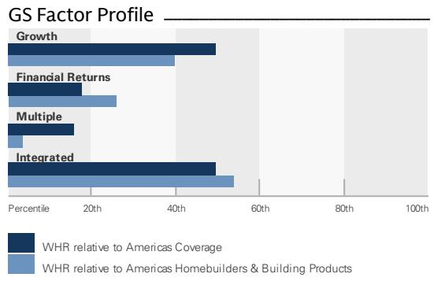
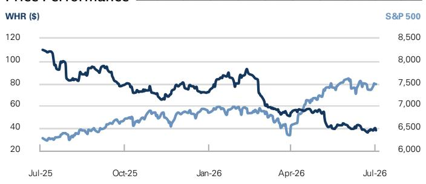
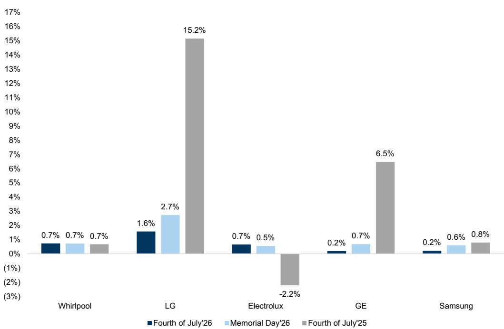

# Whirlpool Corp. (WHR)

Appliances: Fourth of July 2026 Pricing Update

WHR

12m Price Target: \$53.00

Price: \$38.10

Upside: 39.1%

Net Price Up Sequentially and YOY as OEMs Show Greater Discipline: To better assess the competitive environment around the Fourth of July we scanned appliance pricing across three retailers and five major manufacturers. Overall, we found net industry pricing up 702bps YOY, vs +508bps over Memorial Day and +199bps over Presidents' Day, as manufacturers look to offset rising costs including commodity and freight inflation along with Section 232 tariffs. This includes a 43bps contraction in discounts vs Memorial Day to 21%, down 473bps YOY, with a 693bps delta between producers. LG was the most promotional at 25% while Electrolux and Whirlpool both trailed at 18%. We note Whirlpool saw the largest sequential decline vs Memorial Day at 162bps—230bps below the group average—and down 238bps YOY. Notably, the range of discounts between categories narrowed relative to prior sales events with washers at 23% vs more discretionary products including ranges and dishwashers at 22%. Our findings come as Whirlpool implemented a 10% promotional increase on April 17 and a 4% list price increase effective July 9. This compares to a 0.7% list price increase for WHR over this holiday, though we see a path to upside as these efforts come through supported by similar actions from peers. Our channel checks also suggest a move towards a shorter promotional period. As such, we expect net pricing to further expand in the coming months. Given ongoing demand headwinds, we model North America industry shipments down 4% in 2026. We expect the loss of operating leverage along with higher input costs and tariff headwinds to drive Whirlpool's 2Q26 North America major domestic appliance segment operating margin down 370bps YOY to 2.2% with the full-year off 128bps to 3.6%.

List Price Increases Driven by Newer SKUs: On average, list prices grew 0.7% compared to +4.1% a year ago and +1.0% YOY at Memorial Day. The YOY gain was led by LG up an average of 1.6% with 12% of SKUs higher while GE and Samsung rose an average of

## NEUTRAL

Susan Maklari
+1(212)357-3906 | susan.maklari@gs.com
GS & Co. LLC

Charles Perron-Piche, CFA
+1(917)343-1847 | charles.perron-piche@gs.com
GS & Co. LLC

Rhea Bhatia
+1(332)245-7517 | rhea.bhatia@gs.com
GS India SPL

## Key Data

Market cap: \$2.3bn  
Enterprise value: \$6.9bn  
3m ADTV: \$129.6mn  
United States  
Americas Homebuilders & Building Products  
M&A Rank: 3

GS Forecast

<table><tr><td colspan="5">GS Forecast</td></tr><tr><td></td><td>12/25</td><td>12/26E</td><td>12/27E</td><td>12/28E</td></tr><tr><td>Revenue ($ mn)</td><td>15,524.5</td><td>14,972.7</td><td>15,519.4</td><td>15,942.7</td></tr><tr><td>EBITDA ($ mn)</td><td>1,066.4</td><td>1,018.8</td><td>1,229.9</td><td>1,352.6</td></tr><tr><td>EBIT ($ mn)</td><td>728.4</td><td>613.1</td><td>803.1</td><td>908.3</td></tr><tr><td>EPS ($)</td><td>6.23</td><td>3.15</td><td>5.40</td><td>7.00</td></tr><tr><td>P/E (X)</td><td>14.2</td><td>12.1</td><td>7.1</td><td>5.4</td></tr><tr><td>EV/EBITDA (X)</td><td>10.2</td><td>7.0</td><td>5.5</td><td>4.6</td></tr><tr><td>FCF yield (%)</td><td>1.6</td><td>12.9</td><td>17.1</td><td>20.7</td></tr><tr><td>Dividend yield (%)</td><td>6.0</td><td>2.4</td><td>0.0</td><td>0.0</td></tr><tr><td>Net debt/EBITDA (X)</td><td>5.5</td><td>4.6</td><td>3.5</td><td>2.8</td></tr><tr><td></td><td>3/26</td><td>6/26E</td><td>9/26E</td><td>12/26E</td></tr><tr><td>EPS ($)</td><td>(0.56)</td><td>0.10</td><td>1.64</td><td>1.97</td></tr></table>

GS Factor Profile

  
Source: Company data, GS estimates. See disclosures for details.

## Whirlpool Corp. (WHR)

Rating since May 14, 2026

Ratios & Valuation

<table><tr><td></td><td>12/25</td><td>12/26E</td><td>12/27E</td><td>12/28E</td></tr><tr><td>P/E (X)</td><td>14.2</td><td>12.1</td><td>7.1</td><td>5.4</td></tr><tr><td>EV/EBITDA (X)</td><td>10.2</td><td>7.0</td><td>5.5</td><td>4.6</td></tr><tr><td>EV/sales (X)</td><td>0.7</td><td>0.5</td><td>0.4</td><td>0.4</td></tr><tr><td>FCF yield (%)</td><td>1.6</td><td>12.9</td><td>17.1</td><td>20.7</td></tr><tr><td>EV/DACF (X)</td><td>12.7</td><td>9.5</td><td>7.4</td><td>6.2</td></tr><tr><td>CROCI (%)</td><td>7.2</td><td>6.4</td><td>7.7</td><td>8.4</td></tr><tr><td>ROE (%)</td><td>11.8</td><td>4.2</td><td>8.5</td><td>10.0</td></tr><tr><td>Net debt/EBITDA (X)</td><td>5.5</td><td>4.6</td><td>3.5</td><td>2.8</td></tr><tr><td>Net debt/equity (%)</td><td>215.5</td><td>115.8</td><td>98.1</td><td>79.3</td></tr><tr><td>Interest cover (X)</td><td>2.5</td><td>1.7</td><td>2.7</td><td>3.5</td></tr><tr><td>Inventory days</td><td>60.3</td><td>61.4</td><td>56.7</td><td>56.7</td></tr><tr><td>Receivable days</td><td>30.5</td><td>28.7</td><td>25.5</td><td>25.2</td></tr><tr><td>Days payable outstanding</td><td>100.5</td><td>103.1</td><td>100.6</td><td>101.1</td></tr></table>

<table><tr><td colspan="5">Growth &amp; Margins (%)</td></tr><tr><td></td><td>12/25</td><td>12/26E</td><td>12/27E</td><td>12/28E</td></tr><tr><td>Total revenue growth</td><td>(6.5)</td><td>(3.6)</td><td>3.7</td><td>2.7</td></tr><tr><td>EBITDA growth</td><td>(12.6)</td><td>(4.5)</td><td>20.7</td><td>10.0</td></tr><tr><td>EPS growth</td><td>(49.0)</td><td>(49.3)</td><td>71.3</td><td>29.6</td></tr><tr><td>DPS growth</td><td>(24.3)</td><td>(83.0)</td><td>(100.0)</td><td>NM</td></tr><tr><td>Gross margin</td><td>15.4</td><td>14.1</td><td>15.3</td><td>15.7</td></tr><tr><td>EBIT margin</td><td>5.4</td><td>3.4</td><td>5.2</td><td>5.7</td></tr></table>

Price Performance

Balance Sheet (\$ mn)

<table><tr><td colspan="5">Balance Sheet ($ mn)</td></tr><tr><td></td><td>12/25</td><td>12/26E</td><td>12/27E</td><td>12/28E</td></tr><tr><td>Cash &amp; cash equivalents</td><td>669.0</td><td>703.4</td><td>917.9</td><td>804.1</td></tr><tr><td>Accounts receivable</td><td>1,276.0</td><td>1,080.9</td><td>1,086.4</td><td>1,116.0</td></tr><tr><td>Inventory</td><td>2,307.4</td><td>2,018.5</td><td>2,062.9</td><td>2,109.3</td></tr><tr><td>Other current assets</td><td>671.6</td><td>944.0</td><td>944.0</td><td>944.0</td></tr><tr><td>Total current assets</td><td>4,924.0</td><td>4,746.8</td><td>5,011.2</td><td>4,973.4</td></tr><tr><td>Net PP&amp;E</td><td>2,194.0</td><td>2,400.3</td><td>2,498.5</td><td>2,554.2</td></tr><tr><td>Net intangibles</td><td>5,666.0</td><td>5,660.0</td><td>5,660.0</td><td>5,660.0</td></tr><tr><td>Total investments</td><td>0.0</td><td>0.0</td><td>0.0</td><td>0.0</td></tr><tr><td>Other long-term assets</td><td>3,217.0</td><td>3,225.5</td><td>3,173.2</td><td>3,105.8</td></tr><tr><td>Total assets</td><td>16,001.0</td><td>16,032.6</td><td>16,342.9</td><td>16,293.4</td></tr><tr><td>Accounts payable</td><td>3,704.0</td><td>3,561.3</td><td>3,679.1</td><td>3,761.8</td></tr><tr><td>Short-term debt</td><td>937.0</td><td>689.6</td><td>1,189.6</td><td>1,189.6</td></tr><tr><td>Current lease liabilities</td><td>-</td><td>-</td><td>-</td><td>-</td></tr><tr><td>Other current liabilities</td><td>1,872.0</td><td>1,918.2</td><td>1,950.3</td><td>1,969.6</td></tr><tr><td>Total current liabilities</td><td>6,513.0</td><td>6,169.1</td><td>6,819.0</td><td>6,921.1</td></tr><tr><td>Long-term debt</td><td>5,583.0</td><td>4,664.4</td><td>3,994.4</td><td>3,406.4</td></tr><tr><td>Non-current lease liabilities</td><td>692.0</td><td>692.0</td><td>692.0</td><td>692.0</td></tr><tr><td>Other long-term liabilities</td><td>498.0</td><td>489.6</td><td>489.6</td><td>489.6</td></tr><tr><td>Total long-term liabilities</td><td>6,773.0</td><td>5,846.0</td><td>5,176.0</td><td>4,588.0</td></tr><tr><td>Total liabilities</td><td>13,286.0</td><td>12,015.1</td><td>11,995.0</td><td>11,509.1</td></tr><tr><td>Preferred shares</td><td>-</td><td>-</td><td>-</td><td>-</td></tr><tr><td>Total common equity</td><td>2,726.0</td><td>4,028.5</td><td>4,358.9</td><td>4,795.3</td></tr><tr><td>Minority interest</td><td>(11.0)</td><td>(11.0)</td><td>(11.0)</td><td>(11.0)</td></tr><tr><td>Total liabilities &amp; equity</td><td>16,001.0</td><td>16,032.6</td><td>16,342.9</td><td>16,293.4</td></tr><tr><td>BVPS ($)</td><td>48.27</td><td>62.60</td><td>66.18</td><td>72.82</td></tr></table>

<table><tr><td></td><td>3m</td><td>6m</td><td>12m</td></tr><tr><td>Absolute</td><td>(31.3)%</td><td>(48.9)%</td><td>(65.5)%</td></tr><tr><td>Rel. to the S&amp;P 500</td><td>(39.6)%</td><td>(53.1)%</td><td>(71.3)%</td></tr></table>

Source: FactSet. Price as of 2 Jul 2026 close.

Income Statement (\$ mn)

<table><tr><td colspan="5">Income Statement ($ mn)</td></tr><tr><td></td><td>12/25</td><td>12/26E</td><td>12/27E</td><td>12/28E</td></tr><tr><td>Total revenue</td><td>15,524.5</td><td>14,972.7</td><td>15,519.4</td><td>15,942.7</td></tr><tr><td>Cost of goods sold</td><td>(13,138.4)</td><td>(12,856.5)</td><td>(13,139.8)</td><td>(13,435.2)</td></tr><tr><td>SG&amp;A</td><td>(1,633.1)</td><td>(1,552.1)</td><td>(1,579.5)</td><td>(1,594.3)</td></tr><tr><td>R&amp;D</td><td>-</td><td>-</td><td>-</td><td>-</td></tr><tr><td>Other operating inc./(exp.)</td><td>83.1</td><td>(56.0)</td><td>-</td><td>-</td></tr><tr><td>EBITDA</td><td>1,066.4</td><td>1,018.8</td><td>1,229.9</td><td>1,352.6</td></tr><tr><td>Depreciation &amp; amortization</td><td>(338.0)</td><td>(405.7)</td><td>(426.8)</td><td>(444.3)</td></tr><tr><td>EBIT</td><td>836.1</td><td>508.1</td><td>800.1</td><td>913.3</td></tr><tr><td>Net interest inc./(exp.)</td><td>(319.8)</td><td>(284.0)</td><td>(277.5)</td><td>(238.7)</td></tr><tr><td>Income/(loss) from associates</td><td>-</td><td>-</td><td>-</td><td>-</td></tr><tr><td>Pre-tax profit</td><td>516.3</td><td>224.2</td><td>522.6</td><td>674.6</td></tr><tr><td>Provision for taxes</td><td>(141.9)</td><td>(55.4)</td><td>(130.7)</td><td>(168.7)</td></tr><tr><td>Minority interest</td><td>(56.6)</td><td>(26.3)</td><td>(37.0)</td><td>(46.0)</td></tr><tr><td>Preferred dividends</td><td>-</td><td>-</td><td>-</td><td>-</td></tr><tr><td>Net inc. (pre-exceptionals)</td><td>317.8</td><td>142.5</td><td>355.0</td><td>460.0</td></tr><tr><td>Net inc. (post-exceptionals)</td><td>350.2</td><td>202.4</td><td>355.0</td><td>460.0</td></tr><tr><td>EPS (basic, pre-except) ($)</td><td>5.65</td><td>2.22</td><td>5.40</td><td>7.00</td></tr><tr><td>EPS (diluted, pre-except) ($)</td><td>5.65</td><td>2.22</td><td>5.40</td><td>7.00</td></tr><tr><td>EPS (ex-ESO exp., dil.) ($)</td><td>--</td><td>--</td><td>--</td><td>--</td></tr><tr><td>DPS ($)</td><td>5.30</td><td>0.90</td><td>0.00</td><td>0.00</td></tr><tr><td>Div. payout ratio (%)</td><td>93.8</td><td>40.5</td><td>0.0</td><td>0.0</td></tr><tr><td>Wtd avg shares out. (basic) (mn)</td><td>56.3</td><td>64.2</td><td>65.7</td><td>65.7</td></tr><tr><td>Wtd avg shares out. (diluted) (mn)</td><td>56.3</td><td>64.2</td><td>65.7</td><td>65.7</td></tr></table>

<table><tr><td colspan="5">Cash Flow ($ mn)</td></tr><tr><td></td><td>12/25</td><td>12/26E</td><td>12/27E</td><td>12/28E</td></tr><tr><td>Net income</td><td>341.0</td><td>197.0</td><td>375.0</td><td>481.0</td></tr><tr><td>D&amp;A add-back</td><td>338.0</td><td>405.7</td><td>426.8</td><td>444.3</td></tr><tr><td>Minority interest add-back</td><td>-</td><td>-</td><td>-</td><td>-</td></tr><tr><td>Net (inc)/dec working capital</td><td>(209.0)</td><td>111.2</td><td>152.3</td><td>93.5</td></tr><tr><td>Others</td><td>(3.0)</td><td>0.0</td><td>0.0</td><td>25.0</td></tr><tr><td>Cash flow from operations</td><td>467.0</td><td>713.9</td><td>954.1</td><td>1,043.8</td></tr><tr><td>Capital expenditures</td><td>(389.0)</td><td>(398.0)</td><td>(525.0)</td><td>(525.0)</td></tr><tr><td>Acquisitions</td><td>-</td><td>-</td><td>-</td><td>-</td></tr><tr><td>Divestitures</td><td>198.0</td><td>-</td><td>-</td><td>-</td></tr><tr><td>Others</td><td>(315.0)</td><td>(157.0)</td><td>-</td><td>-</td></tr><tr><td>Cash flow from investing</td><td>(506.0)</td><td>(555.0)</td><td>(525.0)</td><td>(525.0)</td></tr><tr><td>Dividends paid</td><td>(299.4)</td><td>(91.5)</td><td>(44.6)</td><td>(44.6)</td></tr><tr><td>Share issuance/(repurchase)</td><td>-</td><td>524.0</td><td>-</td><td>-</td></tr><tr><td>Inc/(dec) in debt</td><td>(310.5)</td><td>(1,140.0)</td><td>(170.0)</td><td>(588.0)</td></tr><tr><td>Others</td><td>42.9</td><td>583.0</td><td>-</td><td>-</td></tr><tr><td>Cash flow from financing</td><td>(567.0)</td><td>(124.5)</td><td>(214.6)</td><td>(632.6)</td></tr><tr><td>Total cash flow</td><td>(606.0)</td><td>34.4</td><td>214.5</td><td>(113.8)</td></tr><tr><td>Free cash flow</td><td>78.0</td><td>315.9</td><td>429.1</td><td>518.8</td></tr><tr><td>Free cash flow per share (basic) ($)</td><td>1.39</td><td>4.92</td><td>6.53</td><td>7.90</td></tr></table>

Source: Company data, GS estimates.

0.2% with declines across 19% and 15% of items, respectively. On a two-year stack, industry prices rose 4.8% vs 4.5% at Memorial Day with 11% of SKUs higher YOY vs 40% a year ago. Growth continues to be led by new products as manufacturers and retailers look to stimulate demand. In turn, we see potential upside as these offerings gain momentum and drive positive mix.

Inventories Decline vs Memorial Day as Product Offerings Transition: Best Buy and Home Depot had the fewest out-of-stock items among surveyed retailers while Lowe's had the most. By manufacturer, GE had the greatest availability while LG trailed. By retailer, Lowe's had more SKUs that were permanently discontinued given the transition to newer launches followed by Best Buy and Home Depot. We also note significant changes to Electrolux's portfolio led by freezers. In our view, this is consistent with the broader efforts noted above.

Valuation & Risks: We are Neutral rated on WHR with a \$53, 12-month price target, which is based on 7.0x our Q5-Q8 adj. EBITDA estimate. Downside risks include: 1) rising competition drives greater promotional activity, 2) inability to deliver on strategic initiatives, 3) increase in raw material costs and the inability to pass them through, and 4) changes in trade actions adding to revenue and margin headwinds. Upside risks include: 1) greater traction in recently launched products and more limited trade down by consumers, 2) the benefits of pricing and cost actions drive upside to margins, 3) recovery in housing, and 4) efforts to reduce debt.

## Net Price Rises as Manufacturers Gain Discipline to Offset Margin Headwinds

## Discounts Drop Sequentially and Remain Meaningfully Lower YOY Despite Weak Demand

In order to better assess the promotional environment around the Fourth of July we scanned appliance prices across three major retailers. The weighted-average discount of 20.5% was 473bps lower vs 2025 and 43bps below Memorial Day. There was a 693bps variation among brands compared to 814bps last year. LG was the most promotional at 25.1%, down 359bps YOY, while Electrolux and Whirlpool trailed at 18.3% and 18.2%, respectively, off 488bps and 238bps YOY. Sequentially, discounts declined the most for Whirlpool at -162bps vs Memorial Day despite recent promotional pricing actions. We note our scan does not consider the shorter promotional period versus a year ago as producers and retailers look to balance rising costs against a weak consumer backdrop.

Exhibit 1: Average Discount on Top Selling Appliances by Brand  
  
Source: www.bestbuy.com, www.homedepot.com, www.lowes.com, GS Global Investment Research

By category, freezers were the least discounted at 13.8%, declining 458bps YOY, while washers were the most at 22.6%, off 357bps vs last year. We note the gap in promotions among product categories narrowed meaningfully vs prior holidays as manufacturers' efforts come through. We expect this to persist given recent promotional pricing actions from WHR and others' efforts to offset inflation.

Exhibit 2: Average Discount by Manufacturer and Product Category

<table><tr><td></td><td>Refrigerator</td><td>Washer</td><td>Dryer</td><td>Ranges</td><td>Dishwasher</td><td>Freezer</td><td>Average</td></tr><tr><td>Samsung</td><td>17.8%</td><td>23.3%</td><td>18.6%</td><td>24.6%</td><td>23.0%</td><td>3.3%</td><td>20.7%</td></tr><tr><td>LG</td><td>30.7%</td><td>32.3%</td><td>26.3%</td><td>21.6%</td><td>17.6%</td><td>10.7%</td><td>25.1%</td></tr><tr><td>GE</td><td>22.6%</td><td>26.2%</td><td>20.3%</td><td>17.4%</td><td>32.2%</td><td>4.7%</td><td>20.6%</td></tr><tr><td>Electrolux</td><td>14.9%</td><td>13.0%</td><td>15.2%</td><td>25.8%</td><td>16.7%</td><td>23.9%</td><td>18.3%</td></tr><tr><td>Whirpool</td><td>14.3%</td><td>16.9%</td><td>15.7%</td><td>23.6%</td><td>21.8%</td><td>16.8%</td><td>18.2%</td></tr><tr><td>Average</td><td>19.8%</td><td>22.6%</td><td>19.0%</td><td>22.3%</td><td>22.1%</td><td>13.8%</td><td>20.5%</td></tr></table>

Average discount of best-selling appliances by brand for each T-6 category  
Source: www.bestbuy.com, www.homedepot.com, www.lowes.com, GS Global Investment Research

Number of SKUs Seeing List Price Increase Moderates Compared to Recent Holidays
Our scans indicate list prices increased an average of 0.7% YOY off an increasingly challenging comp of +4.1% last year and +1.0% YOY at Memorial Day. On a two-year stack, industry list prices rose 4.8% vs +4.5% at Memorial Day and +4.1% a year ago. The range of +0.2% to +1.6% across brands is significantly narrower vs the -2.2% to +15.2% last year with only 11% of SKUs seeing higher list prices vs 40% a year ago. By manufacturer, this was led by LG up 1.6% with 12% of products higher despite a tough comp, while GE and Samsung trailed at +0.2% each with declines across 19% and 15% of items, respectively.

Although companies and retailers are focused on innovation to stimulate demand, we expect ongoing mix headwinds as consumers look to stay within budget. Despite this, we look for momentum around recently launched products to support positive price/mix

for Whirlpool in 2H26. We note the company transitioned 30+% of the North America MDA portfolio in 2025, the largest in its history, partially contributing to the list price gains over recent holidays. More broadly, we expect list price increases to continue in the coming months as manufacturers navigate higher commodity and other input costs as well as tariffs.

Exhibit 3: List Price Changes, YOY by Brand  
  
Average list price increases on comparable best-selling appliances by brand for each T-6 category  
Source: www.bestbuy.com, www.homedepot.com, www.lowes.com, GS Global Investment Research

Exhibit 4: Average List Price Changes YOY

<table><tr><td></td><td>Refrigerator</td><td>Washer</td><td>Dryer</td><td>Ranges</td><td>Dishwasher</td><td>Freezer</td><td>Average</td></tr><tr><td>Whirlpool</td><td>(0.1%)</td><td>(1.0%)</td><td>1.0%</td><td>3.8%</td><td>2.9%</td><td>(2.8%)</td><td>0.7%</td></tr><tr><td>LG</td><td>4.0%</td><td>1.8%</td><td>1.1%</td><td>3.4%</td><td>(2.4%)</td><td>(0.0%)</td><td>1.6%</td></tr><tr><td>Electrolux</td><td>0.2%</td><td>(0.0%)</td><td>(0.0%)</td><td>0.6%</td><td>(0.0%)</td><td>2.9%</td><td>0.7%</td></tr><tr><td>GE</td><td>0.3%</td><td>(0.1%)</td><td>(0.1%)</td><td>(1.2%)</td><td>2.2%</td><td>0.1%</td><td>0.2%</td></tr><tr><td>Samsung</td><td>0.0%</td><td>0.0%</td><td>0.0%</td><td>(0.0%)</td><td>1.2%</td><td>0.0%</td><td>0.2%</td></tr><tr><td>Average</td><td>0.8%</td><td>0.2%</td><td>0.4%</td><td>1.3%</td><td>0.8%</td><td>0.2%</td><td>0.7%</td></tr></table>

Average list price increases on comparable best-selling appliances by brand for each T-6 category  
Source: www.bestbuy.com, www.homedepot.com, www.lowes.com, GS Global Investment Research

## Net Price Increases Significantly as Cost Pressures Persist

In order to better understand the impact of moves around list prices and promotions, we also consider the net change. For the Fourth of July, we find net industry price grew 702bps YOY on top of a 354bps rise last year and vs +508bps YOY at Memorial Day. This was led by GE and Samsung up 1,053bps and 873bps YOY, respectively, while Whirlpool saw the smallest gain, up 375bps YOY vs -88bps at Memorial Day. That said, we expect Whirlpool's net pricing to improve through the year given: 1) list price actions, 2) recent product launches, 3) promotional price increases, and 4) shorter promotional periods. These factors are key to our forecast for the company's North America MDA segment

net price (ex-FX) up
