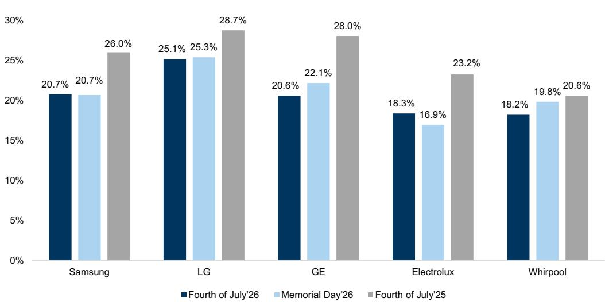
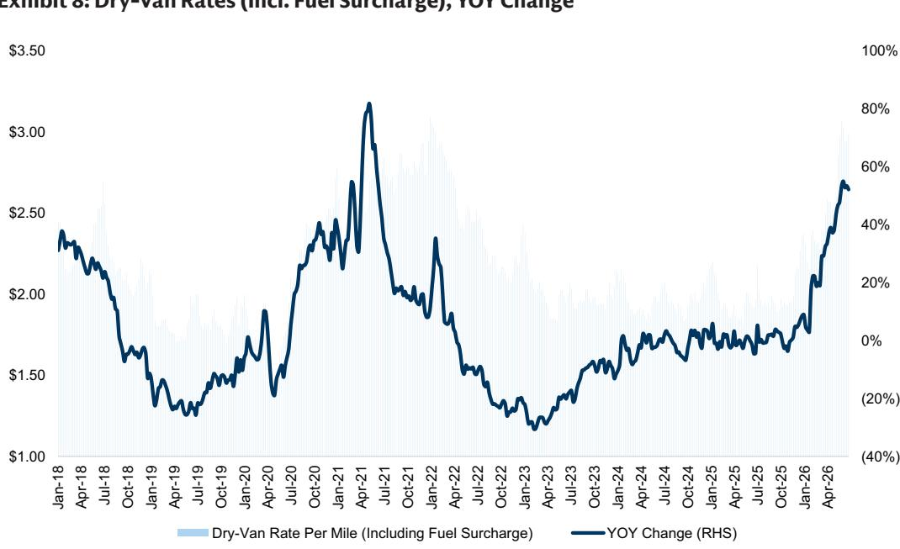
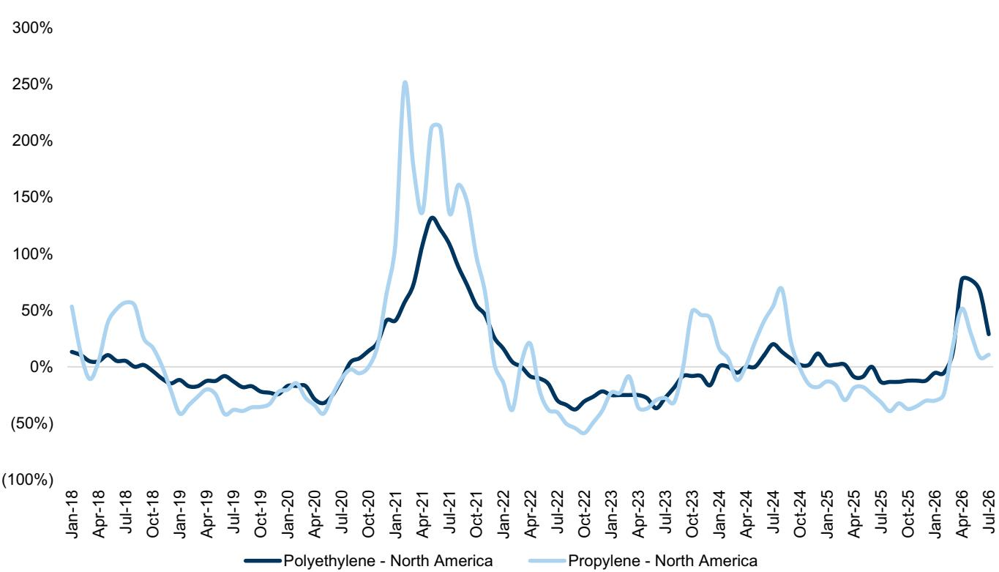

# 行业定价策略趋于理性，但公司盈利恢复仍需自身执行力支撑

美国独立日期间的家电定价数据，反映出的行业趋势远比一次简单的假日促销回顾更为深刻。多年来，主要制造商首次在住房需求变化和投入成本上升的背景下，展现出真正的定价纪律。2026年独立日销售期间，行业净定价同比上升702个基点，较阵亡将士纪念日的508个基点和总统日的199个基点有所加速。这并非偶然现象，而是行业对关税、商品通胀及运费成本上升的共同应对，这些因素已将利润空间压缩至不可持续的水平。然而，在这一令人鼓舞的总体趋势之下，对于具体公司而言，情况更为复杂。尽管该公司是这一行业转变的受益者，但其自身的促销数据显示，其相对于同行处于滞后位置，且短期利润轨迹仍面临较大挑战。观察者关注的核心问题是，该公司能否将行业纪律转化为可持续的盈利能力，还是结构性需求变化和竞争动态将继续侵蚀其利润。

形势十分关键。该公司北美大家电业务板块的营业利润率预计将在2026年第二季度降至2.2%，同比下降370个基点。全年利润率预计将收缩128个基点至3.6%。公司每股收益预计将从2025年的6.23美元降至2026年的3.15美元，降幅接近50%。这些数字反映出一家企业在成本上升与消费者价格敏感度提高之间的处境。独立日数据首次提供了定价能力可能正在恢复的实际证据，但也揭示了对于一家品牌组合和成本结构可能不如同行的公司而言，这种能力的局限性。

## 折扣普遍下降，但公司相对位置揭示竞争劣势

独立日期间所有品牌的加权平均折扣为20.5%，同比下降473个基点，较阵亡将士纪念日环比下降43个基点。这是最清晰的信号，表明制造商已超越口头表态，正在采取具体行动保护利润。品牌间折扣范围从一年前的814个基点收窄至693个基点，表明行业在定价策略上采取了更为统一的方法。

然而，这些数字的构成至关重要。LG促销力度最大，为25.1%，而伊莱克斯和该公司均为18.3%和18.2%。表面上看，该公司较低的折扣率似乎有利。但背景决定一切。该公司折扣率较阵亡将士纪念日环比降幅最大，为负162个基点，比集团平均水平低230个基点。同比来看，该公司折扣率仅下降238个基点，而伊莱克斯为488个基点。这意味着该公司起始折扣基数较高，且回调速度较慢。

这种模式表明，在需求下降的环境中，该公司可能正在利用促销强度作为竞争工具来捍卫市场份额。北美行业出货量预计在2026年下降4%。当整体市场缩小时，企业面临一个明确的选择：保持定价纪律而失去销量，或保持销量而牺牲利润。数据显示，该公司至少相对于同行而言，倾向于后者。这在短期内如果能够保住货架空间和消费者认知，是合理的，但如果需求低迷持续，则存在显著风险。

## 新品转向是标价上涨背后的真正故事

标价与净价讲述着不同的故事，其差异具有启发性。平均而言，独立日期间标价同比仅增长0.7%，较一年前的4.1%增长和阵亡将士纪念日的1.0%大幅放缓。按两年累计计算，行业标价上涨4.8%，略高于阵亡将士纪念日的4.5%。但只有11%的SKU标价同比上涨，而一年前为40%。这并非广泛的定价能力故事，而是由新品推出驱动的狭窄集中现象。

LG以平均1.6%的标价涨幅领先，12%的SKU同比上涨。GE和三星平均涨幅仅为0.2%，分别有19%和15%的商品价格下降。增长由新品驱动，制造商和零售商试图通过创新而非全面提价来刺激需求。这是一个关键区别。当前行业存在的定价能力并非结构性的，而是与特定产品发布和组合转型相关。

对于该公司而言，这种动态有利有弊。该公司在2025年转型了超过30%的北美大家电产品组合，是其历史上最大规模的更新。这使公司能够受益于新品可能带来的积极组合和定价势头。但这也意味着，在消费者日益注重价值的背景下，该公司2026年下半年的定价收益将主要取决于这些新品推出的成功。数据显示，消费者正在降级消费并坚持预算，这为高端产品定位带来了自然阻力。

## 库存动态确认促销周期缩短的战略转变

独立日扫描的库存数据提供了另一个证据，表明行业在促销方式上正在经历结构性变化。Best Buy和家得宝在被调查零售商中缺货商品最少，而劳氏最多。GE在制造商中产品可用性最高，而LG最低。更重要的是，劳氏有更多SKU被永久停产，反映了向新品推出的过渡。

渠道检查还表明，整个行业正在转向更短的促销周期。这是一个有意义的战略转变。历史上，家电制造商依赖延长促销窗口来在销售旺季推动销量。更短的促销周期减少了消费者可以期待折扣的时间，从而支持更高的净定价。但它也需要更精确的库存管理和需求预测。

对于该公司而言，向更短促销周期的转变既是机遇也是风险。如果执行得当，可以支持公司所需的净定价扩张，以抵消成本通胀。但如果需求弱于预期，更短的促销窗口可能导致库存积压和季末被迫打折。公司库存天数预计将从2025年的60.3天上升至2026年的61.4天，表明管理层已在为此做准备。

## 报告未完全回答的问题：公司成本结构能否支撑其定价策略？

报告提供了关于定价和促销趋势的大量数据，但留下几个关键问题未解答。其中最重要的是公司定价策略与其成本结构之间的关系。公司毛利率预计将从2025年的15.4%下降至2026年的14.1%，即使净定价有所改善。这表明投入成本通胀和关税阻力正在抵消定价纪律带来的好处。

报告指出，该公司于4月17日实施了10%的促销增长，并于7月9日生效了4%的标价上涨。但这些行动是在关税、商品通胀和运费成本上涨的背景下采取的，分析中未完全量化这些因素。关键问题是，这些定价行动是否足以将利润率恢复到历史水平，还是仅仅减缓了下降速度。

第二个未解答的问题涉及行业定价纪律的可持续性。当前制造商之间的协调是对共同成本压力的理性反应。但当需求进一步减弱或竞争对手决定积极追求市场份额时，理性行为可能迅速瓦解。报告指出，类别间折扣范围已经收窄，但这也可以解释为促销活动在产品间变得更加统一，如果所有参与者都同样有动力，这可能更容易维持。

第三个不确定性领域是消费者对更高价格的反应。报告假设北美行业出货量在2026年下降4%，但如果消费者继续降级消费或推迟购买，这一假设可能过于乐观。数据显示消费者坚持预算，这为新品发布可能带来的销量增长设置了上限。

## 评估公司复苏轨迹的决策框架

对于试图评估该公司当前估值是机遇还是价值陷阱的观察者而言，独立日定价数据提供了一个有用的框架。分析可以围绕三个关键变量组织：定价能力、成本控制和需求恢复。

第一个变量，定价能力，正在显示出真正的改善。全行业折扣减少和促销周期缩短是积极发展，应在未来几个月支持净定价。该公司7月9日生效的标价上涨，加上同行的类似行动，如果这些努力取得进展，将创造上行空间。然而，公司相对于同行的促销强度是一个警示信号，表明其定价能力可能弱于行业平均水平。

第二个变量，成本控制，是最难评估的。该公司2025年底的债务与EBITDA比率为5.5倍，对于一家面临盈利下降的公司来说较高。公司利息覆盖率为2.5倍，容错空间有限。自由现金流从2025年的7800万美元改善至2026年的3.16亿美元是一个积极信号，但这取决于营运资本改善，在收入下降的环境中可能难以实现。

第三个变量，需求恢复，是最不确定的。报告假设2027年温和复苏，收入增长3.7%，EBITDA增长20.7%。这假设住房市场状况改善，消费者开始更换在当前低迷期间推迟的家电。但任何住房复苏的时间点都非常不确定，当前利率环境不利于快速反弹。

观察者应关注这三个变量之间的相互作用。如果定价能力持续改善且成本控制措施生效，即使没有强劲的需求复苏，该公司也可能产生有意义的利润扩张。但如果定价纪律瓦解或成本通胀持续，公司盈利可能长期面临压力。

## 完整报告包含改变研究视角的详细数据

本分析中呈现的定价数据来自对三家主要零售商和五家制造商在多个产品类别的全面扫描。完整报告包括详细图表，显示品牌和产品类别的折扣水平、标价同比变化以及零售商库存可用性。这些详细数据点允许观察者评估哪些品牌和类别在定价复苏中领先，哪些落后。

例如，数据显示，冰柜是折扣最少的类别，为13.8%，同比下降458个基点，而洗衣机折扣最多，为22.6%。类别间折扣范围从814个基点收窄至693个基点，是行业协调的有意义指标。完整报告还提供了该公司至2028年的详细财务预测，包括收入、EBITDA、每股收益和自由现金流估计。

这些细节很重要，因为它们允许观察者对当前估值背后的假设进行压力测试。以38.10美元的价格计算，该公司交易于2026年预期收益的12.1倍和2027年预期EBITDA的7.0倍。这一目标是否可实现，取决于上述三个变量的轨迹。

加入社区阅读完整报告并查看原始图表。

*仅供参考。部分内容可能基于源材料通过AI辅助生成、翻译、总结或编辑，可能存在遗漏或错误。请独立核实。这不构成任何专业建议。*

仅供参考。部分内容可能基于源材料通过AI辅助生成、翻译、总结或编辑，可能存在遗漏或错误。请独立核实。这不构成任何专业建议。

