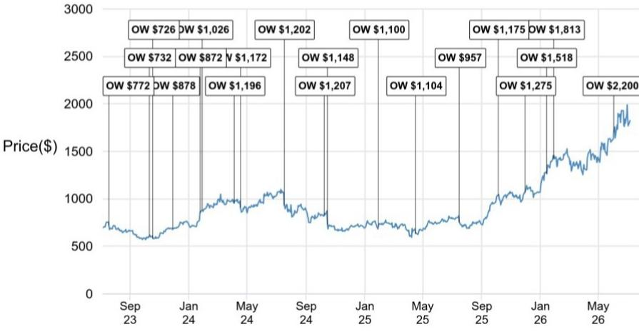
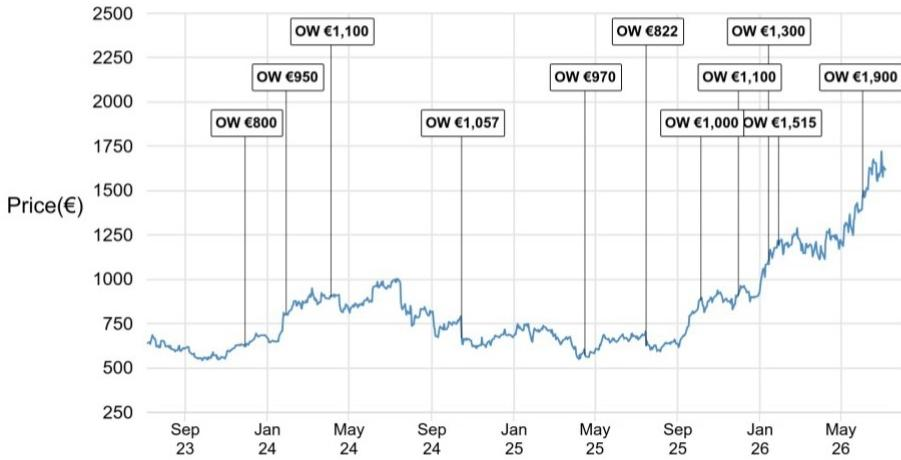
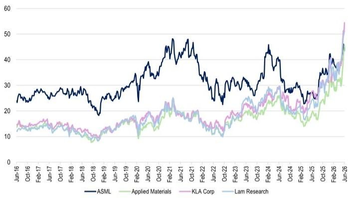

# JPM：不是美国设备商太强，而是ASML的2027年增长信号还没来

ASML即将发布2026年第二季度财报，但市场关注的重点早已越过短期数字。JPM在最新研究报告中提出一个核心判断：**ASML当前最大的问题不是业绩好坏，而是能否给出足够强劲的2027年增长指引，以扭转其相对于美国同行持续扩大的估值折价。** 这份报告认为，短期财报数字对报价影响有限，真正驱动重新定价的变量是ASML管理层对2027年及以后的产能信号。

自2025年9月以来，ASML的表现落后于应用材料和泛林半导体约100-125%，也落后于科磊超过15%。这种差距并非基本面出现变化所致——ASML仍是全球最关键的先进制程光刻设备供应商。问题出在估值层面。ASML目前市盈率低于其历史峰值的45倍，而美国同行却以高出自身历史峰值76-86%的估值交易。更值得关注的是，ASML相对于这些美国同行的估值已从历史平均溢价84%转为折价11%。

> **KC评论：** 这份报告揭示了一个有趣的结构性矛盾。ASML的技术垄断地位没有被市场充分定价，反而因为身处欧洲指数、缺乏本地增量买家，导致其估值逻辑被美国同行“带偏”。读者需要关注的不是季度波动，而是ASML能否通过2027年指引重新建立增长叙事上的相对优势。

## 1. 短期财报承压，但市场已提前定价

JPM预计ASML第二季度营收为87亿欧元，略低于市场预期的88.2亿欧元，毛利率预计为51.7%，同样低于共识的52%。每股收益预估为6.67欧元，比市场预期低2.3%。这些数字本身并不难看——营收同比增长13.1%，但环比微降0.8%。

关键问题在于，ASML对2026年全年营收的指引中值为380亿欧元（同比增长16.3%），而市场共识已预期增长19.8%。这份报告认为，ASML可能会因DUV设备出货量走强而上调全年指引，但2026年本身并非ASML的爆发年。

真正的增长引擎在2027年。JPM预测ASML 2027/2028年每股收益分别为54.4欧元和64.4欧元，分别比当前市场预期高出26.5%和23.8%。这种增长将远超WFE（晶圆厂设备）行业平均水平，但前提是客户订单节奏能够支撑。

## 2. 估值折价的根源：欧洲市场无法独立推动重估

这份报告坦率地指出了ASML面临的资金面困境。ASML在欧洲指数中的权重已经很大，仅靠欧洲本地买家很难推动估值修复。要让ASML重新获得溢价，需要吸引美国和亚洲读者的兴趣。

而美国读者目前更青睐本土设备商——应用材料、泛林、科磊——这些公司受益于更清晰的本土化叙事和更高的可见度。ASML要想从中分得关注，必须展示出超越这些同行的增长前景。

报告认为，ASML在第二季度财报电话会议中应该会像去年此时对2026年做出指引一样，对2027年增长给出明确信号。**如果ASML能够暗示2027年出货90台EUV设备，将是温和利好；若达到90-100台，则非常积极。** 此外，浸没式DUV设备需求的强劲信号，以及2028年以后的产能规划（包括建设新产能的计划），也将成为关键的催化剂。

> **KC评论：** 这里有一个值得追问的问题：ASML为什么不能在2026年就实现超越WFE的增长？报告给出的解释是客户订单时机——2025年12月才开始下单，已经来不及推动供应链在2026年交付更多EUV设备。这意味着2027年的增长并非线性，而是积压订单释放的结果。读者需要仔细审视这份研究报告中关于订单节奏和供应链瓶颈的详细分析。

## 3. 报告尚未完全回答的关键问题

尽管这份研究报告提供了清晰的逻辑链条，仍有几个问题需要进一步验证。

第一，出口管制不确定性的真实影响。报告在不确定性因素中提到了对中国等关键地区的出口限制，但未量化其对2027年EUV出货目标的具体影响。考虑到ASML在中国市场的收入占比和地缘政治不确定性，这是一个不可忽视的变量。

第二，DRAM市场的周期性。报告认为ASML将受益于存储器上行周期，但DRAM价格能否持续走强存在不确定性。如果存储器客户推迟资本开支计划，2027年的EUV订单可能面临下调不确定性。

第三，High-NA EUV的渗透节奏。报告指出High-NA将从2027年开始推动光刻强度提升，但客户对High-NA的接受速度和良率爬坡时间表仍不明确。这部分假设是2027年EPS预期高于市场共识的核心支撑，但也是最大的不确定来源。

## 4. 观察框架：三个信号决定ASML的重新定价

对于关注ASML的读者，这份报告提供了一个清晰的观察框架。

第一个信号：第二季度财报电话会议上管理层对2027年的具体数字指引。如果给出90台以上的EUV出货目标，将是对当前估值折价的有力反击。

第二个信号：浸没式DUV设备的需求趋势。报告特别提到这一点的“帮助”，暗示DUV设备的需求强度可能是2027年增长之外的额外催化剂。

第三个信号：2028年以后的产能规划。任何关于建设新产能或扩建现有设施的消息，都意味着ASML管理层对长期需求的信心，这将对估值倍数产生结构性影响。

这三个信号叠加起来，将决定ASML能否打破当前的估值僵局，重新获得相对于美国同行的溢价。

For informational purposes only. Portions may be generated, translated, summarized, or edited with AI assistance based on source materials and may contain omissions or errors. Please verify independently. This is not investment, legal, tax, accounting, or other professional advice.

For informational purposes only. Portions may be generated, translated, summarized, or edited with AI assistance based on source materials and may contain omissions or errors. Please verify independently. This is not investment, legal, tax, accounting, or other professional advice.

