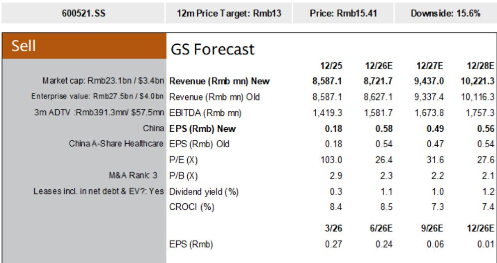
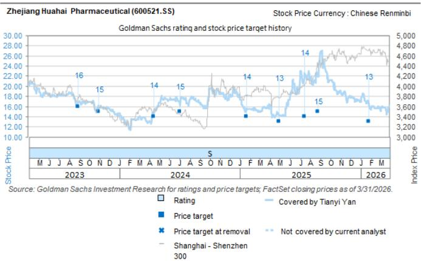
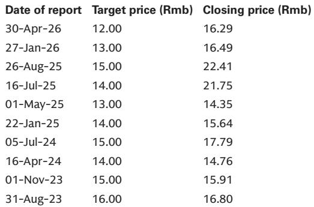

# 华海药业业绩超预期背后的结构性挑战：一份研究报告的解读

浙江华海药业公布了2026年上半年初步业绩，超出市场普遍预期及研究报告分析师的预测。净利润在7.57亿元至7.99亿元之间，同比增长85%至95%。研究报告此前预测为5.4亿元。表面上看，这似乎验证了公司拓展全球销售渠道的战略，也让人重新审视看空观点。但事实并非如此。

业绩超预期由两个因素驱动：经历一段下滑期后的营收增长复苏，以及来自山德士的一次性补偿款700万美元（约合净利润8200万元）。剔除这一非经常性项目，实际超预期幅度大幅收窄。即便考虑此次超预期，当前公司报价约15.41元，隐含约15.6%的下行空间。市场正在定价一个数字尚未支撑的复苏故事。

本文认为，研究报告对华海药业所处位置做出了正确的战略评估。上半年业绩超预期是战术层面的积极信号，但并未改变公司面临的结构性轨迹：核心美国仿制药业务面临利润率压缩、研发和诉讼成本上升，以及估值与基础盈利能力脱节。对于考虑参与的观察者而言，关键问题不在于华海能否在某个半年期超预期，而在于其商业模式能否在未来三到五年内产生可持续的、高于资金成本的回报。现有证据表明，这难以实现。

## 一次性补偿款扭曲了业绩超预期的真实含义

分析上半年业绩时，最重要的步骤是区分信号与噪音。山德士的补偿款对现金流是积极因素，但属于非经常性项目。研究报告明确将8200万元的净利润超预期归因于此。若无此项，隐含净利润区间约为6.75亿至7.17亿元，仍高于5.4亿元的预测，但幅度远没那么显著。

更值得关注的是营收修正。研究报告此前预计上半年营收同比下降4.5%。公司实际报告了正增长，由全球销售渠道扩张驱动。这是合理的运营改善，但幅度有限。2026年全年营收预测仅上调1.1%，从86.27亿元升至87.22亿元。这并非突破性季度，而是经历弱势后的企稳。

由此呈现的模式是：公司能通过渠道扩张和一次性项目实现短期超预期，但核心盈利轨迹仍持平或下滑。2027年和2028年的净利润预测仅分别上调3.1%和3.2%。研究报告并未预测持续加速。2027年隐含每股收益为0.49元，低于2026年的0.58元。即便在超预期后，公司预计明年盈利将低于今年。

## 核心业务面临结构性利润率压缩，销售渠道扩张无法解决

华海已成功从原料药生产商转型为仿制药出口商，聚焦美国和中国市场。这一转型目前已基本完成，公司面临仿制药行业成熟阶段的挑战：定价压力、商品化以及持续补充产品线的需求。

美国仿制药市场多年来处于价格下行周期，受买家整合、印度制造商竞争加剧以及降低药价的监管压力驱动。华海无法免疫于这些力量。研究报告明确将“美国市场仿制药压力增大”列为关键盈利挑战。这并非暂时状况，而是行业的结构性特征。

研发和专利诉讼成本上升进一步压缩利润率。仿制药公司必须投资复杂制剂和法律诉讼以维护市场地位，但随着竞争者增多和价格空间收窄，这些投资的回报正在下降。华海的研发支出占营收比例在过去几年呈上升趋势，但支撑该支出的营收增长尚未实现。

净利润预测说明了问题。在2026年达到8.73亿元后，净利润预计将在2027年降至7.31亿元，然后在2028年回升至8.36亿元。三年期复合年增长率约为6%，低于具有此类风险特征的中国制药公司的股权成本。该业务产生的回报不足以支撑其当前估值。

## 估值与盈利能力脱节，形成不对称下行风险

华海当前报价高于其五年平均前瞻市盈率。以当前15.41元计算，公司估值约为2026年预期盈利的26.4倍。对于一家盈利增长率6%且近期轨迹下滑的公司而言，这一倍数要求较高。研究报告采用19倍的五年退出市盈率，认为当前估值被高估超过15%。

价格与价值之间的脱节不仅体现在相对倍数上，更体现在盈利轨迹上。市场定价的复苏，研究报告自身的预测并未支持。2027年隐含每股收益0.49元，低于2026年预测的0.58元。以26倍市盈率买入一家预期明年盈利下降的公司，是在押注估值重估，而非基本面改善。

研究报告指出的关键催化剂值得关注：美国食品药品监督管理局现场检查结果，以及美国和欧洲市场的新产品上市。两者均为结果不确定的二元事件。FDA检查发现可能扰乱销售，新产品上市可能无法获得市场份额。提及的上行风险包括产品线交付好于预期、原料药价格上涨以及美国销售复苏。这些均有可能，但概率不足以支撑当前估值。

## 报告未完全解答的问题：美国渠道扩张的可持续性

研究报告提供了有力证据，表明华海的全球销售渠道扩张在短期内有效。营收增长在经历下滑后已转为正增长。但报告未完全解答这一扩张能否在支撑当前估值的水平上持续。

美国仿制药市场日益拥挤，新产品进入壁垒较高。华海能否以抵消现有产品价格侵蚀的速度持续推出新产品，存在不确定性。研究报告的预测显示，未来三年营收增长将较为温和，2028年营收102.21亿元，较2025年85.87亿元基数的复合年增长率约为6%。这低于历史增长率，也低于支撑当前倍数所需的增长率。

悬而未决的问题是：渠道扩张是一次性提升，还是可持续的增长引擎？若是前者，2026年上半年的业绩超预期将被证明是峰值，公司报价将回调。若是后者，研究报告的预测可能过于保守，其观点将被证伪。报告提供了足够证据使看空观点具有说服力，但不足以排除看多观点。这种不确定性正是当前水平下该研究标的具有高风险特征的原因。

## 评估华海药业的决策框架

对于考虑关注华海药业的观察者，以下框架可能有助于厘清风险回报特征。

第一，评估业绩超预期的质量。非经常性项目应从核心盈利能力计算中剔除。山德士补偿款为一次性事件。渠道扩张是真实的，但其规模相对于业务体量有限。调整后的盈利能力更接近研究报告修正后的预测，而非表面上的超预期数字。

第二，评估利润率轨迹。美国仿制药市场存在结构性价格下行压力。华海的利润率受定价、研发成本和诉讼费用挤压。研究报告的预测显示，未来三年利润率不会显著扩张。若利润率持平或下滑，公司估值倍数必须压缩以反映较低的资本回报。

第三，将估值与增长率进行比较。以26倍市盈率和6%增长率衡量，该研究标的按任何标准均属昂贵。五年平均市盈率较低，表明当前倍数高于历史常态。回归均值将意味着显著下行。

第四，考虑二元风险。FDA检查和产品上市不可预测。任一方面的负面结果都可能引发估值重估。研究报告的观点隐含地赋予负面结果高于市场定价的概率。

第五，提出战略性问题：华海是一家拥有暂时增长机会的仿制药公司，还是一家拥有持久竞争优势的公司？现有证据指向前者。渠道扩张是战术性胜利，但并未改变行业的结构性动态。在此环境中成功的公司往往具备华海尚未展现的规模、多元化和成本优势。

## 完整报告包含检验这些假设所需的数据

以上分析基于初步业绩和研究报告的修正预测，但完整报告包含详细的财务模型、历史比较和敏感性分析，使观察者能够对假设进行压力测试。原始图表展示了多年来的营收、利润率和每股收益轨迹，提供了摘要无法涵盖的背景。

报告中的关键张力在于短期超预期与长期结构性挑战之间。解决这一张力需要获取完整数据集。希望了解研究报告观点是否过于悲观或不够悲观的人士，应查阅原始附件，包括更新后的预测表格、估值方法以及完整的财务数据。

加入社区以阅读完整报告并查看原始图表。

*仅供参考。部分内容可能基于源材料通过AI辅助生成、翻译、总结或编辑，可能存在遗漏或错误。请独立核实。本文不构成任何专业建议。*

仅供参考。部分内容可能基于源材料通过AI辅助生成、翻译、总结或编辑，可能存在遗漏或错误。请独立核实。本文不构成任何专业建议。

