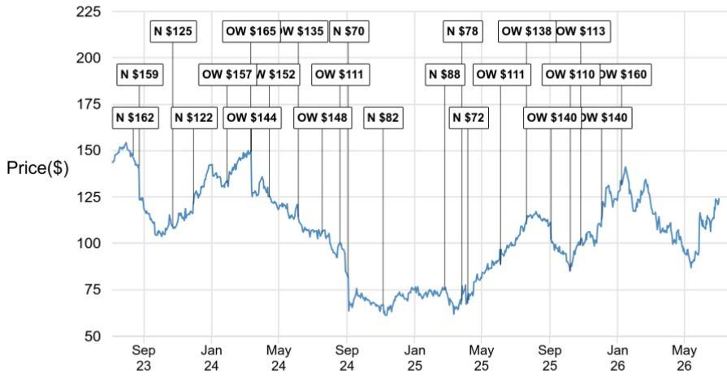
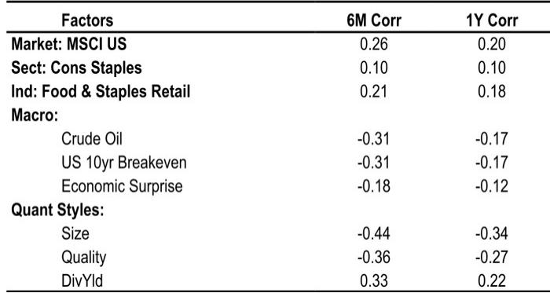
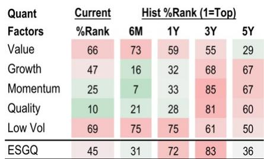

# JPM：不是宏观消费回暖，而是内部运营改善，JPM详解DollarTree盈利拐点

当大多数零售读者还在关注消费支出节奏变化、关税成本等宏观变量时，JPM在Dollar Tree总部的一日调研和门店走访，给出了一个更具体的判断：这家折扣零售商正处在一个由内部运营改善驱动的盈利拐点，而非依赖外部消费环境回暖。

同时全面上调了2026至2028财年的每股盈利预测。核心逻辑不是宏观假设变好，而是四个可量化的内部变量正在同时改善。

## 1. 门店标准的大幅提升是盈利修复的底层支撑

报告最引人注目的数据并非财务预测，而是一个运营指标：一年前，Dollar Tree旗下约52%的门店被管理层评为“低于标准”；今天，这个比例已降至约33%。换言之，在不到12个月里，门店执行质量提升了近20个百分点。

这个改善并非偶然。CEO Creedon在2023年6月读者日提出的G.O.L.D.标准（包括24小时门店恢复、48小时货物进出、简化店内陈列和价格清晰化），正在被首席零售官Konrad系统化落地。JPM团队在门店走访中看到了三个具体变化：价格标签数量从一年前的30多个降至中双位数；彩色编码价格条将在7月底前推广至全部门店；为员工配备的“臀部打印机”已于4月投入使用，减少了标签和库存管理的人力摩擦。

> **KC评论：** 对于零售读者而言，门店执行质量的改善往往比宏观数据更能预测同店销售走势。JPM团队估算，新店成熟曲线将在2027财年贡献约125个基点的同店销售增长，高于过去三年约100个基点的平均水平。这个加速来自2022-2023年开店节奏变化后的“滞后释放”。

## 2. 1美元商品回归不是价格战，是流量策略

6月12日，Dollar Tree重新引入了部分1美元商品，以庆祝公司成立40周年。市场可能将其解读为应对消费疲软的价格竞争手段，但JPM从管理层那里得到的信号不同：这是一个有纪律的流量获取工具，且不会牺牲利润率。

CEO Creedon明确表示，公司的后端采购模式允许在1美元价位上保持与原来相同的利润水平——前提是有足够的提前期来“设计”产品。目前这只是小规模测试，更大的机会在下半年：返校季、万圣节、感恩节和圣诞节。

一个关键细节：Dollar Tree 80%的SKU是整理版的，只有10%与竞争对手重叠。这意味着价格比较的参照系并不直接。JPM的价格分析显示，Dollar Tree在消耗品上的价格比大众零售商低低至中个位数，在可选消费品上低中双位数。

> **KC评论：** 真正值得关注的是管理层所说的“年底将有非常好的流量和单位速度数据”。如果1美元商品能推动客流转正，叠加下半年更轻松的同比基数，2026年第三季度可能迎来“双重催化剂”——低基数和促销拉动。这份报告没有完全量化这个弹性，但暗示了上行空间。

## 3. 毛利率的长期跑道被低估了

JPM认为，市场可能低估了Dollar Tree的毛利率改善潜力。管理层在2025年10月读者日给出的指引是“温和增长”（约每年10个基点），但JPM团队在调研后认为，实际空间远大于此。

三个加速因素值得关注：第一，供应链效率——将每个配送中心覆盖的门店数从约600家提升至约800家，仅此一项就能带来超过20%的配送中心效率提升；第二，多价格点（MPP）规模化——目前MPP仅占SKU的16%，而加拿大同行DOL已做到85%，欧洲的Action也达到约60%，这意味着Dollar Tree的MPP渗透才刚刚开始；第三，损耗率改善——约60%的商品是自有品牌风格，在转售市场上几乎没有“街价”，JPM估算损耗率存在超过80个基点的修复空间。

综合来看，JPM认为存在超过100个基点的多年毛利率上行空间，而市场目前仅定价了每年10个基点的改善。

## 4. 报告没有完全回答的问题：资本配置的增量弹性

报告提到，管理层在6月25日宣布了5亿美元的公司回购计划，JPM估算未来还有超过40亿美元的增量资本配置空间。但这里存在一个尚未被充分讨论的变量：当门店执行改善和MPP扩张带来更高回报率时，管理层是否有意愿和能力加速资本配置？还是会更优先投入开店和供应链改造？

Dollar Tree的净负债/EBITDA已从2025财年的0.7倍降至2028财年预计的0.2倍，资产负债表弹性显著增强。但资本配置的节奏和方向——是更大规模的回购，还是加速门店改造，或是潜在的并购——仍是这份报告未完全展开、但值得持续跟踪的变量。

对于关注折扣零售的读者，JPM这份报告提供了一个清晰的观察框架：不再盯着宏观消费数据，而是追踪门店标准评分、MPP渗透率、1美元商品的流量弹性这三个内部指标。这些才是Dollar Tree未来2-3年盈利能否从“修复”走向“再加速”的真正信号。

For informational purposes only. Portions may be generated,translated,summarized,or edited with AI assistance based on source materials and may contain omissions or errors. Please verify independently. This is not investment,legal,tax,accounting,or other professional advice.

For informational purposes only. Portions may be generated,translated,summarized,or edited with AI assistance based on source materials and may contain omissions or errors. Please verify independently. This is not investment,legal,tax,accounting,or other professional advice.

