# 中国银行业研究

## 风格轮动引发调整；招商银行成为分红亮点

MSCI中国银行指数和沪深300银行指数近一个月分别回调7%和5%，同期MSCI中国指数和沪深300指数分别回调10%和2%。我们观察到，过去一个月彭博一致预期显示MSCI中国银行指数和沪深300银行指数的FY1每股盈利预测分别下调2.8%和1.3%。我们认为，股价调整的主要驱动因素并非盈利下调，而是风格轮动。我们的分析显示，目前国有大行H股和A股的分红回报水平吸引力有限。不过，如果国有大行H股进一步调整9%、A股进一步调整6%，我们认为分红回报将变得具有吸引力，并形成较强的底部支撑。在当前水平，我们认为招商银行是具备吸引力的分红标的，其H股分红回报率（5.4%）已接近国有大行平均水平，A股分红回报率（5.6%）则比国有大行高出110个基点。我们认为其相对表现下行空间有限，因为市场预期已较低，盈利低于预期的空间有限，且招商银行的市净率和市盈率相对于四大国有银行的溢价已接近十年低点，而其2026年预期净资产回报表现比四大国有银行高出380个基点，2026年预期每股盈利增速比四大国有银行高出3%（考虑国有大行的摊薄风险）。

- **国有大行H股分红回报对南向读者吸引力有限**：我们估算，在扣除10%红利税后，国有大行H股的分红回报率与10年期美国国债回报表现的利差约为40个基点，低于十年均值280个基点，因此对海外读者吸引力有限。例如，HSBC控股/渣打集团未来12个月的总回报（分红+回购）分别为6%/7%，高于国有大行H股平均5.5%的水平。南向读者可能会将分红回报率（扣除20%红利税后）与10年期中国国债回报表现进行比较。当前利差为260个基点，接近十年均值220个基点（图1）。对于保险公司而言，风险回报可能更具吸引力，因为它们免征红利税，而中国平安是投资中国银行板块最活跃的机构。不过，中国平安在邮储银行、工商银行、建设银行、招商银行和农业银行的持股比例均超过4%，接近5%的监管红线（图5），这限制了其增持这些银行的能力。尽管如此，如果国有大行H股的分红回报率达到6%（扣除红利税后利差约为300个基点），意味着股价还有约9%的下行空间，届时我们可能会看到更多对股价表现的支撑。

- **国有大行A股分红回报吸引力有限，尤其考虑到摊薄风险**：国有大行A股2026年分红回报率和利差分别为4.4%和270个基点，分别比十年均值高出约40个基点，因此从分红角度而言，股价上行空间有限。对于可能在2026年下半年获得注资的工商银行和农业银行，我们估算全年每股分红分别存在约2%和7%的潜在摊薄（表1）。若考虑摊薄风险，工商银行和农业银行的利差分别为260个基点和210个基点，而十年均值分别为220个基点和240个基点。尽管如此，如果国有大行的利差达到300个基点，意味着股价有6%的下行空间，届时我们将看到对股价的支撑。

## 银行与金融服务

Katherine Lei AC
(852) 2800-8552
katherine.lei@JPM.com
JPM Securities (Asia Pacific) Limited/
JPM Broking (Hong Kong) Limited

Peter Zhang
(852) 2800-8557
peter.zhang@JPM.com
JPM Securities (Asia Pacific) Limited/
JPM Broking (Hong Kong) Limited

Lincoln Yu
(852) 2800 8523
lincoln.yu@JPM.com
JPM Securities (Asia Pacific) Limited/
JPM Broking (Hong Kong) Limited

Haomin Chen
(86-21) 6106 6347
haomin.chen@JPM.com
SAC Registration Number: S1730524080002
JPM Securities (China) Company Limited

分析师认证和重要披露，包括非美国分析师披露，请参见第8页。

- **股份制银行的分红利差高于国有大行，但盈利波动性是关键担忧**：我们估算，H股股份制银行的分红回报率（扣除20%红利税后）与10年期中国国债回报表现的利差为320个基点，高于十年均值190个基点。A股平均分红回报率达到5.7%，利差为400个基点，高于十年均值130个基点。然而，由于盈利波动性较大，加上增长风险和资本摊薄因素（如下表2所示），读者不太可能将股份制银行视为分红型标的。

- **招商银行已成为分红型标的，其相对于国有大行的估值溢价达到过去十年低点**：根据我们的估算，招商银行H股和A股的分红回报率分别为5.4%和5.6%，与10年期中国国债回报表现的利差分别为370个基点和390个基点，均高于各自十年均值100个基点和90个基点。招商银行H股的分红回报率接近四大国有银行5.6%的平均水平，而其A股分红回报率比四大国有银行4.2%的平均水平高出140个基点。更重要的是，我们估算招商银行是我们覆盖范围内相对少见在过去十年中每股盈利持续正增长的银行（表2）。其较高的核心一级资本充足率缓冲（图8）意味着资本摊薄风险较低。读者对我们认为招商银行是分红型标的的主要质疑可能是股价波动性，但我们预计波动性较低，因为市场对盈利的预期已较低，且估值并不高。值得注意的是，JPM/彭博一致预期招商银行2026年每股盈利增速分别为3.0%/3.5%。我们认为下行空间有限，因为净息差同比收缩放缓，且中国资本市场表现稳健支撑其非利息收入。此外，根据我们的估算，招商银行相对于四大国有银行的市净率和市盈率溢价接近十年低点（图9-图10），但其净资产回报表现比四大国有银行平均水平高出380个基点，接近十年均值400个基点。同时，其2026年预期每股盈利增速为3%，高于四大国有银行平均水平（0%），如果考虑工商银行和农业银行的摊薄风险。

图1：H股国有大行平均分红回报率与10年期中国国债回报表现的利差近期为260个基点，十年均值约为220个基点
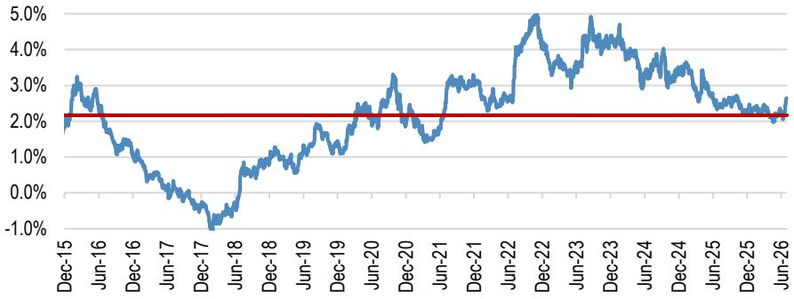
H股国有大行平均扣除红利税后分红回报率与10年期中国国债回报表现的利差（针对适用20%税率的南向读者）
国有大行十年均值
来源：Bloomberg Finance L.P. 数据截至2026年7月2日。

图2：H股股份制银行平均分红回报率与10年期中国国债回报表现的利差近期为320个基点，十年均值约为190个基点
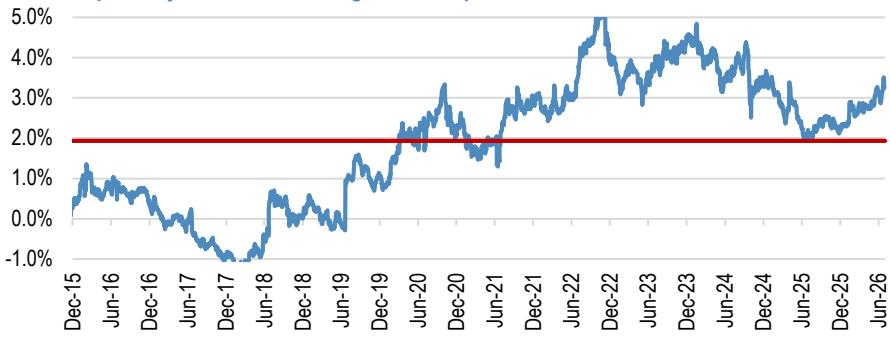
H股股份制银行平均扣除红利税后分红回报率与10年期中国国债回报表现的利差（针对适用20%税率的南向读者）
股份制银行十年均值
来源：Bloomberg Finance L.P. 数据截至2026年7月2日。

图3：A股国有大行平均分红回报率与10年期中国国债回报表现的利差近期为270个基点，十年均值约为230个基点
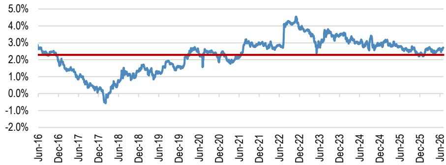
A股上市国有大行平均分红回报率与10年期国债回报表现的利差 — 国有大行十年均值
来源：Bloomberg Finance L.P. 数据截至2026年7月2日。

图4：A股股份制银行平均分红回报率与10年期中国国债回报表现的利差近期为400个基点，十年均值约为130个基点
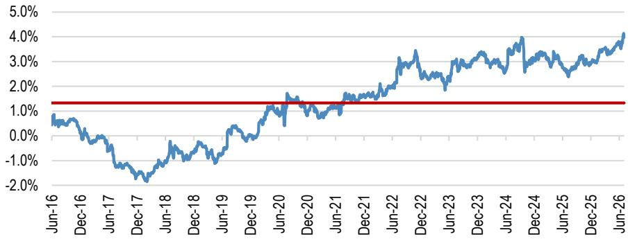
A股上市股份制银行平均分红回报率与10年期国债回报表现的利差 — 股份制银行十年均值
来源：Bloomberg Finance L.P. 数据截至2026年7月2日。

图5：中国平安集团在工商银行、建设银行、招商银行、邮储银行和农业银行的持股比例均超过4%，进一步增持能力有限
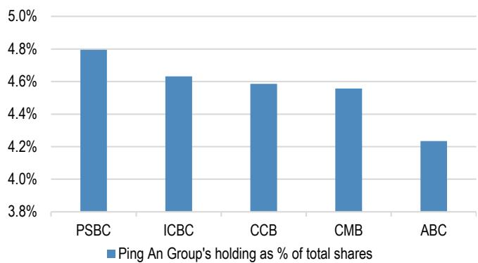
来源：港交所、上交所。注：基于公司披露。中国平安集团可能持有其他未达披露门槛的中国银行股份。

表1：潜在资本补充对农业银行和工商银行财务的模拟影响

<table><tr><td rowspan="2">单位：人民币</td><td rowspan="2">募集金额（十亿）</td><td colspan="3">2026年预期每股盈利</td><td colspan="3">2026年预期每股分红</td><td colspan="3">2026年预期净资产回报表现</td><td colspan="3">A股分红回报率</td></tr><tr><td>基准</td><td>模拟</td><td>差异</td><td>基准</td><td>模拟</td><td>差异</td><td>基准</td><td>模拟</td><td>差异</td><td>基准</td><td>模拟</td><td>差异</td></tr><tr><td>农业银行</td><td>235</td><td>0.82</td><td>0.78</td><td>-5.2%</td><td>0.26</td><td>0.24</td><td>-7.3%</td><td>9.8%</td><td>9.2%</td><td>-57 bps</td><td>4.4%</td><td>4.1%</td><td>-32 bps</td></tr><tr><td>工商银行</td><td>65</td><td>1.03</td><td>1.01</td><td>-1.3%</td><td>0.32</td><td>0.31</td><td>-1.9%</td><td>9.2%</td><td>9.1%</td><td>-11 bps</td><td>4.5%</td><td>4.4%</td><td>-9 bps</td></tr></table>

来源：JPM估算。我们假设资本补充于2026年9月完成。我们假设农业银行募集2350亿元人民币，工商银行募集650亿元人民币，农业银行和工商银行的配售价格分别较其2026年7月3日最新A股收盘价高出15%和9%。

图6：招商银行A股分红回报率高于其十年均值及A股国有大行平均水平
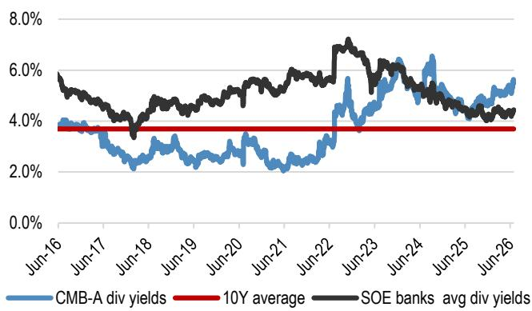
来源：Bloomberg Finance L.P. 数据截至2026年7月2日。

图7：招商银行H股分红回报率高于其十年均值，但略低于H股国有大行平均水平
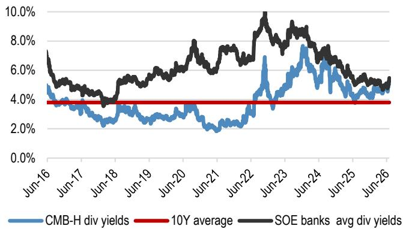
来源：Bloomberg Finance L.P. 数据截至2026年7月2日。

图8：招商银行在我们覆盖的中国银行中拥有较强的资本缓冲
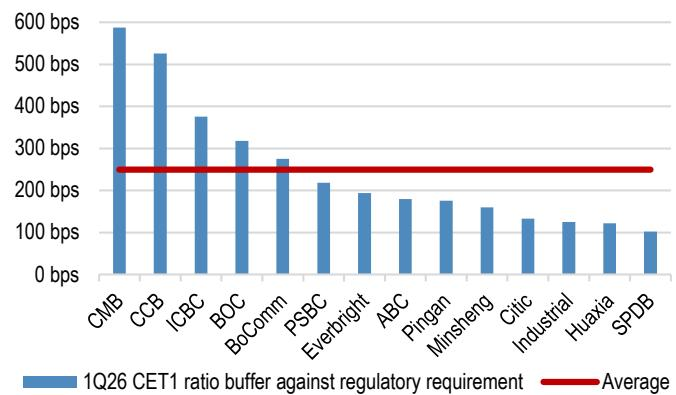
来源：公司报告。

图9：招商银行H股市净率相对于四大国有银行的溢价为58%，而平均水平为130%
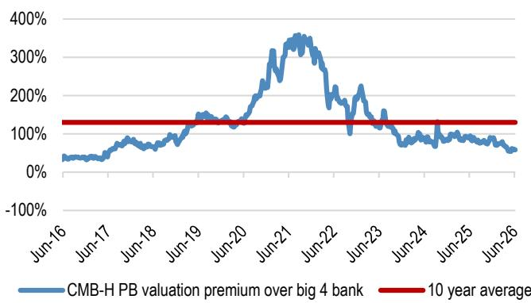
来源：Bloomberg Finance L.P. 数据截至2026年7月2日。

图10：招商银行H股市盈率相对于四大国有银行的溢价为18%，而平均水平为70%
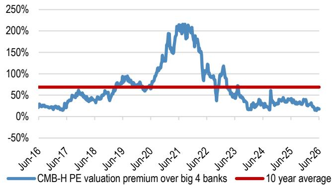
来源：Bloomberg Finance L.P. 数据截至2026年7月2日。

图11：招商银行净资产回报表现比四大国有银行平均水平高出380个基点，十年均值为400个基点
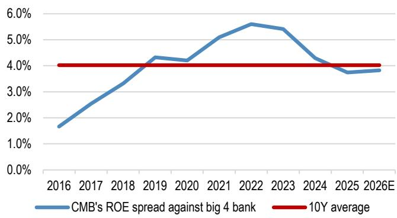
来源：公司报告、JPM估算。

图12：招商银行每股盈利增速与四大国有银行平均每股盈利增速对比
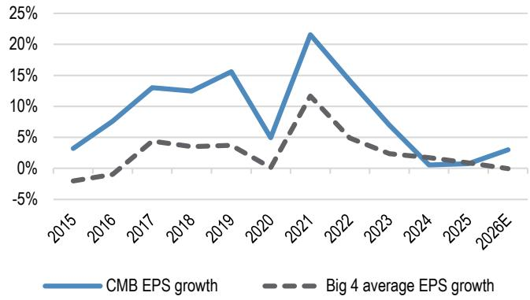
来源：公司报告、JPM估算。

表2：中国银行每股盈利增速——招商银行是我们覆盖范围内相对少见在过去十年中每股盈利持续正增长的银行

<table><tr><td>每股盈利增速</td><td>2015</td><td>2016</td><td>2017</td><td>2018</td><td>2019</td><td>2020</td><td>2021</td><td>2022</td><td>2023</td><td>2024</td><td>2025</td><td>2026E</td></tr><tr><td>农业银行*</td><td>-1%</td><td>1%</td><td>5%</td><td>1%</td><td>1%</td><td>-1%</td><td>10%</td><td>6%</td><td>5%</td><td>4%</td><td>4%</td><td>0%</td></tr><tr><td>中国银行</td><td>-7%</td><td>-5%</td><td>5%</td><td>5%</td><td>4%</td><td>0%</td><td>14%</td><td>3%</td><td>2%</td><td>2%</td><td>-2%</td><td>-1%</td></tr><tr><td>建设银行</td><td>0%</td><td>1%</td><td>5%</td><td>4%</td><td>5%</td><td>1%</td><td>12%</td><td>7%</td><td>2%</td><td>0%</td><td>-1%</td><td>0%</td></tr><tr><td>工商银行*</td><td>-1%</td><td>0%</td><td>3%</td><td>4%</td><td>5%</td><td>0%</td><td>10%</td><td>2%</td><td>1%</td><td>1%</td><td>2%</td><td>1%</td></tr><tr><td>邮储银行</td><td>-12%</td><td>-9%</td><td>6%</td><td>5%</td><td>17%</td><td>-1%</td><td>10%</td><td>9%</td><td>-2%</td><td>-3%</td><td>-10%</td><td>-7%</td></tr><tr><td>交通银行</td><td>1%</td><td>0%</td><td>2%</td><td>5%</td><td>5%</td><td>-1%</td><td>11%</td><td>3%</td><td>1%</td><td>1%</td><td>-7%</td><td>-3%</td></tr><tr><td>中信银行</td><td>1%</td><td>-3%</td><td>-1%</td><td>5%</td><td>1%</td><td>-3%</td><td>14%</td><td>8%</td><td>8%</td><td>5%</td><td>0%</td><td>3%</td></tr><tr><td>招商银行</td><td>3%</td><td>8%</td><td>13%</td><td>12%</td><td>16%</td><td>5%</td><td>22%</td><td>14%</td><td>7%</td><td>1%</td><td>1%</td><td>3%</td></tr><tr><td>民生银行</td><td>3%</td><td>4%</td><td>3%</td><td>1%</td><td>7%</td><td>-42%</td><td>0%</td><td>0%</td><td>1%</td><td>-11%</td><td>-2%</td><td>0%</td></tr><tr><td>兴业银行</td><td>6%</td><td>5%</td><td>1%</td><td>2%</td><td>7%</td><td>-2%</td><td>26%</td><td>11%</td><td>-16%</td><td>0%</td><td>-1%</td><td>2%</td></tr><tr><td>光大银行</td><td>2%</td><td>-1%</td><td>3%</td><td>-5%</td><td>-2%</td><td>-1%</td><td>8%</td><td>3%</td><td>-8%</td><td>3%</td><td>-7%</td><td>-3%</td></tr><tr><td>浦发银行</td><td>6%</td><td>-10%</td><td>-23%</td><td>0%</td><td>6%</td><td>-3%</td><td>-14%</td><td>-4%</td><td>-32%</td><td>27%</td><td>12%</td><td>-5%</td></tr><tr><td>平安银行</td><td>-10%</td><td>-16%</td><td>-9%</td><td>7%</td><td>10%</td><td>-9%</td><td>23%</td><td>27%</td><td>2%</td><td>-4%</td><td>-4%</td><td>3%</td></tr><tr><td>华夏银行</td><td>-5%</td><td>-4%</td><td>-20%</td><td>5%</td><td>-12%</td><td>-12%</td><td>12%</td><td>3%</td><td>6%</td><td>10%</td><td>0%</td><td>6%</td></tr><tr><td>国有大行平均</td><td>-3%</td><td>-2%</td><td>4%</td><td>4%</td><td>6%</td><td>0%</td><td>11%</td><td>5%</td><td>1%</td><td>1%</td><td>-2%</td><td>-2%</td></tr><tr><td>股份制银行平均</td><td>1%</td><td>-2%</td><td>-4%</td><td>4%</td><td>4%</td><td>-8%</td><td>11%</td><td>8%</td><td>-4%</td><td>4%</td><td>0%</td><td>1%</td></tr><tr><td>行业平均</td><td>-1%</td><td>-2%</td><td>-1%</td><td>4%</td><td>5%</td><td>-5%</td><td>11%</td><td>7%</td><td>-2%</td><td>3%</td><td>-1%</td><td>0%</td></tr></table>

来源：公司报告、JPM估算。*我们假设农业银行和工商银行于2026年9月完成资本补充。我们预计农业银行募集2350亿元人民币，工商银行募集650亿元人民币；农业银行和工商银行的配售价格分别较其2026年7月3日最新A股收盘价高出15%和9%。

表3：A股银行分红回报率利差与十年平均利差对比

<table><tr><td colspan="2"></td><td>最新股价</td><td>2026年预期市净率</td><td>年初至今表现</td><td>JPM估算2026年分红回报率</td><td>当前分红利差</td><td>十年平均分红利差</td></tr><tr><td>601288 CH</td><td>农业银行*</td><td>5.90</td><td>0.67</td><td>-23%</td><td>4.1%</td><td>2.5%</td><td>2.4%</td></tr><tr><td>601988 CH</td><td>中国银行</td><td>5.56</td><td>0.63</td><td>-3%</td><td>4.2%</td><td>2.6%</td><td>2.4%</td></tr><tr><td>601939 CH</td><td>建设银行</td><td>9.49</td><td>0.67</td><td>2%</td><td>4.2%</td><td>2.6%</td><td>2.1%</td></tr><tr><td>601398 CH</td><td>工商银行*</td><td>7.04</td><td>0.61</td><td>-11%</td><td>4.4%</td><td>2.8%</td><td>2.2%</td></tr><tr><td>601658 CH</td><td>邮储银行</td><td>4.94</td><td>0.55</td><td>-9%</td><td>4.5%</td><td>2.8%</td><td>2.2%</td></tr><tr><td>601328 CH</td><td>交通银行</td><td>6.51</td><td>0.46</td><td>-10%</td><td>5.3%</td><td>3.6%</td><td>2.8%</td></tr><tr><td colspan="3">国有大行平均</td><td>0.60</td><td>-9%</td><td>4.5%</td><td>2.8%</td><td>2.3%</td></tr><tr><td>601998 CH</td><td>中信银行</td><td>6.99</td><td>0.50</td><td>-9%</td><td>5.6%</td><td>3.9%</td><td>1.8%</td></tr><tr><td>600036 CH</td><td>招商银行</td><td>36.83</td><td>0.78</td><td>-13%</td><td>5.6%</td><td>4.0%</td><td>0.9%</td></tr><tr><td>600016 CH</td><td>民生银行</td><td>3.28</td><td>0.25</td><td>-14%</td><td>5.7%</td><td>4.1%</td><td>2.2%</td></tr><tr><td>601818 CH</td><td>光大银行</td><td>2.98</td><td>0.31</td><td>-15%</td><td>5.6%</td><td>4.0%</td><td>2.0%</td></tr><tr><td>000001 CH</td><td>平安银行</td><td>10.29</td><td>0.42</td><td>-10%</td><td>6.0%</td><td>4.4%</td><td>-0.4%</td></tr><tr><td>601166 CH</td><td>兴业银行</td><td>17.01</td><td>0.41</td><td>-19%</td><td>6.5%</td><td>4.9%</td><td>1.9%</td></tr><tr><td>600000 CH</td><td>浦发银行</td><td>8.69</td><td>0.38</td><td>-30%</td><td>5.0%</td><td>3.4%</td><td>0.9%</td></tr><tr><td>600015 CH</td><td>华夏银行</td><td>6.66</td><td>0.32</td><td>-3%</td><td>6.6%</td><td>5.0%</td><td>1.4%</td></tr><tr><td colspan="3">股份制银行平均</td><td>0.42</td><td>-14%</td><td>5.8%</td><td>4.2%</td><td>1.3%</td></tr><tr><td colspan="3">行业平均</td><td>0.50</td><td>-12%</td><td>5.2%</td><td>3.6%</td><td>1.8%</td></tr></table>

来源：Bloomberg Finance L.P.、JPM估算。数据截至2026年7月3日。*我们已考虑农业银行和工商银行即将进行的资本补充的影响。详细假设请参见表1。

表4：H股银行分红回报率利差与十年平均利差对比

<table><tr><td colspan="2"></td><td>最新股价</td><td>2026年预期市净率</td><td>年初至今表现</td><td>JPM估算2026年分红回报率</td><td>当前分红利差（适用20%税率的南向读者）</td><td>十年平均分红利差</td></tr><tr><td>1288 HK</td><td>农业银行*</td><td>5.30</td><td>0.52</td><td>-8%</td><td>5.3%</td><td>2.6%</td><td>2.4%</td></tr><tr><td>3988 HK</td><td>中国银行</td><td>4.81</td><td>0.47</td><td>8%</td><td>5.6%</td><td>2.9%</td><td>2.6%</td></tr><tr><td>939 HK</td><td>建设银行</td><td>7.78</td><td>0.48</td><td>1%</td><td>5.9%</td><td>3.1%</td><td>2.2%</td></tr><tr><td>1398 HK</td><td>工商银行*</td><td>6.43</td><td>0.48</td><td>2%</td><td>5.6%</td><td>2.9%</td><td>2.1%</td></tr><tr><td>1658 HK</td><td>邮储银行</td><td>4.54</td><td>0.44</td><td>-15%</td><td>5.6%</td><td>2.9%</td><td>1.0%</td></tr><tr><td>3328 HK</td><td>交通银行</td><td>6.61</td><td>0.41</td><td>2%</td><td>6.0%</td><td>3.1%</td><td>2.6%</td></tr><tr><td colspan="3">国有大行平均</td><td>0.47</td><td>-2%</td><td>5.7%</td><td>2.9%</td><td>2.2%</td></tr><tr><td>998 HK</td><td>中信银行</td><td>6.70</td><td>0.42</td><td>-3%</td><td>6.7%</td><td>3.8%</td><td>2.7%</td></tr><tr><td>3968 HK</td><td>招商银行</td><td>44.20</td><td>0.81</td><td>-16%</td><td>5.4%</td><td>2.7%</td><td>0.2%</td></tr><tr><td>1988 HK</td><td>民生银行</td><td>3.21</td><td>0.21</td><td>-18%</td><td>6.7%</td><td>3.8%</td><td>2.4%</td></tr><tr><td>6818 HK</td><td>光大银行</td><td>2.90</td><td>0.26</td><td>-20%</td><td>6.7%</td><td>3.7%</td><td>2.7%</td></tr><tr><td colspan="3">股份制银行平均</td><td>0.42</td><td>-15%</td><td>6.4%</td><td>3.5%</td><td>2.0%</td></tr><tr><td colspan="3">行业平均</td><td>0.45</td><td>-7%</td><td>6.0%</td><td>3.1%</td><td>2.1%</td></tr></table>

来源：Bloomberg Finance L.P.、JPM估算。数据截至2026年7月3日。*我们已考虑农业银行和工商银行即将进行的资本补充的影响。详细假设请参见表1。

# 本报告讨论的公司（除非另有说明，本报告所有价格均为2026年7月3日收盘价）

招商银行 - A (600036.SS/人民币36.83/增持), 招商银行 - H (3968.HK/港币44.20/增持)

分析师认证：本报告封面标注"AC"的研究分析师证明（或，若多位研究分析师主要负责本报告，则封面或文件内标注"AC"的研究分析师分别证明，就其在本研究中涵盖的每个证券或发行人而言）：(1) 本报告中表达的所有观点准确反映了研究分析师对任何及所有相关证券或发行人的个人观点；(2) 研究分析师的任何报酬中，没有任何部分曾经、正在或将会直接或间接地与本研究报告中研究分析师表达的具体建议或观点相关。对于封面列出的所有韩国研究分析师，如适用，他们亦根据KOFIA要求证明，研究分析师的分析是善意进行的，且观点反映了研究分析师自身的意见，未受到不当影响或干预。

除非另有说明，本报告列出的所有作者均为独立撰写研究报告的研究分析师。在欧洲，行业专家（销售与交易）可能作为联系人出现在本报告中，但并非报告作者或研究部门成员。

## 重要披露

- 做市商/流动性提供者：JPM是招商银行-H、招商银行-A或相关实体金融工具的做市商和/或流动性提供者。

- 做市商/流动性提供者（香港）：JPM证券（亚太）有限公司和/或JPM经纪（香港）有限公司和/或其关联公司是招商银行-H、招商银行-A或相关实体及/或其权证或期权的证券做市商和/或流动性提供者，这些证券在香港联合交易所有限公司上市或交易。

- 经理或联合经理：在过去12个月内，JPM担任了招商银行-H、招商银行-A或相关实体证券或金融工具（定义见指令2014/65/EU）公开发行的经理或联合经理。

- 客户：JPM目前拥有，或过去12个月内曾拥有以下实体作为客户：招商银行-H、招商银行-A或相关实体。

- 客户/投资银行：JPM目前拥有，或过去12个月内曾拥有以下实体作为投资银行客户：招商银行-H、招商银行-A或相关实体。

- 客户/非投资银行、证券相关：JPM目前拥有，或过去12个月内曾拥有以下实体作为客户，且提供的服务为非投资银行、证券相关服务：招商银行-H、招商银行-A或相关实体。

- 客户/非证券相关：JPM目前拥有，或过去12个月内曾拥有以下实体作为客户，且提供的服务为非证券相关服务：招商银行-H、招商银行-A或相关实体。

- 已收投资银行报酬：JPM在过去12个月内已从招商银行-H、招商银行-A或相关实体获得投资银行服务报酬。

- 潜在投资银行报酬：JPM预计在未来三个月内将从招商银行-H、招商银行-A或相关实体获得或寻求投资银行服务报酬。

- 已收非投资银行报酬：JPM在过去12个月内已从招商银行-H、招商银行-A或相关实体获得投资银行以外的产品或服务报酬。

- 债务头寸：JPM可能持有招商银行-H、招商银行-A或相关实体的债务证券头寸（如有）。

公司特定披露：JPM确实并寻求与其研究报告所覆盖的公司开展业务。因此，读者应注意，该公司可能存在可能影响本报告客观性的利益冲突。读者应将本报告视为做出投资决策的单一因素。重要披露，包括价格图表和信用意见历史表（如适用），可通过访问https://www.jpmm.com/research/disclosures、致电1-800-477-0406或发送电子邮件至research.disclosure.inquiries@JPM.com获取，适用于汇编报告及所有JPM覆盖的公司及某些未覆盖的公司。

招商银行 - H (3968.HK, 3968 HK) 价格图表
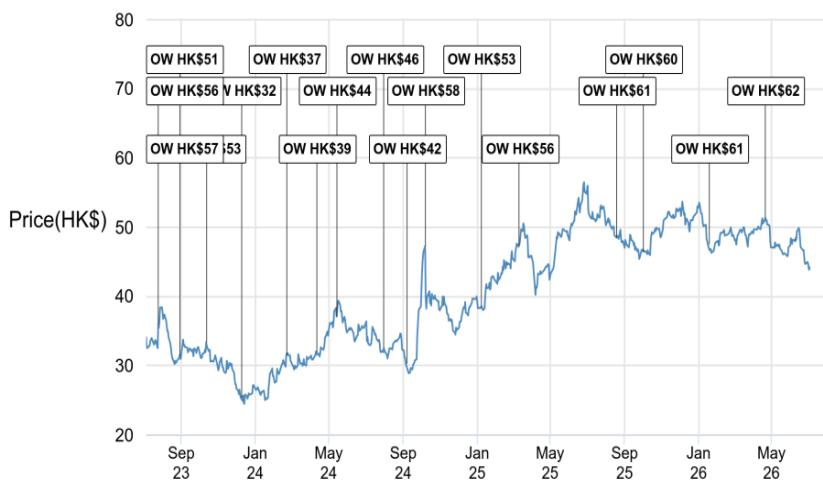
来源：Bloomberg Finance L.P. 和JPM；价格数据已根据股票分割和分红进行调整。首次覆盖日期：2007年4月13日。所有股价均为前一交易日收盘价。

<table><tr><td>日期</td><td>评级</td><td>价格（港币）</td><td>目标价（港币）</td></tr><tr><td>2023年7月5日</td><td>增持</td><td>37.25</td><td>57</td></tr><tr><td>2023年7月26日</td><td>增持</td><td>36.00</td><td>56</td></tr><tr><td>2023年8月30日</td><td>增持</td><td>31.50</td><td>51</td></tr><tr><
