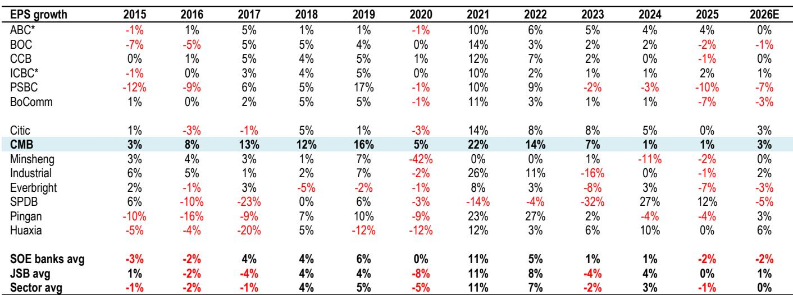
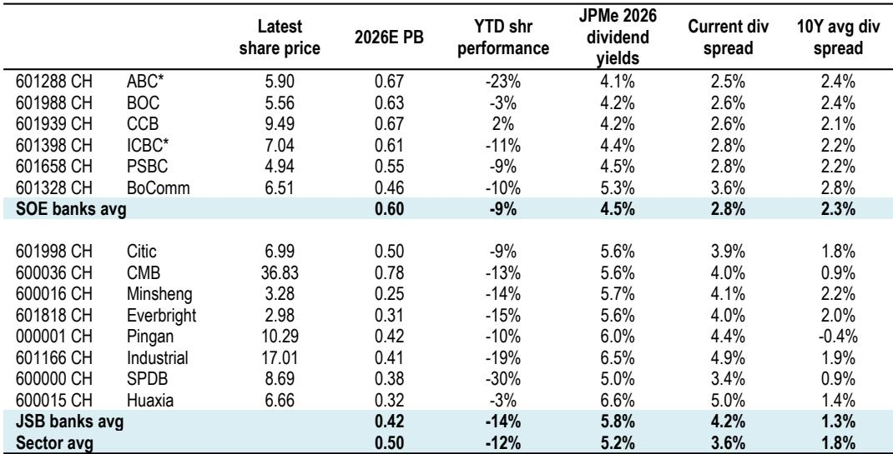
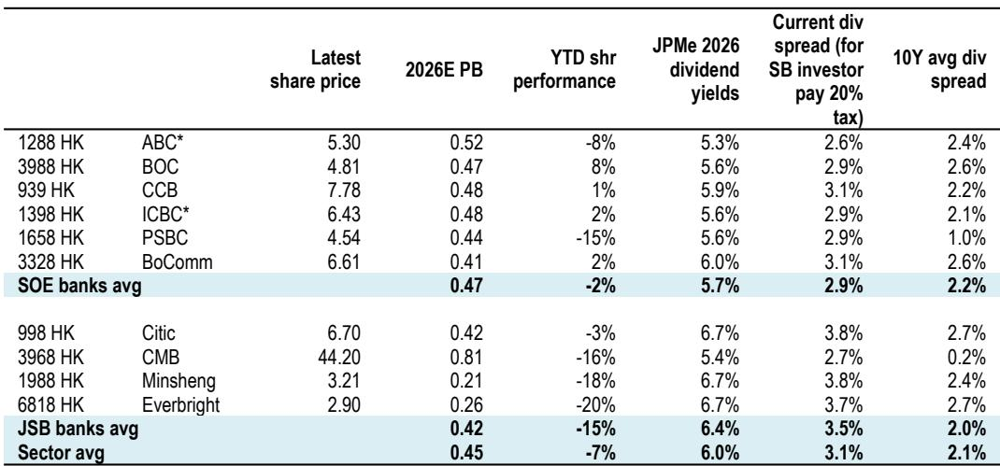

# JPM：银行股调整不是盈利问题，是股息吸引力不够

过去一个月，MSCI中国银行指数和沪深300银行指数分别调整了7%和5%。JPM最新研究认为，这一轮调整的核心驱动力并非盈利预期下修——同期EPS预测仅下调了2.8%和1.3%——而是风格切换。更深层的判断是：当前国有大行的股息率，无论H股还是相关市场，都不够有吸引力。

这听起来有些反直觉。在一个无不确定性利率持续走低的环境里，银行股5%上下的股息率难道不是稀缺资产吗？JPM的分析指向了三个关键变量：股息率与国债回报表现的利差处于历史低位、大行再融资对每股股息的稀释效应、以及保险资金等边际买家的增持能力已接近监管上限。

## 1. 国有大行H股的股息率，对境外和南向资金都不够“香”

报告给出的数字很直接。H股国有大行在扣除10%股息税后，与10年期美国国债的利差仅为40个基点，远低于过去十年280个基点的均值。相比之下，HSBC和渣打未来12个月的总回报（股息加回购）达到6%-7%，高于H股国有大行平均5.5%的水平。

对南向资金而言，扣除20%股息税后，H股大行与10年期中国国债的利差为260个基点，接近十年均值220个基点。这个水平并不算有吸引力。报告指出，如果H股国有大行的股息率能升至6%（对应税后利差约300个基点），报价需再调整约9%，那时才会出现更有力的支撑。

> **KC评论：** 这里的关键不是“银行股还能调整多少”，而是“谁会在什么价位进场”。报告明确画出了两条线：海外读者需要更高的利差补偿，南向资金则需要股息率突破6%。而平安保险这类最积极的买家，其持股已接近5%的举牌线，进一步增持空间有限。这意味着，短期内的边际买家力量可能被高估了。

## 2. 相关市场大行的股息率也面临一个被忽视的稀释不确定性

相关市场国有大行2026年股息率约4.4%，与国债利差270个基点，略高于十年均值。表面看仍有吸引力，但报告提醒了一个关键变量：再融资对每股股息的稀释。

以工行和农行为例，假设2026年下半年完成资本补充，JPM测算对全年每股股息的稀释效应分别为2%和7%。考虑稀释后，工行和农行的股息利差降至260和210个基点，前者与十年均值相当，后者已低于十年均值240个基点。报告认为，只有当股息利差回升至300个基点（对应相关市场约6%的报价仍在调整空间），报价才会有明确支撑。

这个视角在市场上讨论不多。多数读者只看静态股息率，但大行补充核心一级资本带来的股权稀释，正在悄然改变“高股息”的实际回报。

## 3. 招商银行成为相对少见的“股息+增长”交集

在JPM的覆盖范围内，招行是相对少见一家过去十年每年EPS都保持正增长的银行。2026年EPS增速预期为3%，而国有大行平均接近零增长。更重要的是，招行的核心一级资本充足率在全行业处于最高水平，再融资稀释不确定性极低。

当前招行H股股息率5.4%，与国有大行均值几乎持平；相关市场股息率5.6%，比大行均值高出140个基点。而其市净率和市盈率相对于国有大行的溢价，均处于过去十年的最低点附近——尽管其ROE比大行均值高出380个基点，接近十年均值400个基点的水平。

> **KC评论：** 招行的估值溢价已压缩至十年低位，但盈利能力和资本质量的相对优势并未消失。报告实际上是在问：市场是否过度调整了招行，以至于把它和国有大行“一视同仁”了？对于关注银行股的研究者，招行与国有大行之间的估值分化是否会修复，是一个值得持续跟踪的议题。

## 4. 报告尚未完全回答的问题：风格切换何时结束

这份报告清晰地解释了银行股调整的原因，也给出了股息率层面的支撑位。但有一个问题没有充分展开：风格切换本身何时会逆转？如果资金从银行股流向其他板块的趋势仍在持续，那么即使股息率达到报告测算的“支撑位”，报价能否企稳仍取决于更宏观的流动性环境和市场不确定性偏好。

此外，股份制银行的股息率虽然更高（相关市场均值达5.7%，利差400个基点），但盈利波动性和资本补充不确定性让读者难以将其视为纯粹的股息资产。报告对此着墨不多，但这恰恰是银行股内部结构性分化的核心——不是所有高股息都值得积极看待。

对产业决策者而言，这份报告的价值不在于预测银行股何时见底，而在于提供了一个清晰的估值锚定框架：股息率与国债利差、再融资稀释、边际买家能力，这三个变量共同决定了银行股的安全边际。在风格切换的噪音中，这些基本面锚点才是真正值得盯住的信号。

---

For informational purposes only. Portions may be generated,translated,summarized,or edited with AI assistance based on source materials and may contain omissions or errors. Please verify independently. This is not investment,legal,tax,accounting,or other professional advice.

For informational purposes only. Portions may be generated,translated,summarized,or edited with AI assistance based on source materials and may contain omissions or errors. Please verify independently. This is not investment,legal,tax,accounting,or other professional advice.

