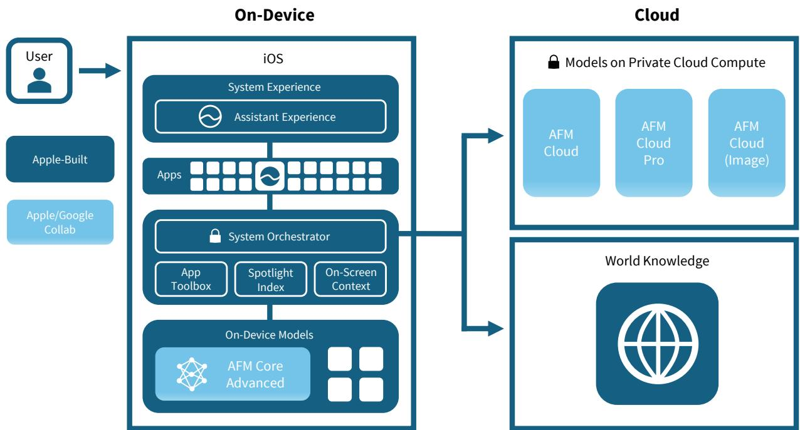
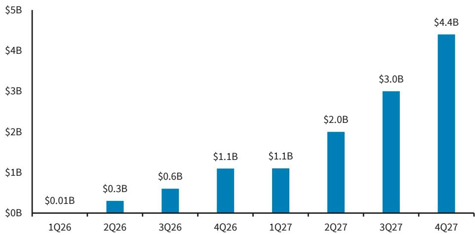

# U.S. Digital Advertising

## Consumer AI Starting to Take Shape - 2Q Preview

We are observing GOOGL, META and PINS ahead of the upcoming reports. We anticipate a solid quarter from the digital advertising group in 2Q, with key revenue growth rates broadly in line to above consensus. Trends should moderate through '26 but already reflected in current expectations.

The Key Takeaway: Market valuations across the digital advertising sector have been reacting more to AI trends and perceived winners/losers of late, rather than core financial results. GOOGL is benefiting mostly from GCP growth (and in 2Q likely the TPUaaS business) rather than Search revenue growth rates. META remains in a cautious sentiment environment, and we think the company could show progress on AI in 2H (both models and products) while ad revenue growth should remain steady. PINS is likely to get things back on track in 2Q (see below) and arguably has the best setup in the group heading into late '26 as core ads start to show relative strength. SNAP has been volatile around the Specs launch, but its ad business seems to be improving a bit in 2Q. This is all playing out as consumer AI seems on the verge of its next major push since ChatGPT's original debut. Native AI advertising remains nascent and isn't likely to have an impact on the group in 2Q. In summary, the backdrop remains broadly constructive for digital advertising: 1) concerns around AI disruption risk seem a bit overblown, and 2) most names are currently trading at a discount to the S&P 500.

Most Ad Categories Tracking Solidly in 2Q: Retail represents upwards of 20-25% of ad spend for larger walled gardens, and up to 85%+ for companies like Pinterest. With the combination of late-quarter promotions falling in 2Q this year (Prime Day, etc.) and some tariff refunds coming through to various brands and retailers being redeployed into customer acquisition, we think trends were broadly stable. Travel seemed to have picked up a bit as Middle East tensions eased and one-off events like World Cup helped demand. AI-native apps are being created and launched at a rapid pace, and often come with heavy direct response ad buys to increase awareness. Lastly, prediction market apps have hit product market fit in 2026 and seem to be leaning into digital marketing, which could result in billions of ad dollars for the largest ecosystems.

## Consumer AI on the Verge of Its Agentic Moment - Siri AI Could Restart the Consumer Race

The Siri AI debut at WWDC looked impressive from the standpoint of being the first "safe and normie" consumer AI app that defaults connectors across Apple's suite of O+O applications into the service for personalization. Gemini and ChatGPT have developer SDKs and plug-ins, but on a consumer opt-in basis they aren't in the same trusted position as Apple, nor do they sit at the OS/device levels. This kind of personalized service with connectors is likely to be what will push the consumer AI space into its next stage, much like how ChatGPT's original debut triggered chatbot adoption. Often a precursor to the West, we are seeing this trend already happening in China – WeChat is integrating its 4m mini-programs into its AI service, allowing consumers to take action, not just chat.

Apple went further out of its way to show off how the orchestration and routing layers of their new AI stack are largely built in-house (in some cases distilled from Gemini) and are not sending queries to other AI models, outside of a few complex tasks. This release was impressive in our view from the standpoint of abstracting away some of the complicated set-up steps for personalized consumer AI, allowing the user to take action, not just chat, and giving Apple much more control of the user interaction layer on the iPhone.

**FIGURE 1. Apple Looks to Control Much More of the AI Experience (and the User Interaction Layer) with Siri AI**  
  
Source: BARC, Company Disclosures

Like WeChat, Apple is attempting to control most of the transactions between the user and third-party applications like DoorDash and Instacart via the App Intent API. In 2Q, ByteDance introduced paid tiers to its popular consumer AI service Doubao ranging from $10-$70 per month, comparable to ChatGPT (~5% payers), so we are likely to see other examples of consumer agent business models take form. All of this is to say that if Siri AI gains traction after being rolled out this fall, we believe it could direct some transactions away from existing channels and into Apple-controlled services.

Noted above, other consumer AI services are building the same capabilities, including Google's Gemini, Meta AI and ChatGPT via various third-party app integrations. To the degree that this kind of interaction between consumer agentic AI services and third-party apps takes off, it could shift ad dollars out of Search and Social, or could potentially be deflationary to overall digital advertising (but still TBD, depending on adoption).

## ChatGPT Ads Still Tiny, But Growing Fast

Somewhat related to consumer agentic AI adoption, we are monitoring how native AI advertising within these new surfaces is progressing. We aren't yet concerned around chatbot ads taking share from the legacy digital channels. There appears to be some anecdotal examples of companies/agencies cutting back on digital to fund chatbot ads, but in our view this is unlikely to be an issue in 2Q. We estimate AI ads could hit a $1B quarterly run rate by 4Q26, at which point the industry may have to start taking notice. Until then, trends and market share in core digital should remain largely as is.

**FIGURE 2. ChatGPT Ads Could Reach $1B Per Quarter By 4Q26**  
  
Source: BARC, The Information, Company Disclosures

## Company-Specific 2Q Previews

**GOOGL:** Checks remain solid in 2Q, and we are expecting similar growth in 2Q (ex-fx) for Google's ad businesses. We estimate Search revenue growth of 16% Y/Y (15% ex-fx) in 2Q, which seems appropriate based on the setup. Query growth has picked up from AI Overviews and AI Mode adoption, including the higher "refresh" rate on some of these queries. The reduction in organic traffic referrals continues to force brands to allocate more to paid search in order to grow. At the same time the company is starting to experiment with native AI ads in some of these new surfaces. We expect queries to remain elevated and paid click-through rates (CTR) to pick up potentially over the next year, but not likely by enough to drive above-industry growth in Search revenue. We expect YouTube +10% Y/Y in 2Q with some small help from the World Cup campaigns on the brand side, but ad growth continues to lag on the mix shift towards ad-free subscriptions. GCP should once again be the standout based on a combination of factors: Anthropic (private) and the overall inference side of GCP inflecting higher. We expect Google Cloud to grow well north of last quarter's 63% Y/Y as agentic enterprise AI appears to have really hit its stride in 2Q. EPS likely benefits once again from below-the-line gains in non-marketable securities from recent IPOs.

**META:** Advances in META's ad stack continue to drive subtle but important improvements in revenue trajectory. Engagement per user is up across IG and Blue based on content recommendations. Ad load is also going up dynamically, while ad targeting continues to improve. The company introduced its Adaptive Ranking Model in 4Q25 and has rolled it out more broadly since, and we think 2Q trends may have benefited to some degree. Some of the historical model tweaks have been subtle in terms of revenue impact, but this one seems more significant and could be more meaningful over time. We are modeling $59B in ad revenue (+25% ex-fx) which could prove conservative by a point or two. We aren't expecting any major surprises on the Capex or Opex outlooks in 2Q. We doubt the debate around equity financing needs or cloud tokens-as-a-service will be fully put to bed until the next Muse models are released, but we would use the recent volatility to add to positions.

**PINS:** As noted above, our checks suggest retail had a solid 2Q with late-quarter promotions helping a bit. We hosted an NDR for PINS management in early June and the tone was broadly upbeat. Direct response may see some improvement from tariff relief, and the company expressed excitement about what they expect TVScientific will bring to the table. Search ads for 3P-CTV is a nascent opportunity that only Amazon, and now PINS, are really pursuing at this point. Small advertiser spend should continue to outpace the larger accounts on PINS, on the back of Performance+. We expect some headwinds to Europe from the sales reorg, but that's well documented and we believe is already reflected in consensus. 2Q and the outlook for 2H could see slight upside for PINS vs our estimates; we are modeling revenue of $1.15b (+15% Y/Y).

**SNAP:** We are hopeful that SNAP could get things back on track in 2Q. The company is lapping some company-specific snafus in direct response, in addition to the tariff-related adjustments last year, both of which should see solid improvement. We expect core ad growth to pick up from 3% in 1Q to somewhere in the mid-single-digits in 2Q. Sponsored Snaps remains the new product most in favor for Snapchat, with increased focus on brands leveraging smaller groups and private conversations vs. the traditional social media ad buys. SNAP's brand advertising has been declining for a few quarters, so we would view any new signs of life as a positive. The Specs launch was met with new investor skepticism, but we note that the company packed a lot of technology into the form factor (comparable to a META Orion prototype) and can always slim things down in consumer v2 (which could already be in development). The company does have a nice lead in AR technology and the ecosystem around lens studio which it can leverage. The activist campaign seems to have come and gone without much impact, which may explain some of the weakness in shares since the Specs launch. Specs de-consolidation remains an option for Snap.

**LFTO:** We just initiated coverage of Liftoff, so for more detail on our thesis refer to Performance Rules Everything Around Me, 6/29/26. 2Q should have upside to the 28% Y/Y growth forecasted by consensus as the company continues to benefit from internal model updates that drive share gains within gaming and rapid growth in new categories like retail and prediction markets. 1Q had a successful model update, hence the company stated it doesn't expect the same level of growth in 2Q (FX was also a smaller tailwind).
