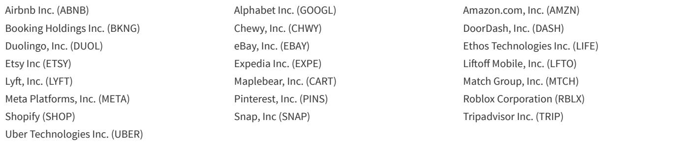

# BARC：消费者AI逼近代理时刻，苹果Siri将改变广告流向

数字广告行业正在经历一个微妙的转折。市场对二季度财报的关注点，已经从收入增速转向了AI叙事和竞争格局的变化。BARC这份覆盖谷歌、Meta、Pinterest、Snap和Liftoff的行业前瞻报告，提出了一个值得认真对待的判断：公司报价对AI趋势和赢家输家分化的反应，已经超过了对核心财务数据的反应。这一信号意味着，读者需要换一套框架来评估这个板块。

报告的核心逻辑并不复杂。数字广告的基本面依然稳健——零售、旅游、AI原生应用和预测市场类广告主都在加码投放，二季度多数公司的收入增速预计符合或略高于市场预期。但真正驱动报价波动的，已经不是这些数字本身，而是市场对各家公司在AI时代的站位预期。谷歌受益于GCP的持续增长和TPUaaS业务，Meta仍处在市场情绪的“冷宫”中，Pinterest则被认为拥有板块内最好的中期布局。这种分化背后的共同变量只有一个：谁能把AI变成新的收入引擎。

## 1. 消费者AI正在逼近“代理时刻”，苹果可能是那个引爆点

BARC将苹果Siri AI的WWDC发布视为消费者AI领域的下一个关键节点。与ChatGPT或Gemini不同，Siri AI是第一个默认打通苹果自有应用和服务生态的“安全且面向大众”的消费者AI产品。它不只是一个聊天工具，而是可以直接执行操作——从叫外卖到订机票，用户不再需要手动跳转多个App。

报告特别提到了一个值得追踪的参照系：微信正在将400万个小程序整合进其AI服务，让消费者可以直接通过AI完成操作，而不仅仅是对话。苹果走的是类似路径，但控制层级更深——它试图通过App Intent API掌控用户与DoorDash、Instacbot等第三方应用之间的交易链路。如果Siri AI在今年秋季推送后获得用户采纳，苹果有可能将一部分交易从现有渠道引流到其自有服务中。

> **KC评论：** 苹果的AI策略本质上是“围墙花园2.0”。上一代围墙花园靠App Store抽成，这一代靠AI代理控制用户交互层。如果成功，它将改变的不只是广告预算的流向，而是整个移动互联网的流量分配逻辑。报告没有展开的是，这种模式对谷歌搜索和Meta社交广告的长期侵蚀效应，可能比短期财报数据所反映的要大得多。

## 2. AI广告规模仍然很小，但增长曲线值得提前关注

报告估计，ChatGPT的原生AI广告在2026年四季度可能达到每季度10亿美元的运行率。这个数字放在全球数字广告6000亿美元的盘子中微不足道，但BARC提醒：当AI广告达到这个规模时，行业可能不得不开始正视它对传统渠道的替代效应。

目前已有零星案例显示，部分公司和广告代理商在削减传统数字广告预算来为聊天机器人广告腾出空间。但报告认为，这在二季度还不是一个需要担忧的问题。真正值得观察的是，当消费者AI代理（如Siri AI、Gemini、Meta AI）开始大规模与第三方应用交互时，广告预算是否会从搜索和社交渠道流出，甚至对整个数字广告市场产生价格变化效应。

## 3. 各公司分化明显，但报告尚未完全回答的关键问题是：AI变现的路径谁更清晰

谷歌的搜索收入增长预计在二季度达到16%，YouTube增长约10%，GCP增速可能超过上季度的63%。但市场对谷歌的关注已经转向AI Overviews和AI Mode带来的查询量增长，以及这些新场景何时能转化为广告收入。Meta的广告收入预计增长25%，其Adaptive Ranking Model被认为比以往任何一次算法更新都更有意义，但市场仍在等待下一代Muse模型的发布来判断其AI投入的回报。Pinterest的搜索广告和Performance+正在驱动中小广告主增长，但其欧洲销售重组的影响尚未完全消化。

报告没有完全回答的一个问题是：消费者AI代理的广告变现路径，究竟会沿着搜索广告的竞价逻辑，还是社交广告的提到逻辑，抑或是一种全新的交互式广告形态？苹果Siri AI的“代理即服务”模式，可能意味着广告主不再为展示付费，而是为AI执行的动作付费。这种转变如果发生，整个数字广告的定价体系都将被重塑。

对于读者而言，跟踪二季度财报时，除了关注收入增速和市场预期差，更值得留意的是各公司在AI代理战略上的具体进展——谁在控制用户交互层，谁在构建开发者生态，谁在尝试新的广告定价模式。这些才是决定未来两到三年板块格局的变量。

---

For informational purposes only. Portions may be generated,translated,summarized,or edited with AI assistance based on source materials and may contain omissions or errors. Please verify independently. This is not investment,legal,tax,accounting,or other professional advice.

For informational purposes only. Portions may be generated,translated,summarized,or edited with AI assistance based on source materials and may contain omissions or errors. Please verify independently. This is not investment,legal,tax,accounting,or other professional advice.

