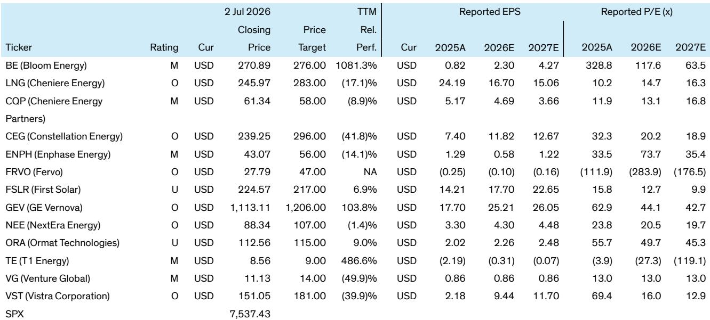

# Bernstein：光伏板块政策红利消退，FirstSolar面临成本削减考验

这份由Bernstein在2026年7月初发布的研究报告，覆盖了美国电力和能源转型板块的14家核心公司，覆盖时间点恰逢2Q26财报季即将开启。报告的核心判断并不复杂：美国电力需求的结构性增长，正在从“AI叙事”转化为可追踪的订单、合同和运营数据。对于关注美国能源基础设施、数据中心电力供应以及清洁能源转型的读者来说，这份报告提供了一个非常清晰的观察框架——哪些变量真正决定了公司的价值，哪些不确定性仍悬而未决。

报告开篇就点明了三个贯穿整个财报季的宏观主题：PJM容量市场的规则变化、与超大规模云服务商的购电协议进展，以及光伏领域的关税政策更新。这三个主题，恰好对应了电力板块当前最核心的三个驱动力——监管框架、需求来源、以及供应链政策。

## 1. PJM容量市场的“可靠性后手”正在重塑独立发电商的估值逻辑

PJM是美国最大的区域输电组织，其容量市场拍卖机制是决定燃煤、燃气和核电机组能否获得稳定收入的关键。Bernstein重点讨论了PJM新提出的“可靠性后手采购”机制，这一机制原定于2027年3月执行，但已被提前至2026年9月。

这背后的直接原因是：数据中心带来的用电需求增长，可能已经超出了现有容量市场拍卖的设计范围。PJM担心基础拍卖无法筹集足够的发电容量，因此计划通过两阶段的后手采购来补足缺口——第一阶段是双边合同撮合，第二阶段才是中央集中采购。

但问题在于，发电商对这一机制存在严重分歧。Vistra、Constellation Energy等独立发电商担心，后手采购可能导致过度采购，压低2029/30交付年度的基础拍卖价格，反而迫使部分机组提前退役。它们提出了一个替代方案：将后手采购改为单阶段、精准针对实际容量缺口的拍卖，并确保后手采购的容量不会重复计入基础拍卖。

> **KC评论：** 这一争议的本质是“谁为数据中心的电力需求买单”。如果PJM最终采纳发电商的方案，意味着超大规模客户需要更直接地通过双边合同锁定容量，而不是通过市场机制摊派成本。这对拥有核电机组、能够提供24/7无碳电力的Constellation和Vistra是利好，但对依赖市场拍卖定价的纯燃气机组则存在不确定性。报告没有给出结论，但指出这是2Q财报季必须追问的问题。

## 2. 超大规模客户的购电协议正在从“意向”走向“合同条款”

报告覆盖的14家公司中，多数都直接或间接受益于与超大规模云服务商的购电协议。Bernstein指出，财报电话会议的讨论焦点已经从“有没有合同”转向了“合同价格趋势、预期容量增加、以及协议性质”——是双边合同还是共址模式，这直接决定了发电商的收入质量和不确定性敞口。

以Bloom Energy为例，该公司在上一季度将全年收入指引从32亿美元上调至36亿美元，毛利率指引从32%上调至34%，直接驱动力就是来自甲骨文等AI客户的订单。Bernstein对Bloom持谨慎乐观态度，认可其“速度到电力”的技术优势，但也指出其规模化瓶颈和燃料电池寿命仍低于燃气轮机。

GE Vernova则是另一个值得关注的案例。报告指出，其2026年上半年燃气发电订单的定价预计比2025年四季度高出10-20个百分点，这一提价能力直接反映了供需紧张。同时，GEV正在测试与超大规模客户的固态变压器，预计秋季会有更新——这可能是其电气化业务的一个潜在催化剂。

> **KC评论：** 购电协议的价格趋势比数量更重要。如果合同价格持续走高，意味着电力供应缺口比市场预期的更大，独立发电商的议价权在增强。但如果合同价格趋于稳定甚至回落，则可能意味着供应端在快速响应。Bernstein没有直接判断趋势方向，但给出了一个清晰的追踪框架：价格、容量、协议类型。

## 3. 光伏板块的“政策依赖”在2Q财报季面临真正考验

对于First Solar和Enphase，Bernstein的观点更加审慎。First Solar的毛利率在1Q26达到47%，但报告估算税收抵免贡献了其中约85%的利润，而这一政策将从2030年开始逐步退出。尽管公司近期在美国的订单均价回升至34-35美分/瓦，但来自印度的高毛利订单占比下降，整体均价反而承压。

关键催化剂是预计在8月做出的“232条款”关税决定——如果对多晶硅衍生物加征关税，可能推动组件均价和订单量进一步上升。但报告也明确指出了First Solar尚未回答的问题：在没有税收抵免的情况下，成本削减策略是什么？

Enphase的情况则更为严峻。2026年被视为其“低谷年”，1Q26非GAAP毛利率已从4Q25的约46%降至约44%，原因在于美国户用太阳能市场在25D税收抵免到期后需求节奏变化。Bernstein预计2Q的终端销售量低于预期10-15%，但认为未来几个季度市场可能触底反弹。值得关注的亮点是Enphase基于GAN的新型微型逆变器，以及其固态变压器在数据中心的潜在应用——管理层的目标是到2031年实现超过11GW的市场规模。

> **KC评论：** 光伏板块的核心矛盾在于：政策红利正在消退，但技术替代尚未成熟。First Solar和Enphase都在押注新技术——前者在研发钙钛矿和CuRe技术，后者在推固态变压器。但这些技术距离规模化商业化仍有2-3年时间。2Q财报季的真正看点，不是当季业绩，而是管理层如何回答“过渡期怎么办”。

## 报告尚未完全回答的关键问题：监管不确定性的定价

Bernstein在多个公司分析中都提到了一个共同的不确定性——监管。无论是PJM的容量市场规则、232条款关税决定，还是Constellation Energy面临的“大型负荷客户监管框架”不明确，都指向同一个问题：当监管环境在快速变化时，市场如何给这些公司定价？

报告没有给出明确的定价框架，而是提供了一个观察窗口：财报电话会议上，管理层对监管进展的表述是否从“等待”变为“推进”，是否能够给出更具体的交易时间表。这可能是判断估值拐点的最直接信号。

对于关注美国能源转型和数据中心电力需求的读者，这份Bernstein报告的价值不在于给出明确的研究交流，而在于提供了一套可验证的观察框架：订单价格是否持续走高、购电协议是否从意向变为合同、监管不确定性是否在收敛。这些变量的变化，比任何单一季度的业绩数字都更能说明行业的方向。

For informational purposes only. Portions may be generated,translated,summarized,or edited with AI assistance based on source materials and may contain omissions or errors. Please verify independently. This is not investment,legal,tax,accounting,or other professional advice.

For informational purposes only. Portions may be generated,translated,summarized,or edited with AI assistance based on source materials and may contain omissions or errors. Please verify independently. This is not investment,legal,tax,accounting,or other professional advice.

