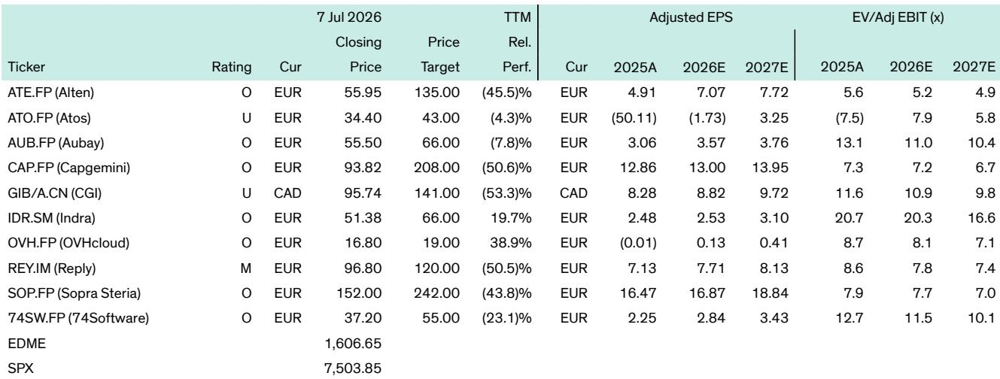

# Bernstein：贝恩研究佐证，AI改写代码快但利润未增，软件定价权面临挑战

法国软件与IT服务行业协会Numeum最新半年度调查，揭示了欧洲科技行业当前最真实的处境。Bernstein在解读这份覆盖413家企业和CIO的问卷后，给出的判断值得仔细推敲：行业确实在复苏，但势头远不如六个月前的预期强劲。更关键的是，AI带来的业务增量并未转化为利润改善，而小型企业的信心仍在调整，正在影响整体修复节奏。

这不是一份让人兴奋的报告。但正是这种克制，让它的信号价值更高。

## 1. 软件增速预期从+8.4%下调至+6.2%，小企业信心是最大变量

调查显示，软件板块的增长预测被明显下修，从半年前的8.4%降至6.2%。IT服务板块的预期则维持在低个位数。报告特别指出，调查期间正值中东局势紧张，法国GDP增速预测已被调降10个基点。但更结构性的原因在于小型企业——无论是软件开发商还是IT服务商——普遍缺乏信心。

小型IT服务商面临客户合并供应商名单、向近岸和离岸交付模式转移、以及新技术研究不确定性三重挑战。小型软件开发商则在AI工具带来的运营成本上升中挣扎。Bernstein认为，正因为小企业问卷权重较高，整体数据看起来比实际更谨慎一些。

> **KC评论：** 这份调查提醒我们，行业复苏不能只看头部公司的订单。小企业是欧洲科技生态的毛细血管，它们的信心缺失往往预示着更长的修复周期。完整报告中的增长预测表格值得细看，尤其是2025年实际数据与2026年预期之间的落差。

## 2. “SaaSpocalypse”未出现，但CIO对AI替代的警惕在上升

一个令人意外的发现是，软件厂商并未因新进入者而出现客户流失加剧，也没有出现大量“软件工厂”取代现有产品的现象。但调查中有一组数据值得高度关注：22%的CIO认为，agentic AI有可能替代或减少某些软件支出。

“某些”这个词很关键。Bernstein引用贝恩咨询的研究指出，在并购流程中，AI已经能够在10天内重写80%的应用程序代码。这意味着，那些非核心业务的软件支出，正面临真正的替代不确定性。

软件厂商自身也感到不确定性。虽然AI带来的技术变革尚未直接颠覆现有业务，但决策者正在花更长时间做选择。对于仍处于AI应用早期阶段的软件公司来说，如何将新功能货币化、如何改造技术栈以匹配AI原生公司的能力，仍是一条长路。

## 3. AI带来业务，但不带来利润——这个矛盾尚未被市场充分定价

无论是软件厂商还是IT服务商，都报告了显著的AI相关生产率提升。但出人意料的是，没有任何一个群体预期利润率会有明显改善。原因有两方面：一是生产率提升的收益被传递给了客户，二是企业需要承担AI工具带来的额外成本。

这意味着，AI目前更多是“成本中性”的技术研究，而非利润放大器。对于读者而言，这挑战了“AI提升效率必然改善盈利”的简单叙事。真正能兑现利润的企业，可能需要在规模、定价权和成本控制之间找到更精细的平衡。

> **KC评论：** 这是报告中最有洞察力的判断之一。Bernstein实际上在说：AI的竞争红利，目前更多流向了客户而非供应商。完整报告对软件和IT服务两个板块分别做了分析，中间的逻辑链条值得逐段推敲。

## 4. 报告没有完全回答的问题：当绿色IT不再成为优先级

调查中还有一个令人关注的趋势：能源效率和绿色IT在CIO的2026年优先级列表中仅排在第22%的位置，远落后于网络安全、合规、成本优化和生成式AI。面对技术颠覆和信息系统升级的不确定性，可持续性被挤出了议程。

这引出一个尚未被充分讨论的问题：如果欧洲科技企业在AI竞赛中牺牲了绿色承诺，监管和客户会如何反应？报告没有给出明确答案，但这可能是未来两年行业格局变化的一个重要变量。

---

对于关注欧洲科技行业的决策者来说，这份报告的价值不在于数据本身，而在于它揭示了一个正在形成的共识：复苏在继续，但速度在节奏变化；AI在渗透，但利润并未同步增长。真正的分化，或许才刚刚开始。

For informational purposes only. Portions may be generated,translated,summarized,or edited with AI assistance based on source materials and may contain omissions or errors. Please verify independently. This is not investment,legal,tax,accounting,or other professional advice.

For informational purposes only. Portions may be generated,translated,summarized,or edited with AI assistance based on source materials and may contain omissions or errors. Please verify independently. This is not investment,legal,tax,accounting,or other professional advice.

