# Global Semiconductors

## Global Semis: Progress of Foundry Decoupling up to 2025

Qingyuan Lin, Ph.D.
+852 2123 2654
qingyuan.lin@bernsteinsg.com

Mark Li
+852 2123 2645
mark.li@bernsteinsg.com

Kai Zhang
+852 2123 2665
kai.zhang@bernsteinsg.com

Francis Ma
+852 2123 2626
francis.ma@bernsteinsg.com

Edward Hou, CFA

+852 2123 2623

edward.hou@bernsteinsg.com

Yipin Cai, CFA

+852 2123 2669

yipin.cai@bernsteinsg.com

Amidst geopolitical tension, many observers expect that foundry decoupling will happen very fast between China and Non-China markets. We analyze the trend annually, this report provides an update on the progress up to 2025. We continue to see further decoupling but at a slow pace, indicating that this will be a multi-year theme rather than a sprint.

Decoupling is happening in foundry, but not as rapidly as many think. In 2025, both advanced-node and mature-node were far from fully decoupled from foundries elsewhere. For Chinese IC suppliers/fabless, 32% of advanced-node demand was sourced from Chinese foundries, increasing from 25% in 2024. As for mature-node, Chinese foundries fulfilled 59% of the demand from Chinese IC suppliers/fabless, marginally increased from 57% in 2024. For non-Chinese IC suppliers/fabless, 5.7% of their mature-node demand was sourced from Chinese foundries, slightly below 6.1% in 2024. For advanced nodes, all non-Chinese fabless chose to source outside of China. For Chinese fabless, some (e.g. Huawei) are forced to source from Chinese foundries, but many still used TSMC when these advanced-node chips (all non-AI chips are not restricted) are outside the scope of export control.

Chinese IC suppliers gain share slightly in matured node, but further lose share in advanced node. From the perspective of IC suppliers, the forced decoupling has led Chinese IC suppliers/fabless to lose share in advanced-node from 14% in 2024 to 11% in 2025. We observe that Chinese foundries are expanding capacity more aggressively for advanced-node in 2025/26 after the local tools improved their performance, so we should see this number reversing over the next few years as chips produced by these new capacity enters the market. On the other hand, Chinese IC suppliers slightly increased their market share in the matured-node from 28% in 2024 to 29% in 2025. This shift in IC suppliers is often due to the sourcing power of Chinese OEMs which have to import advanced chips but have been localizing mature-node chips more, but the progress of mature-node fabless share gain has also slowed down.

China is expanding foundry capacity aggressively, but has only gained limited share globally in matured logic, blended share is actually declining. From a Foundry perspective, the decoupling has motivated China to aggressively expand its capacity to achieve greater self-sufficiency, as evidenced by SMIC's ~100% CapEx/Rev for the past 5 years (while TSMC only at ~40%). While some progress has been made, the goal is far from fully realized. In 2025, in advanced nodes Chinese foundries had only a 3.5% global share but Chinese fabless had 11%, implying the self-sufficiency at 32% at most. In mature nodes as Chinese foundries had a 21% global share & Chinese fabless held 29%, the self-sufficiency was 72%, also not yet fully decoupled. The gap vs. full decouple in advanced-node is because Chinese foundries continue to face challenges in ramping up capacity and improving the yield to lower the cost, primarily due to equipment constraints. On the other hand, the gap in matured nodes is probably due to a slow migration for Chinese fabless. In both cases, there are reasons for Chinese foundry to further expand capacity aggressively. However, we also notice that the share gain by Chinese foundries has been slow, both mature logic and advanced logic has been flattish from 2024 to 2025, and the blended share actually decreased slightly.

## BERNSTEIN TICKER TABLE

<table><tr><td rowspan="2">Ticker</td><td rowspan="2">Rating</td><td rowspan="2">Cur</td><td rowspan="2">7 Jul 2026 Closing Price</td><td rowspan="2">Price Target</td><td rowspan="2">TTM Rel. Perf.</td><td colspan="4">Reported EPS</td><td colspan="3">P/B (x)</td></tr><tr><td>Cur</td><td>2025A</td><td>2026E</td><td>2027E</td><td>2025A</td><td>2026E</td><td>2027E</td></tr><tr><td>2330.TT (TSMC)</td><td>O</td><td>TWD</td><td>2,440.00</td><td>2,780.00</td><td>87.5%</td><td>TWD</td><td>66.25</td><td>101.62</td><td>124.63</td><td>11.7</td><td>8.6</td><td>6.6</td></tr><tr><td>TSM (TSMC)</td><td>O</td><td>USD</td><td>451.79</td><td>430.00</td><td>69.4%</td><td>USD</td><td>10.48</td><td>16.07</td><td>19.70</td><td>13.7</td><td>10.1</td><td>7.7</td></tr><tr><td>2303.TT (UMC)</td><td>U</td><td>TWD</td><td>155.00</td><td>47.00</td><td>216.2%</td><td>TWD</td><td>3.34</td><td>3.31</td><td>3.85</td><td>5.1</td><td>5.0</td><td>4.8</td></tr><tr><td>UMC (UMC)</td><td>U</td><td>USD</td><td>25.83</td><td>7.40</td><td>195.4%</td><td>USD</td><td>0.54</td><td>0.53</td><td>0.62</td><td>5.6</td><td>5.1</td><td>4.9</td></tr><tr><td>5347.TT (Vanguard)</td><td>M</td><td>TWD</td><td>175.00</td><td>94.00</td><td>53.9%</td><td>TWD</td><td>4.30</td><td>4.34</td><td>4.44</td><td>5.1</td><td>5.1</td><td>5.1</td></tr><tr><td>981.HK (SMIC-H)</td><td>O</td><td>HKD</td><td>73.45</td><td>120.00</td><td>22.5%</td><td>USD</td><td>0.09</td><td>0.12</td><td>0.16</td><td>107.6</td><td>75.9</td><td>57.4</td></tr><tr><td>OLD</td><td></td><td></td><td></td><td>70.00</td><td></td><td></td><td></td><td>0.10</td><td>0.13</td><td></td><td></td><td></td></tr><tr><td>688981.CH (SMIC-A)</td><td>O</td><td>CNY</td><td>145.42</td><td>220.00</td><td>29.2%</td><td>USD</td><td>0.09</td><td>0.12</td><td>0.16</td><td>245.9</td><td>173.6</td><td>131.3</td></tr><tr><td>OLD</td><td></td><td></td><td></td><td>120.00</td><td></td><td></td><td></td><td>0.10</td><td>0.13</td><td></td><td></td><td></td></tr><tr><td>1347.HK (Hua Hong-H)</td><td>O</td><td>HKD</td><td>180.00</td><td>220.00</td><td>365.8%</td><td>USD</td><td>0.03</td><td>0.13</td><td>0.19</td><td>723.1</td><td>179.8</td><td>121.7</td></tr><tr><td>OLD</td><td></td><td></td><td></td><td>100.00</td><td></td><td></td><td></td><td>0.11</td><td>0.16</td><td></td><td></td><td></td></tr><tr><td>688347.CH (Hua Hong-A)</td><td>O</td><td>CNY</td><td>324.00</td><td>370.00</td><td>460.6%</td><td>USD</td><td>0.03</td><td>0.13</td><td>0.19</td><td>N/M</td><td>373.6</td><td>252.9</td></tr><tr><td>OLD</td><td></td><td></td><td></td><td>140.00</td><td></td><td></td><td></td><td>0.11</td><td>0.16</td><td></td><td></td><td></td></tr><tr><td>ASIAX</td><td></td><td></td><td>1,979.72</td><td></td><td></td><td></td><td></td><td></td><td></td><td></td><td></td><td></td></tr><tr><td>SPX</td><td></td><td></td><td>7,537.43</td><td></td><td></td><td></td><td></td><td></td><td></td><td></td><td></td><td></td></tr></table>

PRICE TARGET CHANGE / ESTIMATE CHANGE IN BOLD

O - Outperform, M - Market-Perform, U - Underperform, NR - Not Rated, CS - Coverage Suspended 981.HK, 688981.CH, 1347.HK, 688347.CH valuation is Reported P/E (x);
Source: Bloomberg, Bernstein estimates and analysis.

## INVESTMENT IMPLICATIONS

TSMC: We rate TSMC Outperform with TP=NT$2,780.00, and TP = US$430.00 for ADR.

UMC: We rate UMC Underperform with TP=NT$47.00, and TP = US$7.40 for ADR.

Vanguard: We rate Vanguard Market-Perform with TP=NT$94.00.

SMIC: We rate SMIC Outperform with TP=HKD 120.00 for H-share, and TP=CNY 220.00 for A-share. We appreciate the strong revenue momentum achieved by the company due to capacity expansion and ASP improvement. And we improved NTM P/B multiple from 3.2x to 5.4x to reflect the upside the company will be benefited from along with consistent foundry localization and technology upgrades trends in China. Therefore, we upgraded our TP for SMIC H-share to HKD 120 (from 70) and A-share to CNY 220 (from 120) accordingly.

Hua Hong: We rate Hua Hong Outperform with TP=HKD 220.00 for H-share, and TP=CNY 370.00 for A-share. We updated our revenue forecast to reflect the strong performance that the company has delivered via continuously expanding capacity and maintaining high utilization rate. In addition, we increase NTM P/B multiple from 3.2x to 6.8x to incorporate strong demand and tightening supply. Therefore, we upgraded our TP for Hua Hong H-share to HKD 220 (from 100) and A-share to CNY 370 (from 140) accordingly.

## DETAILS

Amidst geopolitical tension, many observers expect that foundry decoupling will happen very fast into China/Non-China. We analyze the trend annually, this report provides an update to the progress till 2025, and the implications to the names in our coverage including TSMC, SMIC, UMC, Hua Hong, Vanguard.

We earlier published a report in 2024 (Global Semiconductors: China buying WFE - will it ever stop? A quantitative assessment) to quantitatively assess the sustainability of semicap demand from China should China pursue to fully decouple from oversea supply, and later (in 2025) another further deep dive on foundry decoupling to access the progress and potential impact (Global Semiconductors: Decoupling in foundry? A quantitative assessment). Today's report succeeds those two reports and provide updates on how decoupling has affected foundries in 2025. We continue to make a distinction between advanced and mature nodes as export controls make them two separate markets, and further quantitatively dimension the possible revenue changes to foundries in our coverage if full decoupling happens. Here we define all process equal or above 22/28nm as mature-node, and below 22/28 nm (FinFET and below) as advanced-node to be consistent with US export control.

Our analysis in this call is based on bottom-up analysis, and therefore should be reasonably accurate as most data is public disclosures. We further enhance it with our estimates & findings from supply chain checks.

\- We gathered data from all major foundries worldwide and categorized their revenue into four segments for the bottom-up analysis: China vs. Non-China and Advanced vs. Mature nodes. The distinction between China and Non-China is based on the headquarters of the foundry customers, which can include fabless companies or IDMs (Integrated Device Manufacturers) outsourcing their production. We refer to these collectively as IC Suppliers, but sometimes also refer them as fabless below as they are more representative. Traditionally, the distinction between Advanced and Mature nodes evolves as Moore's Law advances. However, in this analysis, we adopted the definition of U.S. export control, which classifies nodes as Mature if they are ≥ 28/22nm and Advanced if they are <22nm.

\- The analysis is based on a bottom-up analysis of 25 foundries globally. We carefully calibrate our data with the public disclosures on revenue size, wherever possible, and complement that with our estimates. TSMC is the biggest foundry globally and that is true for Chinese customers too. We hence calibrate TSMC's data particularly carefully. With that, we believe the analysis and conclusions in this call should be reasonably accurate.

## FOUNDRY DECOUPLING: HOW MUCH/FAST IS IT HAPPENING?

## Decoupling is happening in foundry, but not as much/fast as many think.

\- In 2025, for Chinese IC suppliers/fabless, only 59% of their mature-node demand and 32% for their advanced-node demand was sourced from Chinese foundries, far from fully decoupled. While such a proportion for advanced-node significantly increased (vs. 3% in 2020), the increase achieved in mature-node was relatively small, from 45% in 2020 to 59% in 2025.

\- On the other hand, for non-Chinese IC suppliers/fabless, 5.7% of their mature-node demand was sourced from Chinese foundries, marginally decreased from 6.1% in 2024. This shows that the non-Chinese fabless are still decreasing their reliance on Chinese foundries.

For Chinese IC suppliers, as US export controls force Chinese fabless (esp. Huawei/HiSilicon) to use Chinese foundries, we continue to see their outsourcing to Chinese foundries pick up, although mostly in advanced-nodes but only gradually in mature-nodes.

\- When we look at the % of wafer production sourced by Chinese IC suppliers/fabless, we find they indeed have been sourcing more locally from Chinese foundries, up from 30-35% in 2017-2020 to 50% in 2025 (Exhibit 1). While Huawei and other Chinese customers over the past few years sourcing USD ~3bn more advanced-node production domestically from SMIC provided concrete contributions (Exhibit 2), incremental mature-node production was still the major driver (USD ~6.5bn more from 2020-25, Exhibit 3).

\- Though the incremental size of localization was bigger in mature nodes, that represented only a minor increase in localization rate, up from bottom in 2020 at 45% to 59% in 2025 (Exhibit 3). On the other hand the increase of the localization rate was more pronounced in advanced nodes, up from nearly zero before to ~32% in 2025 (Exhibit 2).

\- For advanced-node, export controls have been impactful — due to export restrictions, fabless like Huawei has no alternative but to rely on domestic foundries, despite higher cost. In the mature-node segment, however, the decoupling effect on Chinese foundries has been small. Chinese fabless companies have only slightly increased their onshoring of mature-node production, indicating that geopolitical factors play a much smaller role here. Free from export controls, these fabless firms maintain a relatively larger presence in non-Chinese foundries in mature nodes. Together with overall capacity expansion, we observed that Chinese fabless companies have consistently increased their wafer sourcing from both Chinese and non-Chinese foundry in mature-node. And localization rates for mature-node have been increased consistently since 2020.

At the same time, non-Chinese IC suppliers still gradually shift away from Chinese foundries as many expected. The ‘China for China’ strategy might have slowed it down a bit but did not stop that trend.

\- As for non-Chinese foundry customers (some IDMs but mostly fabless, & hence referred as "non-Chinese fabless" below), they didn't source much from Chinese foundries to start with (only ~5% in 2017, Exhibit 4) and the incremental decoupling away from Chinese foundries has been very slow in mainly mature nodes (Exhibit 5, Exhibit 6). Their overall sourcing rate from Chinese foundries probably dropped 1-2% over the past 5 years (Exhibit 4), but more due to the rising mix to advanced nodes. Exhibit 6 show that even in matured-node, non-Chinese fabless steadily reduce sourcing from Chinese foundries since 2022.

\- Further, some may assume non-Chinese fabless moving production out of China will bring meaningful growth to non-Chinese foundries, particularly to UMC or Vanguard as their business & investment consideration is all mature nodes. However, as shown in Exhibit 6, these customers source predominately outside of China anyway, and as of 2025 in total only had 5.7% of their mature-node production done in China. Hence, the growth headroom offered by moving production away from China is limited, and may create a meaningful upside only at small foundries. In addition, they need to offer competitive price, quality, etc.

EXHIBIT 1: Chinese IC suppliers have been sourcing more locally from Chinese foundries, up from ~30-35% in 2017-2020 to ~50% in 2025  
Wafer Sourcing of Chinese IC Suppliers: Overall (Mature+Advanced)  
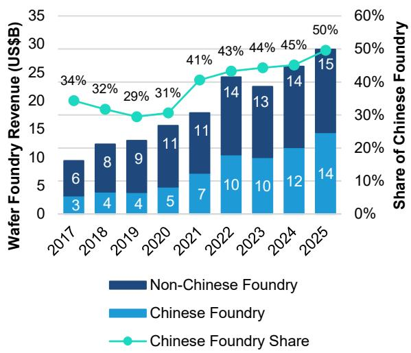  
We use a bottom-up approach to generate this report, but given many foundries don't disclose their revenue share between China & overseas or advanced & mature, we factored in our estimates for every bar in this report.
Source: Company reports, Bernstein analysis and estimates  
EXHIBIT 2: Advanced-node sourcing domestically from SMIC has surpassed 30% in 2025 for the first time by Huawei and other Chinese customers  
Wafer Sourcing of Chinese IC Suppliers: Advanced-Node

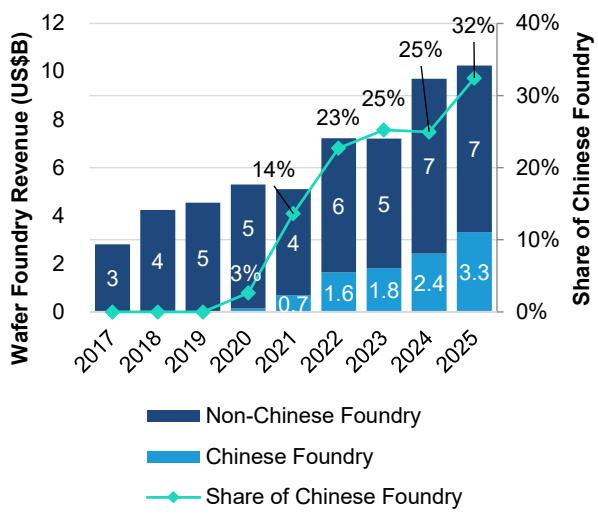  
Source: Company reports, Bernstein analysis and estimates

EXHIBIT 3: Though the incremental size of localization was bigger in mature nodes, that represented a smaller increase in localization rate, up from high 40s% previously to 59% in 2025  
Wafer Sourcing of Chinese IC Suppliers: Mature-Node  
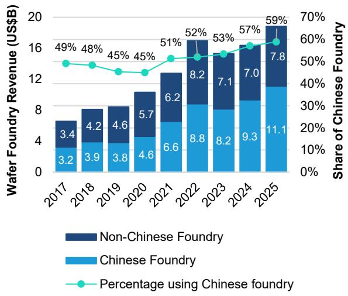  
Source: Company reports, Bernstein analysis and estimates  
EXHIBIT 4: Overall sourcing rate of non-Chinese fabless from Chinese foundries dropped 1-2% over the past 5 years  
Wafer Sourcing of non-Chinese IC Suppliers: Overall (Mature+Advanced)

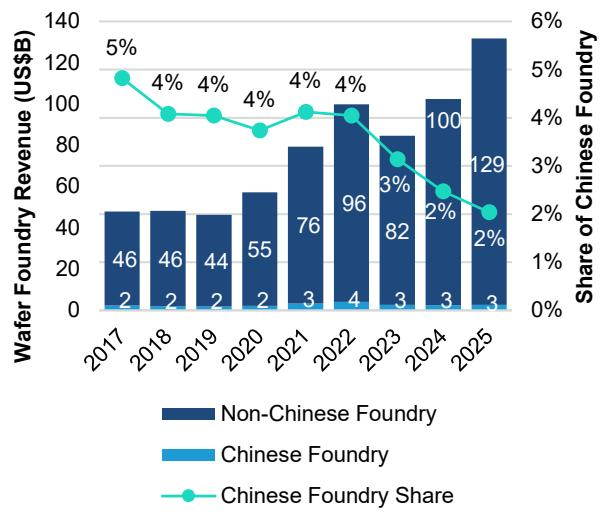  
Source: Company reports, Bernstein analysis and estimates

Wafer Sourcing of non-Chinese IC Suppliers: Advanced-Node

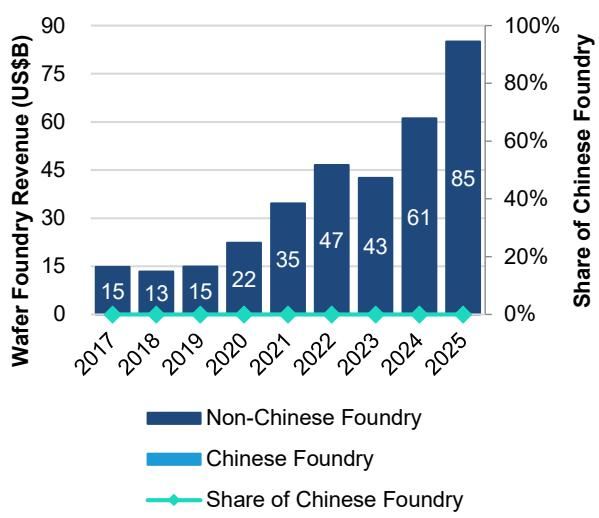  
Source: Company reports, Bernstein analysis and estimates  
EXHIBIT 6: ...and only marginally in mature nodes  
Wafer Sourcing of non-Chinese IC Suppliers: Mature-Node

EXHIBIT 5: Non-Chinese fabless didn't source much from Chinese foundries to start with and the incremental decoupling away from Chinese foundries has been basically none in advanced nodes...  
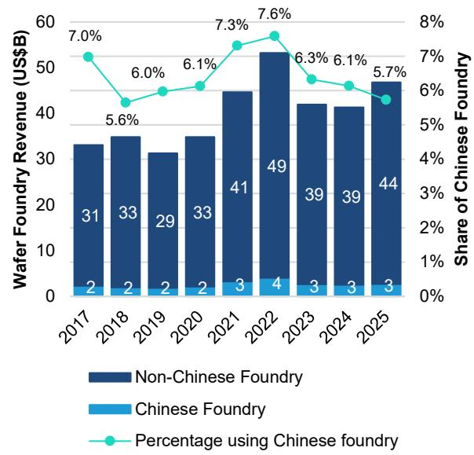  
Source: Company reports, Bernstein analysis and estimates

## GLOBAL IC SUPPLIER SHARE SHIFT

From a IC supplier perspective, the forced decoupling has led to a decrease in the share of Chinese fabless in advanced nodes, dropping from 23% in 2019 to 11% in 2025. However, this shift has simultaneously allowed Chinese fabless companies to increase their market share in the matured-node segment, from 21% in 2019 to 29% in 2025.

\- The definition of "advanced nodes" is supposed to evolve over time, as Moore's Law keeps moving ahead and an advanced node today will become mature later. However, as the US has said no plan to adjust the threshold of export controls, we believe < 22/28nm nodes will always be deemed "advanced" going forward. Our analysis aligns with this and assumes the definition "advanced nodes" stays at < 22/28nm nodes post the announcement of export controls in 2020.

\- Under that definition, an increasing portion of semiconductor market will inevitably shift into advanced-node, a territory that China finds difficult to compete in due to constrain in WFE (Exhibit 7, Exhibit 8, share of advanced-node clearly go up). Exhibit 7 & Exhibit 8 also show that most of advanced-node market was captured by non-Chinese IC suppliers and foundry. The limitation on advanced-node is more pronounced for Chinese foundries (Exhibit 9), less for Chinese fabless (Exhibit 10), as the foundry restriction on advanced-node focuses only on high-end AI or military chips, but actually allows foreign foundries to produce consumer & automotive ones (such as those Application Processors in smartphones and ADAS chips in cars). Exhibit 2 also confirms that nearly 68% of the advanced-node production for Chinese fabless was still carried out by foreign foundries & the onshoring ratio was only 32% in 2025.

\- However, export control still impacted the Chinese fabless in advanced node, as their share within the global advanced node market dropped from the peak at 24% in 2018 (mostly from Huawei) to 11% in 2025 (Exhibit 11). When AI drove the global demand of advanced node to grow faster than matured node in 2025, it is clear that Chinese fabless has been constrained on the supply side and still lose share slightly. However, this is not the case for matured-node, with IC suppliers gradually gaining share in the global matured-node market, from only 17% share in 2017 to 29% share in 2025 (Exhibit 12). We think this is likely due to Chinese OEM increasingly adopt Chinese fabless in their supply chain, indicating a continuous domestic substitution in matured node semiconductors.

EXHIBIT 7: From foundry headquarters' perspective, nearly all of advanced-node market was captured by non-Chinese foundries, especially TSMC

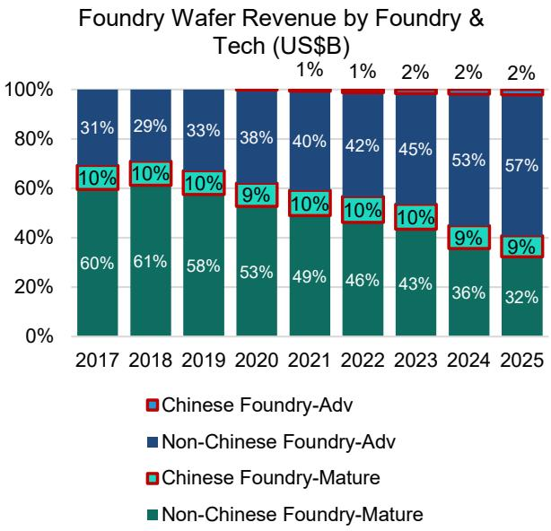  
Source: Company reports, Bernstein analysis and estimates  
EXHIBIT 8: Chinese IC suppliers (mostly fabless) have a small share in advanced nodes, but not as low as Chinese foundries  
Foundry Wafer Revenue by Customer & Tech (US$B)

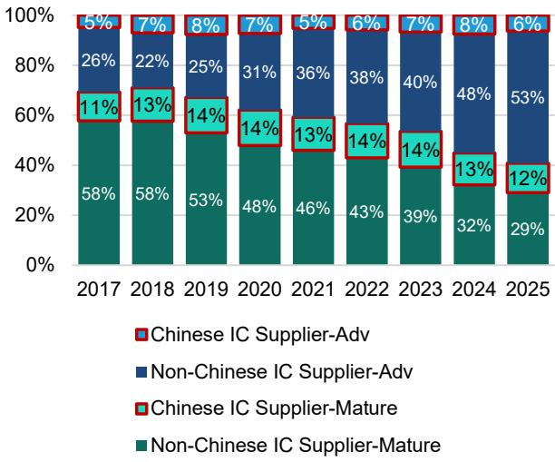  
Source: Company reports, Bernstein analysis and estimates

EXHIBIT 9: Despite force decoupling, Chinese foundry's revenue from the advanced nodes still stayed very small while the rest of world has been growing strongly in this territory

Foundry Wafer Revenue by Foundry & Tech (US$B)

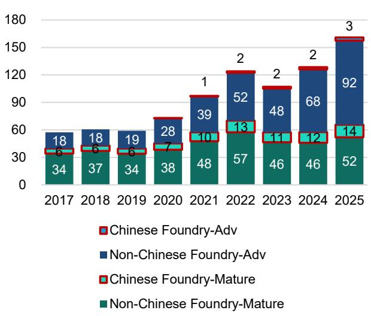  
Source: Company reports, Bernstein analysis and estimates  
Source: Company reports, Bernstein analysis and estimates

EXHIBIT 11: As of 2025, Chinese fabless only took ~11% of global share, lower than that in 2024  
Chinese IC Suppliers as % of Global Adv-Node Wafer Foundry Revenue  
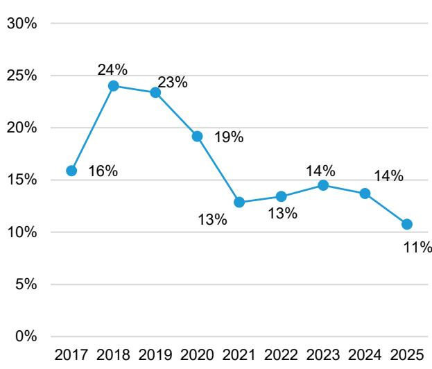  
Foundry Wafer Revenue by Customer & Tech (US$B)

EXHIBIT 10: Chinese IC supplier's has a higher advanced node share than the share in Foundry  
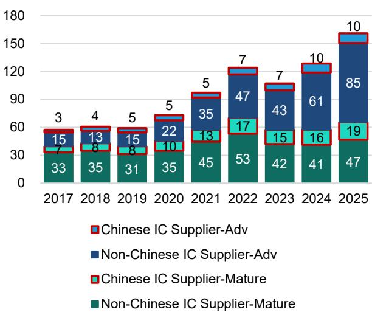  
Source: Company reports, Bernstein analysis and estimates

EXHIBIT 12: While similar decrease was witnessed in mature-node in 2025 as well, Chinese IC suppliers have been gaining global shares in the sector, and becoming an increasing group of customers for foundries, likely thanks to Chinese OEMs sourcing more from them

Chinese IC Suppliers as % of Global Mature-Node Wafer Foundry Revenue

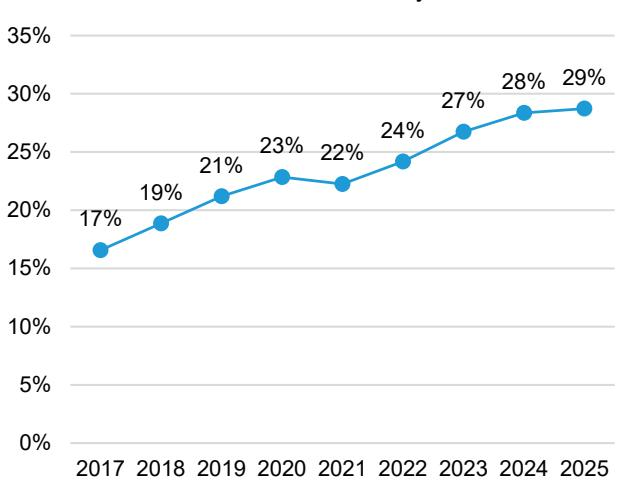  
Source: Company reports, Bernstein analysis and estimates

## GLOBAL FOUNDRY MARKET SHARE SHIFT

From a Foundry perspective, the decoupling has motivated China to aggressively expand its manufacturing capacity to achieve greater self-sufficiency. While some progress has been made, the goal is far from fully realized. Chinese foundries currently hold only a 3.5% global share in the advanced-node segment, and a 21% share in the matured-node segment.

\- The decoupling has motivated China to invest heavily in fab construction to build more capacity to achieve higher self-sufficiency ratio in Foundry. For advanced-node, as the demand of Huawei etc. shifted back to China, Chinese foundries' share reached 3.5% in 2025 from zero in 2019 (Exhibit 13). For matured-node, as the Chinese fabless gain share globally, and allocate higher share to Chinese foundries, the share of Chinese foundry increased from ~14% between 2017-19 to 18-21% in 2022-25 (Exhibit 14). Collectively, Chinese foundry market share only increased from 10% to 11-12% and has marginally decreased in 2024-25 (Exhibit 15), as the growth in advanced-node is faster than matured-node while China's fabless share is mainly in matured-node.

\- However, we highlight that such achievement is at the cost of very heavy CapEx burden. Using SMIC as an example, over the course of 2020 to 2025, SMIC spent US$6.5B average CapEx per year, while the average revenue is only at US$6.7B, representing ~100% CapEx intensity (Exhibit 16), while for the same period TSMC's CapEx intensity is only at 40%. This is clearly an acceleration from the previous already high base of average 68% CapEx intensity for SMIC from 2015 to 2019, indicating that bringing advanced-node production onshore came with a very heavy CapEx burden for China.

\- Despite the heavy investment, the self-sufficiency ratio in Foundry is still far from satisfactory. For advanced-node, Chinese foundries hold only a 3.5% global share in 2025, while the Chinese fabless global share is at 11% (which is a number suppressed by supply constrain, the actual demand should be bigger than 11%). The foundry self-sufficiency in advanced-node is only at ~32%, because Chinese foundries continue to face challenges in supplying advanced-node capacity, primarily due to equipment constraints. On the other hand, in matured-node, Chinese fabless holds a 29% global share, but Chinese foundry only holds a 21%, the self-sufficiency is at 72%, much higher than advanced logic but still with clear room for further growth. If we exclude the Chinese foundry capacity occupied by non-Chinese fabless, the self-sufficiency will be decreased to 59%, indicating a much bigger room for Chinese foundry to further expand capacity. The gap in matured-node is probably due to limited capacity in China for 40/28/22 nm where both the quality and quantity of Chinese foundry supply is not yet ready to fully capture the Chinese fabless demand.

\- From the Chinese foundry perspective, Chinese fabless is becoming increasingly important for Chinese foundries. For advanced-node, the decoupling created a market for China that does not exist before, helping Chinese foundries to grow in capacity, the growth rate achieved 37% in 2025 (Exhibit 17). For matured-node, the revenue contribution from Chinese fabless reached 81%, higher than previous base at ~68% (Exhibit 18). Note that the amount from non-Chinese fabless within Chinese foundries did not further decrease in 2025, indicating that lower pricing in China has also attracted non-Chinese fabless to outsource more to Chinese foundry, a reverse trend of decoupling.

\- From the non-Chinese foundry perspective, the geopolitical tension has forced Chinese fabless to shift away from non-Chinese foundries in advanced logic, as a result the share of Chinese fabless has decreased to only 8% from the previous peak at 24% in 2018 (Exhibit 19, mainly contributed by Huawei/HiSilicon). However, geopolitical tensions have a much smaller impact on matured logic, as non-Chinese foundries also found a rising contribution from Chinese fabless over the past few years (Exhibit 20), although at a scale smaller than Chinese foundries (Exhibit 18).

\- For non-Chinese foundries, competing for the demand of Chinese fabless is a tough battle, as their rivals in China usually tolerate lower margins & offer lower prices. These Chinese foundries also enjoy the advantage of onshore production that is often preferred by these Chinese customers. However, the analysis above suggests that non-Chinese foundry can still have a fair fight to win this demand, possibly through better quality, service, etc. Exhibit 14 shows it is indeed possible that the rapid rise of Chinese fabless can be a growth opportunity for non-Chinese foundries. Or at least non-Chinese foundries should keep prompting their better quality, etc. to delay the pace of losing Chinese customers.

Chinese Foundry Market Share in Global Adv-Node Wafer Foundry Revenue

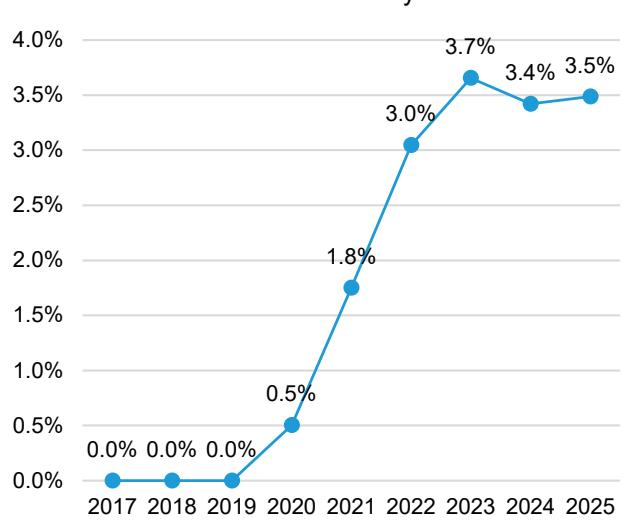

EXHIBIT 13: As Chinese foundries benefited more from export controls, their share in the global foundry market has been rising consistently over time, but only to 3.5% in 2025 in advanced nodes...  
EXHIBIT 14: ... stabilized at ~21% in matured node...  
Chinese Foundry Market Share in Global Mature-Node Wafer Foundry Revenue  
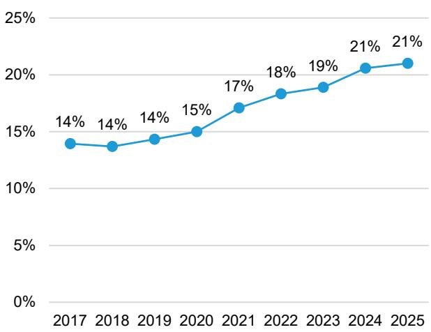  
Source: Company reports, Bernstein analysis and estimates  
Source: Company reports, Bernstein analysis and estimates  
EXHIBIT 15: ...and 11% overall in 2025  
Chinese Foundry Market Share in Global Foundry Wafer Revenue

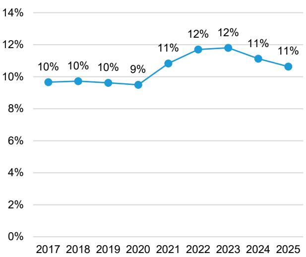  
Source: Company reports, Bernstein analysis and estimates  
EXHIBIT 16: Over the course of 2020 to 2025, SMIC spent more than US$39B in capex in addition to the prior usual level

Capex & Capex/Revenue of SMIC  
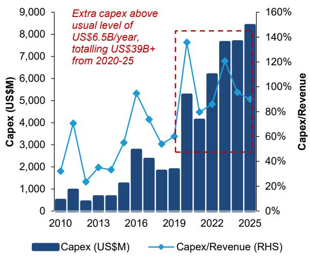  
Source: Company reports, Bernstein analysis

EXHIBIT 17: Chinese foundries' advanced node revenue from Chinese customers increased in 2021-25 as export controls force China to move some advanced-node production onshore

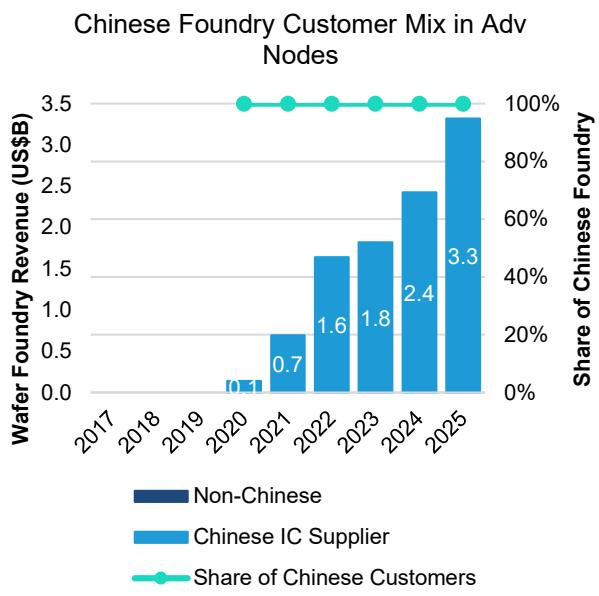  
EXHIBIT 18: Chinese customers have been becoming a large part of Chinese foundry's mature-node revenue  
Chinese Foundry Customer Mix in Mature Nodes

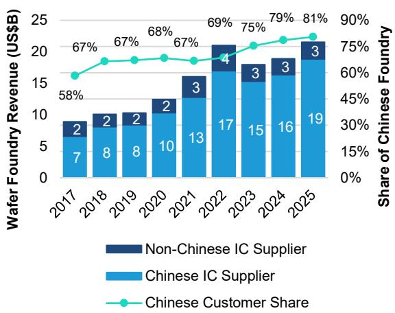  
Source: Company reports, Bernstein analysis and estimates  
Source: Bernstein analysis and estimates  
EXHIBIT 19: Non-Chinese foundries' Chinese customers mix in advanced node dropped in 2021-25 as Chinese fabless became smaller & export controls
