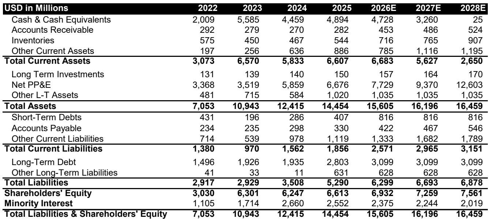

# Bernstein：出口管制下，中国芯片设计公司先进制程全球份额反降至11%

地缘政治不确定性下，市场普遍预期中国与非中国市场的芯片代工将快速分离。但Bernstein最新年度追踪报告给出了一个反直觉的结论：代工脱钩确实在发生，但速度远慢于多数读者的预期。2025年的数据表明，这更像一个持续多年的渐进过程，而非一场短跑。

报告的核心量化判断是：无论是先进制程还是成熟制程，距离“完全脱钩”都还很远。对于中国的芯片设计公司，2025年仅有32%的先进制程需求由本土代工厂满足，较2024年的25%有所提升，但仍有近七成依赖海外。成熟制程方面，本土代工厂的满足率为59%，仅比2024年的57%微幅增长。与此同时，非中国芯片设计公司从中国代工厂采购成熟制程的比例，反而从2024年的6.1%小幅下降至5.7%。

> **KC评论：** 这份报告的价值在于用数据拆解了两个常见误解。第一，先进制程的“国产化率”虽然增长快，但基数极低，且主要受华为等个别公司的被迫转移驱动，并非行业普遍现象。第二，成熟制程的转移速度更慢，因为缺乏出口管制的外部推力，中国设计公司仍有充分的选择自由。完整报告中的图表清晰地展示了这两条曲线的斜率差异，值得细看。

## 1. 中国芯片设计公司的份额正在“结构性分化”

从芯片设计公司的全球竞争格局看，Bernstein的数据揭示了另一种分化。在先进制程领域，中国设计公司的全球份额从2024年的14%下降至2025年的11%。这并非因为中国公司竞争力下降，而是出口管制迫使他们无法使用最先进的代工资源，从而在高端产品竞争中处于劣势。

但在成熟制程领域，中国设计公司的全球份额从28%微增至29%。这种增长更多来自中国终端OEM厂商的采购本地化倾向——这些厂商在进口先进芯片的同时，加速将成熟制程芯片的采购转向国内供应商。不过，成熟制程的份额增长势头也在节奏变化。

一个值得关注的变量是，中国代工厂正在2025至2026年显著扩大先进制程的产能，且本土设备性能有所改善。这意味着当这批新产能的芯片进入市场后，中国设计公司在先进制程领域的份额有望在未来几年出现反转。

## 2. 产能扩张激进，但全球份额增长有限

中国代工厂的产能扩张确实激进。以中芯国际为例，其过去五年的资本开支占营收比例接近100%，而台积电同期仅为40%左右。但这种大规模投入并未立即转化为全球份额的显著提升。

从代工厂视角看，2025年中国代工厂在先进制程的全球份额仅为3.5%，而中国设计公司在该领域的全球份额为11%，意味着自给率至多32%。在成熟制程领域，中国代工厂的全球份额为21%，而中国设计公司份额为29%，自给率为72%。两者都远未达到“完全脱钩”的水平。

报告指出，先进制程的差距主要来自设备限制导致的产能爬坡和良率提升困难。而成熟制程的差距，则更多源于中国设计公司向本土代工厂迁移的速度偏慢。更关键的是，从2024到2025年，中国代工厂在成熟和先进逻辑制程上的份额增长几乎停滞，综合份额甚至略有下降。

## 3. 报告尚未完全回答的关键问题

Bernstein的这份报告提供了扎实的量化框架，但有几个问题值得读者继续追问。

第一，中国代工厂的先进制程产能扩张，最终能否在良率和成本上达到与台积电相近的水平？报告提到了设备约束，但没有量化这一差距的弥合速度。第二，美国出口管制是否会进一步收紧，将更多非AI芯片纳入限制范围？目前华为以外的中国设计公司仍能通过台积电生产非AI先进芯片，这一窗口的存续时间具有高度不确定性。第三，中国设计公司在成熟制程上的份额增长仍在调整，是暂时的周期波动，还是意味着本土替代已接近天花板？这些问题的答案，将直接影响对中芯国际、华虹等中国代工厂未来增长的判断。

对于关注半导体产业链的读者，这份报告提供了一个重要的观察框架：不要用“脱钩”这个二元概念来理解代工市场，而应关注“脱钩速度”和“脱钩结构”。先进制程与成熟制程的脱钩逻辑完全不同，前者受政策驱动，后者更多受商业决策影响。两者背后，是设备、良率、成本和客户粘性等一系列复杂变量的博弈。

For informational purposes only. Portions may be generated,translated,summarized,or edited with AI assistance based on source materials and may contain omissions or errors. Please verify independently. This is not investment,legal,tax,accounting,or other professional advice.

