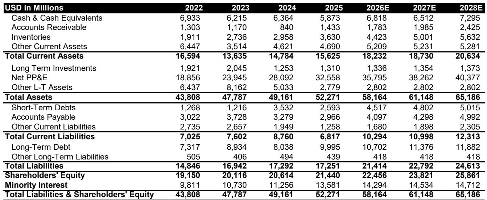
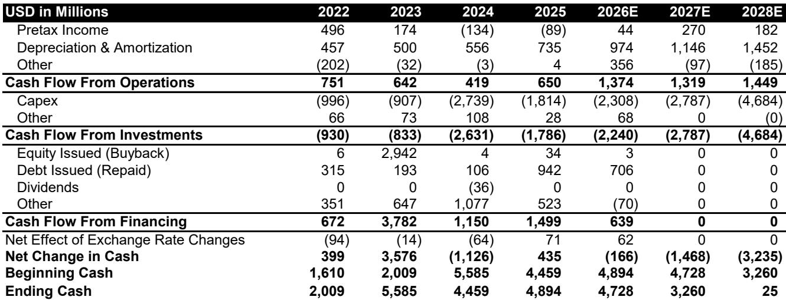

# 半导体代工产业链的区域调整真实存在，但速度慢于市场预期——其战略影响比表面更微妙

两年来，市场参与者一直在预期中国与世界其他地区之间的半导体代工供应链将出现快速、全面的区域调整。这一叙事颇具说服力：地缘政治因素、出口管制和国家安全需求似乎应推动一次彻底的分离。但截至2025年的数据呈现了一个不同的图景——一个比主流叙事所暗示的更渐进、更不均衡、战略上更复杂的图景。

现实情况是，代工领域的区域调整正在发生，但其速度会让那些期待突然重组的人感到失望。2025年，中国无晶圆厂公司仅将其32%的先进制程需求和59%的成熟制程需求交由国内代工厂完成。对于非中国无晶圆厂公司，仅有5.7%的成熟制程生产仍在中国境内，较2024年的6.1%略有下降。这些数字代表了变化，而非断裂。

这一点之所以重要，是因为半导体行业是现代技术的支柱，而代工供应链是其最关键的基础设施。误判区域调整的速度或形态，将对资本配置、供应链战略和竞争定位产生实际影响。我们参考的报告提供了对这一趋势最详尽的从下至上量化分析，并促使人们重新审视若干广为接受的假设。

核心见解是：区域调整并非一个二元事件，而是一个多年、分制程、分客户类型的渐进过程。推动它的力量强大，但抵抗它的力量同样强大——包括成本经济性、技术差距以及半导体供应链本身的复杂性。理解区域调整在何处真实发生、在何处被夸大，以及它对不同参与者意味着什么，是任何严肃的研究者或战略制定者在这一领域的基本分析任务。

## 中国无晶圆厂需求与中国代工厂供应之间的差距仍然巨大，尤其是在先进制程领域

2025年数据中最引人注目的发现，是中国无晶圆厂公司的需求与中国代工厂的供应之间持续存在的不匹配。在先进制程——定义为22/28纳米以下工艺技术，与美国出口管制定义一致——中国无晶圆厂需求占2025年全球先进制程需求的11%，但中国代工厂仅占3.5%的全球份额。结果是：自给率仅为32%，意味着近三分之二的中国先进制程需求仍由非中国代工厂满足。

这一差距并未迅速缩小。从2024年到2025年，中国先进制程需求由国内满足的比例从25%上升至32%——这是一个有意义的跃升，但仍使绝大多数需求暴露于地缘政治风险之下。这一改善主要由单一动态驱动：像华为这样因出口限制别无选择的公司被迫进行本地化。对于设计不受出口管制覆盖的非AI芯片的更广泛中国无晶圆厂公司而言，台积电仍是首选供应商。

战略含义直截了当但常被忽视：出口管制在迫使特定中国公司使用国内代工厂方面是有效的，但它们尚未推动中国先进制程需求的广泛迁移。前沿制程的技术和成本差距仍然过大。中国代工厂继续面临良率挑战、设备限制和成本劣势，这限制了它们服务全部先进制程需求的能力。在这些差距缩小之前——报告表明这可能需要数年而非几个季度——先进制程领域的区域调整叙事将更多是愿景而非现实。

## 成熟制程的区域调整更为深入但已放缓，其原因与大多数人的假设不同

在成熟制程领域，情况既更为深入也更为令人费解。中国代工厂现在满足了中国无晶圆厂公司59%的成熟制程需求，高于2020年的45%，但仅略高于2024年的57%。本地化速度明显放缓，理解其原因需要比简单指向产能或技术限制更细致的分析。

报告的自下而上数据显示，中国无晶圆厂公司在成熟制程领域从中国和非中国代工厂采购晶圆的数量都在增加。转移到国内代工厂的相对产量相当可观——从2020年到2025年大约增加了65亿美元。但由于整体成熟制程需求增长迅速，本地化率仅温和上升。这不是一个中国代工厂未能扩张的故事；而是一个中国无晶圆厂公司即使在存在国内替代方案的情况下，仍继续将非中国代工厂作为其采购组合重要部分的故事。

原因何在？报告指出了中国无晶圆厂公司的缓慢迁移，但背后的驱动因素值得深入探讨。非中国代工厂通常提供更好的质量、更稳定的良率、更强的知识产权保护和已建立的关系。对于服务全球市场的无晶圆厂公司而言，转向国内代工厂的成本——即使其定价具有竞争力——包括潜在的质量风险和客户认知问题。一些观察者曾预期推动快速本地化的“中国为中国”战略，已在某种程度上被这些商业现实所抵消。

与此同时，非中国无晶圆厂公司正在缓慢但稳步地减少对中国代工厂的依赖。它们从中国代工厂采购成熟制程的比例已从2022年的大约6%下降到2025年的5.7%。变化是冰川式的，但方向是明确的。对于联电或世界先进等非中国代工厂而言，这从生产转移中带来的上行空间有限，因为非中国无晶圆厂公司从一开始就从未严重依赖中国代工厂。

## 中国代工厂正在积极投资，但其全球份额增长甚微——综合份额实际上有所下降

投资与市场份额之间的脱节是报告中最重要发现之一。以中芯国际为首的中国代工厂，已连续五年将资本支出维持在约占收入100%的水平，而台积电约为40%。以任何标准衡量，这都是一个非凡的投资水平，既反映了对自给自足的战略需求，也反映了在设备获取受限条件下建设产能的高昂成本。

然而，就全球市场份额而言，结果并不突出。在成熟逻辑制程领域，中国代工厂的份额从2024年到2025年基本持平。在先进逻辑制程领域，同样持平。而综合份额——结合两个制程——实际上略有下降。这一反直觉的结果有一个直接的解释：整体代工市场，尤其是在先进制程领域，增长速度超过了中国代工厂的扩张能力。台积电和其他非中国代工厂也在大力投资，而且它们从更大的基数起步。

其含义是，中国代工厂激进的产能扩张仅仅是维持其相对地位所必需的，而非为了获取份额。要实际增加全球份额，中国代工厂需要比市场增长更快——这意味着不仅要增加产能，还要提高良率、降低成本，并从非中国代工厂赢得客户。限制它们提升先进制程产能的设备限制，也限制了它们在成熟制程领域与拥有数十年工艺优化的非中国代工厂在成本和质量上竞争的能力。

这一动态有一个二阶含义，在报告中未充分展开但值得关注：中国代工厂巨大的资本支出，如果持续下去，最终将在成熟制程领域造成产能过剩。当这些产能上线并开始生产晶圆时，将对整个行业的定价产生下行压力。服务于成熟制程市场的非中国代工厂——包括联电和世界先进——即使没有失去显著的市场份额，也可能面临利润率压缩。战略问题不仅仅是谁能赢得份额，而是当供应超过需求时，谁能维持定价能力。

## 报告未完全解答的问题：区域调整与技术发展之间的反馈循环

报告提供了对区域调整当前状态的细致量化，但留下了几个重要问题。最关键的是区域调整与技术发展之间的反馈循环。随着中国无晶圆厂公司被迫使用国内代工厂进行先进制程生产，它们将不可避免地推动这些代工厂改进。与前沿设计合作的经验——即使局限于较旧制程或较低性能变体——创造了可以加速工艺开发的学习过程。

相反，随着非中国无晶圆厂公司减少对中国代工厂的依赖，它们可能会失去在这些代工厂认证新工艺的动力，这可能通过减少需求的数量和多样性来减缓中国代工厂的技术发展。报告指出，受国内本地工具性能改善的推动，中国代工厂在2025年和2026年正更积极地扩张先进制程产能。但这一产能能否实现使其对广泛市场——而不仅仅是受限制客户——具有竞争力的良率和成本，仍是一个悬而未决的问题。

第二个未解决的问题是第三国代工厂的角色。报告的分析侧重于中国/非中国的二元区分，但现实世界更为复杂。台湾、韩国、欧洲和美国的代工厂具有不同的地缘政治风险敞口和与中国客户的不同关系。随着区域调整的推进，一些非中国代工厂可能通过将自己定位为低风险替代方案而获得不成比例的收益。报告未充分探讨哪些代工厂最有能力承接从中国转移出的需求，或者非中国代工厂之间的竞争动态可能如何变化。

## 研究者和战略制定者的决策框架

对于试图将这一分析转化为可操作决策的读者，以下框架可能有用。需要跟踪的关键变量不是二元的——它们是变化率，并且因制程、客户类型和地区而异。

首先，按制程评估您的风险敞口。先进制程的区域调整正在缓慢进行，主要由出口管制而非市场力量驱动。如果您的组合或供应链依赖于先进制程产能，突然中断的风险低于头条新闻所暗示的，但长期碎片化趋势是真实的。需要关注的关键领先指标不仅是中国的代工产能，还有这些代工厂的良率提升和客户认证。

其次，区分需求侧和供给侧的区域调整。中国无晶圆厂公司正在将部分需求转移到国内代工厂，但非中国无晶圆厂公司也在缓慢地远离中国代工厂。这是两个独立的趋势，具有不同的驱动因素和不同的含义。对中国代工厂利用率的净影响取决于哪个趋势更强，而报告表明两者都是渐进的。

第三，考虑产能扩张的定价影响。中国代工厂正以非凡水平进行投资，但其份额增长甚微。这种组合强烈表明该行业正走向成熟制程的产能过剩。对于高度暴露于成熟制程定价的代工厂——包括联电和世界先进——风险不仅是份额损失，还有利润率压缩。对于无晶圆厂公司而言，风险则相反：潜在的供应过剩可能为成熟制程晶圆创造买方市场。

第四，密切关注技术差距。报告数据显示，中国代工厂在先进制程领域取得了实际进展，在几年内从近乎为零增长到3.5%的全球份额。但它们仍远落后于台积电和三星。问题不在于它们是否会缩小差距，而在于多快以及在哪些特定制程上。报告表明，先进制程的差距需要数年才能弥合，但弥合的速度取决于设备可用性、人才、良率学习等难以预测的因素。

## 市场低估了区域调整的复杂性——完整报告揭示了原因

围绕半导体区域调整的主流叙事是快速、不可避免的碎片化。截至2025年的数据讲述了一个不同的故事：一个缓慢、不均衡且战略上复杂的变化。中国代工厂正在大力投资，但仅获得微小的份额增长。中国无晶圆厂公司正在逐步本地化，但在先进制程上仍严重依赖非中国代工厂。非中国无晶圆厂公司正在减少其中国风险敞口，但由于基数如此之低，对非中国代工厂的影响微乎其微。

完整报告提供了对这些趋势最详尽的从下至上量化分析，包含25家代工厂的详细数据、逐制程分析，以及对未完全披露收入细分公司经过仔细校准的估算。分析师的看法是，区域调整主题将以当前估值中未完全反映的方式创造赢家和输家。

对于严肃的研究者和战略制定者而言，报告的价值不仅在于数据，还在于它提供的分析框架，用于思考一个将重塑全球最重要行业之一的多年趋势。它提出的问题——关于区域调整与技术发展之间的反馈循环，关于非中国代工厂之间的竞争动态，关于产能扩张的定价影响——正是将决定哪些公司在未来十年蓬勃发展、哪些公司挣扎求存的问题。

加入社区阅读完整报告并查看原始图表。

*仅供参考。部分内容可能基于源材料通过AI辅助生成、翻译、总结或编辑，可能存在遗漏或错误。请独立核实。这不是专业建议。*

仅供参考。部分内容可能基于源材料通过AI辅助生成、翻译、总结或编辑，可能存在遗漏或错误。请独立核实。这不是专业建议。

