# Global Semiconductors & Hardware

# China Smartphone Tracker (May): Historical high ASP and inventory level

Mark Li
+852 2123 2645
mark.li@bernsteinsg.com

Stacy A. Rasgon, Ph.D.
+1 213 559 5917
stacy.rasgon@bernsteinsg.com

Mark C. Newman
+1 212 845 7822
mark.newman@bernsteinsg.com

Alex Wang, CFA
+852 2123 2613
alex.wang@bernsteinsg.com

Eunice Lee, CFA
+852 2123 2606
eunice.lee@bernsteinsg.com

Aleksander Peterc
+33 1 57 29 45 25
aleksander.peterc@bernsteinsg.com

Please download our smartphone monthly tracker data from here.

High memory costs pressured all segments. In May, China smartphone sell-through picked up 5% MoM but dropped 20% YoY to 17.3M units, making 5M26 cumulative shipment fall by 9% YoY. High memory price weighed on all segments with low-, mid-, and high-end segment dropping 38%, 17%, and 5% YoY, respectively. The contribution from entry-level models in the overall shipment mix fell to a record low in May.

Historical high ASP ... May ASP rose 24% YoY, a clear acceleration from the mid-teens % seen in 4M26, and was materially higher than prior-year levels. We attribute this to both an upgrade in shipment mix during the “618 Shopping Festival” and memory costs resulting in reduced low-end contribution & also like-for-like price hikes. We remain cautious on demand, as higher handset prices could suppress volumes and ultimately limit further ASP upside.

... and inventory level. After adjusting for possible obsolescence, we still find Android brands have recorded notably higher sell-in than sell-through for two consecutive months. Their inventory level reached a historical high of 3.9 months. Smartphone OEMs found themselves caught in a dilemma of high-inventory and thin (or even negative) margin, and that may explain the less aggressive discounts in this year's "618" festival.

Apple turned more aggressive on pricing by cutting the iPhone 17 Pro by RMB1,000 during the "618" campaign and bringing its price below RMB 7,000 for the first time. This drove a 6ppt unit share gain from Huawei sequentially. Huawei had benefited from the new Pura 80 launch cycle, but early feedback has been lukewarm. We see higher processor costs from SMIC's "N+3" node and elevated memory prices, limit Huawei's ability to compete in a price war.

We rate MediaTek Outperform (report, model). We currently forecast the ASIC revenue to be US\$2B,15B and 22B in 2026–2028, respectively, but see an upside risk to it, especially in 2028. Smartphone revenue should drop, but TPU revenue should be more than enough to offset that. Outperform.

We rate Apple Outperform as strength continues and share gains play out (see Apple Deep Dive and recent APPLE TRACKER). For suppliers in smartphone value chain, Luxshare and Largan should be more resilient than Sunny Optical this year, supported by stronger Apple exposure (vs. Android) and ongoing progress in AI-related products.

Xiaomi's (OP) shipments declined by -29% YoY on a high base, with market share falling to 14.5%, down from 14.6% in April 2026 and 16.1% in May 2025. In 5M26, shipments of high-end models (RMB 4k+) declined by -14% YoY. Meanwhile, mid-range (RMB 2–4k) and low-end (<RMB 2k) segments saw declines of -16% and -31% YoY, respectively, reflecting a product transition phase amid rising memory prices and competition pressures.

## BERNSTEIN TICKER TABLE

<table><tr><td rowspan="2">Ticker</td><td rowspan="2">Rating</td><td rowspan="2">Cur</td><td colspan="3">7 Jul 2026</td><td rowspan="2">TTMRel.</td><td colspan="4">Reported EPS</td><td colspan="3">Reported P/E (x)</td></tr><tr><td>Closing Price</td><td>Price Target</td><td>Target Perf.</td><td>Cur</td><td>2025A</td><td>2026E</td><td>2027E</td><td>2025A</td><td>2026E</td><td>2027E</td></tr><tr><td>2454.TT (MediaTek)</td><td>O</td><td>TWD</td><td>4,030.00</td><td>4,380.00</td><td>182.0%</td><td>TWD</td><td>66.17</td><td>69.52</td><td>170.50</td><td>60.9</td><td>58.0</td><td>23.6</td></tr><tr><td>3034.TT (Novatek)</td><td>M</td><td>TWD</td><td>531.00</td><td>370.00</td><td>(35.9)%</td><td>TWD</td><td>26.87</td><td>24.21</td><td>25.10</td><td>19.8</td><td>21.9</td><td>21.2</td></tr><tr><td>QCOM (Qualcomm )</td><td>M</td><td>USD</td><td>182.97</td><td>235.00</td><td>(4.7)%</td><td>USD</td><td>12.03</td><td>10.64</td><td>10.16</td><td>15.2</td><td>17.2</td><td>18.0</td></tr><tr><td>SOI.FP (Soitec)</td><td>O</td><td>EUR</td><td>98.16</td><td>180.00</td><td>90.9%</td><td>EUR</td><td>(6.17)</td><td>0.28</td><td>2.49</td><td>(15.9)</td><td>356.1</td><td>39.4</td></tr><tr><td>002475.CH ( Luxshare )</td><td>O</td><td>CNY</td><td>63.28</td><td>86.00</td><td>43.7%</td><td>CNY</td><td>2.26</td><td>2.66</td><td>3.45</td><td>28.0</td><td>23.8</td><td>18.3</td></tr><tr><td>3008.TT (Largan)</td><td>O</td><td>TWD</td><td>3,890.00</td><td>5,150.00</td><td>44.8%</td><td>TWD</td><td>158.08</td><td>187.55</td><td>208.38</td><td>24.6</td><td>20.7</td><td>18.7</td></tr><tr><td>1810.HK (Xiaomi)</td><td>O</td><td>HKD</td><td>23.10</td><td>43.00</td><td>(81.1)%</td><td>CNY</td><td>1.62</td><td>1.02</td><td>1.77</td><td>12.3</td><td>19.6</td><td>11.3</td></tr><tr><td>AAPL (Apple )</td><td>O</td><td>USD</td><td>310.66</td><td>350.00</td><td>27.5%</td><td>USD</td><td>7.46</td><td>8.87</td><td>10.65</td><td>41.6</td><td>35.0</td><td>29.2</td></tr><tr><td>2382.HK (Sunny Optical)</td><td>O</td><td>HKD</td><td>55.65</td><td>94.00</td><td>(57.1)%</td><td>CNY</td><td>4.25</td><td>3.44</td><td>4.52</td><td>11.4</td><td>14.0</td><td>10.7</td></tr><tr><td>ASIAX</td><td></td><td></td><td>1,945.70</td><td></td><td></td><td></td><td></td><td></td><td></td><td></td><td></td><td></td></tr><tr><td>SPX</td><td></td><td></td><td>7,503.85</td><td></td><td></td><td></td><td></td><td></td><td></td><td></td><td></td><td></td></tr><tr><td>EDME</td><td></td><td></td><td>1,606.65</td><td></td><td></td><td></td><td></td><td></td><td></td><td></td><td></td><td></td></tr></table>

O - Outperform, M - Market-Perform, U - Underperform, NR - Not Rated, CS - Coverage Suspended

QCOM, SOI.FP, AAPL estimate is Adjusted EPS; QCOM, SOI.FP, AAPL valuation is Adjusted P/E (x); SOI.FP base year is 2026;

Source: Bloomberg, Bernstein estimates and analysis.

## INVESTMENT IMPLICATIONS

MediaTek (OP, PT NT\$4,380.00): We rate MediaTek Outperform with PT NT\$4,380.00.

Novatek (MP, PT NT\$370.00): We rate Novatek Market-Perform with PT NT\$370.00.

Apple (OP, PT\$350): We rate AAPL Outperform with PT \$350.00.

QCOM (MP, \$235): Memory headwinds appear likely to pressure smartphone builds and numbers still appear high though the datacenter narrative sounds promising.

Luxshare (OP, PT RMB 86.00): We rate Luxshare Outperform with a RMB86.00 price target.

Sunny Optical (OP, PT HK\$94.00): We rate Sunny Optical Outperform with a HK\$94.00 price target.

Largan (MP, PT NT\$ 5,150.00): We rate Largan Outperform with a NT\$5,150.00 price target.

Soitec (Outperform, PT €180.00). We rate Soitec Outperform with a PT of €180.00. RF-SOI (60% of revenue) remains under pressure from foundry de-stocking; Soitec's core narrative is shifting to Photonics-SOI as the next primary source of growth.

Xiaomi (Outperform, PT HK\$43): We rate Xiaomi Outperform with price target for 1810.HK at HK\$43.00.

## DETAILS

This tracker is mainly based on the smartphone sell-through data that CINNO reports for the China market. We also compare that with the sell-in data published by CATR to help investors get a view on handset inventory. Additionally, we summarize the shares of mobile SoC suppliers & the use of display panel technologies. Please find the details of our methodology in this and this report.

## In May, high memory costs weighed on all segments.

\- In May, China smartphone sell-through improved 5% MoM but dropped 20% YoY to 17.3M units (Exhibit 1), making 5M26 cumulative shipment fall by 9% YoY.

\- We’d like to assess the impact of rising memory costs, but the anticipation of handset price increase & the resulting pull-forward purchases may make it difficult to isolate the effect of memory costs precisely. Fortunately, a closer look across price tiers reveals consistent and worsening pressure of high memory costs on smartphone market. Should we define low-tier segment as smartphones priced below RMB 2,000 (below c. US\$290), mid-tier as RMB 2,000-5,000 (c. US\$290-725) and high-tier as above RMB 5,000 (above c. US\$725), we find a clear divergence across these segments. The low-end segment continues to lag, with shipments declining 38% YoY in May—significantly underperforming the overall market. The mid-tier segment also weakened, posting a 17% YoY decline, likely reflecting the impact of handset price increases implemented in late March. In comparison, the high-end segment remains relatively resilient, with shipments down only 4.5% YoY (Exhibit 2). As a result, the contribution from low-end segment in overall shipment mix fell to a record low in May (Exhibit 3).

\- Premium OEMs like Huawei and Apple appeared less-affected by the memory cost pressure (Exhibit 4, Exhibit 5). In contrast, other OEMs saw their combined shipment decline 32% YoY in May & their aggregated market share fall 9.5pts YoY (Exhibit 6 - Exhibit 7).

\- We now forecast China smartphone market to 15% decline YoY this year (Smartphone and 5G Model). Sell-through data YTD also revealed the memory impact on handset shipment, but some foundries and component suppliers on the other hand have reported better-than-feared results thus far. We wonder if pulled-in inventory buildup may explain the divergence and delay the impact on foundries & upstream suppliers to 2H26 and 1H27 and will monitor the trend closely.

EXHIBIT 1: China smartphone sell-through shipment in May was up 5% MoM but down 20% YoY.

Smartphone Shipment & YoY Growth  
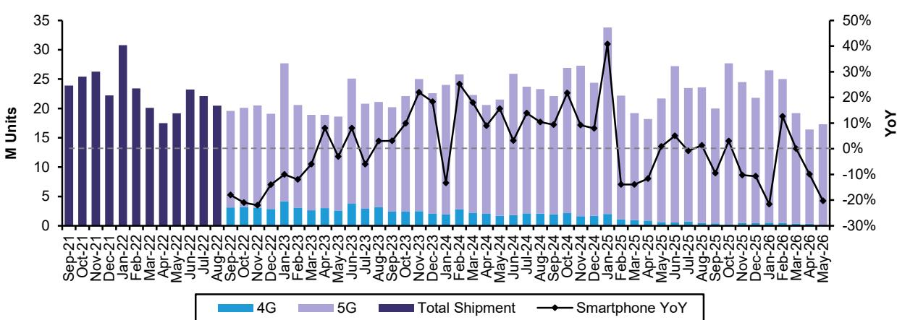  
Source: CINNO and Bernstein analysis

EXHIBIT 2: Low-tier smartphone shipment declined by 38% YoY in May, followed by mid-tier segment (-17% YoY). High-tier was down only 4.5%.  
China Smartphone Sell-through by Price Band  
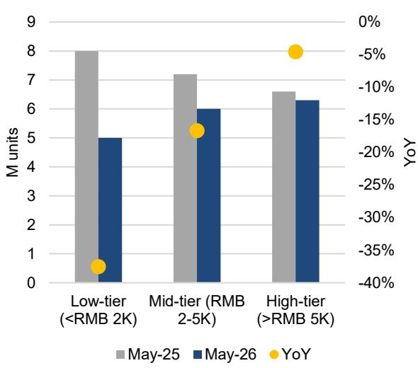  
Source: CINNO and Bernstein analysis

EXHIBIT 3: The contribution from low-end segment in the overall sales mix hit a record low in May.  
China Smartphone Sell-through by Price Band  
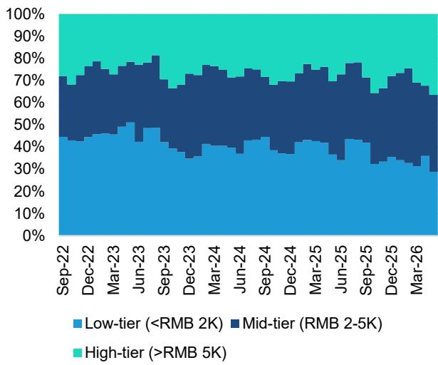  
Source: CINNO and Bernstein analysis

EXHIBIT 4: For Huawei the fall of low-end segment mix strated before memory price hike.  
Huawei Smartphone Sell-through by Price Band  
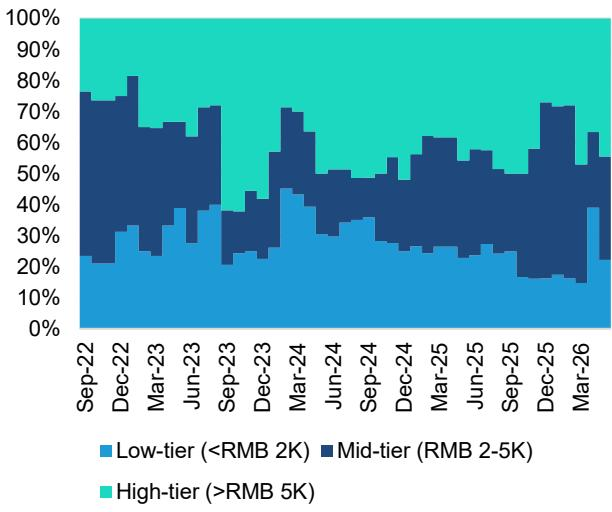  
Source: CINNO and Bernstein analysis

EXHIBIT 5: Apple has no exposure to low-end market, and thus best positioned among all brands.  
Apple Smartphone Sell-through by Price Band  
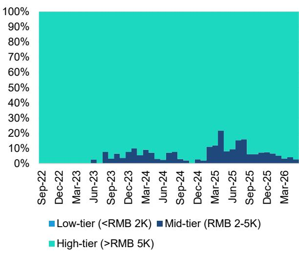  
Source: CINNO and Bernstein analysis

EXHIBIT 6: Other OEMs together shipped 32% less smartphones in May 2026 vs. May 2025 ...

Non-Apple/Huawei Shipment in China & YoY Growth  
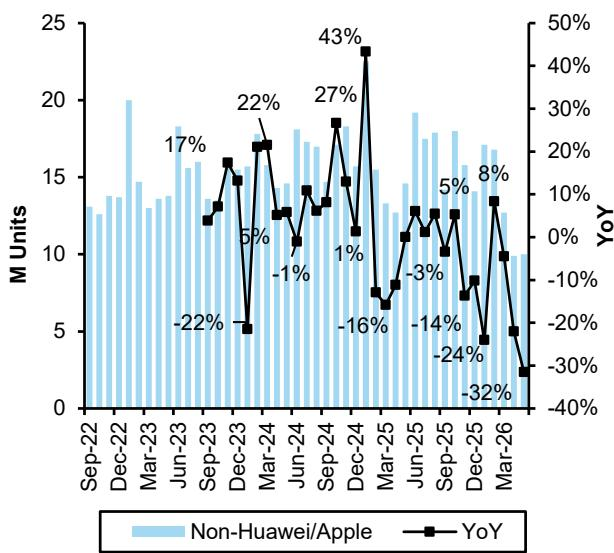  
Source: CINNO and Bernstein analysis

EXHIBIT 7: ...and they collectively lost 9.5pts unit share YoY, mostly burdened by the drop of low-end segment shipment.  
Non-Apple/Huawei Market Share in China  
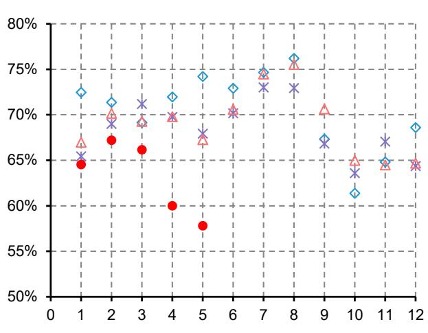  
Source: CINNO and Bernstein analysis

EXHIBIT 8: Except Huawei, all OEMs improved their sell-through MoM in May, but only modestly and with the total volume staying notably below the usual level.  
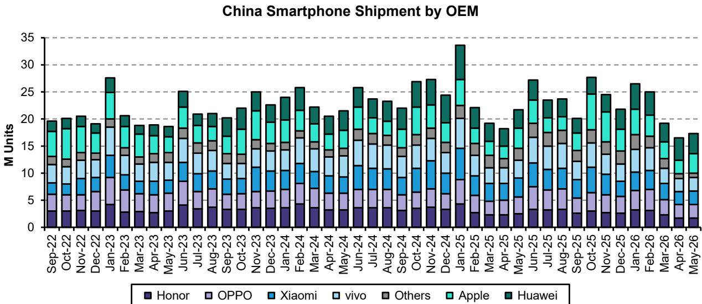  
Source: CINNO and Bernstein analysis

## Apple turned more aggressive during the "618" and gained 6pts unit share sequentially.

\- Huawei's adoption of homegrown SoCs from late 2023 helped it regain share in higher-end segments, and other Chinese OEMs also moved upward and chipped away shares from the low-side of Apple's portfolio. With the size of flagship segment barely growing, Apple earlier lost share mainly to Huawei and to a lesser extent to other OEMs (Exhibit 9 - Exhibit 11).

\- Apple then has responded with more flexible pricing. At the iPhone 17 launch in September 2025, Apple priced the devices below RMB 6,000 & made them eligible for subsidies. The prices of the iPhone 16 series were also adjusted accordingly. Apple also expanded the use of seasonal promotions across various distribution channels. On May 15, 2026, it cut the price of iPhone 17 Pro by RMB1,000 as part of its “618” promotion campaign. Together with the national subsidies, the price of iPhone 17 Pro has come to below RMB 7,000 for the first time. As a result, Apple’s unit share increased by 6pts sequentially in May (Exhibit 16).

\- As for Huawei, its shipment of RMB 6K-and-higher models grew 60% MoM and 33% YoY in May, mainly driven by its newly launched Pura 90 series. The Pro and Pro Max variants feature the Kirin 9030—the same SoC powering the Mate 80 Pro Max, and manufactured on SMIC's non-EUV "N+3" node. Consequently, the combined shipments of these models serve as a key barometer for both SMIC's "N+3" supply health and consumer demand for the chipset (Exhibit 13 - Exhibit 14). Early market feedback for the Pura 90 series has been lukewarm. In addition, elevated chip and memory costs leave Huawei with limited room to wage a price war. In contrast, Apple retains a clear upper hand, leveraging its structural pricing dominance to go on the offensive. This is probably not a surprise as a teardown report shows that SMIC "N+3" is similar to TSMC N6 & about 6 years behind the top-notch mobile SoCs in the market now. Most importantly this also means that China lacking EUV puts Huawei's handset business in a structural disadvantage vs. Apple or other handset OEMs whose smartphones are powered by superior chips made with EUV.

EXHIBIT 9: Apple focuses on flagship segment but the size of this segment hardly expanded.

China Flagship Smartphones (>=RMB6,000) Shipment by OEM

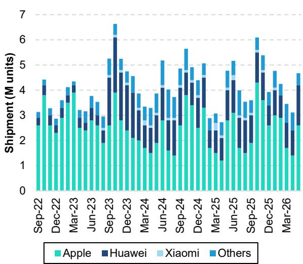  
Source: CINNO and Bernstein analysis  
EXHIBIT 10: In comparison, sub-flagship segment has been growing gradually.  
China Sub-Flagship Smartphones (RMB4,000 - 5,999) Shipment by OEM

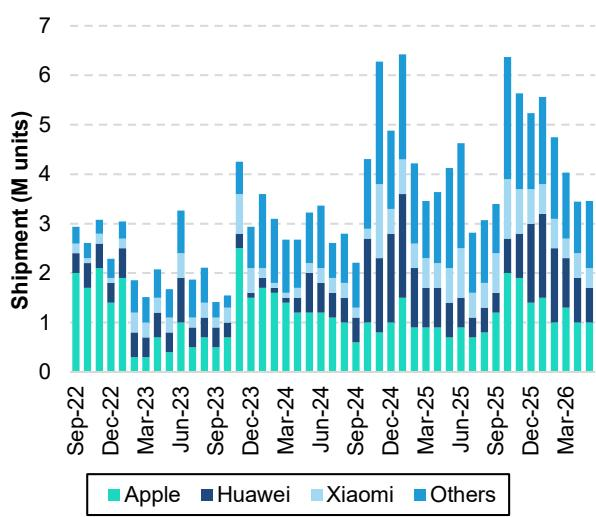  
Source: CINNO and Bernstein analysis

EXHIBIT 11: Apple is challenged by Huawei in the flagship segment & earlier also by other Chinese OEMs in the sub-flagship segment.

Smartphone Shipment in China by Brand

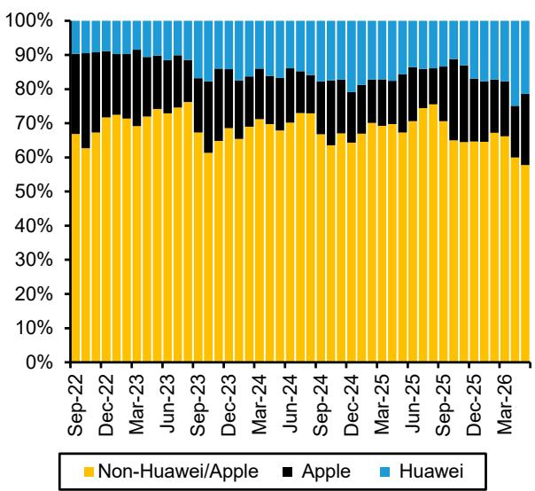  
Source: CINNO and Bernstein analysis

EXHIBIT 12: In mid-May, iPhone offered historical discounts to iPhone 17 Pro, driving its unit share up by 6% MoM and 4% YoY.

Apple & Huawei Market Share in China  
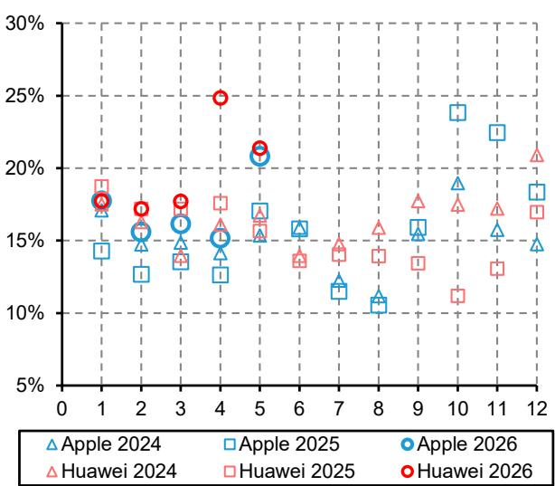  
Source: CINNO and Bernstein analysis  
EXHIBIT 14: ...but its premium segment shipment grew 60% MoM and 33% YoY mainly thanks to the launch of Pura 90 series.

EXHIBIT 13: Huawei's shipment dropped $10\%$ sequentially in May...  
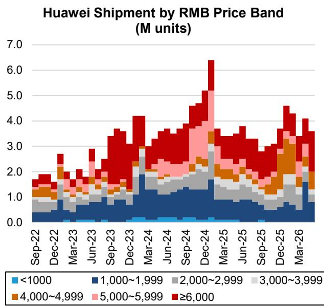

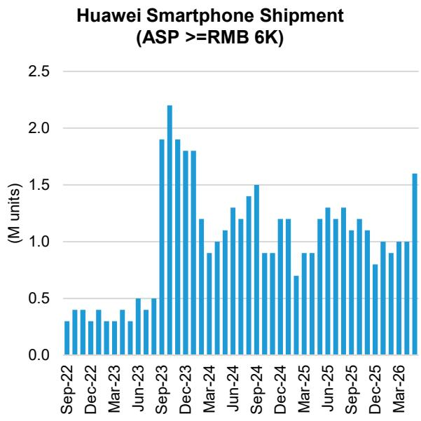

EXHIBIT 15: Huawei's shipment increased by $9\%$ YoY in May...  
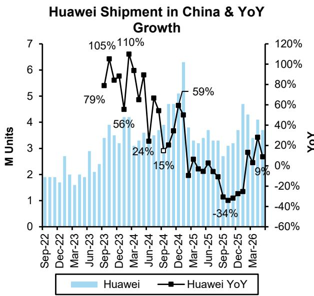  
Source: CINNO and Bernstein analysis

EXHIBIT 16: ... while Apple's shipment declined by $3\%$ YoY.

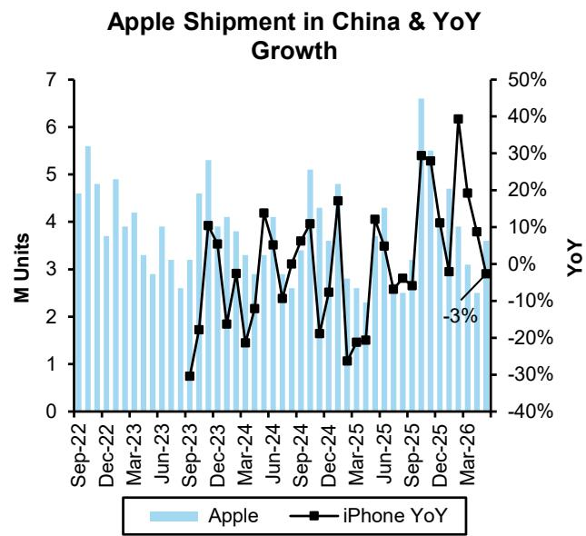  
Source: CINNO and Bernstein analysis

Android brands have recorded notably higher sell-in than sell-through for two consecutive months, driving their inventory level to a historical high.

\- History shows that obsolescence may make sell-in above sell-through by around 5% and our analysis makes an adjustment to reflect that (more details here). With this adjustment, Exhibit 17 shows that May sell-in was notably higher than sell-through, particularly for Android brands (Exhibit 18). According to CINNO research, channel inventory level has climbed to a historical high of 3.9 months. This divergence between sell-in and sell-through likely reflects softer demand following the price increases starting in late March. High inventory may pressure OEMs' cash flows and may incentivize additional discounting ahead of the "618 Shopping Festival." On the other and, thin margins as a result of high memory costs limited their ability to do so. Overall, we find the Android camp offered less aggressive discounts during this year's "618" vs. prior years.

\- On the other hand, iPhone managed a balanced sell-through and sell-in and thus had a healthy inventory level exiting May (Exhibit 19).

EXHIBIT 17: Adjusting the sell-in data from CATR for possible obsolescence, we find sell-in remained notably higher than sell-through in May...  
Smartphone Sell-in (CATR) vs. Sell-through (CINNO) in China  
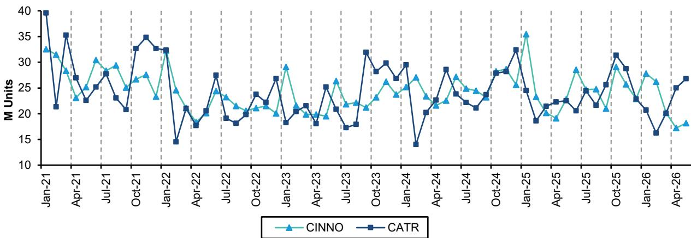  
Source: CINNO, CATR, and Bernstein analysis

EXHIBIT 18: ...especially for non-Apple brands likely due to their recent price adjustments.  
Non-iPhone Sell-in (CATR) vs. Sell-through (CINNO) in China  
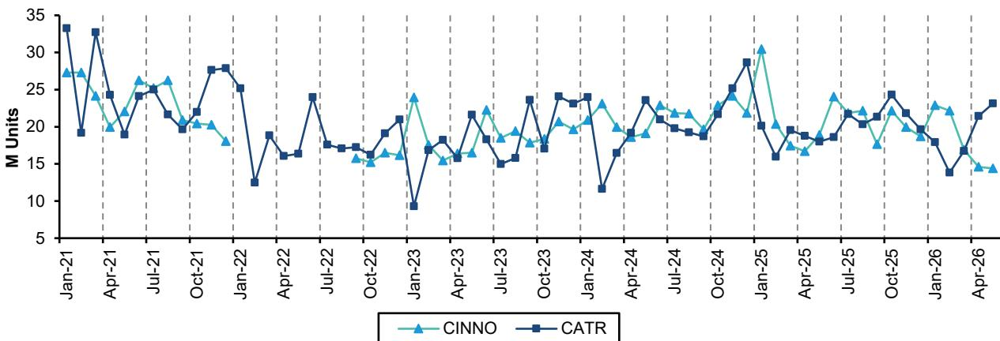  
Source: CINNO, CATR, and Bernstein analysis

EXHIBIT 19: iPhone sell-through caught up with sell-in in May and its inventory level stayed healthy.  
iPhone Sell-in (CATR) vs. Sell-through (CINNO) in China  
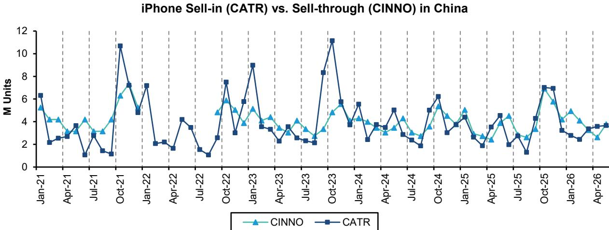  
Source: CINNO, CATR, and Bernstein analysis

## Smartphone ASP jumped by 24% YoY and 13% MoM, but we worry about demand destruction as a result of higher ASP.

\- With 5G nearly fully adopted (Exhibit 20), many see smartphone market ex-growth and are hoping that Edge AI will create a replacement cycle, or stimulate a mix improvement and/or a semiconductor content increase per phone. Qualcomm and MediaTek both highlighted agentic AI as a key value driver in recent earnings calls. Qualcomm expects agentic AI to start impacting the premium segment in fiscal year 2027, potentially triggering a new upgrade cycle. MediaTek did not specify a timeline but emphasized that its next-generation 2nm flagship SoC will have meaningfully stronger AI capabilities. We hence monitor the mix of flagship (≥ US\$850 (RMB 6,000)) & sub-flagship (US\$560-850 (RMB 4,000-5,999)) segments, as well as the overall smartphone ASP, to gauge the momentum of Edge AI. Additionally, high memory cost is prompting OEMs to cut low-priced models and raise prices elsewhere. Both will affect ASP, and we monitor handset prices to get a feel on that too.

\- In early 2024 we were encouraged by the notably higher smartphone ASP in China vs. the same period in 2023. The trend became less visible in late 2024 & early 2025, but regained momentum since March 2025 likely as subsidies motivated consumers to trade up. In May 2026, ASP rose 24% YoY, a clear acceleration from the mid-teens % increase seen in 4M26 (Exhibit 21), and was materially higher than prior-year levels. We attribute this to both an upgrade in sales mix during the “618 Shopping Festival” and elevated memory costs resulting in lower entry-level mix and also like-for-like price increases. Looking ahead, we expect ASPs to normalize sequentially following the “618” period, but remain elevated on a YoY basis. On the other hand, we remain cautious on potential demand destruction, as higher retail prices weigh on volumes and may ultimately limit further ASP upside.

\- Zooming into non-Apple/Huawei OEMs, we find their sub-flagship shipment still represented 17% of their total shipment, but the absolute volume was down 35% YoY in May (Exhibit 22, Exhibit 23). Flagship non-Apple/Huawei sales volume was down 39% YoY and its market share was also slightly lower vs. one year ago (Exhibit 24, Exhibit 25). As Apple and Huawei both turned more aggressive in flagship/sub-flagship segment during this “618 Shopping Festival”, it’s increasingly challenging for other OEMs to get sufficient revenue from flagship & sub-flagship segments to offset the loss in lower-end segments.

EXHIBIT 20: 5G penetration has reached almost 100% in new smartphone sales in China.

Smartphone Shipment & 5G Penetration  
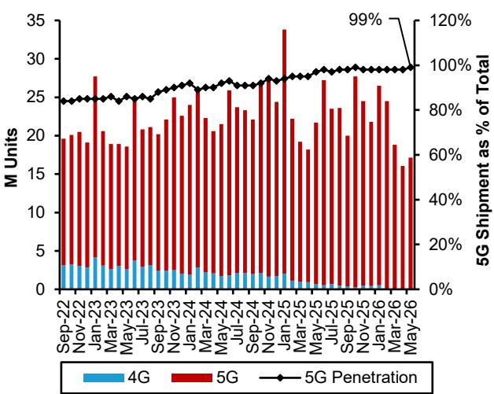  
Source: CINNO and Bernstein analysis

EXHIBIT 21: Smartphone ASP jumped by 24% YoY and 13% MoM.  
Smartphone Blended ASP in China (RMB)  
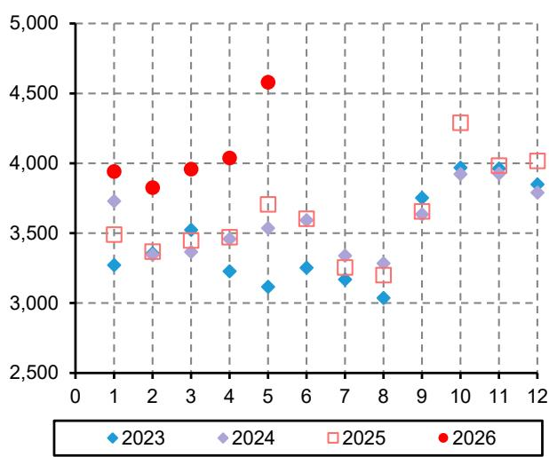  
Source: CINNO and Bernstein analysis

EXHIBIT 22: Non-Apple/Huawei sub-flagship shipment was down 35% YoY in May.  
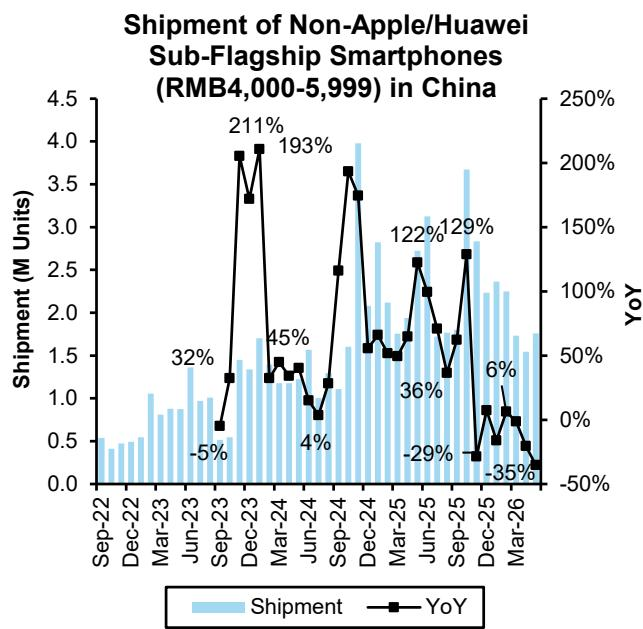  
Source: CINNO and Bernstein analysis

EXHIBIT 23: Sub-flagship segment took up 17% of non-Apple/Huawei shipment, slightly down YoY.  
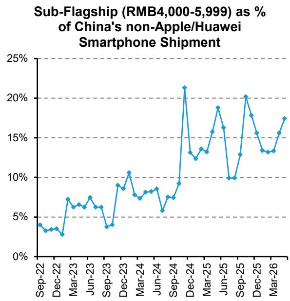  
Source: CINNO and Bernstein analysis

EXHIBIT 24: Non-Apple/Huawei flagship shipment was down 39% YoY.  
Shipment of Non-Apple/Huawei Flagship Smartphones ( $\geq$ RMB6,000) in  
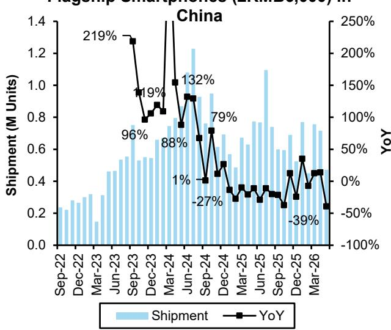  
Source: CINNO and Bernstein analysis

EXHIBIT 25: Flagship segment accounted for c. 5% of total non-Apple/Huawei shipment, slightly lower YoY.

Flagship (≥ RMB6,000) as % of China's non-Apple/Huawei Smartphone Shipment  
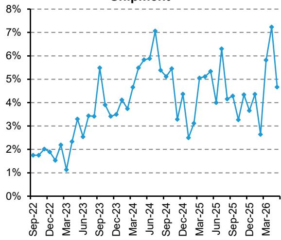  
Source: CINNO and Bernstein analysis  
EXHIBIT 26: The share of Xiaomi's shipments priced above RMB 4k increased MoM to 19%, though modestly below the 22% in May 2025; Shipments in the RMB 2k-4k range reached 37%, vs. 28% in Apr 2026 and 33% in May 2025.  
Xiaomi Smartphone Shipment in China Breakdown by Price Band (in RMB)

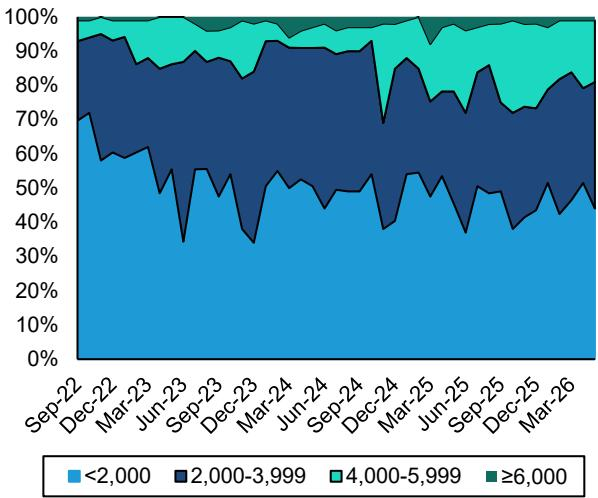  
Source: CINNO and Bernstein analysis  
EXHIBIT 27: In May 2026, Xiaomi's market share declined to $14.5\%$ from $14.6\%$ in Apr 2026 and $16.1\%$ in May 2025.  
Xiaomi Market Share in China

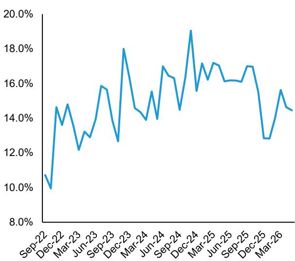  
Source: CIINNO and Bernstein analysis

## EXHIBIT 28: Xiaomi's yoy growth fell -29% YoY.

Xiaomi: China smartphone shipment & growth  
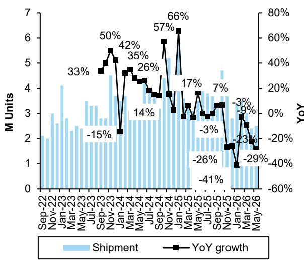  
Source: CINNO and Bernstein analysis

Qualcomm and MediaTek both lost unit shares sequentially mainly because of the weak sales performance of non-Apple/Huawei OEMs.

\- In May, unit share of Qualcomm and MediaTek decreased by 2.4pts and 0.2pts MoM, respectively, primarily as non-Apple/Huawei OEMs lost shares. On a YoY basis, Qualcomm and MediaTek lost 8.9pts and 0.5pts unit share, respectively, likely to HiSilicon (+6.7% YoY) and Apple (+4.0% YoY) (Exhibit 29 - Exhibit 30). MediaTek's shipment mix continued to improve slightly in May after plateauing for 2-3 quarters (Exhibit 31). The company expects further growth of its flagship SoC business driven by customers' oversea expansion as OEMs like OPPO and Xiaomi try to sell more high-end phones outside China (more details in our Tech Tour notes). For example, Xiaomi's 17T - flagship specially targeting oversea markets was launched on 28 May & MediaTek benefits as its sole SoC supplier (i.e. Dimensity 8500 for Standard variant & Dimensity 9500 for Pro variant). Initial feedback was generally positive, but it remains to be seen whether overseas markets can provide a sustained uplift to MediaTek's sales mix. Overall, we're cautious on MediaTek's smartphone business considering the pressure from high memory price & its higher exposure to mid- to low-end segments.

\- Finally, the latest data shows UNISOC's share remained well below $1\%$ (Exhibit 32), implying the mobile SoC market in China remains a duopoly. Because China has the motivation to use the chips from Chinese suppliers, UNISOC's share staying so low in China attests that the company is not competitive in 5G.

EXHIBIT 29: In May, unit share of Qualcomm and MediaTek decreased by 2.4pts and 0.2pts MoM, respectively...  
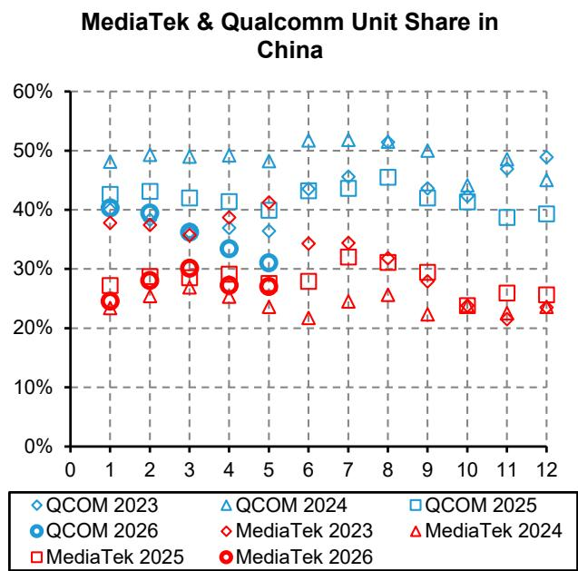  
Source: CINNO and Bernstein analysis

EXHIBIT 30: ...primarily due to weaker share among non-Apple/Huawei OEMs.  
China Smartphone Shipment by Brand  
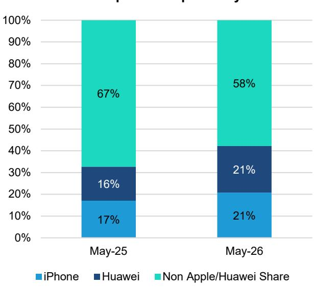  
Source: CINNO and Bernstein analysis

EXHIBIT 31: MediaTek's shipment mix continued to improve after plateauing for a while.  
MediaTek SoC Shipment Breakdown by Price Band (in RMB)  
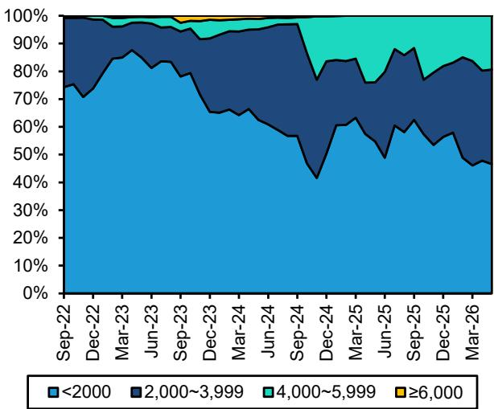  
Source: CINNO and Bernstein analysis

EXHIBIT 32: UNISOC's share remained very small in China, indicating UNISOC is not competitive in 5G.  
UNISOC's Unit Share in China  
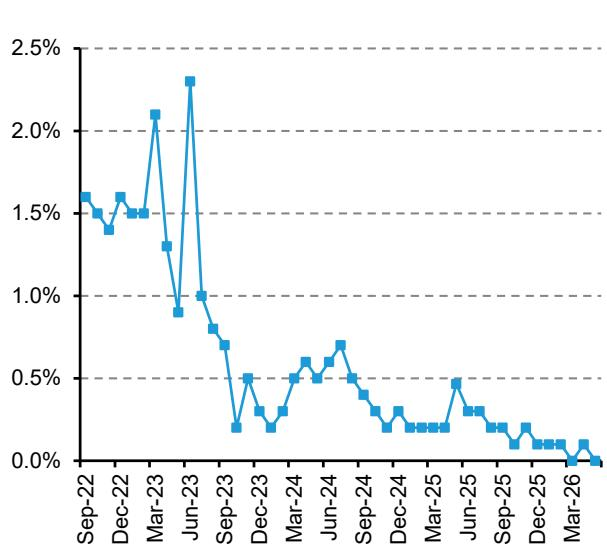  
Source: CINNO and Bernstein analysis

OLED helps Novatek fend off the Chinese rivals, but the adoption has hit a ceiling. Foldable panel remained too small to move the needle.

\- After OLED panel penetration surpassed 80% of the smartphones shipped in China in late 2023, further penetration has been very gradual (Exhibit 33). In fact the penetration has been hovering around 90% for months. We believe that OLED is now a mainstream feature and
