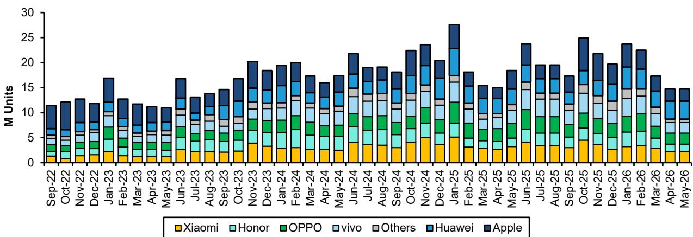

# 中国智能手机市场观察：高端化趋势下的结构性变化

近几个月来，关于中国智能手机市场的讨论一直围绕着一个稳步升级的趋势。更高的平均售价、更丰富的产品组合以及消费者对旗舰设备日益增长的购买意愿，被解读为市场成熟和品牌实力的信号。然而，2026年5月的数据呈现了一个不同的图景。我们看到的并非健康的向高价值设备迁移，而是由零部件成本上涨推动的被迫提价，这正在抑制整体需求。

数据本身是清晰的。5月份中国智能手机出货量同比下降20%，即便行业进入了关键的“618购物节”促销期。2026年前五个月的累计出货量同比下降9%。与此同时，平均售价同比上涨24%，较今年早些时候的两位数增长有所加速。这并非一个高端化的成功故事，而是成本推动型涨价与价格敏感型需求相遇的典型案例，其结果是一个规模缩小且更不稳定的市场。

对于市场观察者而言，关键洞察在于智能手机行业目前正陷入一个三重困境：存储成本上升、渠道库存处于历史高位，以及消费者对更高价格的接受度减弱。这三个因素相互放大，而传统的促销期大幅打折策略对大多数参与者已不再可行。能够脱颖而出的公司，将是那些拥有结构性成本优势、定价能力，或能吸收冲击的细分市场参与者。其余公司则面临利润率压缩和销量下滑的时期，而市场尚未完全对此进行定价。

这并非一个会在存储价格正常化后逆转的周期性低谷。当前动态代表了智能手机供应链中价值分配方式的结构性转变，对设备制造商、零部件供应商和半导体公司的影响深远。以下部分将解析驱动这一转折的核心机制，并为理解新格局提供一个分析框架。

## 存储成本上升导致市场分化，仅高端品牌受影响较小

5月数据中最值得关注的发现是不同价格区间的显著分化。按价格区间划分出货量时，模式清晰可见：低端市场（定义为售价低于2000元的设备）出货量同比下降38%。中端市场（2000元至5000元之间）下降17%。高端市场（5000元以上）仅下降4.5%。入门级机型在整体出货量中的占比创下历史新低。

这种分化并非市场的自然演变，而是存储成本上涨的直接后果，这使得低利润率的手机在经济上变得不可行。对于低端智能手机而言，其物料清单利润率本就微薄，存储成本20-30%的上涨会完全侵蚀利润。设备制造商面临两难选择：要么提价导致销量下滑，要么吸收成本牺牲利润率。5月的数据显示，他们选择了提价，结果销量随之下降。

这意味着低端市场并非简单萎缩，而是在被结构性掏空。原本会购买2000元以下手机的消费者，并未大规模升级到中端设备。他们要么完全推迟购买，要么退出新机市场。这解释了为何整体市场在平均售价上升的同时却在萎缩。高端化的叙事掩盖了一个需求抑制机制，而这一机制在销量最为关键的领域最为严重。

苹果和华为等高端品牌相对不受影响，因为其客户群对价格不那么敏感，且其成本结构能够吸收存储成本上涨，而无需将全部涨幅转嫁给消费者。苹果在“618”活动期间的激进定价，包括将iPhone 17 Pro降价1000元，使其价格首次低于7000元，这是一项利用其结构性优势的战略举措。苹果之所以能在高端市场进行价格竞争，是因为其利润率足够宽裕，能够吸收零部件成本上涨。而对于在中低端市场运营的安卓设备制造商来说，这种灵活性并不存在。

对于观察者而言，战略性问题在于这种两级分化是否会成为常态。如果存储成本持续高企，低端市场可能永远无法恢复到之前的规模。依赖销量驱动模式的设备制造商需要从根本上重新思考其产品策略，而拥有高端定位的公司则可以利用其利润缓冲来获取份额。

## 库存水平创纪录揭示供需结构性错配

5月的库存数据增加了第二层担忧。在调整正常折旧后，安卓品牌连续两个月出货量显著高于销售量。渠道库存已攀升至3.9个月的历史高位。这并非小幅库存积累，而是反映了设备制造商的生产计划与消费者实际购买之间的根本性错配。

其机制很简单。当存储价格开始上涨时，设备制造商可能加速采购以锁定较低成本。这种提前采购暂时提振了出货量，掩盖了销售端的疲软。现在，随着消费者需求因手机价格上涨而减弱，库存积压问题开始显现。设备制造商陷入困境：他们拥有高库存的零部件和成品，每售出一台设备的利润微薄甚至为负，且提供大幅折扣以清理库存的能力有限。

“618购物节”本是缓解这一情况的自然阀门，但并未达到预期效果。由于存储成本已压缩了利润率，安卓设备制造商提供的折扣力度不如往年。相应地，消费者并未像往常一样出现购买热潮。结果是库存水平依然高企，且过时风险正在增加。

这对供应链有直接影响。代工厂和零部件供应商迄今报告的结果好于预期，但这可能反映了同一库存积累过程，而该过程正在下游制造问题。如果设备制造商在2026年下半年开始积极去库存，对上游供应商的影响可能会延迟但会很严重。出货量数据强劲与销售数据疲软之间的背离，是一个典型的周期后期信号，观察者应警惕将当前上游的强劲表现外推到未来季度。

一个悬而未决的问题是，设备制造商能承受这种库存积压多久。如果存储价格开始下跌，去库存的动力会增强，因为持有高成本库存会变成负担。如果存储价格保持高位，设备制造商将面临持续的利润率压力和有限的需求刺激能力。无论哪种情况，都指向一个销量疲软的时期，而供应链估值尚未完全反映这一点。

## 苹果的定价策略利用华为半导体领域的结构性短板

苹果与华为在高端市场的竞争动态尤其具有启发性。华为在高端智能手机领域的复苏，得益于其自研的麒麟SoC，这已成为过去两年中一个标志性故事。搭载由中芯国际非EUV“N+3”工艺制造的麒麟9030的Pura 90系列发布，最初似乎延续了这一势头。早期数据显示，5月份华为在高端市场的出货量环比增长60%，同比增长33%。

然而，更广泛的图景对华为并不那么有利。该公司整体出货量在5月份环比下降10%，且Pura 90系列的早期市场反馈较为平淡。原因是结构性的。中芯国际的“N+3”工艺估计比采用EUV光刻技术的领先移动SoC落后约六年。这意味着华为的旗舰芯片在性能和能效上不如竞品设备，且生产成本更高，因为非EUV工艺需要更多层数和时间。

成本劣势因存储价格上涨而加剧。华为面临来自中芯国际工艺的更高处理器成本以及上涨的存储价格，使其在价格竞争上空间有限。相比之下，苹果可以使用台积电最先进的EUV工艺，并能利用其规模优势谈判更好的存储价格。结果是苹果正在积极利用的结构性定价不对称。

苹果在“618”活动期间将iPhone 17 Pro降价1000元，结合国家补贴，使其价格首次低于7000元。这并非促销策略，而是一项战略举措，旨在华为最脆弱的时候施压。苹果5月份从华为手中获得了6个百分点的单位份额环比增长，只要苹果维持这一定价姿态，这一趋势很可能会持续。

更深层的含义是，中国缺乏EUV光刻能力不仅是半导体行业的问题，也是华为在高端智能手机市场竞争的结构性制约。没有先进制程技术，华为的手机业务将面临永久的成本和性能劣势，这是任何软件优化或生态系统整合都无法完全克服的。对于观察者而言，这意味着苹果在中国市场的份额增长可能比市场当前预期的更持久。

## 报告留下的未解问题：库存积压何时影响上游供应商？

5月数据提供了下游困境的清晰图景，但也提出了一个报告未完全解答的关键问题。如果设备制造商持有3.9个月的库存，且消费者需求正在减弱，那么这种积压何时会转化为对代工厂、存储制造商和零部件供应商的订单削减？

报告指出，一些代工厂和零部件供应商迄今报告的结果好于预期，并提出了提前采购的库存积累可能掩盖真实需求图景的可能性。这是当前环境中最重要的分析张力。上游供应商看到的出货量数据，被设备制造商在需求疲软明朗化之前做出的采购决策所夸大。当设备制造商开始去库存时，订单将停止，上游影响可能突然且严重。

时间点是关键变量。如果设备制造商试图在2026年下半年逐步消化库存，对供应商的影响可能是分散且可控的。如果快速去库存周期开始，可能是由消费者需求进一步恶化或存储价格下跌导致持有库存不经济所触发，那么影响可能会集中且痛苦。

观察者应关注订单取消、库存消化周期延长以及设备制造商关于渠道库存正常化的评论等迹象。强劲的出货量与疲软的销售之间的背离不可能无限期持续，这种背离的解决将决定供应链的哪些部分实际上暴露于潜在的需求疲软之下。

## 理解存储驱动型智能手机周期的分析框架

对于试图在当前环境下进行定位的观察者，报告的发现提出了一个三部分的分析框架，用于评估智能手机价值链上的风险敞口。

首先，评估定价能力和利润率结构。拥有高毛利率且能够转嫁零部件成本上涨的公司处于最佳位置。苹果是最明显的受益者，但拥有专有技术或集中市场份额的特定零部件供应商也可能拥有定价杠杆。主要在中低端市场进行价格竞争的公司面临最严重的利润率压力。

其次，评估库存风险。库存水平相对于销售较高的公司，特别是那些提前采购存储的公司，面临减值和利润率压缩的风险。出货量与销售之间的背离是未来库存减值的先行指标。拥有精益库存和灵活供应链的公司更能应对去库存周期。

第三，考虑半导体技术差距的竞争影响。华为及其他依赖非EUV工艺节点的中国设备制造商面临的结构性劣势，为苹果及其他西方品牌创造了获取高端份额的机会。这不是一个暂时的竞争动态；只要中国无法获得EUV光刻技术，这种情况就会持续。与苹果业务关联度高的供应商，可能比那些严重依赖中国安卓设备制造商的供应商更具韧性。

该框架表明，应优先关注与苹果业务相关、拥有专有技术且库存风险低的公司。同时，对依赖高销量、低利润安卓业务的公司，以及可能因库存积压问题解决而面临延迟订单削减的公司，应保持谨慎。

## 加入社区阅读完整报告并查看原始图表

以上分析基于完整报告按月提供的详细出货量、销售量和库存数据。追踪价格区间构成、设备制造商市场份额变化以及出货量与销售之间背离的图表，对于实时监测动态变化至关重要。要获取完整数据集和支持这些结论的原始图表，请加入社区阅读完整报告并查看原始图表。

*仅供参考。部分内容可能基于源材料通过AI辅助生成、翻译、总结或编辑，可能存在遗漏或错误。请独立核实。本文不构成专业建议。*

仅供参考。部分内容可能基于源材料通过AI辅助生成、翻译、总结或编辑，可能存在遗漏或错误。请独立核实。本文不构成专业建议。

