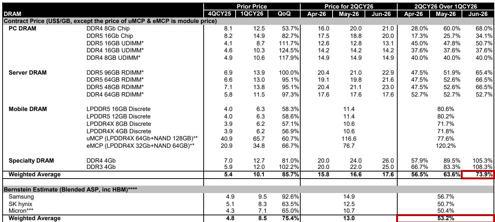
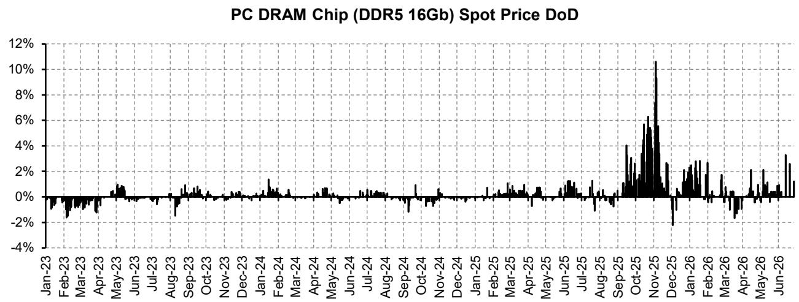
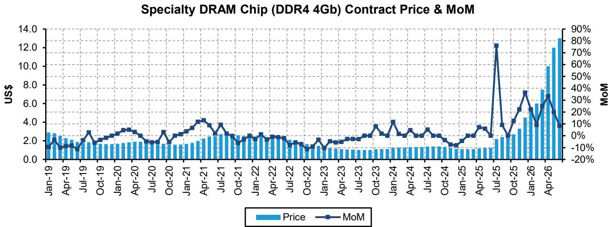

# Bernstein：存储涨价高峰已过，但真正的拐点比市场想的更远

存储芯片行业正在经历一轮罕见的涨价周期。Bernstein最新发布的6月存储追踪报告给出了一个看似矛盾、实则清晰的核心判断：**二季度价格涨幅仍将创下历史级高点，但涨速的拐点已经在三季度报价指引中明确出现。**

这份报告的价值不在于确认涨价本身——市场对此已有预期——而在于它用合约价、现货价、长协价三个维度的交叉验证，揭示了一个更重要的结构性问题：**这轮涨价的持续性和回落路径，将由“长协锁定”与“需求变化”之间的赛跑决定。**

---

## 1. 二季度合约价涨幅超预期，但三季度的减速信号已经明确

6月DRAM合约价继续环比上涨，使得整个二季度传统DRAM合约价较一季度高出约74%。这一数字比5月合约所指示的水平还高出约10个百分点。分品类看，移动DRAM和消费类DRAM涨幅最大，分别接近80%和85%；服务器DRAM约67%；PC DRAM约49%。

NAND端同样强劲。虽然6月晶圆合约价仅环比微涨0.3%-3.7%，但移动NAND和SSD的涨幅高达70%-80%，使得二季度整体NAND合约价环比涨幅接近60%。

**真正值得关注的是三季度指引。** Bernstein援引TrendForce的数据指出，三季度DRAM合约价预期涨幅已从二季度的45%-50%收窄至15%-20%。NAND的减速更为显著，移动NAND从二季度的约80%骤降至三季度的5%-10%。

> **KC评论：** 涨速收窄不等于价格见顶。这份报告真正想说的是：三季度价格仍会涨，只是没有二季度那么猛。对于读者而言，重点不是“何时见顶”，而是“在涨速节奏变化的过程中，哪些公司拥有更强的定价权”。

---

## 2. 现货市场回稳，但交易量太小，不能作为方向性信号

现货价格在经历了4月的短暂回调后，5月和6月连续回升。PC DRAM现货价环比上涨5.6%-11.5%，服务器DRAM模块涨幅更大，达6.1%-26.4%，其中DDR5表现尤为突出。

但Bernstein对现货价格的指引价值持谨慎态度。报告指出，现货市场交易量太小，“不足以影响大局”。更关键的是，现货价仍显著高于合约价，这确实反映了市场短缺的现实，但并不能直接推导出合约价会继续加速上涨。

**现货价格真正的意义在于：它没有明显波动。** 在市场对需求变化存在普遍关注的背景下，现货价企稳本身就说明，当前供需缺口仍然真实存在。

---

## 3. 长协正在改写周期规律，但效果要到2027年才被验证

这份报告最具前瞻性的部分，在于它对长协（LTA）的讨论。Bernstein观察到，美国大型云服务商已基本完成长协谈判，而中国云厂商的谈判仍在进行，预计将持续到三季度。

**长协的关键作用在于锁定价格下限。** 当现货和合约价进入节奏变化周期时，长协可以缓冲价格下跌的幅度和速度。但Bernstein同时指出，不同供应商的长协价格上限存在差异：美光因为倾向于更长的合约期限，其价格上限可能已经接近二季度合约价水平；而三星和SK海力士的上限空间可能更高。

这意味着，即便整体市场涨速节奏变化，那些拥有更强客户关系和更高长协覆盖比例的供应商，仍可能维持更稳定的价格表现。

> **KC评论：** 长协不是万能药。它的作用更多是“平滑”而非“逆转”周期。Bernstein模型显示，存储价格将从2027年下半年开始逐步正常化，但长协的存在可能让这一过程比历史周期更温和。这个判断的关键验证点，在于2027年长协到期续约时的定价博弈。

---

## 4. 报告没有完全回答的关键问题：需求变化何时会从“担忧”变成“现实”

Bernstein明确指出了不确定性：消费端的需求变化“最终会发生”。但报告也承认，到目前为止，这种变化“比担心的要有限”，原因之一是终端客户在涨价预期下提前采购，暂时掩盖了真实需求的变化。

**这个问题的答案，决定了这轮周期的真正高度和长度。** 如果三季度智能手机出货量如TrendForce预测的那样同比下降超过10%，且PC OEM开始调整生产计划，那么需求变化将从预期变为现实，价格涨速的节奏变化可能演变为价格相对水平的回落。

报告没有给出明确的答案，但提供了一个观察框架：关注三季度移动DRAM和消费类NAND的合约价谈判结果，以及中国云厂商长协的最终条款。这两个变量将在很大程度上决定2027年的价格路径。

---

## 观察框架：从“涨多少”转向“谁更抗跌”

对于产业决策者和读者而言，这份报告提示了一个观察重心的转移。

上半年，市场的核心问题是“价格能涨多高”。下半年，这个问题将变成“价格涨速节奏变化时，谁的盈利更稳定”。答案可能来自两个方向：一是长协覆盖比例高、客户关系深的供应商（如三星、SK海力士）；二是产品结构偏向服务器和HBM、受消费端波动影响较小的公司。

报告还隐含了一个未被充分讨论的变量：中国本土存储供应商的崛起。在DDR4和部分NAND领域，中国供应商正在成为重要的边际供给来源，这可能在未来周期中改变供需平衡的节奏。

---

> 关于存储周期的更多模型细节和公司层面数据，建议阅读Bernstein的完整报告《Global Memory:Memory becoming a burden of AI too?》及《Memory:What do New Memory LTAs mean for sustainability of earnings and multiples?》。

For informational purposes only. Portions may be generated,translated,summarized,or edited with AI assistance based on source materials and may contain omissions or errors. Please verify independently. This is not investment,legal,tax,accounting,or other professional advice.

For informational purposes only. Portions may be generated,translated,summarized,or edited with AI assistance based on source materials and may contain omissions or errors. Please verify independently. This is not investment,legal,tax,accounting,or other professional advice.

