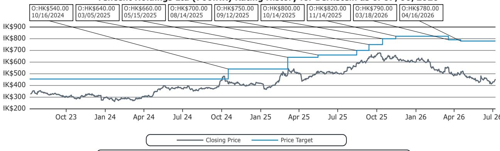
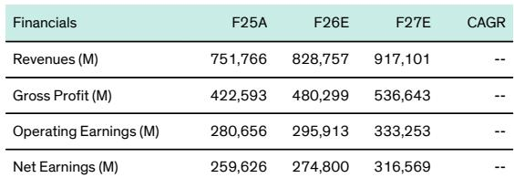
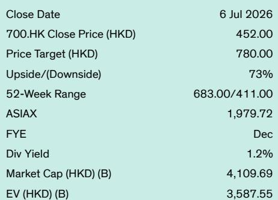

# Tencent's Hy3 Release Proves the AI Team Works, but the Real Test Is Whether Weixin Will Let It In

The debate around Tencent's artificial intelligence strategy has long suffered from a category error. Observers have asked whether Tencent can build a frontier model, when the more strategic question is whether it can build a model that works for its ecosystem. The official release of Hy3 on July 6 provides the clearest answer yet to the first question, while leaving the second one uncomfortably open.

Tencent's updated model, still at 295 billion parameters with 21 billion active, is not competing with the frontier labs on raw reasoning or coding benchmarks. That is not the point. What Hy3 delivers is something more immediately valuable for a company that operates the dominant social and payments infrastructure in China: reliable, low-hallucination, multi-turn agentic capability. The reported improvement in hallucination control from 12.5 percent to 5.4 percent, and the jump in multi-turn retention from 42.9 percent to 75.1 percent, are not just incremental metrics. They represent the difference between a chatbot that frustrates users and an agentic system that merchants and consumers can trust to execute transactions.

The timing matters. Tencent's stock has declined 24.5 percent year-to-date through July 6, underperforming the broader Asia ex-Japan index by more than 45 percentage points. The market has priced in skepticism about the company's ability to navigate a more capital-intensive AI cycle while maintaining its historical return profile. The Hy3 release, coming ten weeks after its preview, suggests that the internal reorganization of Tencent's AI efforts is producing tangible results faster than many expected. But the stock's continued underperformance also reflects a deeper concern that the market has not yet fully articulated: Tencent may have solved the model problem, but the harder problem is organizational.

The core argument of this article is that Tencent's AI future hinges not on whether Hy3 can match GPT-5 or Gemini, but on whether the company can resolve an internal data-access impasse that threatens to separate its model-building capability from its most valuable asset, Weixin. The Hy3 release is a necessary condition for Tencent's AI thesis, but it is far from sufficient. Those who focus only on the benchmark comparisons are missing the more consequential strategic question.

## The Hy3 Release Confirms That Tencent's New AI Team Has Built a Credible Agentic Foundation, Not a Frontier Model

The most important thing to understand about Hy3 is what it does not try to be. Tencent published benchmarks that position the model at roughly GLM-5.1 tier capabilities, with deliberate deprioritization of heavy-duty coding and general reasoning. For a company whose AI ambitions are fundamentally about commerce, advertising, and ecosystem connectivity, this is a rational trade-off.

Consider the use case distribution. Chatbot conversations in consumer applications typically consume hundreds of tokens. Agentic transactions, where a model must navigate multiple steps, interact with external systems, and maintain context across a shopping or service journey, require tens of thousands of tokens. The performance metrics that matter for Tencent are not MATH scores or coding benchmarks, but tool-call stability, hallucination control, and multi-turn retention. On all three, Hy3 shows meaningful improvement from the preview version released two months ago.

The use of grouped query attention in Hy3 leaves room for further architectural improvement, particularly through techniques like multi-head latent attention or direct self-attention that could compress key-value cache requirements. This is not a criticism of the current release, but an acknowledgment that Tencent's engineering team has built a stack that can iterate. The fact that the company moved from preview to official release in ten weeks with material gains across its chosen metrics suggests that the pre-training, reinforcement learning, and evaluation infrastructure is now functioning as a coherent pipeline.

This is the significance that was argued two months ago when Hy3 was first previewed. The model itself was never going to be the headline story. The story was that Tencent's new AI team, assembled after a period of internal reorganization, had demonstrated it could ship. The final release confirms that view. Hy3 is now clearly ahead of comparable models from other Chinese AI labs, including Minimax's M3, and provides a credible base for the next iteration that should feature a new pre-training run, likely by late 2026 or early 2027.

But here is where the analysis must become more uncomfortable. The model works. The team works. The question is whether the organization will let them work on the data that matters most.

## The Capex and Token Spend Debate Misses the Real Risk, Which Is Timing of Monetization, Not Magnitude of Cost

Internet analysts globally have spent the past year watching their coverage universe become more asset-heavy. Tencent has guided for capital expenditure to rise sequentially through 2026, with associated implications for depreciation and amortization costs. The bear case on Tencent's AI spending has crystallized around a specific fear: that token consumption will explode as agentic use cases scale, creating a cost structure that outruns revenue for years.

This fear is analytically plausible but historically myopic. The logic requires examination. Chatbot conversations consume hundreds of tokens. Agentic transactions consume tens of thousands. If Tencent's agentic commerce ambitions materialize at scale, the token count does indeed go parabolic. The bear case then projects this cost forward without corresponding revenue, producing a multi-year margin compression story.

The flaw in this argument is that it treats token consumption as an independent variable rather than a function of transaction volume. Token spend only accelerates if agentic transaction volume and gross merchandise value take off. If they do, revenue follows, with a time lag that history suggests is a matter of when, not if. The pattern is familiar from earlier platform monetization cycles, whether advertising on social feeds or payment processing on messaging apps. Engagement comes first, monetization follows, and the lag has consistently been shorter than skeptics predicted.

What the bear case gets right is that there will be a period where costs lead revenue. The question is whether Tencent's margin structure, which has improved dramatically over the past three years through disciplined cost management and high-margin revenue mix shifts, can absorb that interim period. The adjusted earnings per share estimates of 30.00 yuan for fiscal 2026 and 34.91 yuan for fiscal 2027 imply a market that expects continued earnings growth despite the capex cycle. The stock trades at 13.1 times forward adjusted earnings, a multiple that already embeds significant skepticism.

The more interesting question is not whether Tencent can afford the capex, but whether the monetization model will look like consumer-pays or merchant-pays. In the United States, consumer AI monetization has struggled to gain traction. Subscription rates for standalone AI products remain low, and the advertising-based model has yet to prove itself at scale. China presents a different dynamic. Within Tencent's ecosystem, every kind of transactional intent already exists. Users are accustomed to paying for digital services, and merchants are accustomed to paying for access to users.

The most likely monetization path for Tencent's agentic AI is merchant-pays, not consumer-pays. Merchants would subscribe to agentic AI services that gate access to higher-quality traffic, more sophisticated AI tools, and deeper connectivity across Weixin's various sub-platforms. Those who do not subscribe would receive progressively less traffic and fewer tools. This is a proven model in Chinese internet commerce, and it does not require Tencent to change consumer behavior. It only requires Tencent to change the allocation of its existing traffic and tools, which it controls completely.

## The Hardest Problem Is Not Technical but Organizational, and the Data Access Impasse Between the AI Team and Weixin Remains Unresolved

This is the section of the analysis where the report becomes most valuable, because it identifies a conflict that is not widely discussed in the market. The extensively retooled AI team at Tencent has made real progress realigning model training infrastructure and delivering Hy3. But for a variety of reasons, this team does not appear to have access to Weixin data. Meanwhile, the upcoming Weixin AI agent is being built independently by the Weixin team itself.

The implications of this organizational separation are profound. The AI team that built Hy3 is optimizing a model on data that may not include the most valuable behavioral signals in Tencent's ecosystem. The Weixin team is building an agent on a model that may not benefit from the centralized AI infrastructure and reinforcement learning pipeline that the AI team has spent the past year constructing. Two groups within the same company are effectively pursuing parallel AI strategies, and neither appears to have full visibility into the other's work.

The assumption is that this impasse will eventually be resolved through executive action. Pony Ma and the Tencent leadership team are sophisticated operators who understand the value of data integration. But the fact that the impasse has persisted this long, through multiple organizational restructurings and public commitments to AI, raises a legitimate question. Why has this not already happened?

There are several possible explanations, none of which are mutually exclusive. Weixin may have legitimate privacy and regulatory concerns about sharing user data with a centralized AI team. The Weixin organization may be protecting its autonomy and resisting integration. The AI team may have technical limitations that prevent it from effectively processing Weixin-scale data. Or there may be a strategic disagreement about whether the Weixin agent should be built on a centralized model or a specialized one.

Observers cannot resolve this question from outside, but they can monitor it. The speed at which the Weixin AI agent ships, the model it uses, and the degree of integration between the agent and Tencent's broader AI infrastructure will all be observable signals. If the Weixin agent launches on a model that is clearly different from Hy3, or if it launches without leveraging the AI team's reinforcement learning pipeline, that will be a negative signal about organizational alignment.

## The Decision Framework Shifts from Model Capability to Organizational Integration

The standard framework for evaluating Tencent's AI prospects has focused on three variables: model capability, capital expenditure, and monetization timeline. The Hy3 release provides sufficient evidence on the first variable to reduce its importance as a source of uncertainty. The model is good enough for the use cases that matter. The capex debate, while real, is manageable if monetization follows the merchant-pays path. The timeline question remains open but is directionally positive.

The variable that deserves more weight is organizational integration. A decision framework with four scenarios can be considered.

In the best case, the data access impasse is resolved within the next two quarters. The AI team gains access to Weixin data, the Weixin agent launches on a Hy3-derived model, and the combined system produces a virtuous cycle where agentic commerce scales faster than expected. In this scenario, the current valuation of 13 times forward earnings looks deeply attractive.

In the base case, the impasse persists but both teams continue to improve independently. The AI team iterates Hy3 on available data, the Weixin team builds a competent but less sophisticated agent, and monetization proceeds gradually. The stock remains range-bound until evidence of integration emerges.

In the below-base case, the impasse leads to strategic confusion. The Weixin agent launches but underperforms consumer expectations, the AI team loses momentum from lack of access to the most valuable data, and Tencent's AI narrative shifts from opportunity to cost center.

In the worst case, the organizational conflict becomes public and destabilizing. Key AI talent departs, the Weixin agent fails to gain traction, and Tencent's AI spending becomes a drag on margins without corresponding revenue growth. This scenario would justify the stock's current underperformance and suggest further downside.

The market is currently pricing something between the base case and the below-base case. The 45 percentage point relative underperformance year-to-date reflects a market that sees the organizational risk but has not yet fully modeled it. The opportunity for those who believe in the best case or the base case is that the organizational risk is resolvable through management action. It is not a structural constraint like regulatory hostility or technological inferiority.

## The Full Report Contains the Charts and Data That Support This Analysis, and the Questions It Leaves Unanswered Are Worth Pursuing

The original report from which this analysis is drawn contains detailed benchmark comparisons, financial projections, and valuation methodology that cannot be fully reproduced here. The adjusted earnings per share trajectory, the capex guidance, and the specific improvement metrics across hallucination control and multi-turn retention are all supported by data that deserves close examination.

But the report also leaves several questions meaningfully open. How exactly does the Weixin team's independent AI effort differ from the centralized AI team's approach? What specific data types does the AI team lack access to, and what would change if access were granted? What is the timeline for executive resolution of the organizational impasse? And perhaps most importantly, what is the merchant adoption curve for agentic AI services, and what pricing power does Tencent have in this new channel?

These are not questions that can be answered from a single release or a single analyst report. They require ongoing monitoring of Tencent's product launches, organizational announcements, and management commentary. But they are the questions that will determine whether Tencent's AI investment generates the kind of returns that are currently being debated.

Join the community to read the full report and review the original charts.

*For informational purposes only. Portions may be generated, translated, summarized, or edited with AI assistance based on source materials and may contain omissions or errors. Please verify independently. This is not professional advice.*

For informational purposes only. Portions may be generated, translated, summarized, or edited with AI assistance based on source materials and may contain omissions or errors. Please verify independently. This is not professional advice.

