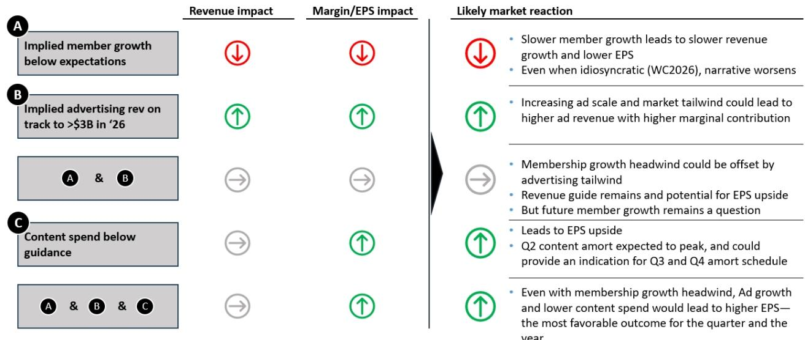
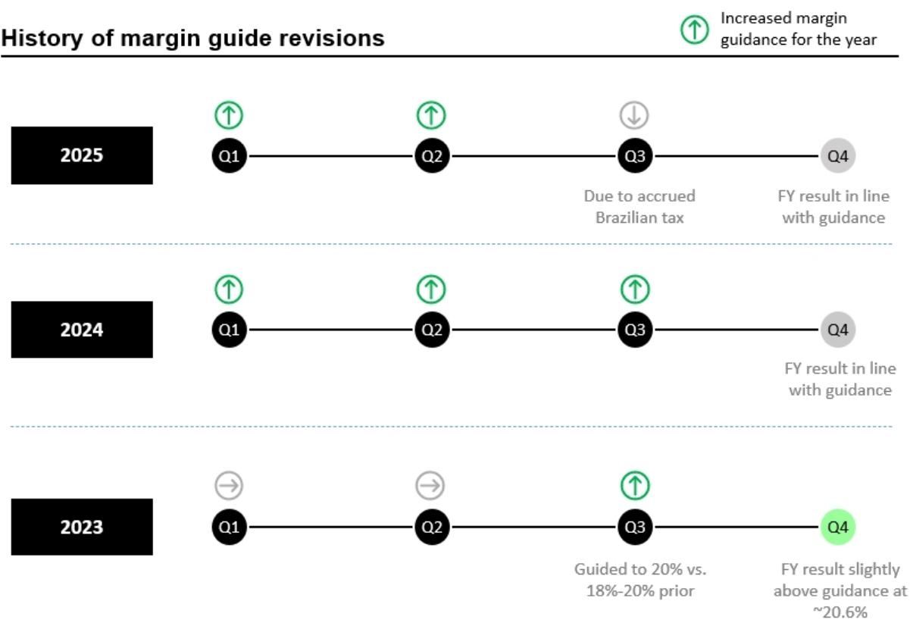
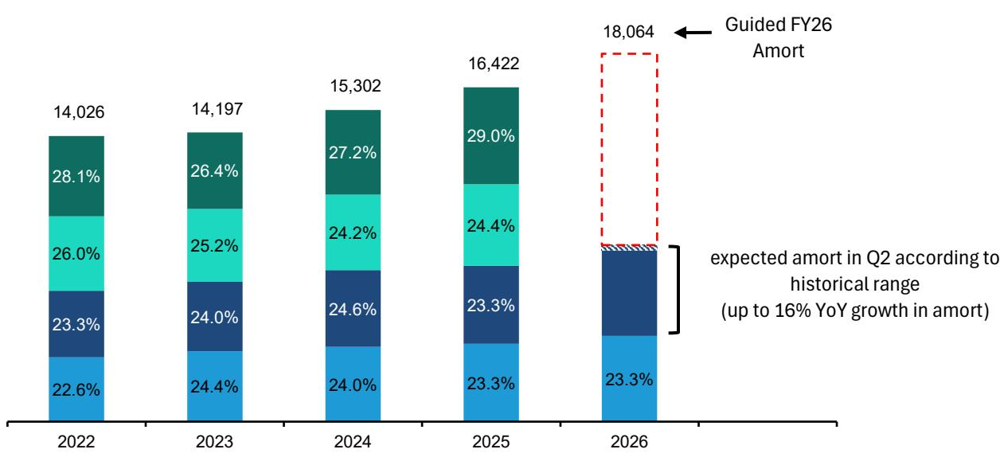

# Netflix at a Crossroads: The Q2 Print Will Determine Whether Subscriber Growth or Advertising Becomes the Dominant Narrative

The streaming giant enters its second-quarter earnings report facing an unusually high number of unresolved strategic questions. Six distinct debates are converging on a single earnings print, and the outcomes will shape not just the company's near-term trajectory but the fundamental narrative around Netflix's business model for years to come. The core tension is simple yet profound: can advertising revenue growth compensate for a structural slowdown in subscriber acquisition, or will the market demand evidence that both engines are firing simultaneously?

For institutional observers, the stakes are unusually high. Netflix shares have declined approximately 19% on an absolute basis year-to-date and have underperformed the S&P 500 by roughly 30 percentage points. The stock now trades at approximately 20 times 2027 consensus earnings per share, a valuation that already embeds considerable skepticism about the company's growth trajectory. The question is whether that skepticism is justified or whether the market is mispricing a transition that will ultimately prove more profitable than the pure subscription model it replaces.

The World Cup 2026 has created a natural experiment in engagement disruption. Major sporting events typically suppress streaming activity, and this year's tournament has added an exogenous headwind to subscriber growth that is largely outside management's control. The critical analytical question is not whether Q2 engagement will be softer—that is well-understood—but rather how much of that headwind is already reflected in the company's 2026 outlook and whether management will use the Q2 print to reset expectations or to signal confidence in the second-half recovery.

## The High End of Revenue Guidance Faces Material Risk from Subscriber Growth Deceleration

Netflix's full-year revenue guidance of 12% to 14% year-over-year growth rests on three pillars: subscriber growth, pricing power from the March 2026 price hike, and the projected doubling of advertising revenue to approximately $3 billion. With pricing now fully implemented and advertising expectations set, hitting the top end of the range requires net subscriber additions of roughly 20 million to 23 million for the full year, implying approximately 7% membership growth.

The problem is that first-half subscriber trends may have tracked below this implied pace. Engagement pressure from the FIFA World Cup has created an incremental headwind during what is already seasonally the softest quarter for streaming. If net additions come in below the high-teens million range for the first half, achieving the upper end of the 14% revenue growth target becomes mathematically challenging. While it is reasonable to assume subscriber growth returns to a more normal cadence in the second half of the year—excluding the July headwind from the World Cup—it is considerably less likely that growth can accelerate sufficiently to offset first-half headwinds.

This creates a classic earnings-season dilemma. Management can either confirm the softness and risk further compression in the company's valuation multiple, or they can attempt to redirect observer attention toward the advertising revenue stream as a compensating factor. The market's reaction will depend heavily on which narrative management chooses to emphasize and how credible that narrative appears given the available data.

## Advertising Revenue Can Offset Subscriber Pressure, But the Market Has No Reliable Way to Verify the Claims

The advertising tier represents Netflix's most important strategic evolution since the introduction of the ad-free subscription model. The company has guided toward approximately $3 billion in advertising revenue for 2026, and there are legitimate reasons to believe this target is achievable. Broader market conditions continue to point to healthy connected television advertising demand, and Netflix's growing scale in the ad-tier subscriber base provides a foundation for revenue growth that is largely independent of total subscriber counts.

However, there is a fundamental information asymmetry problem. There is no reliable third-party data source to track Netflix's advertising revenue in real time. Unlike subscriber numbers, which can be triangulated through multiple industry data providers and payment processor data, advertising revenue remains opaque to outside analysts. This means the market must take management's word on advertising performance, and that creates a trust dynamic that is fragile in the current environment.

The strategic implications are significant. If advertising revenue is tracking ahead of expectations, management has the ability to emphasize the top end of the revenue guidance range even if subscriber growth is below plan. More importantly, the advertising business carries high contribution margins, meaning incremental revenue above the $3 billion target would be highly accretive to earnings per share. A scenario where subscriber growth disappoints but advertising outperforms could actually produce higher EPS than the base case, but the market may not fully credit this dynamic because it cannot independently verify the advertising trajectory.

This information gap creates an opportunity for management to shape the narrative through careful guidance language. But it also creates risk: if the market suspects that advertising revenue is being used to mask subscriber weakness, the skepticism could amplify rather than offset the negative sentiment.

## Margin Guidance May Be Revised Upward Despite Slower Subscriber Growth, But the Base Case Is Not Guaranteed

Over the past two years, Netflix has raised its full-year margin outlook alongside Q2 results. This pattern has become embedded in market expectations, and any deviation from it would carry significant signaling weight. The question is whether management can credibly raise margin guidance this year given the subscriber headwinds from the World Cup.

The answer depends on two variables that are largely independent of subscriber trends: advertising revenue and content spending. If advertising revenue is tracking ahead of expectations, the high-margin contribution flows directly to operating income. Simultaneously, management has guided full-year content amortization growth of approximately 10%, front-loaded into the first half of the year, with Q2 explicitly flagged as the peak growth quarter. If content spending comes in below the $20 billion budget, or if the amortization schedule is more back-end loaded than expected, there is room for margin expansion even on lower revenue.

A 50 basis point or greater margin increase appears achievable under these conditions, and such an outcome would be a powerful signal that the business model is becoming more efficient even as top-line growth moderates. However, there is an alternative scenario that observers must consider. Management may choose to maintain the current margin guidance, effectively confirming that subscriber headwinds are significant enough to warrant waiting until Q3 for greater visibility. This would be interpreted negatively by the market, as it would suggest that the softness is more than a temporary World Cup effect.

The margin guidance decision is therefore a revealed preference signal. An upward revision communicates confidence in the advertising trajectory and content cost discipline. Maintaining guidance communicates caution and uncertainty. The company's reaction will be determined largely by which signal management sends.

## The Potential Discontinuation of the Engagement Report Would Further Erode Investor Confidence

Investor concern is growing around the possibility that Netflix may stop publishing its semiannual "What We Watched" engagement report. This follows the company's earlier decision to discontinue subscriber metrics, and the pattern is concerning for the investment community. While the rationale for eliminating the engagement report may be understandable from a competitive standpoint—providing detailed viewing data to competitors has obvious strategic disadvantages—the timing could not be worse.

The engagement narrative has become a perennial debate for Netflix, and it is likely to remain one for years as consumer preferences and viewing behavior continue to evolve. The rise of short-form video platforms, the fragmentation of attention across multiple streaming services, and the changing nature of content consumption all create uncertainty about the long-term viability of the traditional long-form streaming model. Eliminating the engagement report would remove the primary data source that investors use to track these trends, creating an information vacuum that would likely be filled by negative speculation.

This does not imply that long-form storytelling is in decline. The data suggests that high-quality long-form content continues to command significant audience attention and cultural relevance. But it does suggest that traditional long-form platforms must continue adapting to changing viewer behavior, and investors need visibility into whether that adaptation is succeeding. Removing that visibility would likely weigh on sentiment in the near term, even if the underlying business fundamentals remain sound.

The engagement report decision is therefore a critical governance signal. Maintaining the report demonstrates confidence in the engagement story and a commitment to transparency. Discontinuing it, even for legitimate competitive reasons, would be interpreted as an attempt to hide unfavorable trends. The market's reaction would be immediate and negative.

## The Report Raises Unanswered Questions About the Sustainability of the Premium Valuation

Despite the detailed analysis of near-term risks and offsets, the underlying research leaves several meaningful questions unresolved. The most important is whether the advertising business can eventually become large enough to justify a premium valuation multiple in the absence of robust subscriber growth. The current thesis rests on the assumption that advertising revenue can offset subscriber headwinds in 2026, but the structural question is whether this dynamic is sustainable over a multi-year horizon.

The report also does not fully address the competitive dynamics that will shape Netflix's advertising business over the next three to five years. As other streaming platforms scale their own advertising tiers, the supply of connected television inventory will increase significantly, potentially pressuring CPMs. Netflix's premium positioning may protect its pricing power, but this is an assumption that requires ongoing validation.

Finally, the question of content spending trajectory remains open. The report notes that content amortization growth is expected to decelerate in the second half of 2026, but the sustainability of this trend depends on the company's ability to maintain production efficiency while continuing to invest in high-quality programming. If content costs reaccelerate in 2027, the margin expansion story could reverse quickly.

These unanswered questions are not criticisms of the analysis—they are inherent uncertainties that any observer of Netflix must grapple with. The resolution of these questions will determine whether the current valuation represents an opportunity or a value trap.

## A Decision Framework for Navigating the Q2 Uncertainty

For those trying to position ahead of the Q2 print, a structured decision framework is more useful than a directional view. The outcome space can be mapped along two dimensions: subscriber growth relative to expectations and advertising revenue relative to expectations.

In the first quadrant, where both subscriber growth and advertising revenue meet or exceed expectations, the company has a clear path to re-rating. The narrative shifts back to the fundamental strength of the business, and the current valuation discount begins to close. This is the most favorable scenario but also the least likely given the World Cup headwind.

In the second quadrant, where subscriber growth disappoints but advertising revenue outperforms, the outcome is more nuanced. EPS could still come in above expectations due to the high-margin advertising contribution, but the market's reaction would depend on whether observers focus on the bottom-line beat or the top-line miss. This is the scenario where management's guidance language becomes critical.

In the third quadrant, where subscriber growth meets expectations but advertising revenue disappoints, the company faces modest downside. The advertising narrative loses credibility, and the market begins to question the sustainability of the ad-tier strategy. This scenario is less likely given the broader CTV advertising tailwinds, but it cannot be dismissed entirely.

In the fourth quadrant, where both subscriber growth and advertising revenue disappoint, the company faces significant downside. The dual miss would confirm that the business is experiencing structural headwinds beyond the World Cup effect, and the valuation multiple would likely compress further. This is the worst-case scenario and the one that observers should be most prepared for.

The appropriate positioning depends on one's conviction about which quadrant is most likely. But the framework itself is valuable because it forces explicit consideration of both variables and their interaction effects.

## Join the Community to Read the Full Report and Review the Original Charts

The analysis presented here draws on detailed financial modeling and proprietary data that cannot be fully replicated in a summary format. The original report contains exhibits showing the relationship between subscriber growth, advertising revenue, and content costs that are essential for understanding the full picture. It also includes historical patterns of margin guidance revisions and content amortization schedules that provide important context for the current quarter. Join the community to read the full report and review the original charts.

*For informational purposes only. Portions may be generated, translated, summarized, or edited with AI assistance based on source materials and may contain omissions or errors. Please verify independently. This is not investment, legal, tax, accounting, or other professional advice.*

For informational purposes only. Portions may be generated, translated, summarized, or edited with AI assistance based on source materials and may contain omissions or errors. Please verify independently. This is not investment, legal, tax, accounting, or other professional advice.

