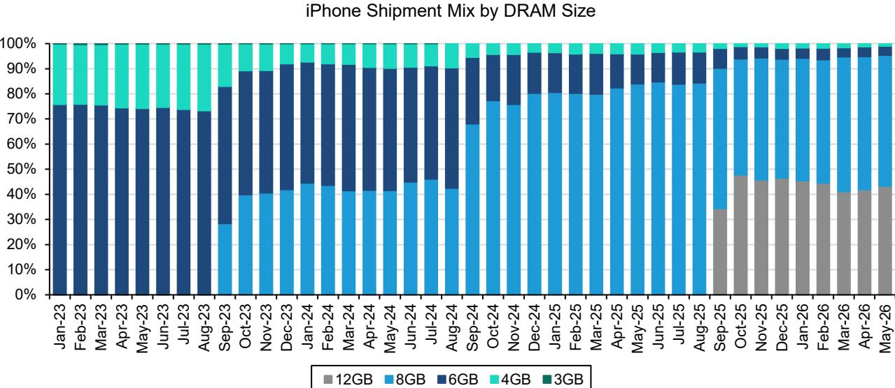
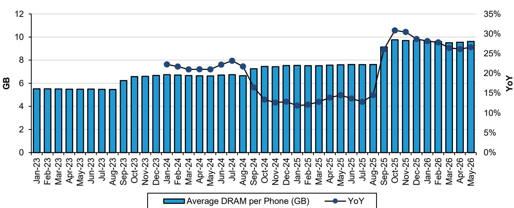
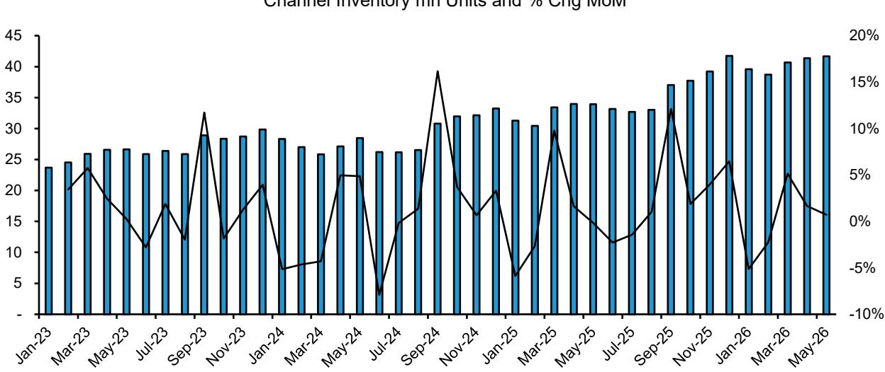

# Bernstein：苹果均价拐点出现，Bernstein称中国市场618策略承压

苹果的全球智能手机份额仍在扩大，但驱动增长的力量正在发生微妙切换。Bernstein最新发布的5月iPhone追踪报告显示，iPhone的出货量增速已节奏变化至2%，远低于市场对FQ3季度53.3百万部的预期水平。更值得关注的是，连续六个月的均价增长在5月出现拐点，同比下滑1.2%。

这份报告的核心信号是：苹果正在经历从“量价齐升”到“份额驱动、价格承压”的转型期。对于读者而言，理解这一转变背后的结构性变量，比关注单月出货量波动更重要。

报告指出，5月iPhone出货量同比仅增长2%，环比增长1%。几乎所有主要市场都实现了正向的销售增长，其中日本和新兴市场表现最为强劲。相对少见的例外是中国市场——销售额同比下降16%，这是自iPhone 17系列发布以来首次出现同比调整。

> **KC评论：** 中国市场下滑的直接原因是今年618促销力度弱于去年。去年iPhone 16 Pro低于6000元门槛，可叠加国家补贴，而今年iPhone 17 Pro降价后仍高于该门槛，无法享受补贴。这意味着苹果在中国市场的定价策略正在面临更复杂的权衡——维持高端定位与获取补贴红利之间的矛盾。

更值得关注的是均价的变化。经过连续六个月的上涨后，5月iPhone均价出现同比下滑。Bernstein认为，这主要归因于e系列（iPhone 17e和16e）的销售占比提升——从去年同期的10%升至11%。e系列均价远低于iPhone主力机型，正在影响整体均价表现。

## 1. 新季度开局偏弱，但历史规律未必适用

报告最引人关注的数据来自FQ3季度的早期追踪。4月和5月iPhone的报告观点-in（出货给渠道）量合计为3590万部，仅占市场共识预期5330万部的67%，以及Bernstein自身预估5610万部的64%。而历史同期均值是72%。

收入端更不乐观：前两个月iPhone收入约314亿美元，仅占市场共识预期的58%，远低于历史同期的69%平均水平。

这些数字看起来值得关注，但需要放在具体背景中理解。FQ3（对应自然年4-6月）是iPhone新品发布前的旧机型消化期，出货节奏本身就有较大波动。更重要的是，今年苹果的库存水平略高于历史均值——5月渠道库存为3.1周，高于历史平均的2.9周。这意味着前两个月的出货量偏低，部分原因可能是渠道在主动去库存，而非终端需求变化。

> **KC评论：** 这里存在一个被市场低估的变量——库存。如果6月渠道开始补货，整季度的出货量可能快速追赶。报告没有给出6月的数据前瞻，但读者可以关注苹果在7月底财报电话会上的库存指引。这才是判断FQ3真实表现的关键。

## 2. 供应链信号分化：谁在受益，谁在承压

Bernstein的报告对苹果供应链的影响做了清晰拆解，不同环节的景气度差异显著。

对于台积电而言，iPhone 17系列在618期间折扣力度减弱，以及iPhone 17e销售偏弱，导致其N3P工艺的出货量低于前代N3E同期水平。但报告认为，即使苹果或其他手机客户释放先进制程产能，这些产能也会被AI应用迅速填补，台积电不会因此损失收入。

内存方面，5月iPhone的DRAM容量同比增长27%，高于2024到2025年全年20%的增速。这是iPhone升级内存规格的直接体现，但Bernstein也提醒，内存价格上涨可能反过来影响后续的容量升级节奏。

在供应链中，立讯精密和大立光情绪较好。报告指出，iPhone出货表现优于安卓阵营，且这两家公司都在AI相关业务上取得稳步进展。索尼的情况则相反——今年CIS（图像传感器）大概率没有升级，2027年面临被三星抢占份额的不确定性。

## 3. 高通的隐忧：苹果自研芯片正在逼近

报告对高通的判断值得单独关注。Bernstein认为，随着苹果加速芯片自研，高通来自苹果的收入将出现显著下降。同时，安卓市场因内存价格上涨而表现仍在调整，叠加苹果份额持续扩大，高通的手机业务收入面临双重不确定性。

这个判断的潜台词是：苹果的自研芯片策略已经从“替代”转向“挤压”。当苹果在基带、Wi-Fi等芯片上逐步摆脱对高通的依赖，后者不仅失去一个高利润率的客户，还面临苹果与安卓之间份额再分配带来的结构性影响。

## 4. 报告尚未完全回答的关键问题

尽管Bernstein的报告提供了丰富的数据维度，但仍有几个关键问题悬而未决。

第一，中国市场618促销力度的差异，究竟是一次性的基数效应，还是反映了苹果在中国定价策略的长期调整？如果苹果无法在下一代机型上重新获得补贴资格，中国市场可能持续面临调整。

第二，e系列占比提升对均价的影响，是周期性的还是结构性的？如果苹果继续用e系列抢占中端市场，均价的节奏变化不确定性可能成为新常态，而非短期波动。

第三，AI功能对换机周期的实际拉动效果，目前仍然无法从出货数据中直接验证。报告提到iPhone 17需求强于预期，但这背后是AI功能驱动，还是正常的换机周期，需要更多证据。

对于关注苹果生态的读者，这份报告的价值不在于给出一个“买或卖”的建议，而在于提供了一个更精细的观察框架：从总量增长转向结构与利润分析，从出货量转向库存与渠道行为，从单一市场转向区域分化。这些维度，才是理解苹果当前所处阶段的真正钥匙。

---

For informational purposes only. Portions may be generated,translated,summarized,or edited with AI assistance based on source materials and may contain omissions or errors. Please verify independently. This is not investment,legal,tax,accounting,or other professional advice.

For informational purposes only. Portions may be generated,translated,summarized,or edited with AI assistance based on source materials and may contain omissions or errors. Please verify independently. This is not investment,legal,tax,accounting,or other professional advice.

