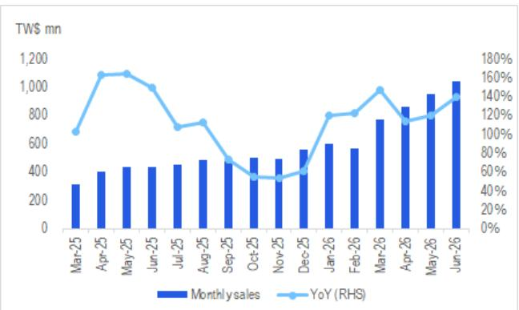
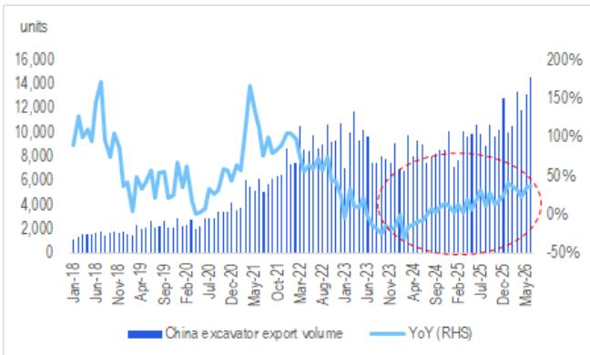

# AI Infrastructure Demand Is Accelerating Through Tangible Supply-Chain Signals, Even as China's Construction Cycle Sends a Mixed Message

The most important data point in China's industrial machinery sector this month is not a government statistic or a macro forecast. It is a single revenue number from a Taiwanese printed circuit board drilling equipment maker. Ta Liang Technology reported monthly revenue of NT$1.04 billion in June 2026, an all-time high, with year-over-year growth accelerating to 140 percent from 120 percent in May. This is not a cyclical recovery. This is a structural demand signal from the heart of the AI hardware supply chain, and it carries implications that extend far beyond one company's order book.

Observers have been wrestling with a persistent question throughout 2026: Is the AI capex cycle peaking, or is it still in its early innings? Cautious voices have pointed to elongated lead times, inventory build concerns, and the sheer scale of capital commitments from hyperscalers as reasons for caution. The Ta Liang data offers a direct counterargument from the factory floor. When a manufacturer of mechanical drilling equipment—a commodity-like input for high-end PCB production—reports accelerating revenue growth to record levels, it suggests that AI PCB makers are not pausing their capacity expansions. They are accelerating them.

The implications for the broader machinery and automation ecosystem are substantial. But a second data stream from China's construction machinery sector introduces a more complicated picture. Excavator sales grew 34 percent domestically and 36 percent in exports in June, yet the overall equipment utilization rate dropped 5.8 percentage points year-over-year to 51.1 percent. This divergence between sales volume and actual usage demands a more nuanced interpretation of China's industrial cycle than either data point alone would suggest.

The strategic question for institutional observers is not whether AI-related machinery is a good theme. It is whether the market is correctly pricing the duration and breadth of this demand wave, and how to navigate the crosscurrents from China's traditional heavy machinery cycle.

## AI PCB Equipment Demand Is No Longer a Forward-Looking Thesis; It Is a Recorded Fact in the Supply Chain

The Ta Liang revenue print is analytically powerful because it comes from a company that sits at a specific, measurable node in the AI hardware supply chain. Mechanical drilling equipment is used to create the microvias and through-holes in high-density interconnect PCBs, which are essential for advanced AI accelerators from both Nvidia and ASIC-based designs. When a drilling equipment maker reports record revenue with sequentially accelerating growth, it means that PCB fabricators are placing orders for new capacity today, not merely planning for future expansion.

This is not a forecast. It is a purchase order. And it directly contradicts the narrative that AI infrastructure investment is approaching a near-term peak.

The report draws a positive read-through to Han's CNC Technology, which manufactures CNC equipment used in similar applications, and Han's Laser Technology, which provides laser-based processing solutions for PCB and semiconductor applications. The logic is straightforward: if PCB makers are aggressively expanding capacity for AI-related production, the equipment vendors supplying that capacity should see corresponding demand. The revenue growth comparison between Ta Liang and Han's CNC reinforces this linkage, suggesting that the demand wave is broad enough to lift multiple players in the equipment ecosystem.

The so-what for observers is that this data point provides a real-time check on the AI capex thesis at a moment when skepticism was rising. It suggests that the supply chain itself is still in expansion mode, and that the equipment cycle may have more runway than equity prices currently reflect. The open question is whether this demand is concentrated in a narrow set of high-end PCB applications or whether it signals a broader upgrade cycle across the electronics manufacturing landscape.

## Construction Machinery Sales and Utilization Are Sending Conflicting Signals That Demand a Framework, Not a Forecast

China's construction machinery data for June 2026 presents a classic analytical puzzle. On the surface, the numbers are strong. Domestic excavator shipments grew 34 percent year-over-year, and exports grew 36 percent. These are robust growth rates by any standard, and they suggest that both domestic infrastructure activity and overseas demand remain healthy.

But the utilization rate tells a different story. At 51.1 percent, the overall construction machinery utilization rate dropped 5.8 percentage points year-over-year. This means that a larger fleet of machines is being deployed, but each machine is working fewer hours. The divergence implies that fleet expansion is outpacing actual construction activity, which raises questions about the sustainability of the sales growth.

There are several possible interpretations, and each carries different implications. One possibility is that the utilization decline reflects a compositional shift toward smaller, less intensively used machines in the export market. Another is that domestic infrastructure projects are being started at a faster pace than they are being completed, creating a temporary bulge in machine purchases that will normalize as projects progress. A third, more concerning interpretation is that the fleet is being overbuilt relative to real demand, setting up a future adjustment in equipment orders.

The report does not resolve this ambiguity, and that is analytically appropriate. The value for observers is not in guessing which interpretation is correct, but in recognizing that the divergence creates a conditional framework. If utilization stabilizes or improves in coming months, the current sales growth is validated and machinery OEMs with strong market positions become more attractive. If utilization continues to decline, the sales data may prove to be a leading indicator of oversupply rather than sustainable demand.

The report's OEM preference ordering—Sany Heavy's Hong Kong listing over its A-share listing, followed by Zoomlion—suggests that the analyst sees relative value differences even within a sector facing this uncertainty. But the key analytical takeaway is that the utilization data introduces a risk factor that pure sales growth numbers alone cannot capture.

## The Report Raises an Unresolved Question About the Interaction Between AI Equipment Demand and Traditional Industrial Cycles

One of the most interesting analytical gaps in the report is that it treats the AI PCB equipment data and the construction machinery data as separate observations, without exploring how these two cycles might interact. This is not a criticism of the analysis, which is appropriately focused on the specific companies and sectors under coverage. But for the institutional observer trying to construct a portfolio view of China's industrial machinery landscape, the interaction between these two cycles is a critical unknown.

Consider the following scenario. AI-related equipment demand continues to accelerate, driving revenue growth for companies like Han's CNC and Han's Laser. At the same time, China's construction machinery cycle shows signs of peaking, with utilization declining even as sales remain strong. How should an observer weigh these competing signals when assessing the overall health of the industrial machinery sector?

One possibility is that these cycles are largely independent, serving different end markets with different customer bases. AI equipment goes to electronics manufacturing; construction machinery goes to infrastructure and real estate. In that case, the appropriate response is to treat them as separate areas of study and allocate accordingly.

But there is a second possibility that is more strategically important. If the AI equipment cycle is driving a broader industrial upgrade cycle in China—requiring new factories, new power infrastructure, and new logistics capacity—then the construction machinery data may eventually benefit from AI-related demand rather than being independent of it. The utilization decline could then be a temporary phenomenon as the fleet expands to serve a changing mix of end markets.

The report does not answer this question, and it cannot be answered from the data presented. But it is the kind of second-order implication that separates a good analysis from a great research perspective. Observers who can develop a framework for understanding how these cycles interact will have a significant advantage over those who treat them as isolated data points.

## A Decision Framework for Navigating Divergent Industrial Signals

For the institutional observer, the combination of accelerating AI equipment demand and conflicting construction machinery signals creates a specific framework. The framework has three dimensions: signal reliability, cycle position, and portfolio construction.

First, signal reliability. The Ta Liang revenue data is a high-frequency, low-latency signal from a specific node in the AI supply chain. It is directly observable and difficult to misinterpret. The construction machinery data, by contrast, requires interpretation because the sales and utilization numbers point in different directions. Observers should assign higher weight to the clearer signal when making near-term assessments, while acknowledging that the construction machinery data may resolve over time.

Second, cycle position. AI equipment demand appears to be in an acceleration phase, with record revenue and accelerating growth. Construction machinery appears to be in a late-cycle phase, with strong sales but declining utilization. The appropriate response differs: for AI equipment, the question is how long the acceleration can persist; for construction machinery, the question is whether the cycle is peaking or merely transitioning to a different growth pattern.

Third, portfolio construction. The report's company-level analysis provides a starting point for positioning. Han's CNC and Han's Laser benefit from the AI equipment cycle. Sany Heavy and Zoomlion are exposed to the construction machinery cycle. The observer's task is to decide whether to treat these as separate themes or to seek exposure to companies that bridge both cycles.

The unanswered question is whether any of the covered companies have meaningful exposure to both AI equipment and construction machinery. If such companies exist, they may offer a natural hedge against the uncertainty in each individual cycle. If not, the portfolio decision becomes a binary choice between two different industrial narratives.

## The Full Report Contains the Charts That Make These Trends Visible

The analysis above is based on the key data points and interpretive framework from the research note, but the original report contains three charts that are essential for visualizing these trends. The first shows Ta Liang's monthly sales and year-over-year growth trajectory, making the acceleration pattern unmistakable. The second compares revenue growth between Han's CNC and Ta Liang, illustrating the breadth of the AI equipment demand signal. The third and fourth charts show China's excavator shipments against social financing and export volumes, providing the context needed to assess the construction machinery cycle.

These charts are not decorative. They are the analytical foundation for the arguments presented here. Without them, the observer is relying on summary statistics that may obscure important patterns in the underlying data.

Join the community to read the full report and review the original charts.

*For informational purposes only. Portions may be generated, translated, summarized, or edited with AI assistance based on source materials and may contain omissions or errors. Please verify independently. This is not investment, legal, tax, accounting, or other professional advice.*

For informational purposes only. Portions may be generated, translated, summarized, or edited with AI assistance based on source materials and may contain omissions or errors. Please verify independently. This is not investment, legal, tax, accounting, or other professional advice.

