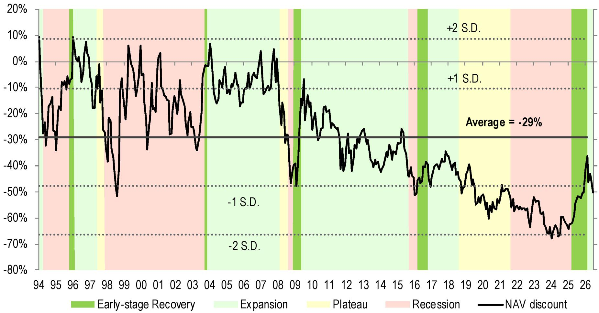
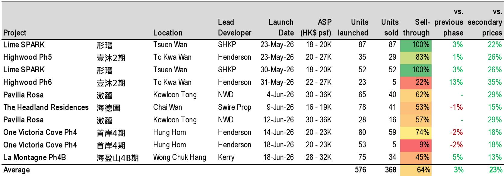
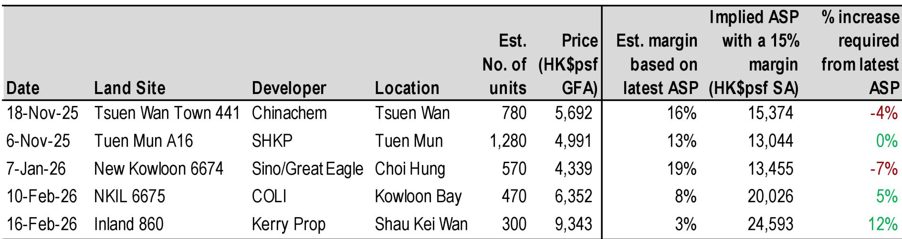

# JPM：香港楼市反弹并非短暂现象，但市场定价逻辑正在变化

一份来自JPM的最新香港住宅市场图鉴，用30年周期数据回答了一个关键问题：当前楼价回升究竟是一次性反弹，还是新一轮周期的开始。报告没有给出简单答案，但提供了足够多的证据，让市场参与者自己判断。

这份报告的核心主张是：香港楼市正处于1994年以来第四个完整周期的“早期复苏”阶段。截至2026年6月底，楼价自2025年3月低点已回升约11%，持续时长约47周。这一幅度和时长，均高于历史早期复苏阶段的均值（12%，25周）。更重要的是，报告通过对比历史数据指出，此轮反弹与过去几次短暂回升后重回调整的走势存在关键区别。

> **KC评论：** 报告的核心价值不在于预测楼价会涨多少，而在于提供了一个可验证的观察框架。如果后续几个月的成交量、开发商定价策略、银行估值变化等高频指标能持续印证“早期复苏”特征，那么市场对香港楼市的定价逻辑可能需要重新校准。

## 1. 成交量持续活跃，但开发商定价变得更“现实”

报告追踪的高频数据显示，楼市反弹的可持续性首先体现在成交量上。2025年3月以来的住宅成交量（一手及二手合计）维持在较高水平，并未出现快速调整。但与此同时，二手市场每周成交量已从高位有所回落，而一手市场的“首日销售率”也出现分化——部分项目仍能实现100%售罄，但另一些项目销售率已降至20%-60%区间。

更值得关注的是开发商定价策略的变化。报告汇编的数据显示，近期新盘平均较周边二手物业溢价约23%，这一溢价水平在过去几个月内有所收窄。开发商正在更积极地定价，而非盲目提价。在土地市场，开发商购地信心也在恢复——近半年来多幅土地以估算利润率8%-19%的价格成交，但其中部分地块的隐含盈亏平衡点仍高于当前二手楼价，说明开发商对后市仍有期待，但并非不计成本。

## 2. 银行估值上调与库存不确定性并存，市场博弈尚未结束

报告中的一个关键信号是银行估值的变化。Centadata的银行估值指数（CVI）在近期出现回升，与二手楼价走势基本同步。银行作为市场中最保守的参与者之一，其估值上调通常意味着对资产价格底部区域的认可。

然而，供应端不确定性并未消失。报告数据显示，未来3-4年香港私人住宅潜在供应约10.1万套，而2026年预计一手成交量约2.2万套。按此计算，库存去化周期仍处于历史偏高水平。这意味着，即使需求在恢复，开发商之间的竞争也不会轻易缓解。定价权正在从卖方市场向买方市场转移，开发商需要持续用有竞争力的价格来吸引买家。

> **KC评论：** 银行估值上调是重要信号，但库存数据提醒我们，这轮复苏的斜率可能比历史均值更平缓。报告中的关键图表——银行估值指数与二手楼价的关系——值得仔细研究，它可能是判断市场是否真正触底的最可靠先行指标之一。

## 3. 报告尚未完全回答的关键问题：内地买家能持续支撑需求吗？

报告用大量篇幅分析了内地买家在香港住宅市场中的作用。数据显示，自2024年3月“撤辣”以来，内地买家（以拼音姓名定义）在一手市场的占比显著上升，按金额计算已从2020-2021年的约2%升至2024-2025年的约7%。最受内地买家青睐的五大区域包括启德、黄竹坑、长沙湾、将军澳及中西区。

但报告也坦承，内地买家的定义存在局限——它无法区分是真正来自内地的购房者，还是已移居香港但保留拼音姓名的居民。更重要的是，内地资金跨境流动仍受每年5万美元的外汇管制限制。报告没有深入讨论的是：一旦内地宏观环境或房地产市场出现变化，这一结构性需求来源的稳定性如何？这可能是当前市场定价中最大的不确定变量。

## 4. 对读者的观察框架：关注四个变量而非一个价格

与其纠结于楼价指数下周是涨是跌，不如关注报告提供的四个高频先行指标：

第一，开发商新盘首日销售率与定价溢价率的组合。如果溢价率收窄而销售率维持高位，说明市场在“以价换量”中找到了均衡。第二，银行估值指数是否持续上行，这决定了按揭市场的信心基础。第三，二手市场挂牌量变化——近期挂牌量从高位有所回落，但如果重新回升，可能意味着业主套现意愿增强。第四，人才签证获批人数与内地买家占比的变化，这是需求端的结构性变量。

这四个指标合在一起，比单一的价格预测更有判断价值。JPM的这份图鉴没有给出明确结论，但它为市场参与者提供了一套完整的观察工具。至于最终答案，仍需要时间给出。

For informational purposes only. Portions may be generated,translated,summarized,or edited with AI assistance based on source materials and may contain omissions or errors. Please verify independently. This is not investment,legal,tax,accounting,or other professional advice.

