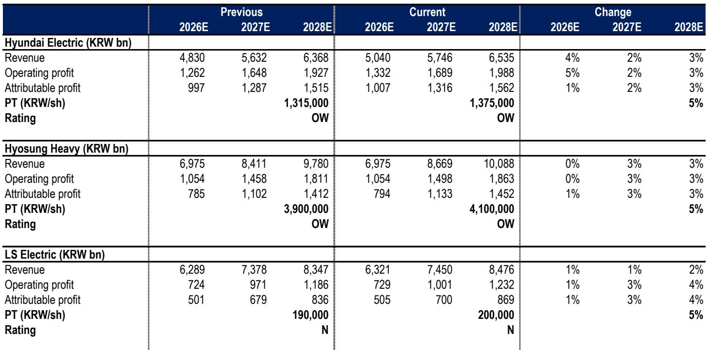
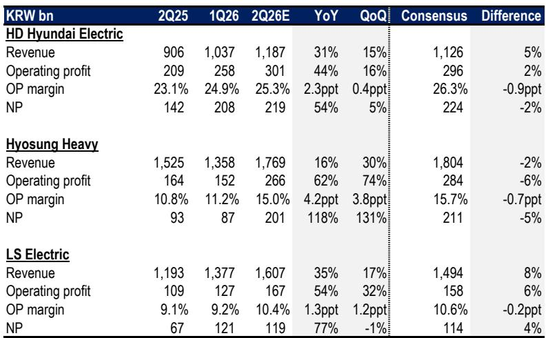
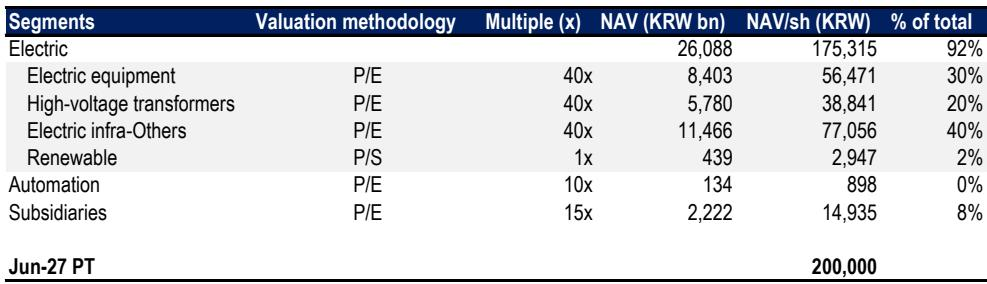

# JPM：AI数据中心订单成关键，韩国电力设备公司谁将胜出？

韩国电力设备公司即将披露二季度业绩。JPM最新报告给出一个清晰的判断：头部玩家之间的差距正在拉大，核心驱动力来自美国AI数据中心订单的获取能力。

这份报告覆盖的三家公司——HD现代电气、晓星重工、LS电气——在二季度将走出截然不同的轨迹。LS电气有望凭借美国数据中心订单的强劲增长成为亮点，新订单可能达到2万亿韩元，较一季度的1万亿弹性较高。晓星重工则可能因中东冲突影响而低于市场预期，其营业利润预计比共识低6%。

报告真正的看点不在于季度数字本身，而在于它揭示了一个正在成型的结构性分化：谁能拿到美国AI数据中心的订单，谁就能在接下来的竞争中占据主动。

## 1. LS电气：新订单超预期，全年指引可能再次上调

LS电气是这份报告中最值得关注的公司。JPM预计其二季度营业利润为1670亿韩元，同比增长54%，比市场共识高出5%以上。更关键的是新订单数据——二季度超过2万亿韩元，远超一季度的1万亿。

这家公司此前已将2026年新订单指引从4万亿上调至5万亿，但JPM认为，按照目前的势头，全年新订单可能达到5-6万亿。这意味着公司在7月底发布业绩时，有可能再次上调全年指引。

> **KC评论：** LS电气的核心逻辑在于它对美国数据中心市场的渗透。报告提到公司正在犹他州扩建产能，这是判断其能否持续获得新订单的关键。完整报告中对产能扩张计划和客户结构的拆解，值得仔细阅读。

## 2. 晓星重工：中东冲突影响，高基数下订单动能减弱

晓星重工的情况则相对复杂。JPM预计其二季度营业利润为2660亿韩元，同比增长62%，但比市场共识低6%。原因有两个：一是中东冲突影响了该地区订单（约占2025年新订单的5-10%），二是公司一季度新订单高达4万亿韩元，基数太高，后续动能自然减弱。

市场最关心的是两个问题：765kV超高压项目的订单进展是否会因德州项目延迟而受影响，以及公司与美国Quanta Services成立的合资公司能否在AI数据中心领域打开局面。

> **KC评论：** 晓星重工面临的核心问题是“从电网到数据中心”的转型能否成功。报告没有完全回答这个问题，但给出了观察窗口——765kV项目的推进节奏和合资公司的具体策略，将是判断公司能否突破当前瓶颈的关键。

## 3. 报告尚未完全回答的关键问题

尽管报告给出了清晰的业绩预测，但有几个重要变量仍处于悬而未决的状态

第一，韩国本土的AI研究浪潮究竟能带来多少增量。韩国存储巨头已公布长期研究计划，但转化为电力设备订单的节奏和规模还不明确。

第二，AI数据中心订单对盈利质量的真实影响。报告提到现代电气和晓星重工的大部分订单仍来自公用事业和电网，而非数据中心。这两类客户的利润率结构不同，订单切换对整体盈利的影响需要更多数据验证。

第三，关税退税和利润率扩张的进展。这是所有三家公司共同面临的政策变量，但目前可量化的信息有限。

## 4. 对产业观察者的框架

这份报告提供了一个实用的分析框架：判断韩国电力设备公司未来竞争力的核心指标，不是总订单量，而是美国AI数据中心订单的占比。

现代电气近期获得了一家超大规模客户超过7亿美元的订单，这是该公司在AI数据中心市场的突破性进展。JPM因此上调了其2027-2028年盈利预测2-3%。LS电气虽然没有获得同等量级的订单，但美国数据中心订单的持续增长正在推动其新订单指引不断上调。

晓星重工的挑战在于，它需要证明自己能够从电网订单向数据中心订单顺利过渡，而中东冲突的干扰让这个转型变得更加紧迫。

对于关注这一赛道的读者，二季度业绩发布后管理层对全年指引的修订幅度，可能比当季数字本身更有信号意义。

For informational purposes only. Portions may be generated,translated,summarized,or edited with AI assistance based on source materials and may contain omissions or errors. Please verify independently. This is not investment,legal,tax,accounting,or other professional advice.

For informational purposes only. Portions may be generated,translated,summarized,or edited with AI assistance based on source materials and may contain omissions or errors. Please verify independently. This is not investment,legal,tax,accounting,or other professional advice.

