## Soitec

## Deeper Mobile trough likely to offset any SiPho upside: Stay Neutral

Soitec is approximately 40% below its year-to-date high, with some market participants questioning whether this represents an interesting point for a medium-term position. We see potential for upward revisions to consensus expectations on the SiPho opportunity, but offsetting this we observe a continued contraction and a much shallower recovery in the Mobile business than currently anticipated by consensus. AI and the associated infrastructure build-out has had mixed effects for Soitec, with the SiPho business expanding but the Mobile business likely to face headwinds as high DRAM prices (due to AI demand) lead to demand changes. We maintain a Neutral stance, based on the view that the downside risk to the core Mobile Communications business is not yet fully reflected in the company's valuation, but equally, we do not think reducing exposure is prudent while we see potential for upward revisions to the Edge & Cloud AI division.

- SiPho remains the significant driver: We expect SiPho will be the material growth engine for Soitec (supported by rising adoption in transceivers and CPO ramping from approximately 2028). We model rapid growth (50% revenue CAGR FY25-30e; €535m in FY30) supported by pre-existing capacity with an assumption that Soitec's market share normalizes (approximately 80% in FY30) as competition increases (notably Global Wafers) plus some downward pressure on pricing as long-term supply agreements take effect. We recognize a high degree of execution risk in SiPho, both for Soitec and also at its customers (in particular ramping CPO).

- Mobile decline to continue in FY27 with shallower recovery: Mobile remains the largest division (approximately 52% of FY26 revenue) but with a step-down in handset volumes expected in 2026-2027 (we estimate -16% and -3%, respectively). As DRAM pricing flows through the supply chain, we see a further contraction in Mobile revenues. Management's more disciplined approach to RF-SOI pricing from FY27 onwards could support margins, but also increase market-share-loss risk and prolong the destocking cycle (we now assume destocking into FY28). Our revenue forecast for the Mobile Communications division is 14-17% below consensus in FY27-29.

- Auto & Industrial still working through inventory: Inventories across Auto & Industrial customers remain elevated, which will represent a headwind to Soitec volume and possibly pricing through FY27 (although pricing discipline appears to be a company priority). There are some recent indications of restocking in the Auto supply chain, but we expect IDMs to see most of the benefit (rather than wafer makers). On top of this, SmartSiC is likely to contract further based on competitive pressures (which prompted the impairment in FY26). We expect revenue to be broadly flat in FY27, with a gradual improvement in FY28 largely in line with consensus.

- Gross margin trajectory shallower than consensus expects: We see a more gradual margin rebuild than the latest consensus, with group-level gross margin only reaching 30.2% in FY29 (vs. 32.2% consensus) despite SiPho mix benefits and improving loading. Headwinds include a higher fixed-cost/depreciation base, pricing pressure (especially RF-SOI) and currency. In the near term, elevated inventory write-downs in FY26 should support FY27 gross margins.

Sources for: Style Exposure – JPM Global Markets Strategy; all other tables are company data and JPM estimates.

## Neutral

SOIT.PA, SOI FP

60H.PA, 60H
Price (07 Jul 26):€98.16

▼Price Target (Dec-27):€92.00
Prior (Dec-27):€130.00

European Tech Hardware & Payments

Craig A McDowell AC
(44-20) 7742-4576
craig.mcdowell@JPM.com

Sandeep Deshpande
(44-20) 7134-5276
sandeep.s.deshpande@JPM.com

Anthony Girard
(44-20) 3493-6469
anthony.girard@JPM.com
JPM Securities plc

Specialist Sales contact details:

## Scott Silver - Specialist Sales - European TMT

(44-20) 7134-0412
scott.silver@JPM.com

Key Changes (FYE Mar)

<table><tr><td></td><td>Prev</td><td>Cur</td><td> $\Delta$ </td></tr><tr><td>Revenue - 27E (€ mn)</td><td>631</td><td>603</td><td>-4.4%</td></tr><tr><td>Revenue - 28E (€ mn)</td><td>824</td><td>748</td><td>-9.2%</td></tr><tr><td>Adj. EPS - 27E (€)</td><td>(0.48)</td><td>(0.59)</td><td>-21.8%</td></tr><tr><td>Adj. EPS - 28E (€)</td><td>1.79</td><td>0.91</td><td>-49.3%</td></tr><tr><td>Adj. EBIT - 27E (€ mn)</td><td>2</td><td colspan="2">(3)-246.5%</td></tr><tr><td>Adj. EBIT - 28E (€ mn)</td><td>96</td><td>58</td><td>-40.0%</td></tr></table>

## Style Exposure

<table><tr><td rowspan="2">Quant Factors</td><td rowspan="2">Current %Rank</td><td colspan="4">Hist %Rank (1=Top)</td></tr><tr><td>6M</td><td>1Y</td><td>3Y</td><td>5Y</td></tr><tr><td>Value</td><td>91</td><td>23</td><td>28</td><td>47</td><td>53</td></tr><tr><td>Growth</td><td>13</td><td>54</td><td>58</td><td>12</td><td></td></tr><tr><td>Momentum</td><td>96</td><td>91</td><td>86</td><td>36</td><td>56</td></tr><tr><td>Quality</td><td>70</td><td>88</td><td>78</td><td>65</td><td>37</td></tr><tr><td>Low Vol</td><td>1</td><td>94</td><td>93</td><td>61</td><td>34</td></tr><tr><td>ESGQ</td><td>51</td><td>47</td><td>35</td><td>83</td><td>97</td></tr></table>

See page 14 for analyst certification and important disclosures, including non-US analyst disclosures.

Price Performance  
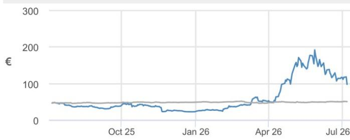

— SOIT.PA Price (€) — SBF120 (rebased)

<table><tr><td></td><td>YTD</td><td>1m</td><td>3m</td><td>12m</td></tr><tr><td>Abs</td><td>323.3%</td><td>-33.1%</td><td>100.3%</td><td>109.9%</td></tr><tr><td>Rel</td><td>319.8%</td><td>-35.4%</td><td>93.9%</td><td>101.2%</td></tr></table>

Company Data

<table><tr><td>Shares O/S (mn)</td><td>36</td></tr><tr><td>52-week range (€)</td><td>200.50-22.62</td></tr><tr><td>Market cap ($ mn)</td><td>4,004.53</td></tr><tr><td>Exchange rate</td><td>0.87</td></tr><tr><td>Free float (%)</td><td>69.5%</td></tr><tr><td>3M ADV (mn)</td><td>0.58</td></tr><tr><td>3M ADV ($ mn)</td><td>84.4</td></tr><tr><td>Volatility (90 Day)</td><td>128</td></tr><tr><td>Index</td><td>SBF 120 INDEX (CAC 120)</td></tr><tr><td>BBG ANR (Buy | Hold | Sell)</td><td>6|10|3</td></tr></table>

Key Metrics (FYE Mar)

<table><tr><td>€ in millions</td><td>FY26A</td><td>FY27E</td><td>FY28E</td></tr><tr><td colspan="4">Financial Estimates</td></tr><tr><td>Revenue</td><td>592</td><td>603</td><td>748</td></tr><tr><td>Adj. EBIT</td><td>(131)</td><td>(3)</td><td>58</td></tr><tr><td>Adj. EBITDA</td><td>143</td><td>131</td><td>189</td></tr><tr><td>Adj. net income</td><td>(220)</td><td>(21)</td><td>33</td></tr><tr><td>Adj. EPS</td><td>(6.17)</td><td>(0.59)</td><td>0.91</td></tr><tr><td>BBG EPS</td><td>(1.94)</td><td>(0.14)</td><td>2.00</td></tr><tr><td>Cashflow from operations</td><td>205</td><td>176</td><td>160</td></tr><tr><td>FCFF</td><td>68</td><td>80</td><td>44</td></tr><tr><td colspan="4">Margins and Growth</td></tr><tr><td>Revenue Growth Y/Y (%)</td><td>(33.6%)</td><td>1.8%</td><td>24.1%</td></tr><tr><td>EBIT margin</td><td>(22.1%)</td><td>(0.4%)</td><td>7.7%</td></tr><tr><td>EBIT Growth Y/Y (%)</td><td>(210.1%)</td><td>(98.0%)</td><td>(2248.4%)</td></tr><tr><td>EBITDA margin</td><td>24.2%</td><td>21.7%</td><td>25.3%</td></tr><tr><td>EBITDA Growth Y/Y (%)</td><td>(52.0%)</td><td>(8.4%)</td><td>44.5%</td></tr><tr><td>Net margin</td><td>(37.2%)</td><td>(3.6%)</td><td>4.4%</td></tr><tr><td>Adj. EPS growth</td><td>(340.4%)</td><td>(90.5%)</td><td>(254.9%)</td></tr><tr><td colspan="4">Ratios</td></tr><tr><td>Adj. tax rate</td><td>(37.9%)</td><td>(9.0%)</td><td>16.0%</td></tr><tr><td>Interest cover</td><td>4.8</td><td>7.7</td><td>10.5</td></tr><tr><td>Net debt/Equity</td><td>0.0</td><td>NM</td><td>NM</td></tr><tr><td>Net debt/EBITDA</td><td>0.4</td><td>NM</td><td>NM</td></tr><tr><td>ROE</td><td>(15.1%)</td><td>(1.6%)</td><td>2.5%</td></tr><tr><td colspan="4">Valuation</td></tr><tr><td>FCFF yield</td><td>1.9%</td><td>2.2%</td><td>1.2%</td></tr><tr><td>Dividend yield</td><td>0.0%</td><td>0.0%</td><td>0.0%</td></tr><tr><td>EV/Revenue</td><td>7.2</td><td>7.0</td><td>5.6</td></tr><tr><td>EV/EBITDA</td><td>29.9</td><td>32.2</td><td>22.1</td></tr><tr><td>Adj. P/E</td><td>NM</td><td>NM</td><td>108.3</td></tr></table>

## Summary Investment Thesis and Valuation

## Investment Thesis

Soitec is going through a period of inventory correction at customers, which is having a significant impact on revenue. At the same time, concerns over the competition for Soitec's largest product (RF-SOI) are heightened. Other products are beginning to compensate, notably POI and Photonics-SOI, which we expect to become the dominant revenue stream in the next 2-3 years. Market enthusiasm for Silicon Photonics has resulted in a significant run-up in the shares; however, we now see the valuation as full to fair, reflecting the future opportunity.

## Valuation

Our Dec-27 price target of €92 is based on 11.0x FY29e EBITDA (y/e March 2029) (previously €130 valued on 15.0x FY29). The chosen multiple is at the high end of the wafer maker range, justified by higher growth; the multiple is an approximately 10% premium to the last five-year average, justified by improving growth, returns and cash flow. We value on FY29 earnings, which we expect to be more normalized following a period of financial performance (in FY26 and expected/guided in FY27).

Performance Drivers  
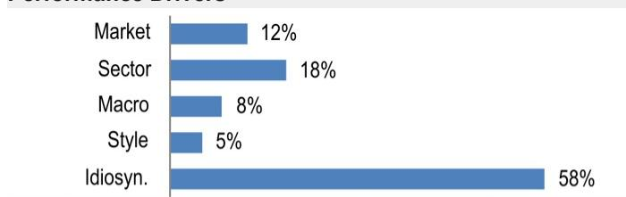

<table><tr><td>Factors</td><td>6M Corr</td><td>1Y Corr</td></tr><tr><td>Market: MSCI Europe ex UK</td><td>0.37</td><td>0.38</td></tr><tr><td>Sect: Technology</td><td>0.46</td><td>0.45</td></tr><tr><td>Ind: Semicond &amp; S Equip</td><td>0.27</td><td>0.30</td></tr><tr><td>Macro:</td><td></td><td></td></tr><tr><td>Euro</td><td>-0.23</td><td>-0.23</td></tr><tr><td>Citi Eco Surprise Eurozone</td><td>-0.17</td><td>-0.19</td></tr><tr><td>Eurozone Exports</td><td>0.10</td><td>0.11</td></tr><tr><td>Quant Styles:</td><td></td><td></td></tr><tr><td>Quality</td><td>0.20</td><td>0.25</td></tr><tr><td>DivYld</td><td>-0.13</td><td>-0.21</td></tr><tr><td>Value</td><td>-0.15</td><td>-0.18</td></tr></table>

- What else could drive upside for the shares from here? The current share price appears to assume SiPho delivering €500m+ revenue by FY30, other divisions returning to growth in FY28, and an improving margin/FCF profile. Beyond any changes to forecasts, we do not think the portfolio review (possibly at H1'27 results) will significantly change the market's perception, while investors will be reluctant to fully underwrite 'incubator projects' at an early stage.

- Q1'27 and Q2'27 reflecting our medium term view: For Q1 (June-end quarter), we are in line with company guidance (+15% y/y organic) which is in line with consensus. Similarly, for Q2 we are broadly in line with consensus. However, we are below on Mobile Communications, but ahead on Edge & Cloud AI (see Table 4).

Conclusion for the shares: Soitec is running at two speeds with SiPho revenue surging, while Mobile Communications (as well as Automotive & Industrial) is seeing slow growth in the forecast period. We think that revenue forecast upgrades could come through on SiPho/Edge & Cloud AI, but there is downside risk to other division estimates; net, at the group level, our forecasts are 4%/6%/3% below the latest consensus. We remain Neutral, on the view that the downside risk to the core Mobile Communications business is not yet fully reflected in the shares, but equally, we do not think reducing exposure is prudent while we see potential for upward revisions to the Edge & Cloud AI division.

- Forecast and PT update: We revise our revenue forecasts with group level changes of -4%/-9%/-3% in FY27/28/29, respectively, with revisions to Mobile as well as Auto & Industrial. The lower revenue assumptions flow through the P&L with limited changes to our opex and D&A assumptions (see Table 2 for summary of forecast changes). Our new PT is €92 (previously €130), which reflects our lowered estimates as well as a lowered multiple (11.0x from 15.0x, reflecting multiple contraction across the peer group).

## SiPho remains the significant driver

On volume, we expect Silicon Photonics (SiPho)-based modules to represent a growing share of optical transceivers in the forecast period, given energy and data-efficiency benefits, while leveraging mature silicon foundries for high-volume production (e.g. STMicroelectronics moving into the SiPho foundry). Industry consultancy Lightcounting estimates that in 2026, SiPho will represent approximately 52% of the optical transceiver market (up from approximately 33% in 2024). CPO will be the next leg of growth later in the decade as it ramps from 2028 onwards – we expect this will be completely based on SiPho (with much larger SiPho content). The result is very significant growth in the SiPho wafer market through to 2030 (JPMe approximately 66% CAGR 2025-2030).

On pricing, while pricing in FY27 is likely to remain positive, we think LTSAs will lead to small (LSD%) blended ASP erosion for Soitec's SiPho business. This will be based on both the initial contract price but also an assumption of pricing descalators (i.e. higher volumes at lower prices). From our discussions with the company, we understand that the aim of the long-term supply agreements (LTSAs) is to gain greater confidence on future volume and pricing, as well as to improve the working capital profile - not necessarily to optimize price. A parallel may be drawn to the memory makers which have managed to secure material LTSA's with customers stretching for 3-5 years and in some cases structured as take or pay - we think this will be the ambition for Soitec.

On market share, we forecast an erosion of Soitec's market share to approximately 80% in FY30 (from an effective approximately 100% currently). Soitec is in the process of qualifying with a number of customers for CPO, which should support market share in the face of competition. In terms of competitors, we highlight Global Wafers (covered by Jimmy Huang) as the main competitive threat. As a reminder, Global Wafers has developed silicon on insulator technology (independent of Soitec patents) and developed a facility in Missouri dedicated to SOI at 300mm. The latest commentary from Global Wafers is that the Missouri facility is already covered by long-term agreements, although the split between RF-SOI and Photonics is uncertain ("Capacity is nearly full with output largely sold through and selected RF-SOI and photonics already ramping.", 5 May 2026 Q1 earnings call). Global Wafers management has indicated that it is exploring the expansion of its SOI production capacity, although no firm commitment has been made. Shin Etsu is also a competitor in SiPho, however, it is reliant on a SmartCut licence and as such may be less cost competitive.

We recognize a high degree of execution risk to SiPho estimates, both internally for Soitec in terms of converting capacity, securing contracts, etc, but also with customers as it launches CPO products (which will be a significant driver of SiPho content).

Taken together, we see faster growth for Soitec's Edge & Cloud AI business, with our revenue forecasts for this division $+6\% / +10\% / +14\%$ below the latest Vara consensus (Table 2).

Figure 1: Optical market, units by form factor  
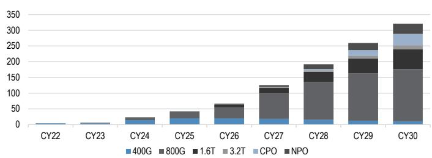  
Source: JPM estimates.

Figure 2: SiPho wafer demand by form factor
Millions of wafers (calendarised)  
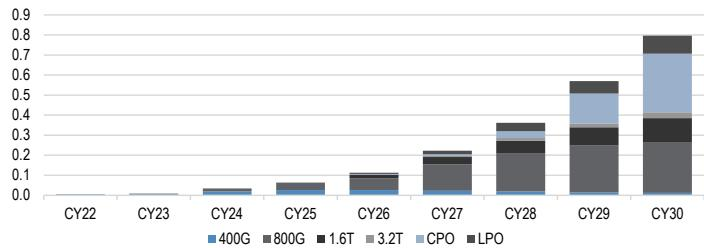  
Source: JPM estimates.

Figure 3: SiPho wafer market and Soitec market share
Millions of wafers (March year-end)  
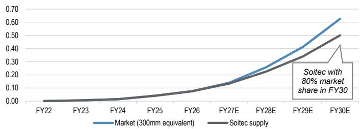  
Source: JPM estimates.

Figure 4: Soitec, SiPho revenue  
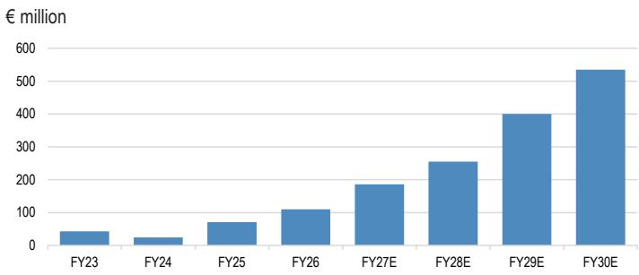  
Source: JPM estimates.

## Mobile decline to continue in FY27 with shallower recovery

Mobile Communications still represents the majority of Soitec revenues (approximately 52% in FY26), and fundamentally the revenue development of this division will be tied to the mobile handset market (Figure 5), although there will be increasing content and some technology shift providing tailwinds. We now factor in a handset decline of 16% in calendar 2026 and 3% in 2027, this is lower than our prior forecast which reflects further news reports of production adjustments by certain vendors.

On RF-SOI, which is the largest product within Mobile Communications and where there is significant inventory sitting at customers (Figure 6), we see a shallower revenue recovery as the digestion of channel inventory is prolonged given softer end-market demand (Figure 7). We understand that management is moving to a more disciplined pricing policy on RF-SOI going forward; positively, this should support gross margin, but negatively, we see greater risk of market share loss (we assume market share erosion to lower priced competitors) and elongation of the destocking cycle (we now assume destocking in FY28).

On the non-RF SOI Mobile business, the destocking is less of a headwind while there are new technologies (notably POI) which are increasing in adoption and should allow for growth ahead of mobile phone units in the forecast period (Figure 8).

Taken together, we see a shallower trajectory for Soitec's Mobile business, with our revenue forecasts for Soitec's Mobile Communication business $-15\% / -14\% / -17\%$ below the latest Vara consensus (Table 2).

Figure 5: Mobile handset market, by generation
Millions of units  
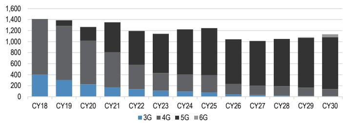  
Source: JPM estimates.

Figure 6: Soitec, RF-SOI wafer shipments and market share
Millions of wafers  
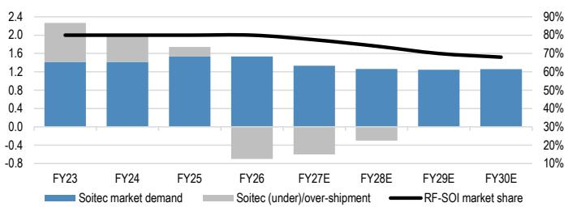  
Source: JPM estimates.

Figure 7: Soitec, RF-SOI revenue  
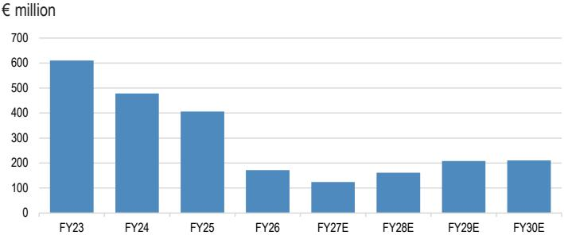  
Source: JPM estimates.

Figure 8: Soitec, non-RF-SOI Mobile revenue and handset growth  
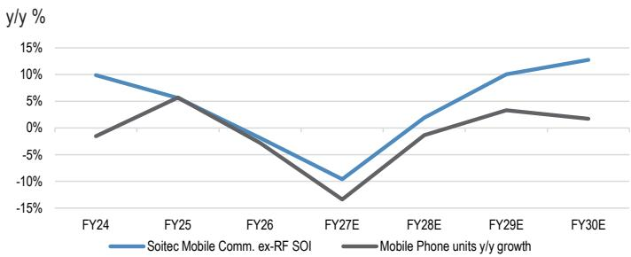  
Source: JPM estimates.

## Auto & Industrial still working through inventory

Recent commentary across IDMs suggests that the Industrial end-market is seeing the beginning of an upcycle; however, the Automotive end-market is much more tentative. The Automotive end-market remains in a prolonged adjustment phase, with regulation in the US and China delaying an upcycle (i.e. changes in the EV tax credit scheme in the US, and changes in incentive schemes in China). There has been some evidence through Q1 reporting of restocking in the Automotive supply chain benefiting IDMs, but without any real change in the end-market (in fact, S&P has revised down vehicle production forecasts) and with inventories still elevated at IDMs, we do not think that the restocking benefit will extend further down the supply chain to Soitec. Our base case is that Auto & Industrial revenue sees mild growth in FY27, with an improvement in growth in FY28 – within this we assume further declines in the SmartSic business (given competitive pressures which prompted the impairment through FY26).

Our revenue estimates for Auto & Industrial largely correspond to latest Vara consensus (Table 2).

Figure 9: Auto and Industrial exposed IDMs, days of inventory
Days  
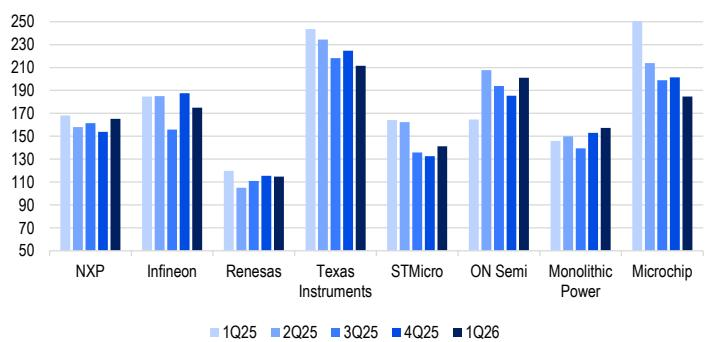  
Source: JPM estimates, Company data.

Figure 10: Auto and industrial IDMs, average days of inventory
Days  
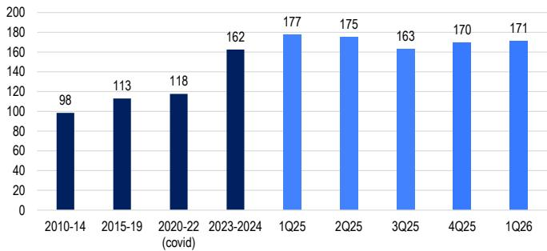  
Source: JPM estimates, Company data.

## Gross margin trajectory shallower than consensus expects

Most investors we speak to (and our modelling) forecast FY29 revenue ≥€1bn. On gross margin, our starting point is to use FY23 (approximately €1.1bn revenue) level as the basis (i.e. 37.0%), with a number of puts and takes into the future (which we outline below). The net impact, in our view, is a shallower trajectory upwards in gross margin, with our estimate not breaking through 35% in the forecast period.

## Headwinds

- Capital base growth: The capital base has grown significantly since FY23, with corresponding increases in the depreciation charge and operating costs, creating a higher fixed cost base hurdle. The PPE balance has grown approximately 27% from FY23 to end-FY26 (note, this would be higher when excluding impairments of tangible assets related to SmartSiC, while the number of "production" employees grew approximately 12% in the same period (from 1,269 to 1,418) adding to the fixed operating cost.

- Mix and price: While SiPho will be accretive to contribution margin in the forecast period, we see price pressures in key substrates (notably RF-SOI) resulting in a softer group-level contribution margin compared to the peak of FY23. Management is being more disciplined on pricing in FY27 (even in the face of high channel inventory), but within the Mobile segment we struggle to see positive pricing in the forecast period given inventory in the channel and growing competition.

- Currency: The average EURUSD rate in FY23 was approximately 1.04 vs. the current level of approximately 1.14. With sales in USD and a largely EUR cost base, the move in exchange rate represents a headwind to profitability (as a reminder, an approximately 5c move higher in the EURUSD rate represents an approximately 150bps headwind to EBITDA margin, with our expectation that this is mostly in the gross margin).

- Rising bare wafer prices: We don't see an immediate risk to gross margins from the higher bulk wafer prices that have been reported in the industry, but we do see this as a possible impact (which may be offset in Soitec's pricing). Soitec has approximately €194m of raw materials (including approximately €37m of consignment) as well as high balances of WIP (approximately €20m) and finished products (approximately €20m); we expect that these balances should sustain sales largely through FY27 (Days of Inventory stands at 162 days, Figure 9).

## Tailwinds

- Licensing income: We note a step change in the licence income earned by Soitec since FY23. We expect that the step change relates to a change in the royalty rate paid on IP-use rather than being volume driven, with a positive impact on gross margin. Global Wafers is no longer a licensee so that will reduce license income going forward (although we understand from discussion with the company there was a one-off "catch up" royalty from Global Wafers in the FY26 base, approximately €HSDm), but that the company is seeking further licensees (e.g. ZenSemi)

- Inventory write-downs: There was an elevated impairment of inventory which would have had the effect of depressing gross margins in FY26 (Figure 10). However, in future periods as this impaired inventory is sold and recognized in COGs, the gross margin should see support (likely in FY27).

Taken together, we see a shallower trajectory for Soitec's gross margin, with our gross margin forecast approximately 200-360 bps below latest Vara consensus in FY28 and FY29 (Table 2).

Figure 11: Soitec, JPM gross margin bridge %  
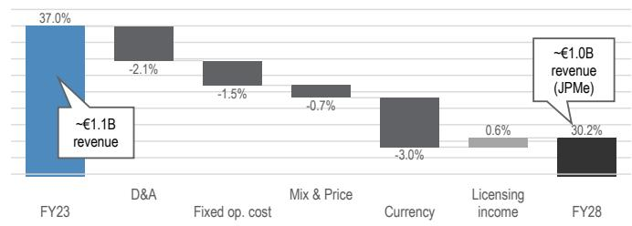  
Source: JPM estimates.

Figure 12: Soitec, days of inventory  
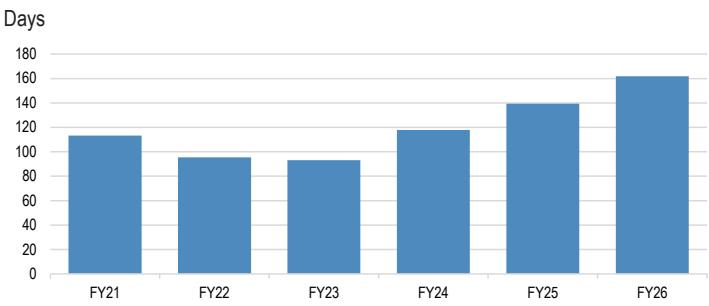  
Source: JPM estimates, Company data.

Figure 13: Soitec, license income  
€ million and % of sales  
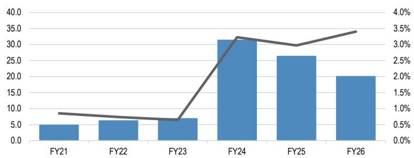  
Source: .P. Morgan estimates, Company data

Figure 14: Soitec, impairment of inventory  
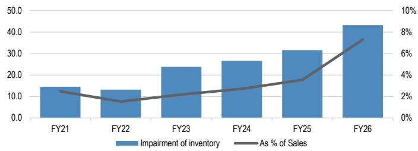  
Source: .P. Morgan estimates, Company data

## What else could drive upside for the shares from here?

From discussions in the market, we see the following expectations underpinning the current share price:

1. SiPho to deliver revenue of greater than €500m in FY30

2. Mobile Communications and Automotive & Industrial returning to growth in FY28

3. Group-level gross margins reaching low-mid 30% by FY29

4. An improving operating margin and free cash flow profile

As we outline above, we are more cautious on (2), (3) and (4) with our forecasts below consensus expectations. Beyond the numbers in the forecast period, we highlight two events that may have a bearing on the shares – (a) presentation of the portfolio review currently being undertaken by CEO Remont, and (b) the increasing credibility of 'incubator projects':

- On (a), our expectation is that this will include actions to better optimize sales and research efforts (focusing on the most valuable opportunities) or at most extreme discontinuation of some small product lines (which are either undifferentiated or not a large enough market); in either case we don't see a fundamental change in view on the company. We don't expect a read-out from this review until at least H1'27 results in November.

- On (b), we sense that under the new CEO, Soitec will be investing further in the next drivers of growth. Although there have been some indications of application of SOI in memory or quantum computing, we expect that the market will be reluctant to underwrite in Soitec numbers.

## What is the right multiple for Soitec at this point?

Five-year history has seen Soitec trading on approximately 10x two-year forward EBITDA on average, although we note a significant variation in this time (approximately 4.0x to approximately 26.0x more recently). We think that as estimates begin to stabilize (following the significant expansion driven by SiPho) a small premium to longer-run average EBITDA multiple can be justified, owing to:

- Improving free cash flow: With action taken by management to correct working capital and more disciplined capital allocation, we see a significant improvement in free cash generation, with our expectation for €212m of free cash flow in the next three years (comparing to €97m cumulative in the prior five years).

- Improving growth and returns: With working capital improvement and capital discipline we see improving ROIC in the forecast period (contrary to the declining trend in the prior five years); in addition there is accelerating growth (driven by SiPho), which is unlike the prior five years where growth was decelerating (and turning negative).

- Durable growth: We view the SiPho growth driver as more durable than the prior RF-SOI driven growth. The RF-SOI growth driver is backed (ultimately) by hypersaler capex, which is much more robust backing than the consumer market (mobile phones).

- Improving sentiment: From recent discussions with investors we note improving sentiment toward Soitec, with investors willing to reassess with a new management team in place and being proactive and candid on the measures needed to improve the company.

We value the shares at 11.0x two-year forward EBITDA, which is an approximately 10% premium to recent history (given the justification above). The selected multiple is at the high end of the range of wafer maker peers on an EV/EBITDA basis (more expensive on a P/E basis), which can be justified by higher growth.

Table 1: Soitec, valuation comps table  
X

<table><tr><td rowspan="2"></td><td colspan="4">EV/Sales</td><td rowspan="2">Sales CAGR</td><td rowspan="2">Growth Adj.</td><td colspan="4">EV/EBITDA</td><td rowspan="2">EBITDA CAGR</td><td rowspan="2">Growth Adj.</td><td colspan="4">EV/EBIT</td><td rowspan="2">EBIT CAGR</td><td rowspan="2">Growth Adj.</td><td colspan="4">P/E</td><td rowspan="2">EPS CAGR</td><td rowspan="2">Growth Adj.</td><td></td></tr><tr><td>FY26</td><td>FY27</td><td>FY28</td><td>FY29</td><td>FY26</td><td>FY27</td><td>FY28</td><td>FY29</td><td>FY26</td><td>FY27</td><td>FY28</td><td>FY29</td><td>FY26</td><td>FY27</td><td>FY28</td><td>FY29</td><td></td></tr><tr><td colspan="25">Soitec (current price)</td><td></td></tr><tr><td>Fiscal years</td><td>[CM]</td><td></td><td>7.1</td><td>5.7</td><td>4.3</td><td>19%</td><td>0.3</td><td></td><td>32.7</td><td>22.6</td><td>14.1</td><td>29%</td><td>0.8</td><td></td><td>-1599.1</td><td>74.4</td><td>24.3</td><td>-380%</td><td>-0.2</td><td
