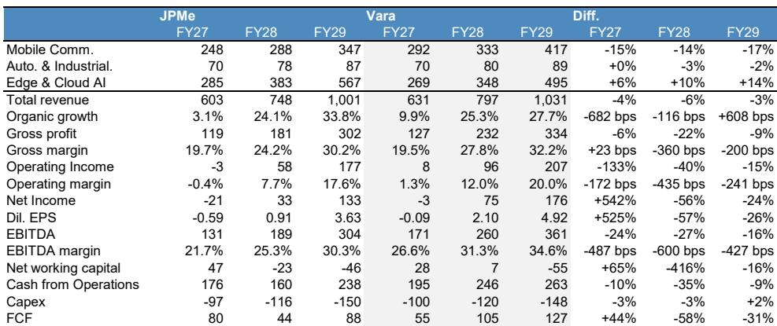
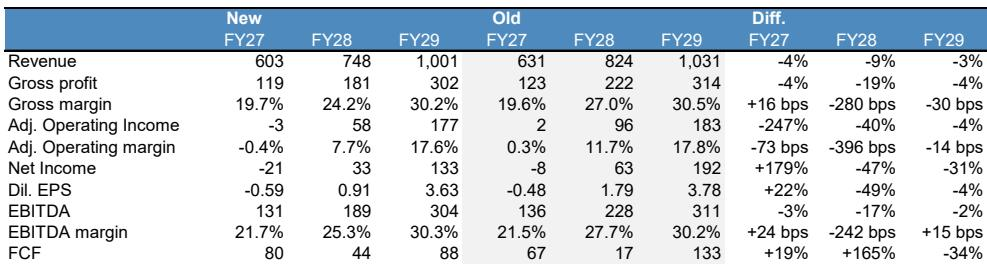
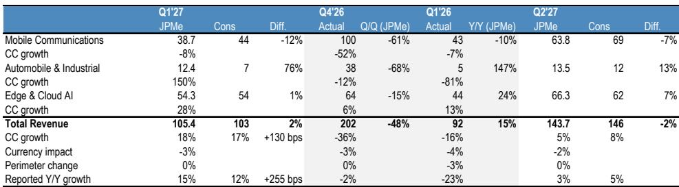

# The Soitec Thesis Is Not a Simple AI Play: Silicon Photonics Booms, but the Mobile Core Is Still Destocking

Soitec's share price has fallen roughly 40% from its year-to-date peak. To many observers, that looks like an opportunity in a company with a clear AI-linked growth story. The narrative is seductive: Silicon Photonics (SiPho) is booming, driven by the insatiable demand for data-center bandwidth, and Soitec is the dominant supplier of the engineered substrates that make SiPho possible. The temptation is to treat the drawdown as a technical correction in a fundamentally sound long-term story.

That framing is incomplete and potentially misleading. The central strategic tension at Soitec is not between bulls and bears on AI infrastructure. It is between two fundamentally different business cycles operating inside the same company. One division—Edge & Cloud AI, powered by SiPho—is experiencing explosive growth. The other—Mobile Communications, still roughly half of revenue—is entering a deeper and more prolonged contraction than most analysts currently model. These two forces are not independent; they are linked by a mechanism that the market has not fully priced.

AI infrastructure build-out has been a mixed blessing for Soitec. The same demand that is flooding data centers with SiPho-based optical transceivers is also consuming massive quantities of high-bandwidth memory (HBM) and DRAM. That memory demand is pushing DRAM prices higher, which in turn is squeezing the bill of materials for smartphone manufacturers. The result is demand destruction in the handset market—a classic second-order effect that is not captured in a simple "AI winner" thesis.

This article argues that the net risk-reward for Soitec remains balanced at current levels, but for reasons that are more nuanced than consensus expects. The upside from SiPho is real and likely underappreciated. But the downside in Mobile is also larger than consensus anticipates, and the recovery trajectory is shallower. The two forces largely offset each other at the group level. The critical question for observers is not whether Soitec will grow, but which division will set the narrative—and the valuation—over the next 18 months.

## Silicon Photonics Is the Structural Growth Engine, but Execution Risk Is Material

The SiPho opportunity for Soitec is not speculative. The technology is already embedded in the optical transceiver market, where industry estimates suggest SiPho-based modules will represent roughly 52% of the market in 2026, up from about 33% in 2024. The next leg of growth—co-packaged optics (CPO)—is expected to ramp from 2028 onward and will be entirely SiPho-based, with much larger substrate content per module. The implied growth trajectory for Soitec's Edge & Cloud AI division is extraordinary: a 50% revenue CAGR from FY25 to FY30, reaching approximately €535 million by FY30.

The strategic logic is clear. SiPho offers energy and data-efficiency advantages over traditional optics, and it leverages mature silicon foundries for high-volume production. Soitec's Smart Cut technology is the industry standard for producing silicon-on-insulator (SOI) wafers, and the company has effectively 100% market share in SiPho substrates today. The question is not whether the market will grow, but whether Soitec can maintain its dominance as competition emerges.

Here the report identifies a critical tension. Soitec's long-term supply agreements (LTSAs) with customers are designed to secure volume visibility and improve working capital, not to optimize pricing. The company is trading some pricing power for volume certainty. That is a rational strategy in a high-growth market, but it implies a structural erosion of blended average selling prices over time. The report models small but consistent ASP declines, which is a reasonable baseline assumption.

The more significant risk is market share erosion. Global Wafers has developed its own SOI technology independent of Soitec's patents and has built a dedicated facility in Missouri. Shin Etsu is also a competitor, though it is reliant on a Smart Cut license and may be less cost competitive. The report assumes Soitec's SiPho market share normalizes to roughly 80% by FY30. That still leaves substantial growth, but it is a material downgrade from the current near-monopoly position.

The so-what for observers is straightforward: the SiPho revenue trajectory is impressive, but it is not risk-free. The upside case depends on Soitec converting capacity, securing LTSAs, and maintaining technological leadership. The downside case—competition erodes market share faster than modeled, or CPO ramps more slowly than expected—is equally plausible. This is not a "sure thing" growth story; it is a high-conviction, high-execution-risk bet on a specific technology transition.

## The Mobile Division Faces a Deeper Contraction Than Consensus Expects

The Mobile Communications division is still the largest part of Soitec, representing roughly 52% of FY26 revenue. It is also the part of the business most exposed to a mechanism that the market may be underestimating: the link between AI-driven DRAM pricing and handset demand destruction.

The logic is as follows. AI infrastructure build-out requires massive quantities of HBM and high-density DRAM. That demand is pushing DRAM prices higher across the board, including for the memory used in smartphones. As smartphone OEMs face higher component costs, they have two options: absorb the cost and compress margins, or reduce production volumes. The market is seeing the latter. The report factors in a 16% decline in handset volumes in calendar 2026 and a further 3% decline in 2027, driven by production cuts at Chinese-focused vendors.

This is not a cyclical normalization. It is a structural squeeze driven by AI's insatiable appetite for memory. The mechanism is similar to what happens when a dominant customer in a supply chain consumes capacity that other customers rely on. The difference is that in this case, the capacity is not wafer fabrication but memory production, and the second-order effect is a contraction in end-market demand for a completely different product.

The implications for Soitec's RF-SOI business—the largest product within Mobile Communications—are severe. Inventory is already elevated at customers, and the destocking cycle is likely to be prolonged. The report's revenue forecasts for the Mobile Communications division are 14% to 17% below consensus in FY27 through FY29. That is a significant divergence.

Management's response is to adopt a more disciplined pricing policy on RF-SOI, which should support gross margins in the medium term. But the trade-off is clear: higher prices mean higher risk of market share loss to lower-priced competitors, and a longer destocking cycle as customers work through existing inventory before committing to new purchases at higher prices. The report now assumes destocking extends into FY28.

The strategic takeaway is that Mobile is not merely "weak" or "cyclical." It is facing a structural headwind from AI-driven memory pricing that has no obvious catalyst for reversal. The recovery, when it comes, will be shallower and later than consensus expects. Observers who focus only on the SiPho growth story are missing this critical offset.

## The Auto and Industrial Recovery Is Delayed, Not Cancelled

The Auto & Industrial division is the third leg of Soitec's business, and it is also under pressure. Customer inventories remain elevated, and the recovery in end-market demand is tentative. The Industrial segment is showing early signs of an upcycle, but the Automotive segment is still in a prolonged downturn, complicated by regulatory uncertainty in the US and China.

The report expects revenue in this division to be broadly flat in FY27, with a gradual improvement in FY28 that is largely in line with consensus. There is no dramatic catalyst here—no structural growth driver like SiPho and no sharp cyclical downturn like Mobile. The division is a modest headwind in the near term and a modest tailwind later, but it is unlikely to be the deciding factor for the overall research thesis.

One specific risk worth noting is SmartSiC. Soitec's silicon carbide substrate business is facing competitive pressures that prompted an impairment in FY26. The report expects further contraction in SmartSiC, which will be a drag on the division's results. This is a reminder that not all of Soitec's "next-generation" technologies are succeeding equally.

## The Gross Margin Recovery Is More Gradual Than Consensus Models

The combination of a booming SiPho business and a contracting Mobile business creates a mixed picture for gross margins. SiPho carries higher margins and benefits from mix, but the Mobile contraction means lower factory loading, which depresses margins through higher fixed-cost absorption. The report sees group-level gross margins reaching only 30.2% in FY29, compared to consensus of 32.2%.

The difference matters because margin recovery is central to the bull case. If margins recover more slowly than expected, the path to normalized earnings is delayed, and the stock's valuation—already elevated on near-term metrics—looks less justified.

The headwinds are not limited to mix and loading. A higher fixed-cost and depreciation base from capacity investments is a structural drag. Pricing pressure in RF-SOI is another. Currency is a third factor. The report's margin estimates are below consensus across the forecast period, which implies that the earnings recovery is both slower and shallower than the market currently prices.

## What the Report Does Not Fully Answer: The Valuation Debate and the Portfolio Review

The report is explicit about its valuation method based on 15.0x. The multiple compression reflects the broader de-rating across the semiconductor peer group. But the report leaves several critical questions unanswered.

First, is 11.0x EBITDA the right multiple for a company with a structural growth driver like SiPho? The report justifies it as a premium to the wafer maker peer group and a premium to Soitec's own five-year average. But if SiPho delivers the growth trajectory the report models, the company's revenue mix will shift dramatically toward higher-margin, higher-growth products. A case could be made that the multiple should expand, not contract, as that shift occurs. The report does not fully engage with this counterargument.

Second, what is the portfolio review that the company has signaled for the first half of FY27? The report acknowledges it but dismisses its potential impact, arguing that observers will be reluctant to underwrite "incubator projects" at an early stage. That may be correct, but it also means there is an unresolved catalyst on the horizon. A portfolio review could lead to asset sales, restructuring, or a clearer strategic focus that changes the valuation narrative.

Third, the report's view is a function of offsetting risks: upside in SiPho versus downside in Mobile. But what if the timing of those forces diverges? If SiPho accelerates faster than expected while Mobile's decline is front-loaded, the net effect could be positive for the stock in the near term. Conversely, if Mobile's decline deepens before SiPho's ramp fully materializes, the stock could fall further. The report does not provide a scenario analysis that helps observers calibrate these timing risks.

## A Decision Framework for Observers

For those considering a position in Soitec, the report's analysis suggests a structured approach based on three questions.

First, what is your view on the timing and magnitude of the SiPho ramp? If you believe the 50% CAGR through FY30 is achievable and that Soitec can maintain 80% market share, the upside from SiPho alone is substantial. If you are more skeptical—on CPO timing, on competition from Global Wafers, or on the sustainability of SiPho adoption—the risk-reward shifts.

Second, what is your view on the handset market and DRAM pricing? The link between AI-driven memory demand and handset demand destruction is the report's most novel insight. If you believe DRAM pricing will moderate as memory supply catches up with AI demand, the headwind to Mobile could ease sooner than modeled. If you believe DRAM pricing will remain elevated, the destocking cycle could extend further.

Third, what is your view on the portfolio review? A decision to divest or restructure the Mobile or Auto & Industrial divisions could change the research case dramatically. A pure-play SiPho company would command a very different valuation multiple than a diversified wafer maker with a struggling core business.

The report's view is a judgment that these forces are roughly balanced at current prices. But the balance is dynamic, not static. The stock could move meaningfully in either direction depending on how these questions resolve.

## Join the Community to Read the Full Report and Review the Original Charts

The analysis in this article is based on a detailed research report that includes revenue forecasts by division, gross margin trajectories, market share assumptions, and valuation scenarios. The charts in the full report are essential for understanding the magnitude of the SiPho opportunity and the depth of the Mobile contraction. They also show

If you found this strategic analysis useful, consider joining the community to access the complete report and review the original data. The full document includes the detailed financial estimates, the competitive analysis of Global Wafers and Shin Etsu, and the scenario framework that underpins the view.

*For informational purposes only. Portions may be generated, translated, summarized, or edited with AI assistance based on source materials and may contain omissions or errors. Please verify independently. This is not professional advice.*

For informational purposes only. Portions may be generated, translated, summarized, or edited with AI assistance based on source materials and may contain omissions or errors. Please verify independently. This is not professional advice.

