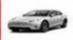
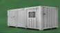
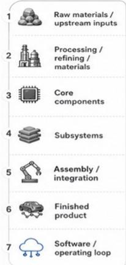
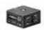
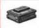
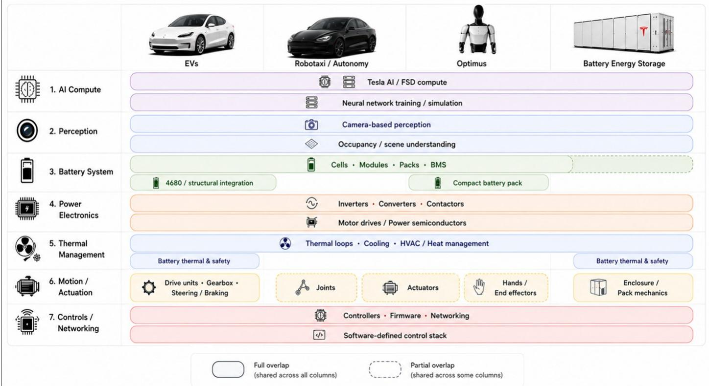

## Robotaxi Industry

## Key Highlights and Takeaways from Recent Videos, Podcasts and News Developments

The evolving robotaxi landscape is relevant to our coverage of TSLA, RIVN, F, GM, and key auto tech supply chain names (APTV, VC, MGA, INVZ). In this update (click here for our previous update and also click here for our robotaxi deep-dive and TSLA deep-dive), we’ve pulled together key highlights from the steady stream of videos and podcasts that surface on this industry each week. Key incremental takeaways were: 1) Robotaxi scaling accelerates — TSLA launched unsupervised Robotaxi in West Miami on July 3, while a production Cybercab with no wheel or pedals is now self-driving in Austin as an engineering test and the Cybercab cleared onto the Texas DPS first-responder registry, and management teased a July 7 Giga Texas scaling announcement; 2) FSD software and regulatory momentum both build — v14 Lite began rolling to the ~4mn HW3 fleet on 6/29 with encouraging early feedback, while European approval advances country-by-country (Finland eyeing a fast-track), though the EU-wide vote slips to October with Sweden pushing a no over speed-limit compliance; 3) TSLA launched the stretched three-row Model YL in the US at $61,990, confirmed a Giga Berlin ramp toward 7,500/wk from October on a European demand rebound, and is running FSD validation testing on the refreshed Semi; 4) Waymo exited its Phoenix Uber pilot and incorporated a German unit, Zoox unveiled its production-intent redesigned robotaxi ahead of a ramp to 100/wk, and Wayve advanced its OEM-licensing model (Stellantis, Nissan) alongside an $85 mn private markets sale; and 5) Regulatory backdrop turns more permissive — NHTSA moved to drop the manual brake-pedal mandate for ADS-only vehicles (a direct precondition for purpose-built robotaxis like Cybercab and Zoox), while UNECE adopted the first global ADS technical regulation, setting a shared safety floor across the US, China, EU, Japan, Canada and the UK. We focus on resources that have consistently proven valuable and reliable in our research process, but we welcome any suggestions from investors on what they’re watching, listening to, or reading. Below are quick summaries of the most value-add content we’ve come across in recent weeks:

## Podcasts & Videos:

- On Brighter with Herbert, TSLA VP of Vehicle Engineering Lars Moravy discussed Cybercab, Optimus, manufacturing and AI, teasing a major scaling announcement tied to the Giga Texas campus on July 7 and characterizing the ~150 Cybercabs on site as a test fleet with the majority in Autopilot training, running versions that still carry steering wheels and pedals, with burn-in begun on a new campus-edge track, lines installed and over 90% automated, and the ramp roughly where expected, which he credited to scars from production hell, virtual commissioning and pre-ship machine testing. He framed Cybercab as its own platform built for scale, analogizing the transition to hard disks giving way to solid-state flash (cheaper, faster, more reliable, more durable), argued its key underestimated advantage is end-to-end efficiency from raw material through vehicle + charging, and named Zoox as a fellow white-sheet competitor while characterizing Waymo as buying cars and adding compute. He expects Cybercab to outsell Model Y and noted Starlink integration is being explored. On factory AI utilization, he detailed code generation for software teams, an internal agent aggregating owner and lessons-learned data, anomaly detection on equipment KPIs, linked systems feeding end-of-line body scans upstream into tolerance changes, and cars self-driving from end-of-line. On Optimus, he said Fremont is transitioning to Optimus, with the first modular

Autos & Auto Parts

Rajat Gupta AC

(1-212) 622-6382

rajat.gupta@JPM.com

Jash Patwa

(1-212) 622-5472

jash.patwa@jpmchase.com

Yash Beswala

(1-212) 622-0028

yash.beswala@jpmchase.com

JPM Securities LLC

See page 12 for analyst certification and important disclosures.

line landed and roughly ~ 40 more to go, and emphasized that Optimus benefits from TSLA's manufacturing, actuator and motor design and real-world AI.

- On Brighter with Herbert, host Herbert and Futurazza's Brian White discussed the milestone that a production Cybercab with no steering wheel and no pedals is driving itself on Austin public roads as an engineering test, albeit involving a person aboard the two-seater but not touching controls, with Musk confirming it is driving itself. They covered the Texas DPS officially adding the Cybercab to its connected-AV first-responder interaction page (a requirement for Level 4 scale operations, giving Texas police, fire and EMS a standardized protocol) and, separately, Coral Gables, FL fire personnel completing specialized robotaxi safety training covering battery systems, emergency access and incident management despite no local service yet. On semiconductors, they detailed Terafab landing its first major hire in a 18-year Intel manufacturing veteran and former factory manager (Gary Jang) as director of the Austin fab project.

- On his July 1 Giga Texas drone update, Joe Tegtmeyer reported Cybercabs seen for the first time racing around the site's outer oval and performing stop-and-go testing plus simulated passenger drop-offs and pickups near the west main entrance, distinguishing logo-ed Cybercab units (no wheel or pedals, fully autonomous, no supervisor) from engineering versions with a steering wheel and supervisor — including one instance of the two tested together — alongside Model Ys driving themselves out to the west outbound lot indicating production underway, Cybertruck production appearing to pick up again, Cybercab groupings staged on the outbound lot, and transport trucks lined up to move units offsite. On construction, he covered Optimus factory steel erection proceeding north and south with seven cranes, continued clearing at the east-side advanced-technology chip-fab site ahead of building construction expected later in summer running into 2027, water-retention pond liner work, conduit connecting the expanded switchyard to Megapacks for Cortex 2, horizontal drilling under the Colorado River to pull an HDPE pipe, and accumulation of older engineering-version robotaxis he speculated are staged for recycling.

- On his channel, David Moss walked through newly posted Cybercab first-responder materials on tesla.com, including a ~30-page interaction plan, an Arizona one-pager, an emergency response guide and a rescue sheet, confirming TSLA classifies Cybercab, unsupervised FSD and Model Y robotaxi as SAE Level 4 while steer-by-wire engineering vehicles with a steering wheel are Level 2, and detailing a 400V battery on a 48V low-voltage architecture (contrary to speculation it might match Cybertruck's 800V), first-responder-adjustable geo-fencing, 10 airbags, three glass types (laminated front, tempered sides, plastic over the B-pillar cameras), powered seats, interior door latches, an active hood that spikes up before a detected collision, external microphones and speakers for two-way support communication, camera washers with pressurized air, an emergency charge-cable release, and orange coolant/battery lines. He noted it is TSLA's first FWD-only vehicle, that opening a door or unbuckling a seatbelt causes it to disengage and park, that it charges (battery) before accepting new bookings when low, flashes hazards rapidly on a fault, responds to hand signals (which he says he tested with police and flaggers on cross-country FSD drives), and will not take rides in extreme weather (rain, fog, snow).

- On WSJ, a reporter rode through central London in a Wayve-equipped Ford Mustang Mach-E (safety driver aboard) and interviewed co-founder and CEO Alex Kendall. He described the 2017-founded, ~$8.6 bn valued startup's embodied AI as an end-to-end system that learns from human behavior and requires no HD mapping and, in his framing, little compute or infrastructure. Kendall cast it as a deliberately contrarian bet against rigid rules-based stacks and the hybrid model used by Waymo, citing a McKinsey survey in which 78% of AV experts believed hybrid was the likeliest path, and stressed the tech is adaptable across cities, vehicles, sensors and deployable on any OEM. The segment noted Uber and Wayve are teaming to launch London public-road robotaxi trials once UK regulators approve, positioning London as a near-term three-provider battleground alongside Waymo and Baidu's Apollo Go, and cited partnerships with Stellantis (supervised hands-free driving, with Uber planning to add Stellantis-designed Wayve-equipped vehicles to its fleet) and Nissan (driver assistance for mass-produced vehicles). On an AI bubble, Wayve CEO highlighted the opportunity as under-hyped while questioning whether today's giants will be tomorrow's.

- On Odd Lots, recorded live at Bloomberg Invest in Hong Kong, hosts Joe Weisenthal and Tracy Alloway interviewed Baidu CFO Henry He, who described the company as a full-stack AI player across chips, the Ernie model, cloud and applications. He picked cloud as the must-win layer, since it hosts Ernie plus other models and connects to Baidu's inference chips, and noted ~80% of incremental token demand is inference. On robotaxis, Mr. He emphasized outlined economics on a cost-per-mile basis, citing a US owning vs. renting tipping point of ~$0.60-0.80/mile against current robotaxi costs of ~$1-2.50/mile, and noted only two cities globally host 1,000+ robotaxis (San Francisco via Waymo, one Chinese city via Apollo Go). He said Apollo Go delivered ~350K trips last quarter across 27 cities, ~20-25% below Waymo's ~500K/wk, and also shipped cars into London as both players open that market, and noted that the company partners with Uber, Lyft and Grab.

- On Bloomberg Television, Nissan president and CEO Ivan Espinosa, said the company intends to embed autonomous driving tech across as much as ~90% of its lineup as an AI-defined vehicle. He called the Wayve-developed system almost Level 4 ready but to be rolled out step by step for regulators and consumers, beginning in Japan with an end-to-end-capable car called El Grand by FY2027-end before a gradual global rollout. Espinosa said Nissan has cut development time ~40% over 18 months, taking a global car from concept to start of production in 30 months. On US manufacturing, he confirmed Nissan will keep building at Smyrna, TN and Canton, MS, with US-built mix up from ~45% last January to 60% by year-end, citing ~$2,000-3,000 of added tariff cost per Mexico-built vehicle and a cost-reduction program to keep them competitive.

- On The Driverless Digest, host Harry interviewed Rocsys CEO and co-founder Crijn Bouman, previously founder of the ABB-acquired fast-charger Epyon. Bouman shared that removing the driver breaks vehicles' interface to the built world, especially as charging, garages and car washes all assume a driver, and that charging is the highest-frequency depot task and the bottleneck for scaling driverless fleets. He estimated a 24/7 robotaxi covering ~200-300 miles cycles requiring three to four charging shifts daily, and that a city like Los Angeles might need ~10,000 vehicles, implying ~30,000 sessions and 60,000-80,000 plug/unplug events per day. He introduced the M1, billed as the world's first multi-bay hands-free charging solution, featuring an overhead rail with a robotic arm that moves between bays to plug in, works with any make and charger, and retrofits existing lots without extra space (up to 10 bays per rail). Bouman said computer vision proved more capable than feared, handling snow, rain, hail, sand and even spider webs, with remote operators for edge cases, and framed London as the European battleground under the UK's AV framework effective January.

## TSLA specific newsflow:

- Robotaxi launches in Miami. TSLA launched its robotaxi service in a section of West Miami on July 3, with initial availability limited to areas outside downtown as with the Dallas and Houston rollouts and riders already using unsupervised vehicles without an in-car safety monitor. Scope is expected to widen over time, as it did to the full Austin metro last month. Miami is the first of TSLA's five stated target cities to come online — Phoenix, Las Vegas, Orlando and Tampa remain on the near-term roadmap — and enters a market where Waymo has operated since January and Zoox is testing ahead of its own launch.

- FSD v14 Lite launched; distills the HW4 stack; adds parking and speed profiles;

FSD v14 feedback remains encouraging. TSLA began rolling out FSD v14 Lite (firmware 2026.20.5.1) to a first wave of Hardware 3 (AI3) owners on 6/29, with Mr. Elluswamy, TSLA's VP of AI Software, noting the release is limited initially to Early Access Group members — vetted influencers and high-safety-score owners — before widening to more of the ~4 mn affected cars over coming weeks pending feedback. The build distills the HW4 v14 driving behavior into HW3's cameras and compute, passing through HW4 gains including reinforcement learning and offline models, sharpening proactive and reactive handling across navigation, merges/forks, pedestrian interactions, traffic lights and vehicle cut-ins, and adding comfort gains (fewer false slowdowns, smoother steering, more consistent lane centering) plus new parking, unparking and reverse functions, always-on Speed Profiles, and Arrival Options (lot, street, driveway, curbside); Mr. Elluswamy framed the headline change as significantly improved safety and characterized it as a compressed neural network rather than a feature-reduced one, though v14 Lite stays supervised and hands-on. It marks the first major step for a legacy fleet that had stalled at v13.2.9 — with many cars still running on v12.6.4 — and early impressions from owners running both previous stacks have been positive, with the step-up from v12.6.4 described as night-and-day alongside reports of multi-hour, zero-intervention drives through rush-hour traffic and tight canyon roads that testers characterized as feeling close to their AI4 cars. Separately, community trackers and social-media commentary reported FSD 14.3.4 running minimal disengagements across NYC, including an unsupervised New Haven-to-NYC trip and a widely circulated double-yellow sideswipe-avoidance maneuver cited as reactive capability beyond coded responses.

- FSD regulatory expansion: Finland fast-tracked; EU vote slips to October with Sweden pushing a no. The national-recognition fast path in EU continues to compress approval from years to weeks, with the original Dutch RDW provisional approval dated April 10 after 18 months of testing, since followed by Lithuania, Estonia, Denmark, Belgium, and Finland's Traficom now signaling it may move ahead of the EU-wide decision on a faster schedule after summer once it resolves questions on driver-handover timing, low-visibility overtaking and the speed-offset feature. The EU-wide approval route requires a qualified majority of 15 of 27 states representing ~65% of the population via the TCMV, whose June 30 committee meeting was held but a vote is not expected before October 2026, and the more material opposition signal is that Sweden's transport authority is actively calling for a vote against the rollout unless TSLA removes the ability to exceed posted speed limits, with Norway and Finland flagging curve and roundabout handling.

- Production-ready Cybercab driving around Austin. A video shared by Mr. Musk shows a production-ready Cybercab, featuring no steering wheel or pedals driving around in Austin with a safety monitor seated in the vehicles.

- Cybercab First Responder guide surfaces technical details. TSLA's newly released Robotaxi First Responder guides reveal notable technical and operational detail: the Cybercab is TSLA's first front-wheel-drive vehicle, runs a 48V low-voltage system (complicating conventional jump-starts), and operates as a Level 4 vehicle within a geofenced area. On emergency interaction, it is designed to detect first-responder vehicles with lights and sirens and pull over to the first safe location (moving to the rightmost lane on highways), respond to visible hand signals and cone-delineated paths, and — on a safety-critical event like a collision or airbag deployment — stop, park, disable Autonomous Mode, flash hazards rapidly, unlock doors, vent windows and open two-way support communication that can escalate to 911, with rapid hazard flashing (~2x normal) signaling that autonomous mode is disabled and a documented caging/wheel-chocking procedure to immobilize a vehicle that may otherwise move even when stationary.

- Washington DC emerges as the next Cybercab frontier; local authorization the gating variable. Per press reports, TSLA is preparing to bring a meaningful number of purpose-built Cybercabs to Washington DC, though the path from testing to commercial service still faces hurdles, and no launch date or vehicle count has been announced. The city is not a cold start, with Cybercabs spotted testing on DC public roads as far back as March 2026 and a Council member introducing legislation in April 2026 to authorize robotaxi operations, but the district has yet to complete the required safety study underpinning those rules, leaving local authorization as the critical unknown that will dictate the timing of any large-scale deployment.

- Uruguay teased as third official South American market.TSLA teased an official Uruguay entry via an animated Estamos llegando (we are arriving) clip on its Latin America account in a shift that would convert an existing grey-market presence into direct sales, service and charging and make Uruguay its third official South American market after Chile and Colombia, supported by a new combined Argentina/Uruguay country manager and local approval of three Model 3 and three Model Y variants for import from Giga Shanghai although pricing and order timelines are not yet announced.

- TSLA Semi: FSD validation testing underway. A second refreshed Semi was spotted on public roads (Fremont/Palo Alto) carrying roof-mounted ground-truth validation hardware resembling the rigs seen on passenger cars ahead of FSD enablement, alongside the truck's 10 external cameras with washers and cabin camera, with sensors currently handling AEB and lane-keep only.

- Giga Berlin: production ramp on European demand rebound. TSLA confirmed plans to hire another 1,000 workers at Giga Berlin to support a 7,500 vehicles/wk target from October on top of the 1,000 hires announced in April (brought on by end-June to lift output ~20% to ~6,000/wk), a further ~25% step that would put the plant on a ~390,000/yr pace, still below the original 500,000 target but its highest sustained run yet, alongside 1,500+ hires in May for German battery-cell production.

- Model YL launches in the US as a stretched three-row six-seater. TSLA launched the three-row, six-seat Model YL in the US and Puerto Rico as a $61,990 Launch Series, a stretched variant adding ~150 mm of wheelbase and ~180 mm of length for a 2+2+2 layout, claiming 0-60 in 4.4s and ~325 mi EPA range and FSD Supervised with integrated Grok. The Launch Series follows TSLA's usual playbook of leading with a higher-priced trim before cheaper configurations, which will determine competitiveness against the three-row Kia EV9 ($54,900) and Hyundai Ioniq 9 ($58,955) that both undercut it on price but trail its acceleration, while filling a six-seat gap the standard Model Y's cramped third row never addressed. The Model YL launched in China in August 2025 and has since expanded to Australia, New Zealand and Southeast Asia.

- App code points to cabin-camera driver authentication for FSD. Code strings in TSLA mobile app version 4.58.5 suggest a feature that uses the interior cabin camera to authenticate the driver against saved authorized-driver profiles before FSD can engage, blocking activation on a mismatch. Potential applications include preventing unauthorized or underage use, tying FSD access to an owner's account across vehicles, and verifying that a robotaxi passenger matches the person who booked the ride.

## Broader robotaxi industry developments:

- NHTSA moves to drop the manual brake-pedal mandate for ADS-only vehicles. NHTSA opened rulemaking (30-day comment) to eliminate the manual brake-pedal requirement for vehicles designed exclusively for automated operation, the fifth FMVSS update under the administration's AV framework after transmission, windscreen and tire-pressure changes. While preserving stopping-distance performance via alternative testing and leaving existing rules intact for AVs that retain manual controls, with Administrator Morrison framing it as tearing down barriers to innovative designs while holding developers accountable, alongside DOT work on national AV performance standards and a National AV Safety Forum. The change is a direct precondition for purpose-built robotaxis without manual controls (Cybercab, Zoox), reduces the risk of NHTSA challenging the Cybercab's FMVSS self-certification, and reflects a shift toward judging AVs by demonstrated capability rather than component checklists.

- Uber and Waymo end the Phoenix pilot; Uber lines up an unnamed replacement partner. Uber and Waymo wound down their Phoenix robotaxi pilot (concluded ~May at the contracted end date) — an intentionally limited deployment of just over a dozen vehicles that Waymo has folded back into its own Phoenix fleet to serve riders via its app, the Via transit integration and DoorDash delivery, with Waymo rides staying exclusive to Uber in Austin and Atlanta and Uber reportedly preparing a separate unnamed Phoenix AV partner.

- Waymo incorporates a German unit. Waymo registered Waymo Germany GmbH with a stated purpose of AV ride-hailing and supporting third-party operators, with Transdev, its longest-running US fleet partner since 2019, advertising an AV operations lead in Munich and a staffing firm recruiting test drivers in Berlin and Munich, viewed as groundwork consistent with its London and Tokyo ambitions, typically preceded by months to years of human-supervised mapping.

- UNECE adopts the first global ADS technical regulation, setting a shared floor but no passport. UNECE World Forum for Harmonization of Vehicle Regulation's 199th session adopted a UN Global Technical Regulation on Automated Driving Systems (ECE/TRANS/WP.29/2026/139), backed by the US, China, EU, Japan, Canada and the UK and entering force in about a month, filling the gap beyond the narrow ALKS R157 to cover Category 1 and 2 vehicles performing the full Dynamic Driving Task with no human fallback — but crucially a GTR (Global Technical Regulation) under the 1998 Agreement carrying no mutual recognition (which is why the US and China can sign on), setting a floor of four requirements (a competent-and-careful-human-driver safety benchmark; a multi-pillar validation regime of audit, simulation, test-track and real-world used together; a documented Safety Management System and safety case leaning on ISO 26262/21434 and IATF 16949; and continuous in-service monitoring with a mandatory Data Storage System), hardware-agnostic with no LiDAR mandate, and for Europe specifically supplying the technical building block to lift the interim rule's 1,500-vehicle/type/yr cap toward genuine mass production.

- Zoox unveils its production-intent robotaxi redesign; Hayward ramp to 100/wk. Amazon's Zoox revealed the next evolution of its purpose-built robotaxi ahead of paid rides later this year, retaining the carriage-style bidirectional cabin, four-wheel steering, 40-sensor suite, four seats, 75-mph capability and absence of wheel or pedals while adding refinements drawn from ~500,000 rider trips with lighter aloe-green and stone-grey CMF (color, material and finish), added seat and headrest padding, a brighter touchscreen, larger cupholders, a fluted charging pad, relocated and enlarged bidirectional reflectors, and a door speaker, microphone and two-way audio — with this production-intent vehicle heading into serial production at Hayward, CA at up to 100/wk subject to regulatory approval.

- EU launches ADACities deployment initiative. The European Commission launched ADACities (mobility flagship of its Apply AI Strategy), announced by EVP Virkkunen at the first ECAVA forum in Brussels, to let selected cities lead real-world deployment across robotaxis, car-sharing, shuttles and self-driving cars via an open call for expressions of interest, with supported partnerships required to be EU-centric with European OEMs and tech at the core, wired to the Technological Sovereignty Package and building on the 18-member-state Luxembourg Joint Declaration (EU-vehicle preference, non-EU players admitted mainly via an EU partner with a meaningful footprint, data kept in the EU), though the 2030 target of 100+ AVs per participating city seems conservative.

- TaskUs consumer AV-trust survey: access is the gating variable. The TaskUs 2026 AV Trust survey (1,000+ US consumers, fielded May 2026) found top sentiments of curiosity (42%) and nervousness (41%). Additional sentiments included skepticism (33%), excitement (26%) and fear (25%), with 41% citing no opportunity as the reason they haven't ridden and access correlating tightly with trust and trial (23% in robotaxi cities fully trust the vehicles vs. 4% elsewhere; 37% in-market have ridden vs. 6%; 35% in-market very likely to try within 12 months vs. 10%; 38% of all Americans likely to try within a year), while safety perception splits 35% safer / 27% as safe / 38% less safe than human drivers. Concerns center on accidents or system failure (43%) and lack of control (22%), with only 17% being very confident in a remote operator's ability to intervene.

  
Body electronics, power distribution, thermal

  
Actuators & precision motors

## Charts: Tesla Vertical Integration

## Figure 1: TSLA's Vertically and Horizontally Integrated Engineering Playbook

  
Source: JPM.

## INTEGRATION LEVEL

## 1 BATTERY SCALE LOOP

Higher scale & learning in battery materials and cells drive cost, energy density and longevity improvements across EVs and Energy Storage.

## 2 AI / AUTONOMY LEARNING LOOP

Real-world driving data and AI advancements from EVs continuously improve Robotaxi autonomy; shared learning accelerates Optimus AI capabilities (indirect link).

## OVERLAP RIBBONS (Shared Capabilities)

## 3 FACTORY AUTOMATION LOOP

Optimus deployed in Tesla factories automates and optimizes EV assembly, improving quality, throughput and cost structure.

Power Electronics (EV, Optimus & Storage)

Figure 2: TSLA's Cross-Platform Shared Hardware Stack  
  
Source: JPM.

Table 1: TSLA Production Capacity and Footprint

<table><tr><td>Region</td><td>Product</td><td>Capacity</td><td>Status</td></tr><tr><td>Automotive</td><td></td><td></td><td></td></tr><tr><td>California</td><td>Model 3 / Model Y</td><td>&gt;550,000</td><td>Production</td></tr><tr><td>Shanghai</td><td>Model 3 / Model Y</td><td>&gt;950,000</td><td>Production</td></tr><tr><td>Berlin</td><td>Model Y</td><td>&gt;375,000</td><td>Production</td></tr><tr><td>Texas</td><td>Model Y</td><td>&gt;250,000</td><td>Production</td></tr><tr><td>Texas</td><td>Cybertruck</td><td>&gt;125,000</td><td>Production</td></tr><tr><td>Texas</td><td>Cybercab</td><td>-</td><td>Pilot Production</td></tr><tr><td>Nevada</td><td>Tesla Semi</td><td>-</td><td>Pilot Production</td></tr><tr><td>TBD</td><td>Roadster</td><td>-</td><td>Design development</td></tr><tr><td>Energy Storage &amp; Generation</td><td></td><td></td><td></td></tr><tr><td>California</td><td>Megapack</td><td>40 GWh</td><td>Production</td></tr><tr><td>Shanghai</td><td>Megapack</td><td>20 GWh (Potential 40 GWh)</td><td>Production</td></tr><tr><td>Texas</td><td>Megapack</td><td>~50 GWh</td><td>Construction</td></tr><tr><td>Nevada</td><td>Powerwall</td><td>6 GWh</td><td>Production</td></tr><tr><td>New York</td><td>Solar Panels &amp; Roof</td><td>0.3 GWh</td><td>Production</td></tr><tr><td>Robotics</td><td></td><td></td><td></td></tr><tr><td>California</td><td>Optimus</td><td>-</td><td>Construction</td></tr><tr><td>Texas</td><td>Optimus</td><td>-</td><td>Construction</td></tr><tr><td>AI Training Compute</td><td></td><td></td><td></td></tr><tr><td>Texas</td><td>Cortex 1</td><td>&gt;100k H100e</td><td>Production</td></tr><tr><td>Texas</td><td>Cortex 2</td><td>&gt;130k H100e</td><td>Early Ramp</td></tr><tr><td>Battery Manufacturing</td><td></td><td></td><td></td></tr><tr><td>Nevada</td><td>LFP</td><td>7 GWh</td><td>Early Ramp</td></tr><tr><td>Texas</td><td>4680</td><td>40 GWh</td><td>Production</td></tr><tr><td>Texas</td><td>Cathode Materials</td><td>10 GWh</td><td>Early Ramp</td></tr><tr><td>Texas</td><td>Lithium Refining</td><td>30 GWh</td><td>Early Ramp</td></tr></table>

Source: Company reports.

Robotaxi Industry  
Table 2: Announced Parternships Across Robotaxi Value Chain

<table><tr><td>Fleet owner-operator Owns the robotaxis and is responsible for testing and deployment</td><td>Self-driving developer Develops the self-driving technology, both software and hardware</td><td>Automaker Builds the base vehicle or custom robotaxi on the assembly line</td><td>Fleet management Responsible for vehicle charging, cleaning and general depot operations</td><td>Ride-hailing network Handles route planning, passenger matching and payment processing</td></tr><tr><td></td><td></td><td>Tesla</td><td></td><td></td></tr><tr><td></td><td></td><td>Zoox</td><td></td><td></td></tr><tr><td colspan="2">Waymo</td><td>JLR, Zeekr, Hyundai</td><td>Transdev, Terawatt, Voltera, Moove, Avomo and Avis Budget</td><td>Uber, Lyft</td></tr><tr><td colspan="2">May Mobility</td><td>Toyota</td><td>Flexdrive</td><td>Uber, Lyft</td></tr><tr><td>VW ADMT</td><td>Mobileye</td><td>Volkswagen</td><td>MOIA</td><td>Uber</td></tr><tr><td>Marubeni</td><td>Mobileye</td><td>Undisclosed</td><td>Flexdrive</td><td>Lyft</td></tr><tr><td colspan="2">Avride</td><td>Hyundai</td><td>Undisclosed</td><td>Uber</td></tr><tr><td colspan="2">Baidu</td><td>FAW Group, Arcfox, JAC</td><td>Baidu</td><td>Baidu, Uber, Lyft</td></tr><tr><td colspan="2">Pony.ai</td><td>Toyota, BAIC BJEV</td><td>Pony.ai</td><td>Pony.ai, Uber</td></tr><tr><td colspan
