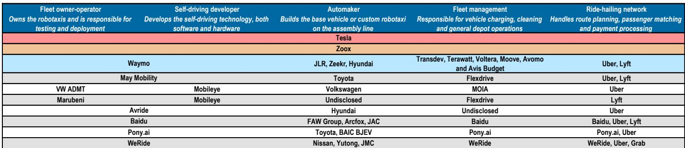

# JPM：特斯拉Robotaxi的真正瓶颈是充电，不是监管

Robotaxi行业正在从“能不能上路”转向“能不能规模化运营”。JPM最新研报跟踪了特斯拉、Waymo、Zoox等主要玩家的最新进展，得出一个核心判断：行业已经从技术验证阶段进入运营基础设施竞赛阶段，而充电环节正在成为最容易被忽视的规模化瓶颈。

这份报告覆盖了7月3日特斯拉在迈阿密启动无人驾驶Robotaxi服务、FSD v14 Lite向HW3车队推送、以及Cybercab技术细节曝光等关键事件。但真正值得关注的，不是某个城市的落地时间表，而是行业正在发生的一个结构性变化：当车辆不再需要驾驶员，车辆与物理世界之间的所有交互接口——从充电到清洗到紧急响应——都需要重新设计。

## 1. 特斯拉的“三线推进”策略正在加速，但每个市场都在考验其本地化能力

JPM研报显示，特斯拉正在同时推进三条线：FSD软件迭代、Cybercab硬件验证、以及监管审批。7月3日迈阿密上线是第一条线的最新节点——这是继达拉斯、休斯顿、奥斯汀之后，特斯拉Robotaxi进入的第四个美国城市，也是其五个目标城市中第一个落地的。

但更值得关注的是第二条线。JPM确认，一辆没有方向盘和踏板的量产版Cybercab已经在奥斯汀公共道路上进行工程测试，车内只有一名安全员，但不接触任何控制装置。这款车已进入德州公共安全部的第一响应者注册系统——这是Level 4规模化运营的前置条件。

监管方面，欧盟层面的审批投票推迟至2026年10月，但芬兰正在走快速通道。瑞典则明确要求特斯拉移除超速功能才能获批。这种“国家层面加速、欧盟层面拉锯”的格局，意味着特斯拉在欧洲的落地将是一个碎片化的过程。

> **KC评论：** JPM这份报告最有价值的部分不是单个城市的落地新闻，而是它揭示了一个事实：特斯拉的Robotaxi策略已经从“技术驱动”转向“运营驱动”。每个新市场都需要重新解决监管、基础设施和本地化问题，这不是一个可以简单复制的模式。

## 2. 充电正在成为Robotaxi规模化运营的“隐藏瓶颈”

JPM引用了Rocsys CEO的观点：当车辆没有驾驶员，充电成为最高频的场站任务，也是规模化运营的最大瓶颈。一辆24/7运营的Robotaxi每天需要3-4次充电，一个城市如果有1万辆Robotaxi，每天将产生6-8万次插拔操作。

这个问题在研报中被反复提及：Cybercab采用400V电池和48V低压架构，这意味着它不能简单复用现有的充电基础设施。特斯拉正在探索通过Megapack和Cortex 2系统构建自己的充电网络，但JPM指出，这需要大量资本支出和时间。

Zoox和Waymo也在面临类似问题。Zoox的设计目标是每周生产100辆，但其充电方案尚未完全公开。Waymo则通过与Uber的合作在凤凰城测试商业化运营，但充电环节同样依赖自建网络。

> **KC评论：** JPM这份报告最反常识的判断是：Robotaxi的规模化瓶颈可能不是技术、不是监管，而是充电。当车辆没有驾驶员，充电必须自动化，这意味着每个Robotaxi运营商都需要成为“充电基础设施公司”。这是报告没有完全展开、但值得持续跟踪的关键变量。

## 3. 行业正在形成“白纸设计”与“改装路线”的分化

JPM将Cybercab定位为“白纸设计”平台——从零开始为自动驾驶打造，类比于从硬盘到固态存储的转变。Zoox也被归入这一阵营。而Waymo被描述为“买车加算力”的路线——在现有车辆基础上加装传感器和计算单元。

这两种路线各有优劣。白纸设计可以实现从原材料到车辆到充电的全链路效率优化，但需要巨大的前期投入和时间。改装路线可以更快上路，但在系统集成和成本控制上存在天花板。

JPM引用了特斯拉VP Lars Moravy的观点：Cybercab的关键被低估的优势是从原材料到车辆到充电的端到端效率。这种效率优势在规模化之后才会显现，但在短期内，改装路线可能更快实现商业闭环。

## 4. 报告尚未完全回答的关键问题：运营宏观环境性何时能跑通？

JPM引用了百度CFO Henry He的数据：在美国，拥有vs.租用Robotaxi的盈亏平衡点在每英里0.60-0.80美元，而当前Robotaxi的实际成本在1-2.50美元/英里。这意味着即使技术成熟，运营宏观环境性仍然是尚未解决的问题。

报告没有给出明确的盈利时间表，但指出了一些值得关注的变量：Cybercab的充电效率、FSD的监管进展、以及Waymo和Zoox的资本消耗速度。这些变量将共同决定行业的商业可行性和竞争格局。

对于产业决策者来说，JPM这份研报的真正价值在于：它提供了一个系统的观察框架——不是看谁先上线，而是看谁能在充电、监管、运营三个维度上同时解决规模化问题。这个框架远比单个城市的落地新闻更有参考意义。

For informational purposes only. Portions may be generated,translated,summarized,or edited with AI assistance based on source materials and may contain omissions or errors. Please verify independently. This is not investment,legal,tax,accounting,or other professional advice.

For informational purposes only. Portions may be generated,translated,summarized,or edited with AI assistance based on source materials and may contain omissions or errors. Please verify independently. This is not investment,legal,tax,accounting,or other professional advice.

