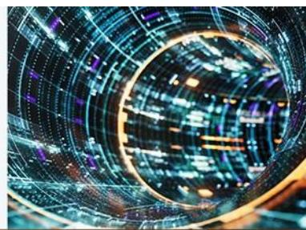

# Technology – Consumer Electronics / Industrial Electronics / Precisions

Technology – Consumer Electronics/Industrial Electronics/Precisions
Junya Ayada AC

Junya Ayada AC
+813-6736-8631

junya.ayada@JPM.com
JPM Securities Japan Co., Ltd.

JPM

Japan Industrial

Technology Forum

August 27-28, 2026 • Four Seasons Hotel Tokyo at Otemachi

See the end pages of this presentation for analyst certification and important disclosures, including non-US analyst disclosures.

## Valuation

<table><tr><td rowspan="2" colspan="2"></td><td rowspan="2">Rating</td><td rowspan="2">Price 06-Jul-26 (JPY)</td><td rowspan="2">Price Target (JPY)</td><td rowspan="2">Market cap 06-Jul-26 (bn JPY)</td><td colspan="2">P/E (x)</td><td colspan="2">P/B (x)</td><td colspan="2">EV/EBITDA (x)</td><td colspan="2">ROE (%)</td><td colspan="2">Div. yield (%)</td><td colspan="2">FCF yield (%)</td></tr><tr><td>1FY</td><td>2FY</td><td>1FY</td><td>2FY</td><td>1FY</td><td>2FY</td><td>1FY</td><td>2FY</td><td>1FY</td><td>2FY</td><td>1FY</td><td>2FY</td></tr><tr><td>6501</td><td>Hitachi</td><td>OW</td><td>4,805</td><td>6,000</td><td>21,621</td><td>23.8</td><td>19.7</td><td>3.2</td><td>3.1</td><td>12.0</td><td>10.7</td><td>13.4</td><td>15.5</td><td>1.2</td><td>1.2</td><td>3.3</td><td>3.0</td></tr><tr><td>6503</td><td>Mitsubishi Elec.</td><td>OW</td><td>6,043</td><td>7,000</td><td>12,367</td><td>23.8</td><td>21.4</td><td>2.7</td><td>2.5</td><td>13.8</td><td>12.7</td><td>11.1</td><td>11.5</td><td>1.0</td><td>1.1</td><td>1.9</td><td>1.2</td></tr><tr><td>6701</td><td>NEC</td><td>OW</td><td>4,347</td><td>5,400</td><td>5,766</td><td>20.0</td><td>17.4</td><td>2.4</td><td>2.2</td><td>13.7</td><td>11.2</td><td>12.4</td><td>12.9</td><td>0.9</td><td>0.9</td><td>-3.0</td><td>6.9</td></tr><tr><td>6702</td><td>Fujitsu</td><td>OW</td><td>3,349</td><td>4,300</td><td>5,810</td><td>17.9</td><td>15.4</td><td>2.7</td><td>2.6</td><td>13.0</td><td>11.0</td><td>15.4</td><td>17.2</td><td>1.6</td><td>1.6</td><td>5.8</td><td>5.3</td></tr><tr><td>6724</td><td>Seiko Epson</td><td>UW</td><td>2,878</td><td>1,900</td><td>922</td><td>16.8</td><td>17.7</td><td>1.1</td><td>1.0</td><td>5.5</td><td>5.3</td><td>6.5</td><td>6.0</td><td>2.6</td><td>2.6</td><td>5.1</td><td>6.0</td></tr><tr><td>6752</td><td>Panasonic HD</td><td>N</td><td>4,557</td><td>4,600</td><td>10,639</td><td>23.1</td><td>20.0</td><td>1.9</td><td>1.8</td><td>10.6</td><td>9.3</td><td>8.6</td><td>9.2</td><td>1.2</td><td>1.3</td><td>3.9</td><td>2.8</td></tr><tr><td>6753</td><td>Sharp</td><td>UW</td><td>641</td><td>720</td><td>416</td><td>14.3</td><td>12.6</td><td>1.8</td><td>1.5</td><td>8.2</td><td>7.4</td><td>13.1</td><td>13.0</td><td>0.0</td><td>0.0</td><td>9.3</td><td>4.8</td></tr><tr><td>6758</td><td>Sony Group</td><td>OW</td><td>3,422</td><td>5,700</td><td>20,216</td><td>16.2</td><td>14.6</td><td>2.4</td><td>2.1</td><td>7.8</td><td>7.3</td><td>14.5</td><td>14.7</td><td>1.0</td><td>1.3</td><td>-0.1</td><td>3.0</td></tr><tr><td>6952</td><td>Casio</td><td>N</td><td>1,886</td><td>1,300</td><td>424</td><td>24.6</td><td>22.4</td><td>1.9</td><td>1.8</td><td>9.3</td><td>8.4</td><td>7.7</td><td>8.2</td><td>2.4</td><td>2.4</td><td>3.9</td><td>5.5</td></tr><tr><td>7751</td><td>Canon</td><td>N</td><td>4,338</td><td>4,400</td><td>3,811</td><td>11.1</td><td>10.9</td><td>1.0</td><td>1.0</td><td>6.9</td><td>6.7</td><td>9.3</td><td>9.2</td><td>3.7</td><td>3.7</td><td>7.6</td><td>7.0</td></tr><tr><td>7752</td><td>Ricoh</td><td>N</td><td>1,468</td><td>1,450</td><td>836</td><td>12.7</td><td>11.9</td><td>0.8</td><td>0.7</td><td>7.9</td><td>7.2</td><td>6.1</td><td>6.2</td><td>2.9</td><td>3.0</td><td>7.6</td><td>8.4</td></tr><tr><td>7762</td><td>Citizen Watch</td><td>N</td><td>2,395</td><td>1,850</td><td>584</td><td>22.6</td><td>22.0</td><td>2.1</td><td>2.0</td><td>12.1</td><td>11.7</td><td>9.3</td><td>9.1</td><td>2.0</td><td>2.0</td><td>3.3</td><td>4.1</td></tr><tr><td>7951</td><td>Yamaha</td><td>N</td><td>1,188</td><td>1,100</td><td>523</td><td>15.3</td><td>--</td><td>1.1</td><td>1.1</td><td>8.3</td><td>7.6</td><td>6.1</td><td>6.2</td><td>2.2</td><td>2.2</td><td>4.8</td><td>4.8</td></tr><tr><td>8050</td><td>Seiko Group</td><td>NC</td><td>7,850</td><td>--</td><td>642</td><td>26.4</td><td>22.9</td><td>3.3</td><td>3.0</td><td>--</td><td>--</td><td>13.2</td><td>14.2</td><td>1.2</td><td>1.4</td><td>2.5</td><td>3.6</td></tr><tr><td></td><td>Average</td><td></td><td></td><td></td><td></td><td>19.2</td><td>17.6</td><td>2.0</td><td>1.9</td><td>9.9</td><td>9.0</td><td>10.5</td><td>10.9</td><td>1.7</td><td>1.8</td><td>4.0</td><td>4.7</td></tr></table>

## Performance

<table><tr><td rowspan="2" colspan="2"></td><td rowspan="2">Rating</td><td rowspan="2">Price06-Jul-26(JPY)</td><td rowspan="2">Market cap06-Jul-26(mn JPY)</td><td rowspan="2">Trading volume30days moving avg.(k shares)</td><td rowspan="2">Trading value30days moving avg.(mn JPY)</td><td colspan="4">Actual performance</td><td colspan="4">Relative performance vs Topix</td><td>βTopix</td></tr><tr><td>1M(%)</td><td>3M(%)</td><td>6M(%)</td><td>1Y(%)</td><td>1M(%)</td><td>3M(%)</td><td>6M(%)</td><td>1Y(%)</td><td>6M</td></tr><tr><td>6501</td><td>Hitachi</td><td>OW</td><td>4,805</td><td>21,621</td><td>13,406</td><td>65,051</td><td>-9.3</td><td>1.8</td><td>-11.8</td><td>19.3</td><td>-12.7</td><td>-9.3</td><td>-24.5</td><td>-18.2</td><td>0.97</td></tr><tr><td>6503</td><td>Mitsubishi Elec.</td><td>OW</td><td>6,043</td><td>12,367</td><td>6,611</td><td>39,848</td><td>0.5</td><td>14.0</td><td>23.0</td><td>95.9</td><td>-3.3</td><td>1.6</td><td>5.3</td><td>34.3</td><td>1.32</td></tr><tr><td>6701</td><td>NEC</td><td>OW</td><td>4,347</td><td>5,766</td><td>7,734</td><td>31,120</td><td>2.2</td><td>8.4</td><td>-23.5</td><td>10.4</td><td>-1.6</td><td>-3.5</td><td>-34.6</td><td>-24.3</td><td>0.84</td></tr><tr><td>6702</td><td>Fujitsu</td><td>OW</td><td>3,349</td><td>5,810</td><td>8,757</td><td>29,663</td><td>-6.7</td><td>2.9</td><td>-22.8</td><td>-3.1</td><td>-10.2</td><td>-8.3</td><td>-33.9</td><td>-33.6</td><td>0.80</td></tr><tr><td>6724</td><td>Seiko Epson</td><td>UW</td><td>2,878</td><td>922</td><td>2,333</td><td>6,599</td><td>-2.9</td><td>42.6</td><td>43.9</td><td>51.8</td><td>-6.5</td><td>27.0</td><td>23.1</td><td>4.0</td><td>1.08</td></tr><tr><td>6752</td><td>Panasonic HD</td><td>N</td><td>4,557</td><td>10,639</td><td>14,297</td><td>58,269</td><td>21.4</td><td>63.9</td><td>116.6</td><td>201.4</td><td>16.9</td><td>46.0</td><td>85.4</td><td>106.6</td><td>1.20</td></tr><tr><td>6753</td><td>Sharp</td><td>UW</td><td>641</td><td>416</td><td>4,639</td><td>2,904</td><td>-2.7</td><td>0.5</td><td>-21.6</td><td>-6.6</td><td>-6.3</td><td>-10.4</td><td>-32.9</td><td>-35.9</td><td>0.77</td></tr><tr><td>6758</td><td>Sony Group</td><td>OW</td><td>3,422</td><td>20,216</td><td>20,673</td><td>69,682</td><td>-3.8</td><td>3.9</td><td>-16.8</td><td>-3.9</td><td>-7.4</td><td>-7.4</td><td>-28.7</td><td>-34.2</td><td>0.78</td></tr><tr><td>6952</td><td>Casio Computer</td><td>N</td><td>1,886</td><td>424</td><td>1,422</td><td>2,601</td><td>2.7</td><td>17.6</td><td>46.1</td><td>72.2</td><td>-1.1</td><td>4.7</td><td>25.1</td><td>18.0</td><td>0.89</td></tr><tr><td>7751</td><td>Canon</td><td>N</td><td>4,338</td><td>3,811</td><td>4,352</td><td>18,579</td><td>-0.6</td><td>-3.3</td><td>-8.5</td><td>4.7</td><td>-4.3</td><td>-13.8</td><td>-21.7</td><td>-28.3</td><td>0.66</td></tr><tr><td>7752</td><td>Ricoh</td><td>N</td><td>1,468</td><td>836</td><td>2,107</td><td>3,074</td><td>-2.9</td><td>8.0</td><td>4.2</td><td>8.1</td><td>-6.5</td><td>-3.8</td><td>-10.8</td><td>-25.9</td><td>0.87</td></tr><tr><td>7762</td><td>Citizen Watch</td><td>N</td><td>2,395</td><td>584</td><td>1,262</td><td>2,926</td><td>6.3</td><td>33.1</td><td>82.8</td><td>181.8</td><td>2.3</td><td>18.6</td><td>56.5</td><td>93.1</td><td>1.01</td></tr><tr><td>7951</td><td>Yamaha</td><td>N</td><td>1,188</td><td>523</td><td>2,074</td><td>2,331</td><td>8.3</td><td>1.5</td><td>6.4</td><td>17.0</td><td>4.3</td><td>-9.6</td><td>-8.9</td><td>-19.8</td><td>0.82</td></tr><tr><td>8050</td><td>Seiko Group</td><td>NC</td><td>7,850</td><td>642</td><td>309</td><td>2,264</td><td>16.3</td><td>32.2</td><td>117.8</td><td>268.1</td><td>12.0</td><td>17.7</td><td>86.4</td><td>152.3</td><td>1.23</td></tr><tr><td></td><td colspan="6">Performance weighted average</td><td>-0.7</td><td>13.2</td><td>9.6</td><td>48.4</td><td>-4.4</td><td>0.9</td><td>-6.2</td><td>1.7</td><td></td></tr><tr><td></td><td colspan="6">Performance simple average</td><td>2.1</td><td>16.2</td><td>24.0</td><td>65.5</td><td>-1.7</td><td>3.5</td><td>6.1</td><td>13.4</td><td></td></tr><tr><td></td><td>TOPIX</td><td></td><td colspan="2">4,102</td><td colspan="2">2,781,275</td><td>3.9</td><td>12.3</td><td>16.8</td><td>45.9</td><td colspan="4"></td><td></td></tr></table>

Source: Bloomberg Finance L.P., JPM.  
Note: NC stands for Not Covered. Ratings are per JPM estimates

## Earnings forecast summary

Hitachi (6501)

<table><tr><td></td><td>Sales(JPYm)</td><td>YoY(%)</td><td>Adj. OP(JPYm)</td><td>YoY(%)</td><td>PBT(JPYm)</td><td>YoY(%)</td><td>NP(JPYm)</td><td>YoY(%)</td><td>EPS(JPY)</td><td>P/E(x)</td></tr><tr><td>3/24 A</td><td>9,728,716</td><td>-10.6%</td><td>755,816</td><td>1.0%</td><td>825,801</td><td>0.7%</td><td>589,896</td><td>-9.1%</td><td>126.9</td><td>37.9</td></tr><tr><td>3/25 A</td><td>9,783,370</td><td>0.6%</td><td>971,606</td><td>28.6%</td><td>962,733</td><td>16.6%</td><td>615,724</td><td>4.4%</td><td>134.5</td><td>35.7</td></tr><tr><td>3/26 A</td><td>10,586,781</td><td>8.2%</td><td>1,199,275</td><td>23.4%</td><td>1,273,109</td><td>32.2%</td><td>802,368</td><td>30.3%</td><td>178.3</td><td>26.9</td></tr><tr><td>3/27 CoE</td><td>11,100,000</td><td>4.8%</td><td>1,315,000</td><td>9.6%</td><td>1,257,000</td><td>-1.3%</td><td>850,000</td><td>5.9%</td><td>188.8</td><td>25.5</td></tr><tr><td>3/27 JPM E</td><td>11,261,000</td><td>6.4%</td><td>1,365,000</td><td>13.8%</td><td>1,315,000</td><td>3.3%</td><td>885,000</td><td>10.3%</td><td>201.6</td><td>23.8</td></tr><tr><td>3/27 Bloomberg consensus</td><td>11,280,760</td><td>6.6%</td><td>1,349,884</td><td>12.6%</td><td>1,333,905</td><td>4.8%</td><td>905,712</td><td>12.9%</td><td>202.9</td><td>23.7</td></tr><tr><td>3/28 JPM E</td><td>11,753,000</td><td>4.4%</td><td>1,580,000</td><td>15.8%</td><td>1,540,000</td><td>17.1%</td><td>1,046,000</td><td>18.2%</td><td>243.8</td><td>19.7</td></tr><tr><td>3/28 Bloomberg consensus</td><td>12,037,848</td><td>6.7%</td><td>1,561,510</td><td>15.7%</td><td>1,539,251</td><td>15.4%</td><td>1,050,933</td><td>16.0%</td><td>238.2</td><td>20.2</td></tr><tr><td>3/29 JPM E</td><td>12,587,000</td><td>7.1%</td><td>1,770,000</td><td>12.0%</td><td>1,730,000</td><td>12.3%</td><td>1,182,000</td><td>13.0%</td><td>282.1</td><td>17.0</td></tr><tr><td>3/29 Bloomberg consensus</td><td>12,854,982</td><td>6.8%</td><td>1,743,997</td><td>11.7%</td><td>1,731,218</td><td>12.5%</td><td>1,184,094</td><td>12.7%</td><td>273.7</td><td>17.6</td></tr></table>

Mitsubishi Electric (6503)

<table><tr><td></td><td>Sales(JPYm)</td><td>YoY(%)</td><td>OP(JPYm)</td><td>YoY(%)</td><td>PBT(JPYm)</td><td>YoY(%)</td><td>NP(JPYm)</td><td>YoY(%)</td><td>EPS(JPY)</td><td>P/E(x)</td></tr><tr><td>3/24 A</td><td>5,257,914</td><td>5.1%</td><td>328,525</td><td>25.2%</td><td>365,853</td><td>25.2%</td><td>284,949</td><td>33.2%</td><td>135.7</td><td>44.5</td></tr><tr><td>3/25 A</td><td>5,521,711</td><td>5.0%</td><td>391,850</td><td>19.3%</td><td>437,265</td><td>19.5%</td><td>324,084</td><td>13.7%</td><td>156.2</td><td>38.7</td></tr><tr><td>3/26 A</td><td>5,894,747</td><td>6.8%</td><td>433,095</td><td>10.5%</td><td>526,077</td><td>20.3%</td><td>407,758</td><td>25.8%</td><td>199.3</td><td>30.3</td></tr><tr><td>3/27 CoE</td><td>6,200,000</td><td>5.2%</td><td>--</td><td>--</td><td>640,000</td><td>21.7%</td><td>475,000</td><td>16.5%</td><td>231.0</td><td>26.2</td></tr><tr><td>3/27 JPM E</td><td>6,307,000</td><td>7.0%</td><td>635,000</td><td>46.6%</td><td>690,000</td><td>31.2%</td><td>513,000</td><td>25.8%</td><td>254.0</td><td>23.8</td></tr><tr><td>3/27 Bloomberg consensus</td><td>6,246,489</td><td>6.0%</td><td>622,965</td><td>43.8%</td><td>676,403</td><td>28.6%</td><td>497,725</td><td>22.1%</td><td>246.5</td><td>24.5</td></tr><tr><td>3/28 JPM E</td><td>6,533,000</td><td>3.6%</td><td>690,000</td><td>8.7%</td><td>750,000</td><td>8.7%</td><td>562,000</td><td>9.6%</td><td>282.0</td><td>21.4</td></tr><tr><td>3/28 Bloomberg consensus</td><td>6,473,009</td><td>3.6%</td><td>690,334</td><td>10.8%</td><td>745,554</td><td>10.2%</td><td>550,523</td><td>10.6%</td><td>276.9</td><td>21.8</td></tr><tr><td>3/29 JPM E</td><td>6,767,000</td><td>3.6%</td><td>770,000</td><td>11.6%</td><td>830,000</td><td>10.7%</td><td>624,000</td><td>11.0%</td><td>317.4</td><td>19.0</td></tr><tr><td>3/29 Bloomberg consensus</td><td>6,768,946</td><td>4.6%</td><td>759,324</td><td>10.0%</td><td>817,687</td><td>9.7%</td><td>604,047</td><td>9.7%</td><td>311.6</td><td>19.4</td></tr></table>

Panasonic HD (6752)

<table><tr><td></td><td>Sales(JPYm)</td><td>YoY(%)</td><td>Adj. OP(JPYm)</td><td>YoY(%)</td><td>OP(JPYm)</td><td>YoY(%)</td><td>NP(JPYm)</td><td>YoY(%)</td><td>EPS(JPY)</td><td>P/E(x)</td></tr><tr><td>3/24 A</td><td>8,496,420</td><td>1.4%</td><td>389,999</td><td>24.2%</td><td>360,962</td><td>25.1%</td><td>443,994</td><td>67.2%</td><td>190.2</td><td>24.0</td></tr><tr><td>3/25 A</td><td>8,458,185</td><td>-0.5%</td><td>467,223</td><td>19.8%</td><td>426,490</td><td>18.2%</td><td>366,205</td><td>-17.5%</td><td>156.9</td><td>29.0</td></tr><tr><td>3/26 A</td><td>8,048,722</td><td>-4.8%</td><td>447,443</td><td>-4.2%</td><td>236,407</td><td>-44.6%</td><td>189,540</td><td>-48.2%</td><td>81.2</td><td>56.1</td></tr><tr><td>3/27 CoE</td><td>7,600,000</td><td>-5.6%</td><td>600,000</td><td>34.1%</td><td>550,000</td><td>132.6%</td><td>420,000</td><td>121.6%</td><td>179.9</td><td>25.3</td></tr><tr><td>3/27 JPM E</td><td>7,676,000</td><td>-4.6%</td><td>650,000</td><td>45.3%</td><td>600,000</td><td>153.8%</td><td>461,000</td><td>143.2%</td><td>197.5</td><td>23.1</td></tr><tr><td>3/27 Bloomberg consensus</td><td>7,821,898</td><td>-2.8%</td><td>--</td><td>--</td><td>577,446</td><td>144.3%</td><td>452,132</td><td>138.5%</td><td>194.1</td><td>23.4</td></tr><tr><td>3/28 JPM E</td><td>8,369,000</td><td>9.0%</td><td>735,000</td><td>13.1%</td><td>695,000</td><td>15.8%</td><td>532,000</td><td>15.4%</td><td>227.9</td><td>20.0</td></tr><tr><td>3/28 Bloomberg consensus</td><td>8,225,516</td><td>5.2%</td><td>--</td><td>--</td><td>707,813</td><td>22.6%</td><td>551,338</td><td>21.9%</td><td>236.6</td><td>18.9</td></tr><tr><td>3/29 JPM E</td><td>8,414,000</td><td>0.5%</td><td>770,000</td><td>4.8%</td><td>730,000</td><td>5.0%</td><td>557,000</td><td>4.7%</td><td>238.6</td><td>19.1</td></tr><tr><td>3/29 Bloomberg consensus</td><td>8,781,089</td><td>6.8%</td><td>--</td><td>--</td><td>859,512</td><td>21.4%</td><td>671,250</td><td>21.7%</td><td>288.2</td><td>15.9</td></tr></table>

Source: Bloomberg Finance L.P., JPM estimates.  
Note: Share prices are as of July 6.

## Earnings forecast summary (Continued)

Sony Group (6758)

<table><tr><td></td><
