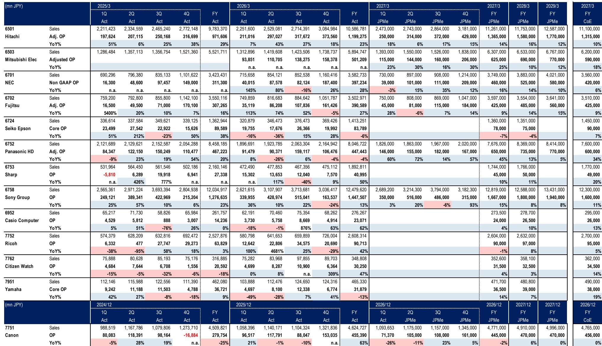
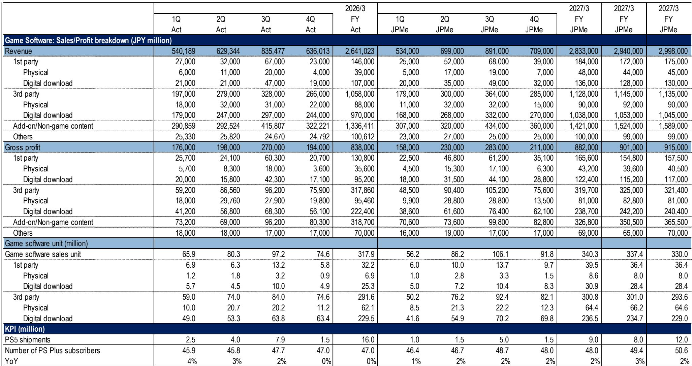
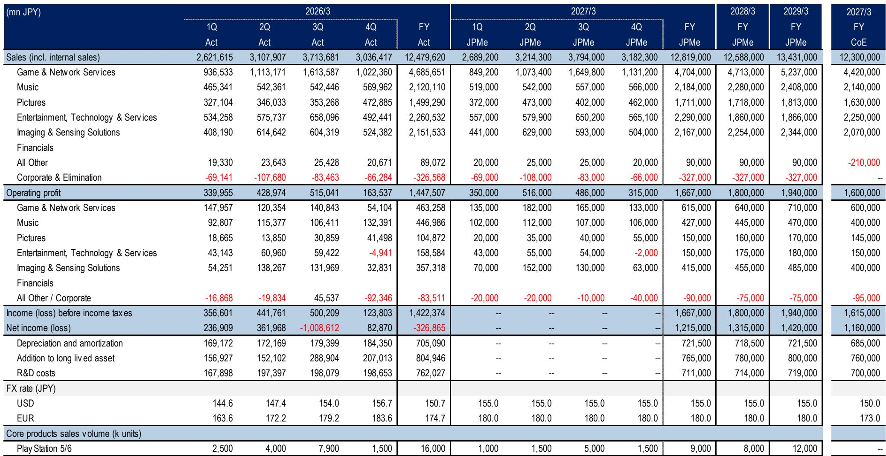

# Japan's Industrial Technology Giants Are Not a Single Trade: The Market Is Rewriting the Valuation Rules for Conglomerates and Specialists Alike

The conventional view that Japan's industrial technology sector moves as a monolithic block is increasingly at odds with the evidence. Over the past year, the performance spread between the best and worst performers in the coverage universe has exceeded 200 percentage points, with Panasonic HD surging over 200% and Sharp declining nearly 7% on an absolute basis. This divergence is not noise. It reflects a fundamental repricing of business models, capital allocation strategies, and end-market exposure that observers must understand as a structural shift rather than a cyclical rotation. The era of buying "Japan tech" as a basket is over. The new regime demands company-specific conviction and a framework that separates genuine transformation from cyclical tailwinds.

The data from the report reveals a stark reality. The simple average one-year performance of the fourteen covered companies was 65.5%, but the weighted average was only 48.4%. The difference tells a story: the largest market-cap names, which dominate the weightings, have underperformed the smaller names in the universe. Hitachi, with a market cap of 21.6 trillion yen, returned 19.3% over one year. Sony Group, at 20.2 trillion yen, returned negative 3.9%. Meanwhile, Panasonic HD, at 10.6 trillion yen, returned 201.4%. This is not a sector rally. It is a selective re-rating of specific restructuring stories.

The strategic question for observers is no longer whether Japan's industrial technology sector is worth studying. The question is which companies have genuinely restructured their portfolios and capital allocation frameworks to deliver sustainable returns, and which are still trading on legacy valuation methodologies that no longer apply. This report, based on the August 2026 Japan Industrial Technology Forum, provides the foundation for that analysis.

## The Restructuring Premium Is Real: Companies That Have Reshaped Their Portfolios Are Trading at Higher Multiples, and the Market Is Rewarding Them

The valuation table in the report makes the restructuring premium visible. Hitachi, trading at 2e company has undergone a multi-year transformation, divesting non-core businesses and focusing on digital, green energy, and infrastructure solutions. Its ROE trajectory tells the story: from 13.4% in the most recent fiscal year to an estimated 15.5% in fiscal year 2028. This is not a cyclical improvement. It is a structural shift in capital efficiency.

Mitsubishi Electric offers a similar but distinct narrative. Trading at 23.8x forward P/E with a target of 7,000 yen, the company is benefiting from its exposure to factory automation and energy systems. But the key insight is that its operating profit growth is accelerating: the report estimates 46.6% operating profit growth in the current fiscal year, followed by 8.7% and 11.6% in the subsequent two years. The market is pricing in a step-change in profitability, not a gradual recovery.

The contrast with the underperformers is instructive. Canon, trading at just 11.1x forward P/E with company's ROE is stagnant at around 9.3%, and its earnings growth is flat. The market is telling observers that a company with a mature product portfolio and no clear restructuring catalyst deserves a structural discount. Seiko Epsition. Its ROE of 6.5% is barely above cost of equity, and its P/E is contracting rather than expanding.

The so-what is clear: the market is no longer pricing Japanese industrial technology companies on a sector-wide basis. It is pricing individual companies on their demonstrated ability to generate higher returns on capital. The restructuring premium is not a temporary phenomenon. It is the new baseline for valuation.

## The Earnings Trajectories Reveal a Two-Speed Market: Growth Observers Must Distinguish Between Accelerating Compounders and Cyclical Rebounds

A careful reading of the earnings forecast summaries shows that the market is not treating all growth equally. There is a fundamental difference between companies that are compounding earnings at a sustainable rate and companies that are experiencing a one-time cyclical rebound, and the valuation multiples reflect this distinction.

Hitachi and NEC represent the compounding model. Hitachi's operating profit is projected to grow from 1,199 billion yen in the most recent fiscal year to 1,770 billion yen by fiscal year 2029, a compound annual growth rate of roughly 8%. NEC, with operating profit growing from 397 billion yen to an estimated 550 billion yen over the same period, shows a similar pattern. Both companies are benefiting from structural demand drivers: digital transformation, energy infrastructure modernization, and defense spending. Their earnings growth is not dependent on a single macroeconomic variable.

Mitsubishi Electric and Sony Group represent a different profile. Mitsubishi Electric's operating profit growth is front-loaded, with 46.6% growth in the current year followed by a deceleration to high single digits. This pattern is consistent with a company that is benefiting from a cyclical recovery in factory automation and semiconductor equipment demand. The question for observers is whether the deceleration is a normalization or a warning sign. The report does not provide a definitive answer, but the valuation multiple suggests the market is giving the company the benefit of the doubt.

Panasonic HD is the most complex case. The company reported a 44.6% decline in operating profit in the most recent fiscal year, but is projected to deliver 153.8% growth in the current year. This is a classic cyclical rebound, driven by restructuring and cost reduction rather than organic demand growth. The market has rewarded the stock with a 201.4% one-year return, but the forward P/E of 23.1x suggests observers are pricing in a sustained recovery. The risk is that the rebound is a one-time event, and the company's long-term growth rate is closer to the mid-single digits implied by the fiscal year 2029 estimates.

The strategic implication is that observers must build a framework that distinguishes between these two growth profiles. A company like Hitachi, with consistent double-digit ROE and accelerating earnings, deserves a premium multiple. A company like Panasonic HD, with a volatile earnings history and a restructuring-driven recovery, requires a discount for uncertainty. The market is already making this distinction, but not all observers have internalized the logic.

## The Report's Blind Spot: The Impact of Yen Normalization on Earnings Quality and Competitive Positioning

For all its analytical rigor, the report does not fully address one critical variable: the impact of yen normalization on the quality of reported earnings. The Japanese yen has been historically weak during the period covered by the report, and many of the earnings beats and upward revisions have been partially or fully driven by foreign exchange tailwinds. As the yen normalizes, the question is whether the underlying business momentum is strong enough to offset the currency headwind.

Consider Sony Group. The company generates roughly 70% of its revenue outside Japan. A 10% appreciation of the yen against the dollar would reduce its operating profit by approximately 100 billion yen, based on the company's own sensitivity disclosures. The report's earnings estimates for Sony assume continued margin expansion in the gaming and entertainment segments, but they do not explicitly model the currency impact. If the yen strengthens by 15% over the next two years, the implied EPS growth of 8% per year could easily turn negative.

The same logic applies to Canon and Ricoh, both of which have significant overseas revenue exposure. Canon's forward P/E of 10.9x already reflects depressed expectations, but if yen appreciation accelerates, the company's earnings could fall further. The report's views on these names may be appropriate under current conditions, but they do not account for a scenario in which currency becomes a dominant driver of earnings.

This blind spot creates an analytical opportunity. Observers who can build a framework that separates organic earnings growth from currency-driven earnings growth will have a significant advantage. The companies that can maintain or expand margins in a yen-strengthening environment are the ones that have genuine pricing power and competitive moats. The companies that are dependent on a weak yen for their earnings momentum are the ones that will face challenges when the currency cycle turns.

## A Decision Framework for Observers: Four Questions to Separate Structural Winners from Cyclical Plays

Based on the report's data and the strategic logic of the sector, observers should apply a four-question framework to each company in the coverage universe. This framework is designed to cut through the noise of quarterly earnings and focus on the structural factors that determine long-term returns.

First, is the company's earnings growth driven by portfolio restructuring or by end-market recovery? Hitachi and NEC pass this test because their growth is coming from businesses they have deliberately chosen and invested in. Panasonic HD and Mitsubishi Electric are more ambiguous, with significant exposure to cyclical end markets like automotive and factory automation.

Second, does the company have pricing power in its core markets? The report does not provide direct pricing data, but the ROE trajectory is a useful proxy. Companies with sustainable ROEs above 12% typically have some form of competitive advantage that allows them to maintain margins. Companies with ROEs below 10% are likely price takers in commoditized markets.

Third, is the company's balance sheet positioned for the next downturn? The report shows that several companies, including Fujitsu and NEC, have negative FCF yields in the current year, which suggests they are investing heavily in growth or restructuring. This is not necessarily a negative, but it does increase vulnerability if the macroeconomic environment changes. Observers should prefer companies with positive and growing FCF yields, such as Canon at 7.6% and Ricoh at 7.6%.

Fourth, what is the valuation discount or premium relative to the company's historical range and its global peers? The report's average P/E of 19.2x for the current fiscal year is not demanding by historical standards, but the dispersion is wide. Hitachi at 23.8x and Canon at 11.1x are pricing in very different futures. The question is which one is wrong.

This framework does not provide mechanical signals, but it does force observers to make explicit assumptions about the drivers of value. The companies that score well on all four questions are the ones that deserve a premium valuation. The companies that score poorly on multiple questions are the ones that should be approached with caution.

## The Unresolved Question: How Will the Market Price the Next Generation of Technology Investments?

The report covers the current generation of industrial technology companies, but it does not fully address the next wave of investment. Japan is making significant investments in areas like quantum computing, advanced semiconductors, and next-generation energy storage. Companies like Hitachi and NEC are positioning themselves in these markets, but the revenue contribution is still small, and the profitability is uncertain.

The strategic question for observers is whether the market will give these companies credit for their future technology bets or whether it will continue to value them based on their current business mix. If the market adopts the latter approach, then companies like Sony, with its strong position in entertainment and imaging sensors, may be undervalued relative to their growth potential. If the market adopts the former approach, then companies like Hitachi, with its broad portfolio of technology investments, may deserve a higher multiple than the current 23.8x.

The report does not resolve this tension, and it is unlikely that any single analysis can. The answer will emerge over time as the companies report their progress and as the market updates its expectations. Observers who are following this space should pay close attention to the capital allocation decisions that companies are making, particularly in R&D spending and M&A. The companies that are investing in high-return technology opportunities while maintaining discipline in their core businesses are the ones that will create the most value over the next decade.

The full report and original charts provide additional data on earnings trajectories, valuation multiples, and performance dispersion. The report raises more questions than it answers, and that is precisely its value. The companies that survive and thrive in the next cycle will not be the ones that benefit from a weak yen or a cyclical recovery. They will be the ones that have reshaped their portfolios, improved their capital efficiency, and positioned themselves for structural growth. The market is already rewarding those companies.

*For informational purposes only. Portions may be generated, translated, summarized, or edited with AI assistance based on source materials and may contain omissions or errors. Please verify independently. This is not professional advice.*

For informational purposes only. Portions may be generated, translated, summarized, or edited with AI assistance based on source materials and may contain omissions or errors. Please verify independently. This is not professional advice.

