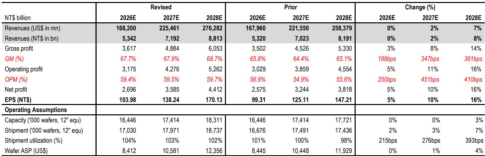
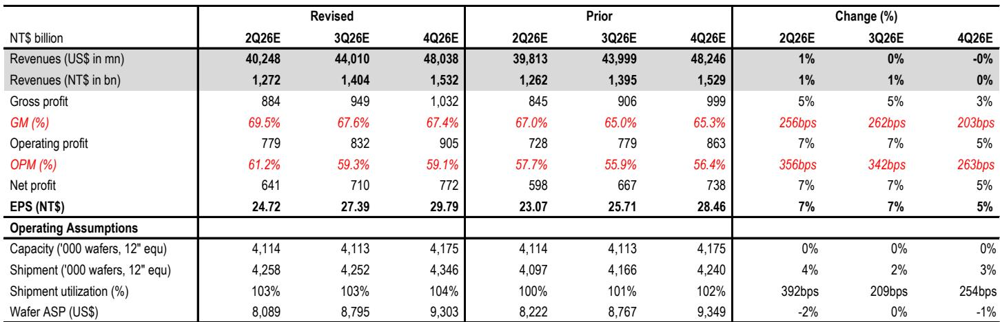
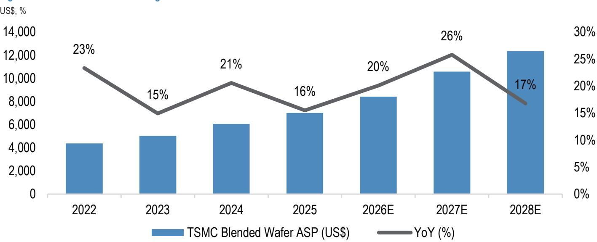

# JPM：台积电三年资本支出2190亿美元，AICPU成被低估的增长极

台积电即将发布2026年第二季度财报，JPM在最新报告中给出了一个关键判断：这家全球先进的芯片制造商的毛利率正在逼近70%的关口。在半导体行业周期中，这并非一个寻常信号。过去三个月，台积电报价跑输台湾加权指数约8%，市场对其市场份额流失、产能扩张保守、以及供应链中其他环节更具吸引力的涨价叙事产生了疑虑。但这份报告认为，这些担忧很可能在即将到来的业绩发布会上被逐一击破。

报告的核心逻辑并不复杂：AI需求的可见性正在变得前所未有的清晰，而台积电的产能扩张计划正在变得前所未有的激进。两者叠加，意味着公司不仅有能力维持高毛利率，更有底气在2027年实施更大范围和幅度的涨价。这不再是一个简单的周期复苏故事，而是结构性定价权的重新确认。

## 1. 毛利率站稳高位的背后，是N3节点的盈利跨越和定价能力的双重支撑

JPM预计台积电2026年第二季度毛利率将达到69.5%，环比提升超过3个百分点。支撑这一数字的并非一次性因素：N5及以下节点的产能利用率持续超过100%，加急订单带来50%至100%的价格溢价，而更重要的是，N3节点的盈利能力预计将在2026年下半年超过公司平均毛利率水平。

这意味着，即便N2量产和海外工厂的扩张会带来一定的稀释效应，台积电仍有能力在未来几个季度将毛利率维持在接近70%的水平。报告特别指出，2027年N3和N2节点预计将实现8%至10%的价格上调，同时N5、N7以及CoWoS封装也可能迎来温和涨价。这并非简单的成本转嫁，而是供需缺口持续扩大下的定价权兑现。

> **KC评论：** 毛利率逼近70%对台积电而言是一个重要的心理关口。但读者需要关注的不是这个数字本身，而是支撑它的结构性因素——N3节点的盈利拐点和2027年的涨价预期。报告中的图2详细拆解了季度毛利率趋势，值得仔细看。

## 2. 数据中心AI收入CAGR上调至69%，AI CPU正成为一个被低估的增长极

JPM将台积电数据中心AI收入的年复合增长率从此前的59%上调至69%，显著高于公司自身给出的中高50%的指引区间。上调的主要驱动力来自两个方面：AI加速器持续的大芯片和多芯片封装趋势，以及一个此前被市场低估的变量——AI CPU的快速增长。

报告预计，从2026年开始，AI CPU将成为数据中心AI收入中增长最快的类别，到2029年将占据约14%的收入份额。这意味着台积电的AI叙事正在从单一的GPU代工向更广泛的计算架构延伸。在1月份的业绩发布会上，公司已经暗示了数据中心AI预测的上行空间，而这次会议很可能会给出更具体的更新。

## 3. 产能扩张的激进程度超出预期，2026至2028年累计资本支出或达2190亿美元

这是报告中信息量最大的部分。JPM将台积电2026、2027、2028年的资本支出预测分别上调至580亿、780亿和840亿美元，三年累计约2190亿美元，而2023至2025年这一数字仅为1010亿美元。弹性较高的资本支出计划背后，是台积电对N2和N3产能的全面加速。

N3方面，预计到2028年末月产能将达到24万片晶圆，而供需缺口仍高达约60万片。N2的扩张更为激进，未来三年内将有最多9个工厂阶段同时推进，到2028年末月产能将达到17万片，超过任何先前节点的爬坡速度。先进封装方面，CoWoS产能预计将在2027年接近每年200万片，同比增长约80%至90%。

> **KC评论：** 2190亿美元的三年资本支出计划是一个惊人的数字，但报告也指出，台积电很可能不会在本次业绩发布会上给出明确的三年资本支出指引。这反而是一个值得关注的信号：如果管理层在问答环节中释放出任何关于长期资本支出的线索，市场可能会重新定价公司的成长天花板。

## 4. 报告尚未完全回答的关键问题：市场对竞争和产能过剩的担忧何时会真正消退

尽管报告对台积电的技术领先地位和市场份额给出了积极判断，但一个悬而未决的问题是：当如此大规模的产能集中释放时，市场对2028年之后可能出现产能过剩的担忧将如何演变？报告预计台积电将保留95%以上的N2产品市场份额，但竞争对手（英特尔、三星、TeraFab等）在2028至2029年时间窗口内也可能具备实际产能。

另一个值得追问的维度是：AI CPU的爆发是否会改变台积电的客户结构，从而影响其定价策略和毛利率的长期走向？报告提到了Vera和Venice等CPU产品对CoWoS的需求拉动，但并未深入讨论这些新客户对台积电议价能力的影响。

## 5. 对观察者的框架：关注三个信号，而非一个数字

对于关注这家公司的读者，报告提供了一个清晰的观察框架。在业绩发布会上，有三个信号比具体数字更重要：第一，管理层对市场份额流失担忧的直接回应——是否给出明确的技术路线图或客户绑定证据；第二，对2027年涨价预期的定性描述——是暗示性还是明确性；第三，对数据中心AI TAM的更新——这将是判断公司长期增长斜率的关键。

这三个信号将共同决定市场是否愿意接受20倍远期市盈率以上的估值。而公司五年平均历史估值低于此水平。这意味着，JPM认为台积电正在进入一个结构性溢价的新阶段。

For informational purposes only. Portions may be generated,translated,summarized,or edited with AI assistance based on source materials and may contain omissions or errors. Please verify independently. This is not investment,legal,tax,accounting,or other professional advice.

For informational purposes only. Portions may be generated,translated,summarized,or edited with AI assistance based on source materials and may contain omissions or errors. Please verify independently. This is not investment,legal,tax,accounting,or other professional advice.

