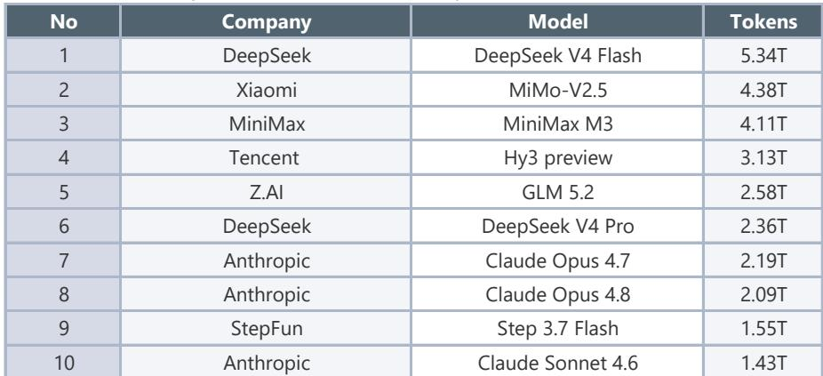
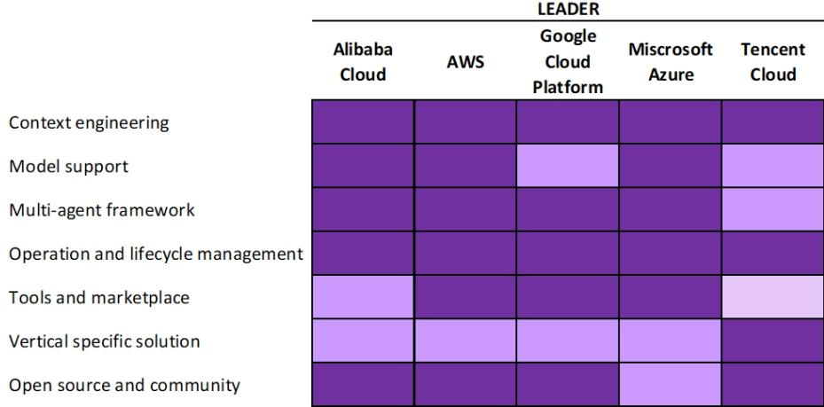
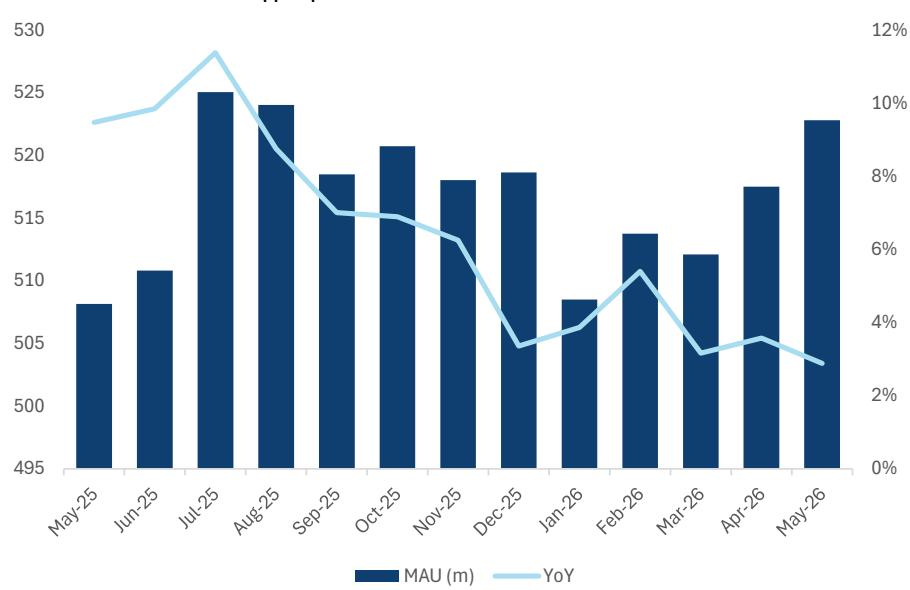

# China's AI Model Race Is Entering a New Phase: Cost Efficiency Has Become the Decisive Competitive Advantage

The most important development in China's AI sector this week is not a breakthrough in raw intelligence scores. It is a pricing decision. Tencent's Hy3 official version was released at RMB 1 per million input tokens and RMB 4 per million output tokens—roughly half the price of its preview version and a fraction of what competitors charge for comparable capability. This is not merely a promotional tactic. It signals a structural shift in how China's AI leaders are competing. The winner in this market will not necessarily be the model with the highest benchmark score. It will be the model that can deliver sufficient intelligence at a cost structure that makes enterprise deployment economically viable at scale.

The logic is straightforward but its implications are profound. When token consumption growth softens—as the Silicon Data LLM Token Expenditure Index shows for late June through early July, with readings ranging from 1.62 to 1.71, well below the 2.04 level seen on May 31—the market is telling us that demand is not the bottleneck. Affordability is. Enterprises are not refusing to use AI. They are rationing their token budgets. Media reports that technology and internet companies are setting upper limits on token consumption among employees confirm this pattern. The constraint is not technological. It is economic.

What makes this moment strategically important is that China's model providers are now structurally advantaged on cost. According to data from Artificial Analysis, Chinese models from DeepSeek, Qwen, Kimi, MiniMax, and Zhipu have API costs that are a fraction of comparable US models. This advantage comes from architectural choices—Mixture of Experts, Group-Query Attention, sparse attention mechanisms, and high Model FLOPs Utilization—that were once seen as engineering compromises. They now look like strategic weapons. The narrowing intelligence gap between US and Chinese models, combined with this persistent cost advantage, creates a window for Chinese AI platforms to capture enterprise workloads that US providers cannot economically address.

The question observers should be asking is not whether China's AI models are catching up. They are. The question is which companies have the cost structure, the ecosystem, and the go-to-market discipline to convert this technical parity into sustained commercial advantage.

## Hy3's Pricing Strategy Is Not a Discount—It Is a Declaration of Intent to Own the Enterprise Market

Tencent's Hy3 official version represents a deliberate strategic choice that deserves close examination. The improvements over the preview version are meaningful: task success rate rose from 72 percent to 90 percent, hallucination rates dropped by 15 percentage points, and token efficiency gains of 47.4 percent in word processing and 49 percent in PPT generation were achieved versus GLM-5.2. In blind tests among 270 experts across real work scenarios including frontend development, data engineering, storage, and CI/CD, Hy3 scored better than GLM-5.1. These are not marginal gains. They represent a model that has been hardened through feedback from over 50 business units and optimized for the specific productivity scenarios that enterprises care about most: software development, office productivity, financial analysis, design, and game development.

But the headline story is the price. At RMB 1 per million input tokens and RMB 4 per million output tokens, Hy3 is dramatically cheaper than its peers. DeepSeek-V4-Pro charges RMB 6 and RMB 12 respectively. GLM-5.2 charges RMB 8 and RMB 28. Qwen3.7 Max is at RMB 12 and RMB 36. Kimi-2.7 is at RMB 6.5 and RMB 27. Even MiniMax M3, which has been aggressive on pricing, charges RMB 4.2 and RMB 16.8. Hy3 is undercutting the market by a factor of two to nine times depending on the competitor.

This is not a temporary promotion. It is a bet that the path to dominance runs through volume, not margin. Tencent is effectively saying that it will trade near-term model revenue for ecosystem adoption, betting that enterprises that build workflows around Hy3 will be difficult to displace later, even if competitors match the price. The logic is similar to what we have seen in cloud computing: early pricing aggression creates switching costs and data gravity that compound over time.

The question this raises is whether competitors will follow Hy3 down the pricing curve—and whether they can afford to. Models with less efficient architectures, higher inference costs, or smaller user bases to amortize fixed investments will face difficult choices. The cost efficiency advantage that Chinese models already enjoy versus US counterparts may now become a weapon for intra-China consolidation.

## The Token Consumption Data Reveals a Market That Is Growing but Not Yet Profitable

The Silicon Data LLM Token Expenditure Index for the week of June 28 showed continued softness, with readings between 1.62 and 1.71 compared to 1.68 to 1.74 the prior week and well below the 2.04 level on May 31. This index is weighted by where usage is concentrated, meaning expenditure rises when demand shifts toward premium models. The decline tells us that users are either consuming fewer tokens overall or are trading down to cheaper models.

OpenRouter data for the week of June 29 confirms the pattern: weekly token consumption remained stable at 46.7 trillion, with DeepSeek V4 Flash ranking first, followed by Xiaomi MiMo-V2.5 and MiniMax M3. Stability is not the same as growth. After the surge in February 2026 driven by coding adoption, the market appears to be in a digestion phase where users are optimizing their usage rather than expanding it.

This creates a strategic tension for model providers. They need to invest in frontier model development to maintain competitiveness. But the revenue environment does not yet support the cost structure of premium models at scale. The result is a market where companies must either find ways to dramatically reduce inference costs—as Hy3 has done—or accept that their premium offerings will remain niche products for high-value use cases.

The decision by DeepSeek to introduce peak-hour pricing starting July 15 is revealing. Input and output prices will double during peak hours of 9:00 to 12:00 and 14:00 to 18:00. This is an attempt to manage capacity constraints while maintaining low baseline prices. It acknowledges that demand is real but that supply is not infinite, and that some users will pay more for guaranteed access during business hours. The question is whether this tiered pricing model will become standard across the industry, or whether the competitive pressure from Hy3's flat low pricing will force others to follow suit.

## The Regulatory Intervention on Virtual Intimate Relationships Is a Signal of Broader Governance Risks

On July 15, new measures from five Chinese regulatory bodies—including the Cyberspace Administration, the National Development and Reform Commission, and the Ministry of Public Security—will take effect to protect users from issues arising from AI virtual intimate relationship services. Doubao and Qwen have already announced they will stop offering these features on July 10 and July 15 respectively.

At first glance, this appears to be a narrow regulatory action targeting a specific and controversial use case. But its implications are broader. The regulations aim to prevent over-dependence on AI and protect real interpersonal relationships. This is not a technical regulation. It is a social governance intervention that signals the government's willingness to shape how AI is deployed in consumer-facing applications.

For observers, this creates a new dimension of risk. The Chinese AI market has been characterized by rapid experimentation across use cases, from coding assistants to emotional companion apps. The regulatory environment has been relatively permissive compared to other jurisdictions. That may be changing. If the government begins to impose use-case restrictions on other AI applications—particularly those involving education, healthcare, or financial advice—the addressable market for certain models could shrink significantly.

The more subtle implication is about data collection. Virtual intimate relationship services require deep personalization and generate rich behavioral data. The regulatory motivation may be as much about data governance as it is about social welfare. Companies that have built their AI strategies around consumer engagement and data collection may need to reassess their compliance frameworks and business models.

## Open Questions That the Report Does Not Fully Answer

The report provides extensive data on token consumption, pricing, and model performance benchmarks. But it leaves several critical questions unresolved.

First, how sustainable is the cost advantage of Chinese models versus US models? The architectural innovations—MoE, GQA, sparse attention—that enable Chinese models to achieve lower costs are not proprietary. US companies can and will adopt similar techniques. The narrowing of the intelligence gap is a two-way street. If US models close the cost gap while maintaining their lead in frontier capabilities, the competitive dynamics could shift again.

Second, what is the actual revenue trajectory for Chinese AI model providers? Token consumption data tells us about usage volume, not about revenue. With prices falling as fast as they are, it is entirely possible that total market revenue is flat or declining even as usage grows. The report does not provide revenue estimates or profitability analysis for the model providers. This is a significant gap for those trying to understand these businesses.

Third, how will the lock-up expirations for Zhipu and MiniMax affect the competitive landscape? The report notes that lock-up periods expire this week for both companies. If early investors or employees seek to monetize their positions, it could create pressure on these companies to demonstrate near-term revenue growth—potentially forcing pricing decisions that prioritize short-term cash flow over long-term market share.

Fourth, what is the real enterprise adoption rate? The report highlights that companies are setting token consumption limits for employees. This suggests that enterprise adoption is happening but is being managed carefully. The question is whether this caution reflects a temporary budget constraint or a deeper consideration about the return on investment from AI tools.

## A Decision Framework for Observers Navigating the Chinese AI Market

Based on the data and analysis in this report, we can construct a decision framework with three dimensions: cost position, use-case focus, and regulatory exposure.

On cost position, the key metric is not the headline price per token but the total cost of ownership for an enterprise deploying the model at scale. This includes inference cost, fine-tuning cost, and the cost of integrating the model into existing workflows. Hy3 appears to have a strong position here, but competitors with more efficient architectures—such as DeepSeek's MoE-based models—may be able to match or beat Hy3's pricing while maintaining higher margins.

On use-case focus, the report identifies coding, workspace scenarios, and mid- to long-form content as areas with significant opportunities ahead. Companies that have specialized models or fine-tuning capabilities in these verticals may be better positioned than general-purpose model providers. The emergence of Meituan's open-source LongCat 2.0 model, with its focus on agent, reasoning, and interaction use cases, and its claim to be the first model of its scale to complete full training and inference on a 50,000-card domestic compute cluster, suggests that vertical specialization is becoming a viable strategy.

On regulatory exposure, the key question is whether a company's primary use cases fall into categories that are likely to attract government scrutiny. Consumer-facing applications involving emotional engagement, education, or financial advice carry higher regulatory risk. Enterprise productivity tools, coding assistants, and industrial applications face lower regulatory risk but may have longer sales cycles and lower margins.

Observers should ask three questions about any Chinese AI company they evaluate: Can this company sustain its cost advantage as competitors respond? Does it have a defensible position in a specific enterprise vertical? And is its revenue model resilient to regulatory intervention?

## Join the Community to Read the Full Report and Review the Original Charts

The analysis above draws on a subset of the data points and exhibits available in the full report, which contains over 50 data points on token consumption across OpenRouter, pricing comparisons across models, model intelligence assessments from Artificial Analysis, user trends by sub-sector, and detailed benchmark results across agentic coding, agentic search, working agent, STEM agent, reasoning, and context learning tasks. The full report also includes the complete benchmark comparison tables for Hy3 versus GLM-5.1, GLM-5.2, DeepSeek-V4 Flash, DeepSeek-V4 Pro, Seed-2.1 Pro, Qwen-3.7 Max, Gemini-3.1-pro-preview, Claude-opus-4-8, and GPT-5.5 across dozens of tasks, as well as the Silicon Data LLM Token Expenditure Index methodology and historical data.

The charts referenced in this article—including weekly token consumption trends over the past 12 months, the Token Expenditure Index, and blended price comparisons between China and US models—are available in the original report and provide essential context for the arguments made here. Join the community to read the full report and review the original charts.

*For informational purposes only. Portions may be generated, translated, summarized, or edited with AI assistance based on source materials and may contain omissions or errors. Please verify independently. This is not professional advice.*

For informational purposes only. Portions may be generated, translated, summarized, or edited with AI assistance based on source materials and may contain omissions or errors. Please verify independently. This is not professional advice.

