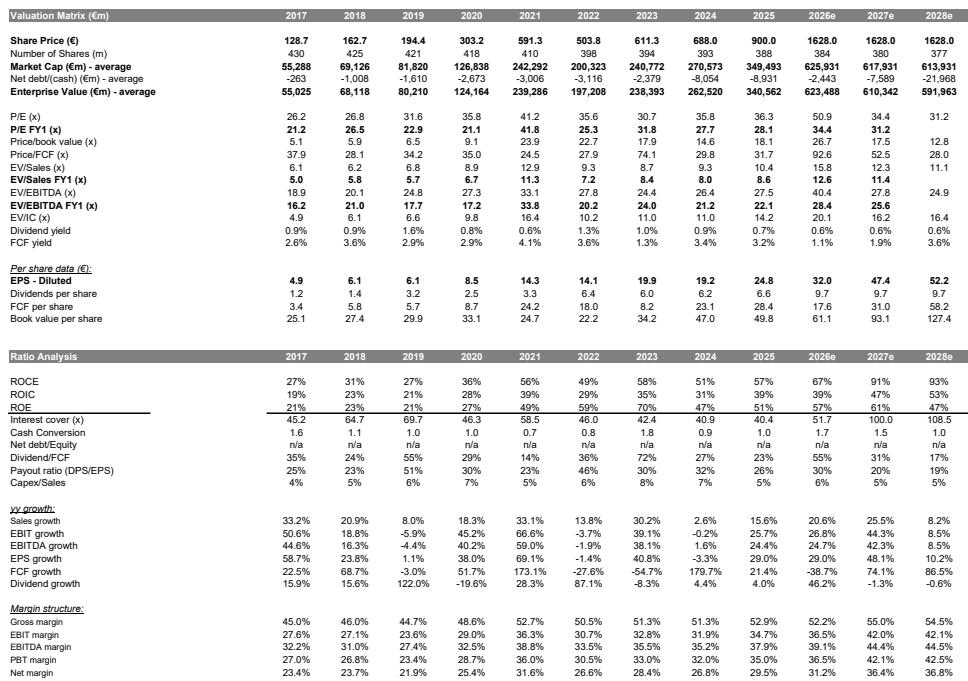
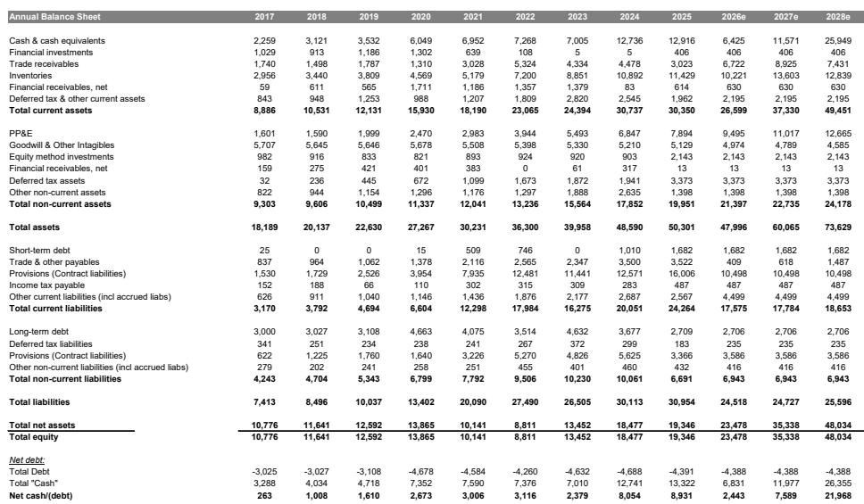
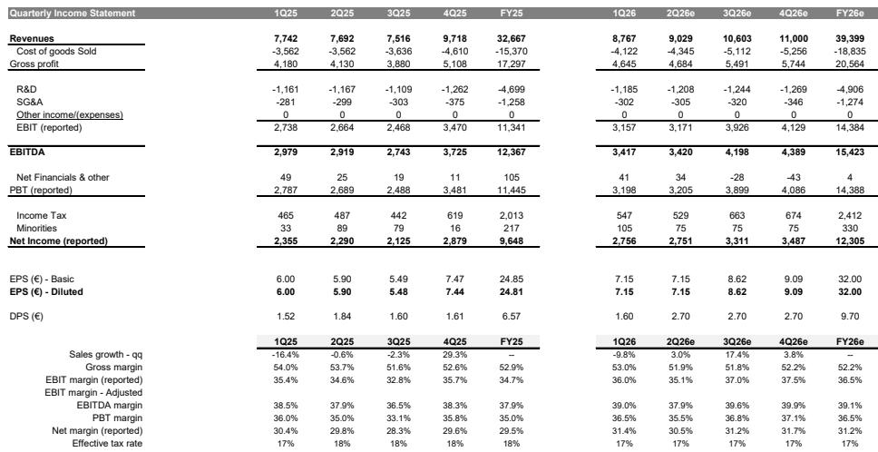

# MS：半导体设备周期观察？MS看到中国DUV需求增长

市场对ASML的关注，过去几个月集中在三个问题上：产能是否足够支撑客户需求，2028年的WFE（晶圆厂设备支出）是否会达到阶段性高点，以及公司在EUV上的定价能力是否已经充分体现。这份MS在7月初发布的报告，给出了一个与市场普遍情绪不同的判断：这三个关注点，每一个都可能在未来一个季度内转化为积极因素。核心逻辑是ASML正处于一个“追赶交易”的窗口期——年初至今报价上涨约75%，但仍跑输美国半导体设备同行约34%，估值折价正在被市场重新审视。

报告认为，即将到来的二季度业绩发布，虽然季度数字本身大概率符合预期，但管理层对全年指引的更新、以及关于产能和2028年订单的增量信息，才是真正的变量。

## 1. 产能瓶颈正在被打破，但市场尚未充分反映

市场对ASML最大的疑问在于其能否按时交付足够多的Low NA EUV光刻机。MS在报告中指出，管理层已在4月股东大会上提及将在三季度启动Brainport Industries Campus的建设，第一期工程有望在2028年底前完成，届时公司可满足每年约110台Low NA EUV的客户需求。这意味着，当前市场关注的产能天花板，可能在未来两年内被系统性解决。

但报告同时强调，市场要的不是远期规划，而是管理层在二季度电话会或非交易路演中给出更明确的产能路线图。如果管理层能够确认明年实现约90台Low NA EUV的交付能力，这将对市场信心构成直接支撑。

> **KC评论：** 产能问题本质上是“能不能接到更多订单”的问题。如果ASML证明自己可以造出来，客户就敢下更长的订单。这份报告的核心判断之一，就是产能约束正在从负面因素变成正面因素——但需要管理层在业绩会上亲口确认。

## 2. 2028年WFE的增量来自中国存储器和DUV强度

市场普遍关注2028年是否会成为WFE周期的阶段性高点，但MS看到了两个结构性增量。第一，中国存储器厂商——包括CXMT和YMTC——的订单有望在2026年底前进入ASML的订单簿，2027年开始出货。这意味着ASML的DUV业务在2028年仍能保持增长。第二，报告特别提到华为和中芯国际近期公布的“芯片折叠”技术（一种Tau缩放形式），本质上是对DUV光刻层数的增加。如果这一技术路线被更广泛采用，DUV的需求强度将超出此前预期。

这两个因素叠加，使得2028年不仅不是WFE的终点，反而可能成为中国市场贡献增长的一年。报告上调了2026年和2027年的EUV出货量预估，分别从69台和90台提升至75台和92台，其中SK海力士的拉货力度被显著上调。

> **KC评论：** 中国市场的逻辑在变。过去市场关注中国需求变化，但报告认为，中国存储厂商的先进制程进度和DUV强度提升，反而可能成为ASML在周期后半段的意外增量。这个判断值得跟踪，因为它依赖的是中国厂商的技术进展和订单节奏，存在不确定性。

## 3. 定价能力正在从“吞吐量”转向“生产力”

关于ASML定价能力是否充分体现的担忧，报告给出了一个不同的视角。过去，EUV的价值主张主要围绕吞吐量提升——每小时更多晶圆。但报告指出，随着EUV激光功率路线图的加速，故事正在转向“最大化生产力”。这意味着ASML可以通过提升每台设备的产出效率，而不是单纯增加设备数量，来获得更高的定价空间。

此外，报告提到，像Terafab这样的新型晶圆厂模式，可能为ASML创造新的价格谈判机会。如果合作伙伴关系进一步拓宽，ASML的毛利率有望在2020年代末持续扩张。报告对2027年毛利率的预估为55.0%，高于市场共识的54.1%，这个差异本身就反映了对定价能力的乐观判断。

## 报告尚未完全回答的关键问题

这份报告逻辑清晰，但有两个问题仍需观察。第一，中国存储器厂商的订单节奏是否真的能在2026年底前落地，取决于地缘政治环境和出口管制政策的演变，报告对此没有展开。第二，产能扩张本身需要大量资本开支，Brainport Campus的建设进度和成本控制，将直接影响ASML未来的自由现金流和回报表现。报告提到了产能建设的时间表，但没有给出详细的资本开支预估。

对于关注半导体设备周期的读者，这份报告提供了一个重要的观察框架：ASML的估值折价能否收窄，取决于管理层能否在二季度业绩会上同时回答产能、2028年WFE和定价能力这三个问题。如果答案都是肯定的，那么“追赶交易”的叙事就有了数据支撑。

For informational purposes only. Portions may be generated,translated,summarized,or edited with AI assistance based on source materials and may contain omissions or errors. Please verify independently. This is not investment,legal,tax,accounting,or other professional advice.

For informational purposes only. Portions may be generated,translated,summarized,or edited with AI assistance based on source materials and may contain omissions or errors. Please verify independently. This is not investment,legal,tax,accounting,or other professional advice.

